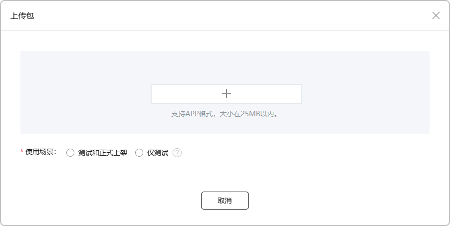
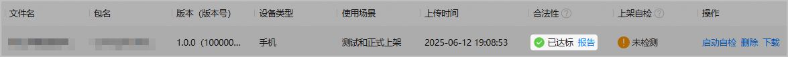
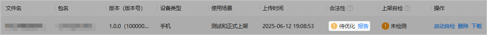
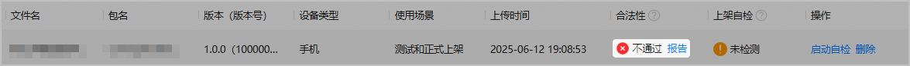
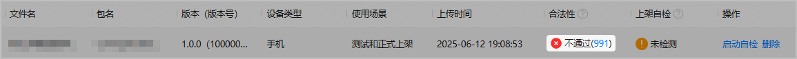
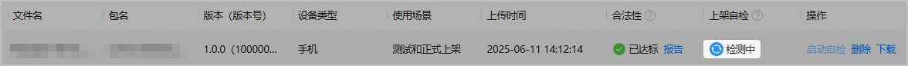
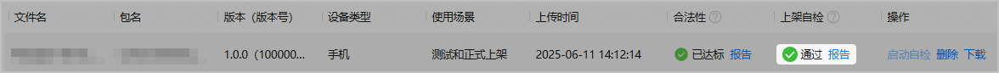
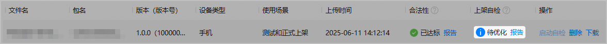
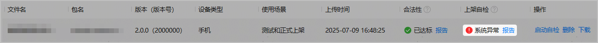

上传用于小游戏测试或正式上架的软件包后，AppGallery Connect会对软件包自动检测合法性，您可以根据报告或者错误码修复软件包问题。

#### 前提条件

确保小游戏软件包已符合上架要求。软件包要求请参见[准备游戏软件包](https://developer.huawei.com/consumer/cn/doc/app/agc-help-release-minigame-prepare-0000002424763490#section24731651195720)。

请确保小游戏已申请[JSVM权限](https://developer.huawei.com/consumer/cn/doc/app/agc-help-release-minigame-acl-and-ability-0000002425276004#section13637635175211)和[存储空间管理服务](https://developer.huawei.com/consumer/cn/doc/app/agc-help-release-minigame-acl-and-ability-0000002425276004#section17374114165216)，并且待上架软件包内已配置相关权限信息.。

#### 操作步骤

1. 登录[AppGallery Connect](https://developer.huawei.com/consumer/cn/service/josp/agc/index.html)，点击“APP与元服务”，选择待上架的小游戏。左侧导航栏选择“应用上架 > 软件包管理”，在右侧页面点击“上传”。
2. 在弹出的“上传包”窗口中先选择使用场景，再上传小游戏软件包。

   
3. 软件包上传成功后，AppGallery Connect自动检测软件包的合法性，检测结果展示在“合法性”列。
   * 已达标：表示小游戏软件包满足规范要求，可以用于正式上架。

     点击“报告”查看详细的检测报告。

     
   * 待优化：表示小游戏软件包可以用于正式上架，但仍存在一些问题可能导致后续审核被驳回，或者影响游戏体验。

     建议点击“报告”查看详细的检测报告，进一步优化软件包，并在优化后重新上传软件包。

     
   * 不通过：表示小游戏软件包不满足上架要求，不允许用于正式上架。

     点击“报告”或错误码链接，查看详细的原因与修改建议，并在修改后重新上传软件包。

     
4. （推荐）为了提高小游戏审核的通过率，建议使用“上架自检”检测功能。该功能按照华为应用市场的上架标准，在热门移动终端设备上测试小游戏软件包的兼容性、稳定性、性能、功耗、UX等，可帮助小游戏软件包提前发现问题。

   

   每个小游戏同时只能进行1个自检任务。若您在启动自检后删除了软件包，自检任务将继续执行，需等待自检任务结束才可以执行新的自检任务。

   点击“操作”列的“启动自检”，执行“上架自检”检测功能。启动检测后，可在“上架自检”列查看检测进度与结果。

   * 检测中：表示正在检测小游戏软件包。检测时长可能受终端设备数量和排队情况影响，请耐心等待。

     
   * 通过：表示小游戏软件包检测通过，可以用于正式上架。

     点击“报告”查看详细的检测报告。

     
   * 待优化：表示检测未通过。若“合法性”检测通过，但“上架自检”检测未通过，该小游戏软件包可以用于正式上架，但存在审核被驳回的风险。

     建议点击“报告”查看详细的检测报告，进一步优化小游戏软件包，并在优化后重新上传软件包。

     
   * 系统异常：表示系统发生错误。

     点击“报告”查看详细原因。若不展示“报告”，请点击“启动自检”重试。若还有疑问请[联系客服](https://developer.huawei.com/consumer/cn/service/josp/agc/index.html#/interactive/feedback/1/)。

     
