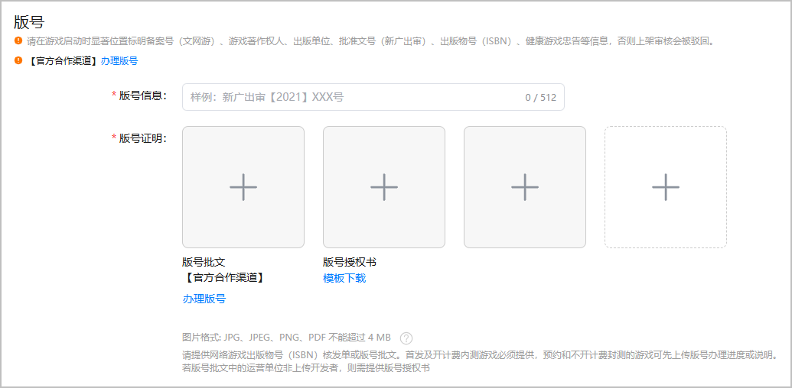

根据法律法规，要求小游戏上架时提供对应的小游戏版号材料。

#### 前提条件

已根据[游戏版权、版号要求](https://developer.huawei.com/consumer/cn/doc/80301#h1-1584931854487-2)提前准备游戏版号材料。

#### 操作步骤

登录[AppGallery Connect](https://developer.huawei.com/consumer/cn/service/josp/agc/index.html)，点击“APP与元服务”，选择待上架的小游戏。左侧导航栏选择“应用上架 > 版本信息”，右侧页面进入“版号”区域，根据提示上传提前准备好的版号材料。

