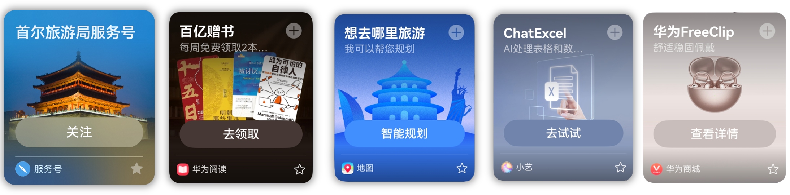
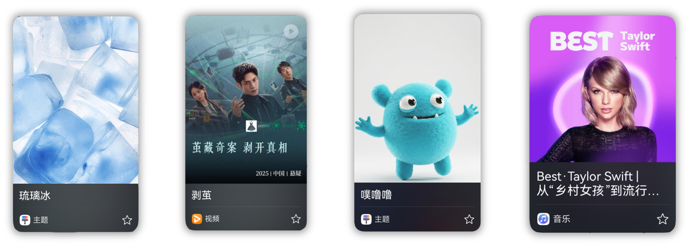

#### 素材审核细则

#### [h2]素材内容规范

* 素材信息可包含商品品牌、商品品名、基本属性（如材质/功能/特征等）和规格参数（如型号/颜色/尺寸/规格/用途/货号等）等。
* 不得包含与商品无关的信息（如无关品牌、品类等），需保障商品信息的描述与实际售卖的商品一致。
* 素材信息中不得使用拼音、字母或代号等字符，以用来替代原有形容表达商品信息的文本内容。例如：白chen衫、红9。
* 素材信息不允许涉及侵害他人隐私权、名誉权、肖像权、知识产权、商业秘密等合法权利的内容。
* 素材信息不能涉及色情、暴力、赌博等违法违规内容。
* 不允许使用过于宽泛的通用名词、行业词、产品名称、活动名称、功能词等。如：绿茶、香肠、网课、驾校、扫码领红包、健身等，建议添加商标名称/企业名称等可以体现业务特性的名称。
* 名称不能含有夸大意义，或有明显营销信息。例如：关注赚百万、点击有礼等。
* 名称不能涉及国家领导人等重要政治人物。
* 名称不允许以存在明显语意歧义的词语来命名。例如：呵呵、小三等。
* 不得使用山寨名称、冒用他人名称，不得使用第三方品牌名称，包括但不限于节目名称、知名影视作品/人物等。
* 名称中不得出现广告法禁止行为的信息。

#### [h2]素材图片规范

* 商品主题图所示的商品颜色、规格必须与文字介绍一致；商品主图中不应出现与实际推荐的商品无关的图片和内容。
* 商品图片应清晰、美观、不失真，不得出现模糊不清、拉伸、图片翻转、打码、遮盖商品等情况。
* 未经授权，不得使用其他商品品牌和商品图片。

#### 优秀素材示例

#### [h2]竖卡（4\*3）-沉浸型

#### [h2]竖卡（4\*3）-内容型

