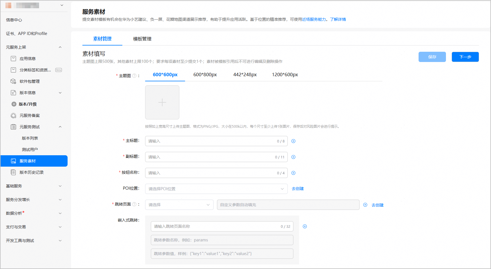
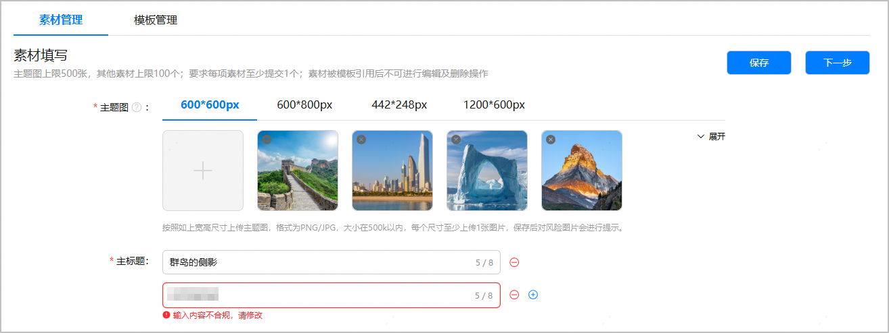

您可在素材管理页面上传宽\*高为600\*600px、600\*800px、442\*248px、1200\*600px四种尺寸的主题图，并可设置素材模板的主标题、副标题、按钮名称、关联的POI位置、跳转页面等信息。

* 主题图最多支持上传500张，主标题、副标题、按钮名称、跳转页面、嵌入式参数素材最多支持添加100个。
* 被模板使用的素材不支持编辑和删除。

1. 登录[AppGallery Connect](https://developer.huawei.com/consumer/cn/service/josp/agc/index.html)，点击“APP与元服务”。

   
2. 进入“HarmonyOS”页签，您可通过包名、应用名称、应用类型等信息进行筛选，然后在应用列表中点击您的应用/元服务名称。

   
3. 左侧菜单栏选择“应用上架/元服务上架 > 服务素材”，进入服务素材主界面。
4. 选择“素材管理”页签，上传主题图，并填写其他素材信息。每项素材至少添加1个。

   

   | 配置项 | 说明 | 操作方法 |
   | --- | --- | --- |
   | 主题图 | 有内容的主题图片。支持600\*600px、600\*800px、442\*248px、1200\*600px四种尺寸，每种尺寸的主题图至少传1张，四种尺寸的主题图数量最多不超过500。图片格式均为JPG/PNG，大小在500KB以内。  说明：  * 系统会对上传的主题图进行风控检查。如发现高风险图片，将在主题图右上角标注“高风险”字样，并且将禁止该图片被素材模板选用。请您更换为合规图片。 * 不允许删除已被模板使用的主题图。 | 根据主题图尺寸，选择对应尺寸页签，然后点击“+”上传主题图。  如需删除某个已成功上传且未被模板使用的主题图，可点击主题图左上角的进行删除。 |
   | 主标题 | 对关键内容的简要说明。不超过8个字符。 | 点击行尾的，可在下方增加一行，同时出现；点击新增行输入框后的，可删除该行配置。 |
   | 副标题 | 对关键内容的阐述。不超过11个字符。 |
   | 跳转页面 | 下拉框选择App Linking应用或元服务链接。  * 应用类型为HarmonyOS应用 选中应用链接名称后，系统将自动填充该链接的域名，并支持设置path地址和自定义参数。    + path地址：可选，路径必须以“/”开头，“/”后面可以包含多个由字母、数字、下划线（\_）或短横线（-）组成的片段，多个片段之间以“/”分隔。整条路径里不允许出现空格或其他特殊字符，也不允许以“/”结尾，不超过128个字符。 正确填写样例：  /product/123\_detail-info  错误填写样例：  product/123\_detail-info（缺少开头的“/”）  /product/123\_detail-info/（结尾多了一个“/”）  /product/123 detail-info（包含空格）   + 自定义参数：可选，用于精确定位到应用指定功能页面，不超过128个字符。具体配置要求如下：     - 须按key=value的键值对形式输入。     - 每个key必须由字母、数字或下划线（\_）组成。     - 每个value不允许包含“&”。     - 第一个key=value键值对前面不允许有任何符号。     - 如果有多个键值对，必须用“&”连接，且“&”前后不允许有多余的“&”或空格。     - 整个字符串不允许以“&”开头或结尾。 正确填写样例：  id=123&name=alice&role=admin  错误填写样例：  &id=123&name=alice （以“&”开头）  id=123&name=alice& （以“&”结尾）  id=123&&name=alice （连续两个“&”）  id=123&name=ali&ce （value包含“&”） * 应用类型为元服务 选中元服务链接名称后，系统将在自定义参数框中自动填充该链接配置的自定义参数。 说明：  使用App Linking应用链接或元服务链接的素材模板上线后，该链接的有效期将变更为长期有效。 | 请按照如下两种情况进行操作：  * 如果尚未创建App Linking应用/元服务链接，请点击“去创建”，在新窗口的App Linking服务界面[创建应用链接](https://developer.huawei.com/consumer/cn/doc/harmonyos-guides/app-linking-startupapp#在agc为应用创建关联的网址域 名)或[创建元服务链接](https://developer.huawei.com/consumer/cn/doc/atomic-guides/atomic-applinking#section48651523147)。 * 如果已创建App Linking应用/元服务链接，系统将自动读取成功或已生效状态且关联本应用/元服务的链接供您选择。 点击行尾的，可在下方增加一行跳转页面配置，同时出现；点击新增行输入框后的，可删除该行配置。 |
   | 按钮名称 | 按钮上显示的内容。不超过4个字符。 | 点击行尾的，可在下方增加一行，同时出现；点击新增行输入框后的，可删除该行配置。 |
   | POI位置 | 可选，下拉框选择关联的POI位置信息，支持多选或全选，最多支持选择100个。 | 请按照以下两种情况进行操作：  * 如果尚未创建关联的POI，请点击“去创建”，在新窗口的POI管理界面完成POI的创建，然后返回素材管理窗口进行关联。 * 如果已创建关联的POI，系统将自动读取配置的POI数据，并筛选出已激活状态、全网使用场景的POI供您选择。 |
   | 嵌入式跳转 | 嵌入式体验的跳转参数信息，包括以下信息：  * 跳转页面名称：可根据跳转页面的功能来定义，不超过32个字符。 * 跳转参数名称：填写元服务自定义跳转参数名称，不允许为空，至少包含一个字符，最多不超过128个字符。 * 跳转参数值：填写元服务自定义跳转参数值，需要以\\{"key1":"value1","key2":"value2"\}格式填写，不允许为空，最多不超过256个字符。 说明：  仅当应用类型为元服务时展示该配置项。 | 点击行尾的，可在下方增加一行嵌入式跳转参数配置，同时出现；点击新增行输入框后的，可删除该行配置。 |
5. 在配置过程中，系统会对您添加的素材进行合规性检查。如果发现不合规或存在风险的素材，系统将在相应位置给出提示。请修改不合规的素材，并建议您将风险素材也修改为合规内容，以避免因使用风险素材而导致模板审核被驳回。

   
6. 完成素材配置后，点击页面右上角的的“下一步”。如果所有素材配置均合规，则会自动跳转至“模板管理”页面。
