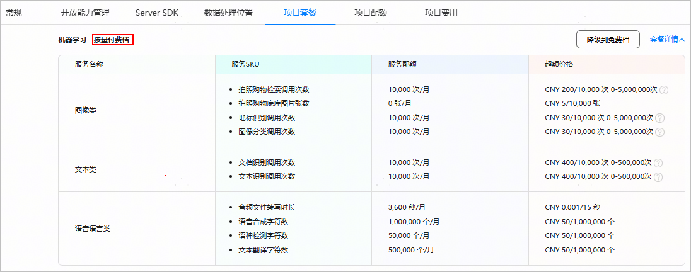

您可以在AppGallery Connect查看当前项目下订阅的所有免费档和按量付费档套餐。

1. 登录[AppGallery Connect](https://developer.huawei.com/consumer/cn/service/josp/agc/index.html)，选择“开发与服务”。
2. 在项目列表中点击您的项目，进入“项目设置”页面。
3. 点击“项目套餐”页签，可查看当前项目下的套餐列表。
   * 如果套餐名后缀为“免费档”，表示已订阅该免费档套餐。

     
   * 如果套餐名后缀为“按量付费档”，表示已订阅该按量付费档套餐。

     
