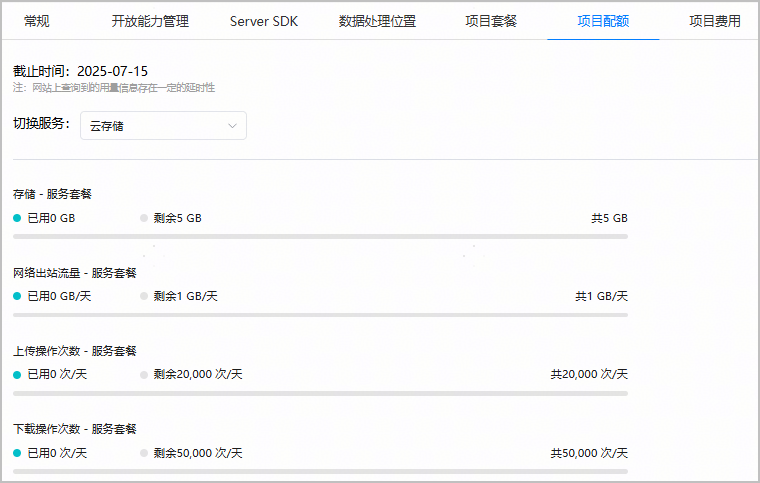

免费试用时，您可以在AppGallery Connect查询免费配额的使用情况，避免因配额用尽导致业务中断。

套餐免费配额即将用尽时，AppGallery Connect也会通过互动中心消息、邮件和短信给您发送提醒。

1. 登录[AppGallery Connect](https://developer.huawei.com/consumer/cn/service/josp/agc/index.html)，选择“开发与服务”。
2. 在项目列表中点击您的项目，进入“项目设置”页面。
3. 点击“项目配额”页签，可查询当前项目下已订阅服务的免费配额使用情况。

   

* 如果项目启用了多个数据处理位置，此处展示的配额使用量为服务在这多个数据处理位置的配额使用总和。
* 免费配额为零的服务不支持在“项目配额”页面查看。如果服务下某个SKU的免费配额为0，则该SKU也不展示在“项目配额”页面。
* 由于统计汇总原因，配额使用信息会存在一定的延迟（通常不会超过1个小时）。
* 如果配额用量信息与账单详情不一致，请以账单数据为准。
