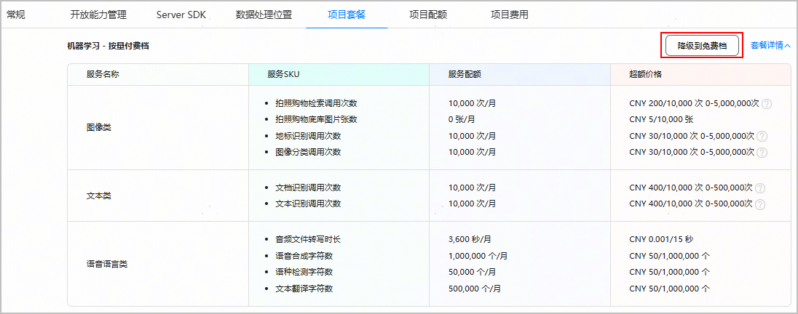
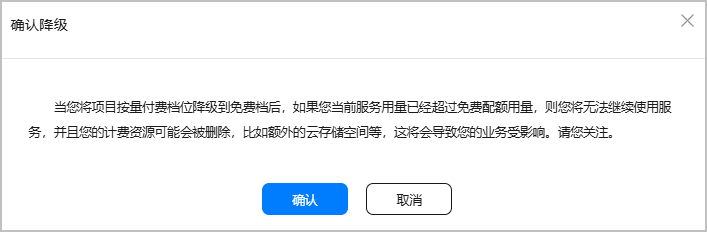
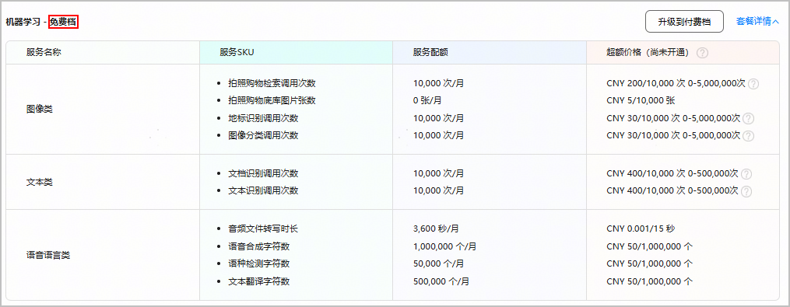

升级到按量付费档套餐后，您也可以选择降级，将付费档关闭，仅使用免费配额。

1. 登录[AppGallery Connect](https://developer.huawei.com/consumer/cn/service/josp/agc/index.html)，选择“开发与服务”。
2. 在项目列表中点击您的项目，进入“项目设置”页面。
3. 点击“项目套餐”页签，进入项目套餐列表页面。
4. 找到您需要降级的套餐，点击“降级到免费档”。

   
5. 仔细阅读“确认降级”提示后，点击“确认”，即可完成套餐降级。套餐降级立刻生效。

   
6. 返回项目套餐列表，可看到套餐名后缀已变更为“免费档”。

   
