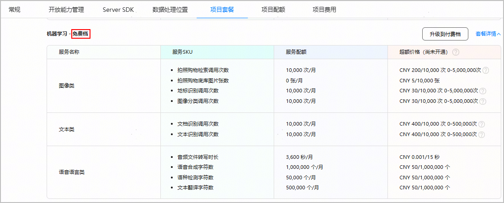

收费服务通常会提供一定免费配额，供您体验试用。[创建项目](/docs/distribute/agc/agc-help-project-0000002270709469/agc-help-create-project-0000002242804048)后，华为会自动为您订阅部分收费服务的免费档套餐。

1. 登录[AppGallery Connect](https://developer.huawei.com/consumer/cn/service/josp/agc/index.html)，选择“开发与服务”。
2. 在项目列表中点击您的项目，进入“项目设置”页面。
3. 点击“项目套餐”页签，可查看当前项目下的套餐列表。

   如果套餐名后缀为“免费档”，表示该免费档套餐已自动订阅，您可以在配额范围内免费使用套餐内各个服务，也可以查看到对应服务的按量付费价格（即“超额价格”）。

   

* 订阅某服务的免费档套餐并不代表开通了该服务。如需开通服务，请参考对应服务的开发指南操作。
* 如果套餐内某服务尚未配置超额价格，则“超额价格”列显示“尚未上线”。周期内的免费服务配额用尽后，您可以等待下个计费周期继续使用，或者联系agconnect@huawei.com。
