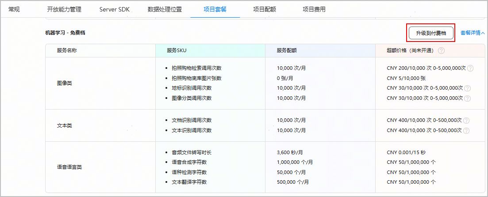
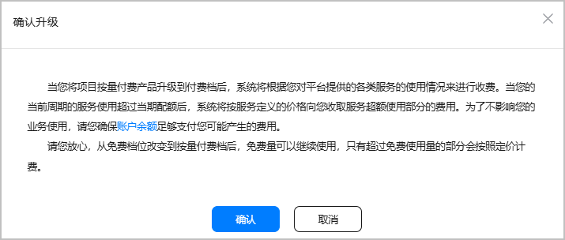
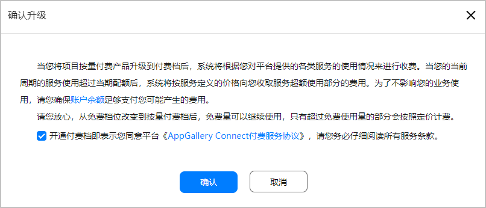
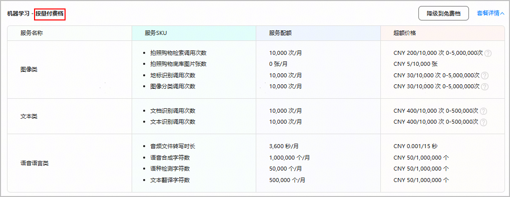

按量付费套餐指您使用收费服务时，如果服务的使用量超过免费额度，则可以将服务的订阅方式切换到按量付费模式，系统将允许您继续使用服务，您只需要对周期内超额使用的部分按照用多少付多少的模式进行付费。您超额使用的费用将自动从您的账户余额中扣除，您需要保证您的账户余额充足。

#### 前提条件

* 目前中国站点以外的个人开发者无法升级到付费档。
* 升级到付费档前，请确保您已[开通付费服务](https://developer.huawei.com/consumer/cn/doc/start/payment-service-0000001052865979)，系统将默认自动设置您的币种为人民币。

#### 操作步骤

1. 登录[AppGallery Connect](https://developer.huawei.com/consumer/cn/service/josp/agc/index.html)，选择“开发与服务”。
2. 在项目列表中点击您的项目，进入“项目设置”页面。
3. 点击“项目套餐”页签，进入项目套餐列表页面。
4. 找到您需要升级的套餐，点击“升级到付费档”。

   
5. 仔细阅读“确认升级”提示后，点击“确认”，即可完成套餐升级。套餐升级即刻生效。

   

   如您尚未签署华为AppGallery Connect付费服务协议，或协议非最新，您还需进行协议签署。在“确认升级”弹窗，仔细阅读协议内容后勾选同意，点击“确认”即可。

   
6. 返回项目套餐列表，可看到套餐名后缀已变更为“按量付费档”。

   

   

   * 您超额使用的费用将自动从您的账户余额中扣除，请保证您的账户余额充足。为防止您的账户余额不足而导致扣款失败，您可以[设置账户余额不足提醒](/docs/distribute/agc/agc-help-account-0000002270829385/agc-help-set-balance-notify-0000002247531780)。
   * 升级到按量付费档套餐后，建议您尽快前往“账户中心 > 费用 > 消费提醒”[设置消费提醒](/docs/distribute/agc/agc-help-account-0000002270829385/agc-help-set-spending-notify-0000002242112054)，以便您及时了解当前的消费情况，避免意外账单费用。
   * 升级到按量付费档套餐后，如果您的账户内有优惠券，每月将优先使用优惠券抵扣费用。费用超出优惠券金额时，则需要您付费使用。如需查看账户内的优惠券详情，请参见[管理优惠券](/docs/distribute/agc/agc-help-account-0000002270829385/agc-help-coupon-0000002242112062)。
