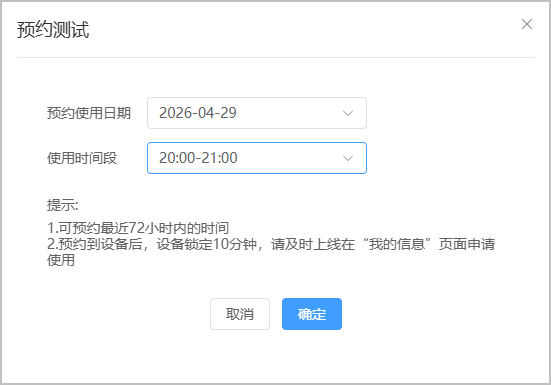
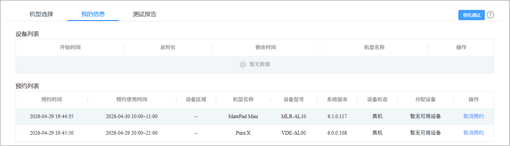
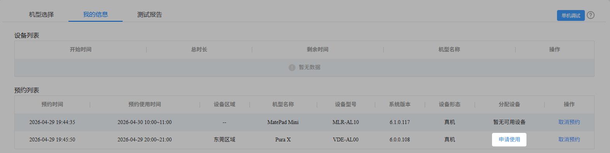
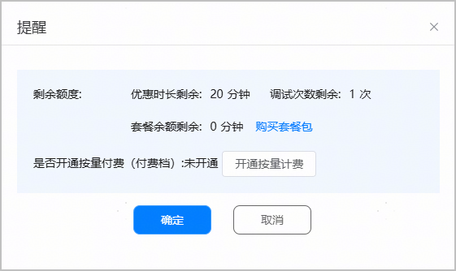

当您想在特定时间段进行调试，或是您当前想要调试的设备处于忙碌状态无法申请时，云调试服务支持预约测试设备。您可预约最近72小时内的调试时间。当预约的设备在预约时段空闲时，设备会被锁定10分钟，请您及时上线，并在“我的信息”页面申请使用。每个账号最多在线同时预约2台设备。

#### 前提条件

* 请确保您的账户未欠费，如欠费，您将无法使用云调试服务，请为[账户充值](https://developer.huawei.com/consumer/cn/doc/development/AppGallery-connect-Guides/agc-account-recharge-0000001126625360)。
* 当前HarmonyOS 5及以上机型均为优惠机型，请确保剩余优惠时长不少于15分钟。

#### 操作步骤

1. 登录[AppGallery Connect](https://developer.huawei.com/consumer/cn/service/josp/agc/index.html)，点击“开发与服务”。
2. 在项目列表中点击需要测试的项目。
3. 在左侧导航栏选择“质量 > 云调试”，进入云调试主界面。

   

4. 选中“HarmonyOS 5及以上”选框后，鼠标移动至您想要预约的设备上，点击“预约测试”。

   

   HarmonyOS 5及以上机型为每个开发者账号提供每天360分钟的免费额度。为防止免费额度用尽无法在预约的时段进行调试，您可以[订购付费套餐包](/docs/distribute/agc/agc-help-clouddebug-0000002235870046/agc-help-clouddebug-price-0000002255019568#section1554613186493)，并确保套餐内的剩余时长不少于15分钟，或[升级付费档](/docs/distribute/agc/agc-help-clouddebug-0000002235870046/agc-help-clouddebug-price-0000002255019568#section12857373426)，并确保账户余额大于15元。如果余额不足，请为您的账户[充值](/docs/distribute/agc/agc-help-account-0000002270829385/agc-help-topup-0000002277191065)。

   

   充值后状态变更可能会有一定延迟，请您耐心等待后刷新重试。

5. 在弹出的“预约测试”框中，按照提示信息填写预约使用日期和使用时间段，填写完成后点击“确定”。

   
6. 跳转至“我的信息”界面后，您可在“预约列表”下查看您预约测试时的时间、预约使用时间、设备区域、机型名称等信息。如您想要取消预约的调试，您可在对应设备的“操作”栏下点击“取消预约”。

   
7. 当预约的设备在预约时段空闲，设备会被锁定10分钟，系统会通过邮件和短信通知您，请您及时上线，并在“我的信息”页面预约列表下的对应设备的“分配设备”栏中，点击“申请使用”。

   
8. 在弹出的“提醒”框中确认剩余额度后，点击“确定”，系统将预扣特定的时间额度。

   您可以点击“购买套餐包”订购项目付费套餐或点击“开通按量计费”根据实际使用量付费。

   您可参考[调试应用](/docs/distribute/agc/agc-help-single-device-debugging-0000002578270125/agc-help-clouddebug-debugapp-0000002289629821)完成后续调试步骤。

   
