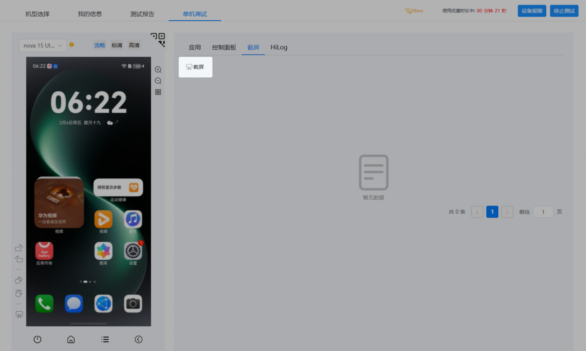
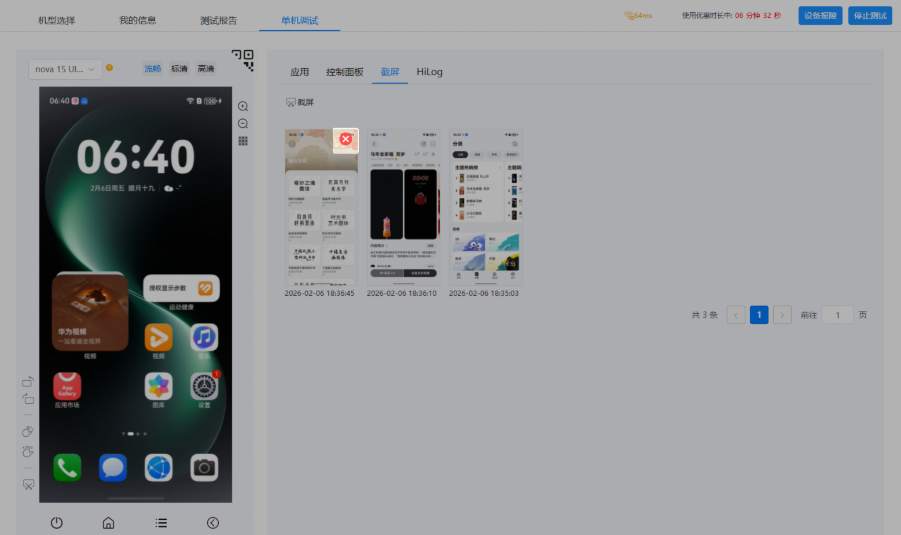

云调试服务支持在调试过程中实时对设备进行截屏。当您在调试应用过程中需要保存特殊场景的信息时，可以通过截屏功能保存场景界面，以便您定位问题。

#### 前提条件

调试截屏前必须先[申请调试设备](/docs/distribute/agc/agc-help-single-device-debugging-0000002578270125/agc-help-clouddebug-applyequip-0000002254916518)。

#### 截屏

1. 调试设备申请成功后，进入调试页面，点击“截屏”页签进入截屏页面。
2. 当您的调试设备处于想要截屏的调试场景时，点击页面右侧的“截屏”，即可截取场景图片。

   

   截屏图片按时间先后排序，您可点击图片右上角的红色“×”号，删除无用截图。

   

   截屏图片会同步保存至测试报告中，您可以在测试报告上打开对应设备的报告详情，查看历史截屏图片，详见[查看测试报告](/docs/distribute/agc/agc-help-single-device-debugging-0000002578270125/agc-help-clouddebug-viewreport-0000002255019576)。

   
