通过云调试服务，您可以在不同HarmonyOS 5及以上设备上调试HAP/APP格式的应用，从而提前发现并解决问题。

在本场景下，如无特殊说明，“应用”所指代的对象包括HarmonyOS 5及以上应用和元服务。

#### 前提条件

* 调试应用前必须先[申请调试设备](https://developer.huawei.com/consumer/cn/doc/app/agc-help-clouddebug-applyequip-0000002254916518)。
* 在使用云调试服务前，请准备好配置了发布证书且打包时编译模式选择“release”的应用包，且应用软件包的大小须在4GB以内。

#### 上传应用

1. 设备初始化成功后，进入“单机调试”页签。

   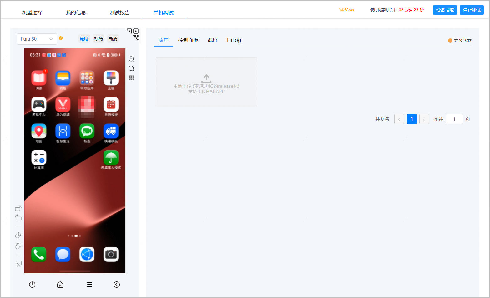
2. 点击右侧区域“应用”页签下的“本地上传”，上传本地待调试的应用release包。上传完成后，应用自动安装。应用安装成功后，您可在左侧的手机界面区域查看安装完成的应用。

   您还可以在“我的信息”页签下上传应用，具体操作方法请参见[管理应用](https://developer.huawei.com/consumer/cn/doc/app/agc-help-clouddebug-manageapp-0000002578460771)。

   

   * 当前仅支持上传和安装配置了发布证书且在打包时“Build Mode”选择“release”的应用release包，暂不支持In-house应用及debug版本的应用包。
   * 上传应用包时，系统会对包名、版本和SHA256进行重复性校验。允许上传具有相同包名和版本但SHA256不同的应用包。如果待上传应用包的包名、版本和SHA256与已成功上传的应用包完全一致，则无法上传并弹框提示您。
   * HAP和APP格式的HarmonyOS应用在真机设备上安装完成后均会自动打开，无需您手动操作。

   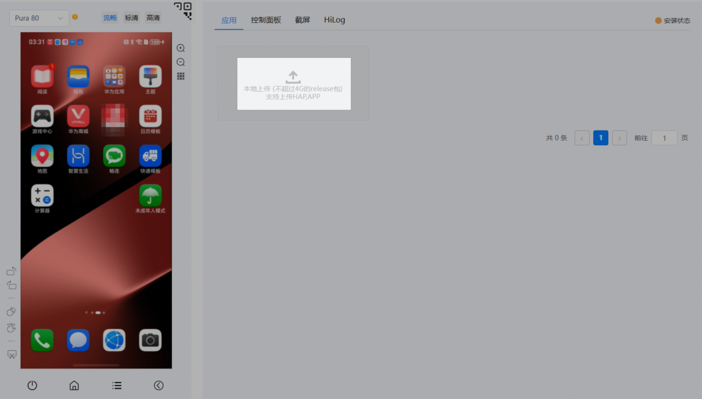
3. （可选）如果应用安装失败，您可点击提示框中的“参考文档”查看问题解决方法。

   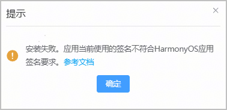

#### 调试说明

目前支持以下两种方式调试应用，请根据实际需求选择：

* 方式一：[PC上调试应用](#section081042915213)

  应用安装完成后，您可以直接在“单机调试”页面通过鼠标滑动、点击等操作来调试应用。
* 方式二：[扫码在自己手机上调试应用](#section164431443104)

  应用安装完成后，将鼠标悬停在“单机调试”页面的二维码上，然后在您的手机上左滑进入负一屏界面，触摸右上角按钮扫一扫二维码，将调试界面投屏到您的手机上进行调试。

此外，在应用调试过程中，由于隐私安全限制，当系统检测到进入登录界面时，会显示黑屏以避免展示屏幕内容。在此情况下，您可[使用获取控件树按钮完成登录](#section1851413117162)。

#### [h2]PC上调试应用

完成应用安装后，返回“单机调试”页面，您可在左侧设备区域通过鼠标滑动、点击等远程操作调试设备，了解应用的运行和使用情况。

您还可以在右侧区域的不同页签（基于所选调试设备动态刷新）中，根据实际需要进行其他调试操作：

* 应用：您可以手动安装或删除已上传的其他应用。
* [控制面板](https://developer.huawei.com/consumer/cn/doc/app/agc-help-clouddebug-location-0000002289516745)：您可以输入hdc shell命令调试，也可以输入正确的经度、纬度、海拔高度和城市信息，了解应用在特定位置的使用情况。
* [截屏](https://developer.huawei.com/consumer/cn/doc/app/agc-help-clouddebug-capturescreen-0000002254916522)：当您在调试应用过程中遇到需要保存的特殊场景信息时，可以通过截屏功能保存场景界面，方便后续定位问题。
* [Hilog](https://developer.huawei.com/consumer/cn/doc/app/agc-help-clouddebug-viewlog-0000002289629825)：您可以在线查看和导出设备运行期间的系统日志和应用日志。

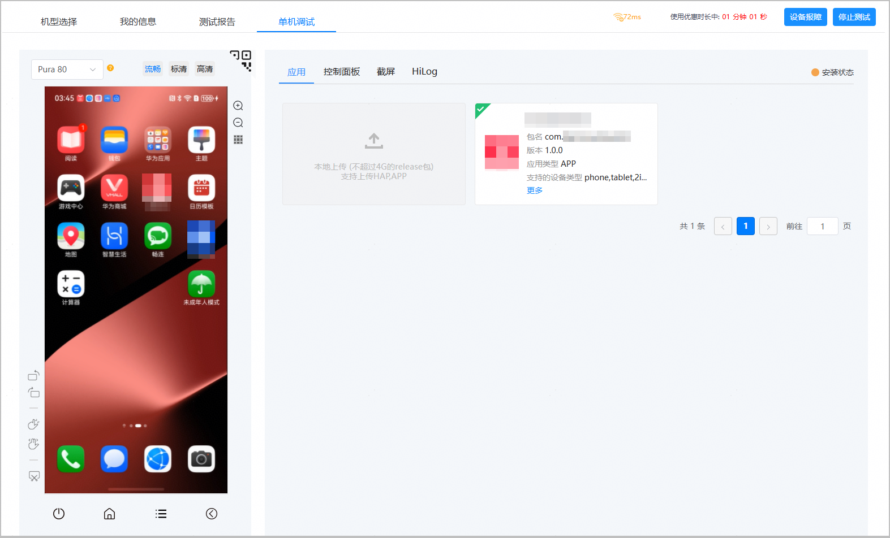

**界面按钮说明**

| 按钮位置 | 样式 | 功能名称 | 功能介绍 | |
| --- | --- | --- | --- | --- |
| **左侧设备区域** |  | 多设备切换 | 在调试界面切换想要调试的设备。系统最多支持同时打开两个窗口，申请两台设备进行调试。 | |
|  | 显示设备详情 | 显示当前调试设备的基本信息，包括设备型号、系统版本等。 | |
|  | 切换设备分辨率 | 根据需要选择设备分辨率，分辨率选项包括：流畅、标清和高清。 | |
|  | 放大 | 放大设备界面。 | |
|  | 缩小 | 缩小设备界面。 | |
|  | 内屏 | 以手机内屏展示调试界面。  **仅选择阔折叠或双折叠形态的折叠屏手机调试时显示该按钮。** | |
|  | 外屏 | 以手机外屏展示调试界面。  **仅选择阔折叠或双折叠形态的折叠屏手机调试时显示该按钮。** | |
|  | 全屏 | 以手机全屏展示调试界面。  **仅选择三折叠屏手机（例如Mate XT）调试时显示该按钮。** | |
|  | 主屏 | 以手机主屏展示调试界面。  **仅选择三折叠屏手机（例如Mate XT）调试时显示该按钮。** | |
|  | 副屏 | 以手机副屏展示调试界面。  **仅选择三折叠屏手机（例如Mate XT）调试时显示该按钮。** | |
|  | 获取控件树 | 由于隐私安全的限制，登录界面不会显示屏幕内容。您可以通过点击该按钮启动辅助控件绘制功能，系统将自动绘制与登录相关的控件，以帮助您完成账号登录。详情请参见[使用获取控件树按钮完成登录](#section1851413117162)。 | |
|  | 逆时针旋转 | 根据实际情况切换横屏或竖屏。  说明：  在不支持旋转的界面，点击“”，界面右上角会提示“不支持屏幕旋转”。 | |
|  | 顺时针旋转 | 根据实际情况切换横屏或竖屏。  说明：  在不支持旋转的界面，点击“”，界面右上角会提示“不支持屏幕旋转”。 | |
|  | 双指捏合 | 在某些特殊场景下，例如地图或图片处理类应用，当需要使用捏合功能时，请点击此按钮。 | |
|  | 双指展开 | 在某些特殊场景下，例如地图或图片处理类应用，当需要使用展开功能时，请点击此按钮。 | |
|  | 截屏 | 对调试设备界面进行截屏。  调试过程中可在调试界面右侧的“截屏”页签查看截图。 | |
|  | 电源 | 使设备立即进入黑屏状态或是从黑屏状态唤醒。 | |
|  | 返回主页 | 使设备从当前操作界面返回主页。 | |
|  | 返回 | 返回上级界面。 | |
| **右侧上传应用区域** |  | 安装 | 手动安装已上传应用。 | |
|  | 删除 | 删除已上传的应用文件。 | |
| 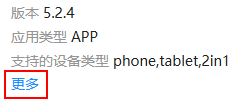 | 更多 | 显示已上传应用的基本信息，包括文件大小和上传时间。 | |

#### [h2]扫码在自己手机上调试应用

1. 应用安装完成后，返回“单机调试”页签，将鼠标悬停在二维码上。

   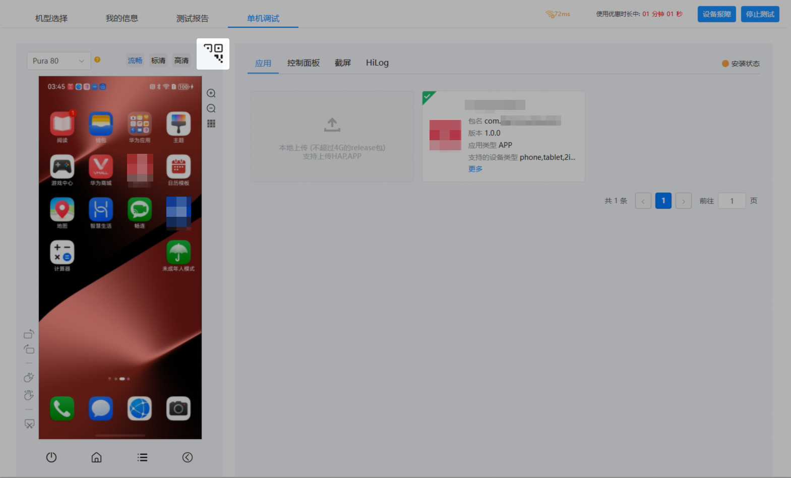
2. 左侧设备区域将显示完整的二维码。此时，您可以在自己手机上左滑进入负一屏界面，然后触摸右上角按钮扫一扫二维码。

   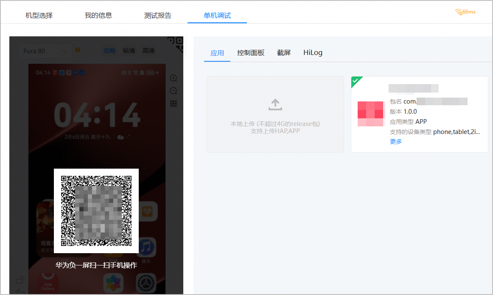
3. 当左侧设备区域显示“远程手机操作中...”时，表示调试界面已成功投屏，您即可在自己手机上的浏览器H5页面调试应用。

   

   当您在手机上调试应用时，PC上“单机调试”页面右侧的应用、控制面板、截屏功能将不允许使用。如果您需要上传其他应用软件包、使用控制面板调试或者截屏等，可以点击左侧设备区域的“断开”，系统将停止投屏并恢复应用、控制面板、截屏相关功能。

   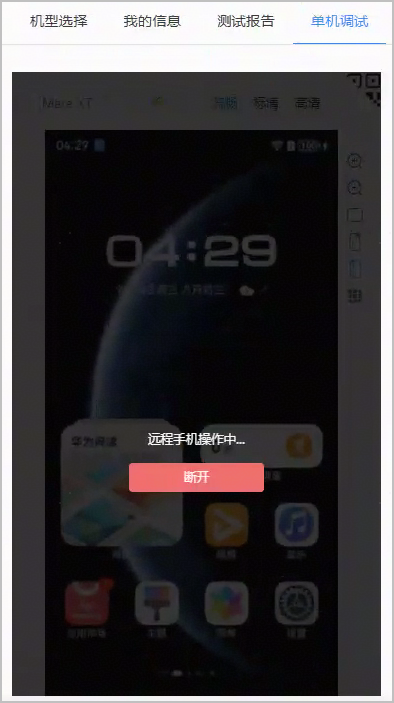
4. 当手机调试界面提示您调试时长不足2分钟时，如果您需要继续调试，请返回PC端延长调试时间。延长调试时间详情请参见[申请调试设备](https://developer.huawei.com/consumer/cn/doc/app/agc-help-clouddebug-applyequip-0000002254916518#ZH-CN_TOPIC_0000002254916518__li14407164912614)。

   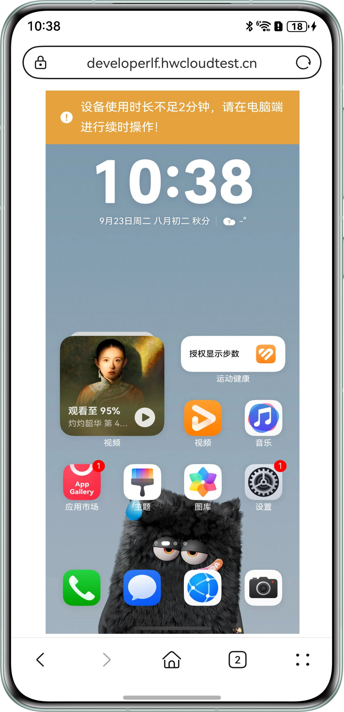

#### [h2]使用获取控件树按钮完成登录

在应用调试过程中，由于隐私安全的限制，当系统检测到进入登录界面时，会显示黑屏以避免展示屏幕内容。您可以按照以下步骤完成登录：

1. 出现黑屏时，调试界面会弹出提示框，点击“启动”。

   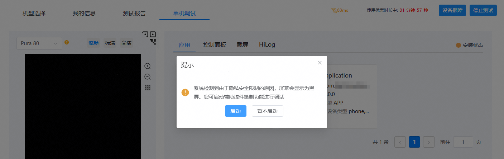
2. 系统将启动辅助控件绘制功能，设备界面会绘制出账号、密码/验证码等控件，展示效果类似如下图。此时，您可以输入账号相关信息进行登录。

   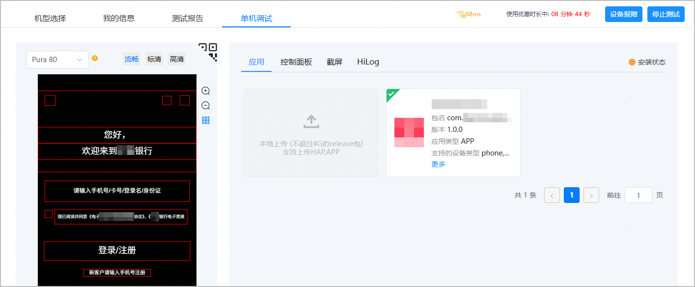
3. 登录成功后，设备调试界面会自动完成刷新，界面显示将恢复正常。点击按钮可以去除设备界面的绘制控件。

#### 释放设备

当您申请的调试设备的使用额度未用完时，您可手动释放设备，方法有如下两种：

方法一：

1. 在调试界面点击右上角“停止测试”。

   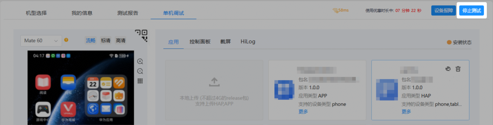
2. 在弹出的提示框中点击“确定”，即可结束调试并释放设备，页面随即跳转回“机型选择”页面。

   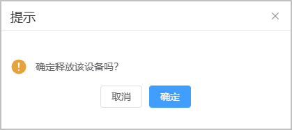

方法二：

1. 在云调试服务下“我的信息”页面，点击“单机调试”。
2. 在“设备列表”下，点击想要释放设备的“操作”列的。

   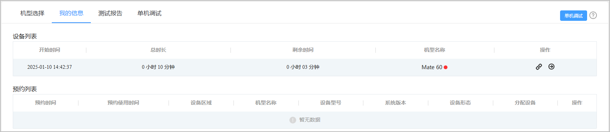
3. 在弹出的提示框中点击“确定”，即可结束调试并释放设备。

   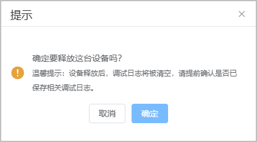

#### 设备报障

如果您申请的设备存在故障，您可以通过设备报障告知我们。

1. 在调试界面点击右上角的“设备报障”。

   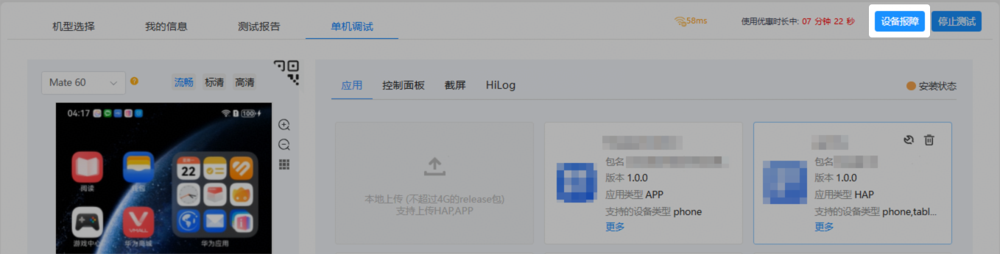
2. 在“设备报障”弹出框的文本框中输入故障原因后，点击“确定”。收到您的报障后，技术人员会尽快处理。

   

   “故障原因”长度为5-100个字符，仅允许包含中英文、数字及以下特殊字符：~$@#%&\*/()（）《》-+\_，、：:。,!.?？=或空格。

   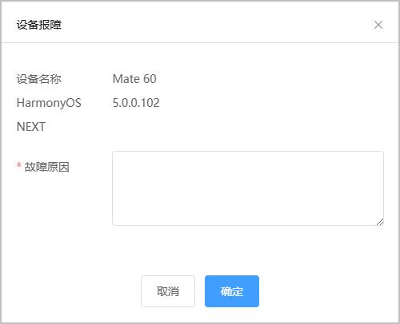
