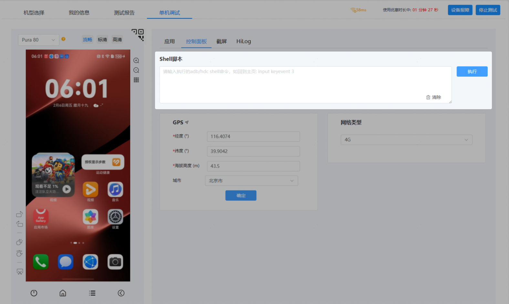
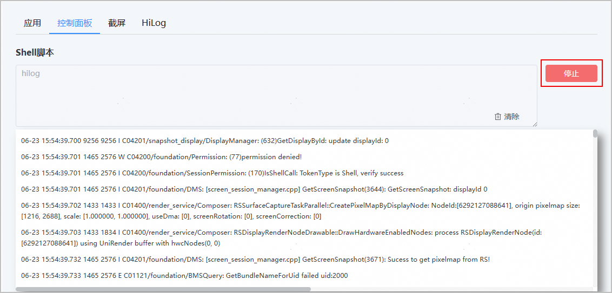
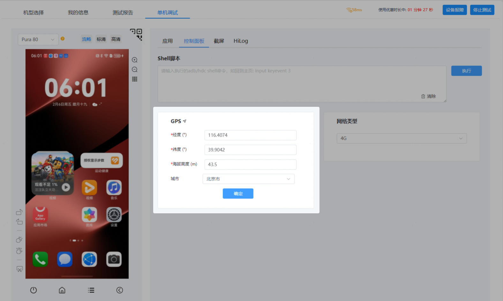

当前控制面板支持以下操作：

* [Shell脚本操作](#section9863820161614)：您可以通过输入hdc shell命令对HarmonyOS 5及以上设备执行操作，例如回到主页等。
* [设置地理位置](#section158111988619)：您可以通过输入正确的经度、纬度、海拔高度和城市信息，了解应用在特定位置的使用情况。

#### 前提条件

进行控制面板内的操作前必须先[申请调试设备](https://developer.huawei.com/consumer/cn/doc/app/agc-help-clouddebug-applyequip-0000002254916518)。

#### Shell脚本操作

调试设备申请成功后，进入调试页面，点击“控制面板”页签，选择Shell脚本输入框，输入hdc shell命令，点击“执行”发送命令，“清除”按钮可清除本次执行结果。

* 由于安全限制，当前hdc调试不支持reboot、reboot recovery等命令。
* 输入命令时，可不携带“hdc shell”前缀，当携带前缀时，系统会自动过滤前缀后再执行命令。

此外，云调试已支持识别持续打印输出的shell命令（如hilog），并新增了停止操作。当系统识别出您输入的为持续打印日志的hdc shell命令时，命令执行一段时间后，“执行”按钮将自动变更为“停止”。如下图所示，您可根据需要随时点击“停止”以暂停命令执行。点击“停止”后，按钮将恢复为“执行”，您可以继续执行当前命令或其他hdc shell命令。

#### 设置地理位置

您可以通过设置调试设备的地理位置信息，了解应用在特定位置的使用情况。

调试设备申请成功后，进入调试页面，点击“控制面板”页签，填写GPS的相关信息，包括经度、纬度、海拔高度和城市。填写完成后，点击“确定”，当页面提示设置成功时，即表示地理位置设置完成。

