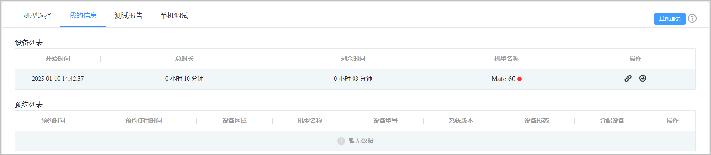

当您成功申请到调试设备后，您可在“我的信息”页签下查看或释放您的调试设备。

#### 前提条件

在进行设备管理的相关操作时，必须先成功[申请调试设备](https://developer.huawei.com/consumer/cn/doc/app/agc-help-clouddebug-applyequip-0000002254916518)。

#### 操作步骤

1. 登录[AppGallery Connect](https://developer.huawei.com/consumer/cn/service/josp/agc/index.html)，点击“开发与服务”。
2. 在项目列表中点击需要测试的项目。
3. 在左侧导航栏选择“质量 > 云调试”。
4. 点击“我的信息”页签，您可以在设备列表中看到您申请的调试设备机型、调试开始时间、调试总时长以及剩余调试时间。

   
5. （可选）您可点击对应设备操作栏下的“”或“”，释放该设备或是进入该设备的调试界面。
