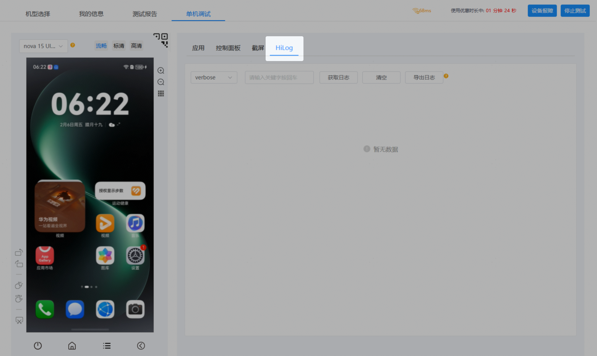
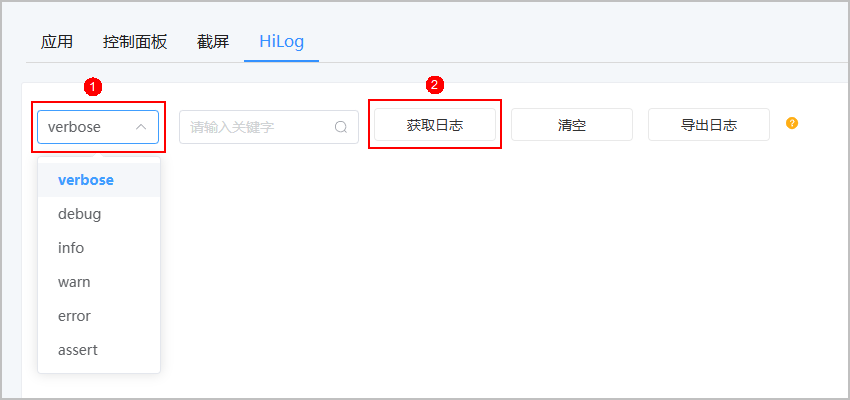
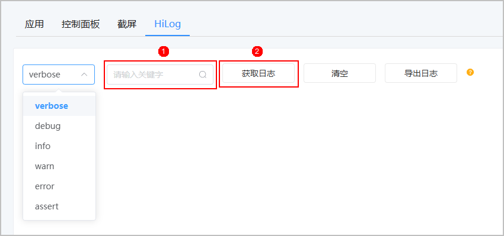
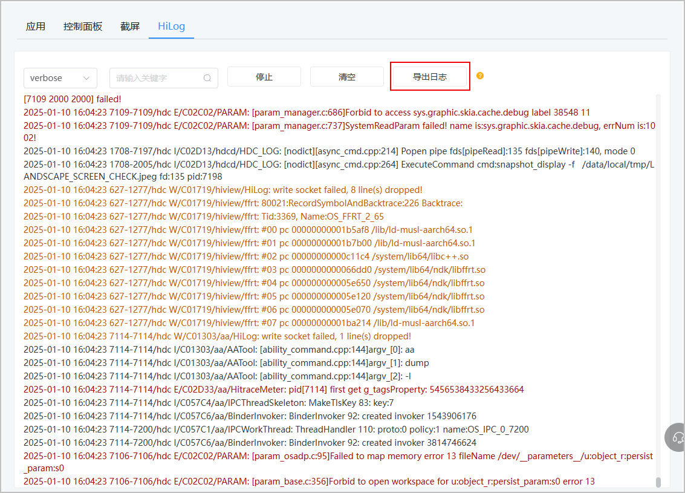
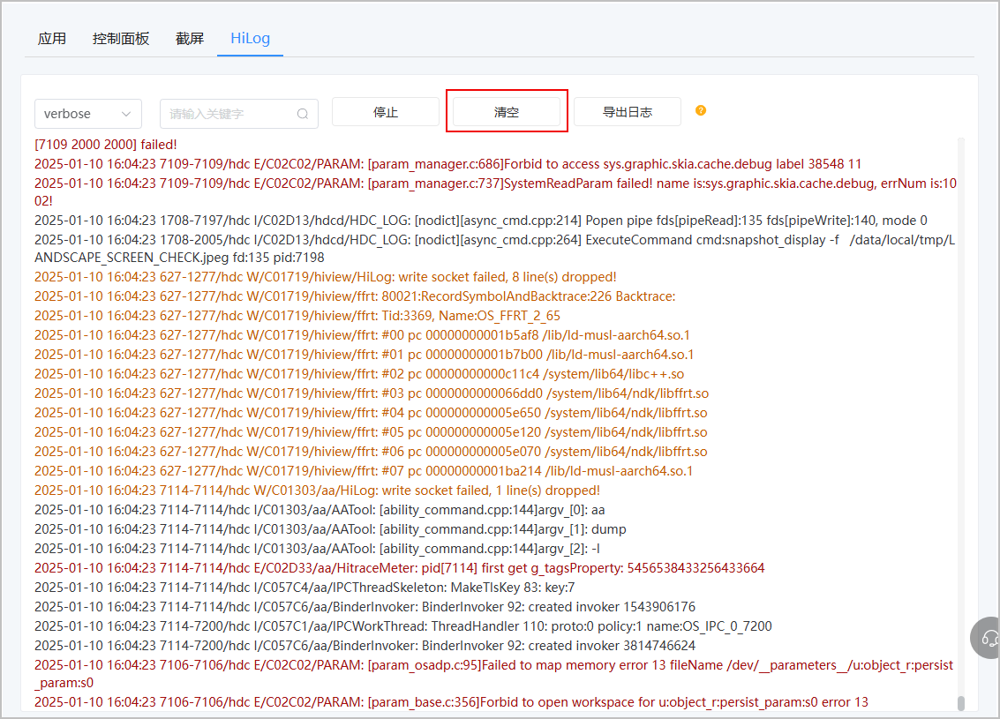

云调试服务支持在线查看和导出日志，通过获取设备运行期间的系统日志、应用日志，帮助用户定位问题。

#### 前提条件

查看日志前必须先[申请调试设备](/docs/distribute/agc/agc-help-single-device-debugging-0000002578270125/agc-help-clouddebug-applyequip-0000002254916518)。

#### 操作步骤

1. 调试设备申请成功后，进入调试页面，点击“HiLog”页签。

   

2. 日志信息可以按照日志类型分为verbose、debug、info、warn、error和assert，您可通过点击日志类型下拉框选择相应的日志类型后，点击“获取日志”。

   

   日志可实时展示500条，下载15000条。

   

   您也可在关键字输入框中输入关键字后，点击“获取日志”。

   
3. （可选）获取到相关日志信息后，您可点击“导出日志”，将获取的日志保存至本地。

   
4. （可选）点击“清空”，即可一键清除已获取的日志。

   
