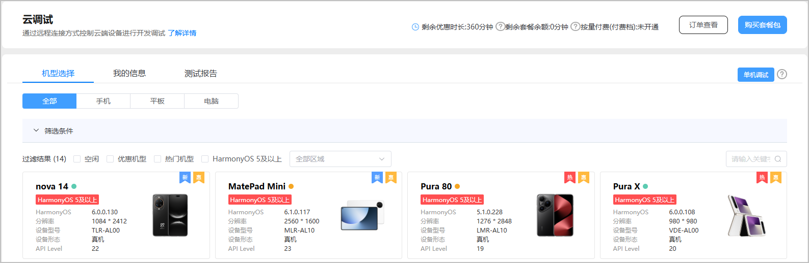
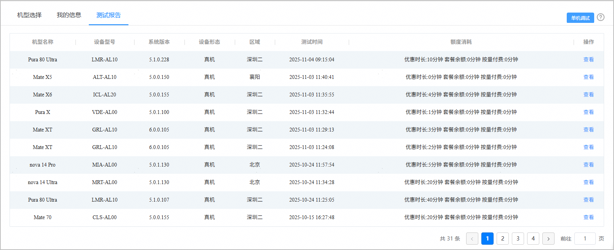
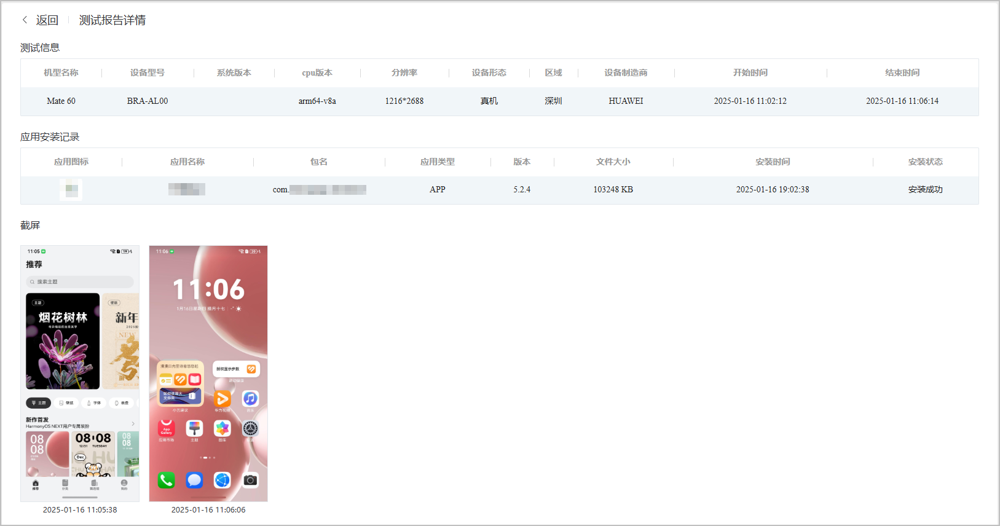

在单机调试过程中，系统会自动生成测试报告。您既可以在调试过程中实时查看报告，也可以在调试结束后查看完整报告。您可在“测试报告”页签查看您调试过的设备的相关测试信息，以及优惠时长、套餐余额和按量付费的额度消耗。

#### 前提条件

您正在进行或者已完成应用调试。

#### 操作步骤

1. 登录[AppGallery Connect](https://developer.huawei.com/consumer/cn/service/josp/agc/index.html)，点击“开发与服务”。
2. 在项目列表中点击需要测试的项目。

3. 在左侧导航栏选择“质量 > 云调试”。

   
4. 在“测试报告”页签下点击右侧的“单机调试”，您可以查看优惠时长、套餐余额和按量付费的额度消耗。

   
5. 点击对应调试机型“操作”列的“查看”，即可查看相关测试信息。在测试报告详情页中，您可以查看历史调试设备的详情信息，应用的安装记录，以及历史截屏数据。

   
