#### 新增模板

每个应用或元服务最多支持添加500个模板。

1. 登录[AppGallery Connect](https://developer.huawei.com/consumer/cn/service/josp/agc/index.html)，点击“APP与元服务”。
2. 进入“HarmonyOS”页签，您可通过包名、应用名称、应用类型等信息进行筛选，然后在应用列表中点击您的应用/元服务名称。

   
3. 左侧菜单栏选择“应用上架/元服务上架 > 服务素材”，进入服务素材主界面。
4. 选择“模板管理”页签，在“4\*3类型”卡片区域点击“+”新增素材模板。

   

   系统会使用您上传的素材，自动创建一个4\*3类型的草稿态模板卡片，并命名为“4\*3模板”。

   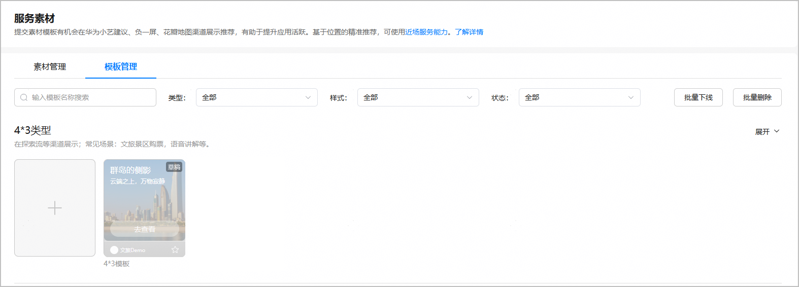
5. 页面右侧滑出“新建4\*3卡片模板”窗口，选择“模板样式”，并配置其他模板信息。
   * 沉浸版（包含文案、按钮、App、Logo、主题图片信息）

     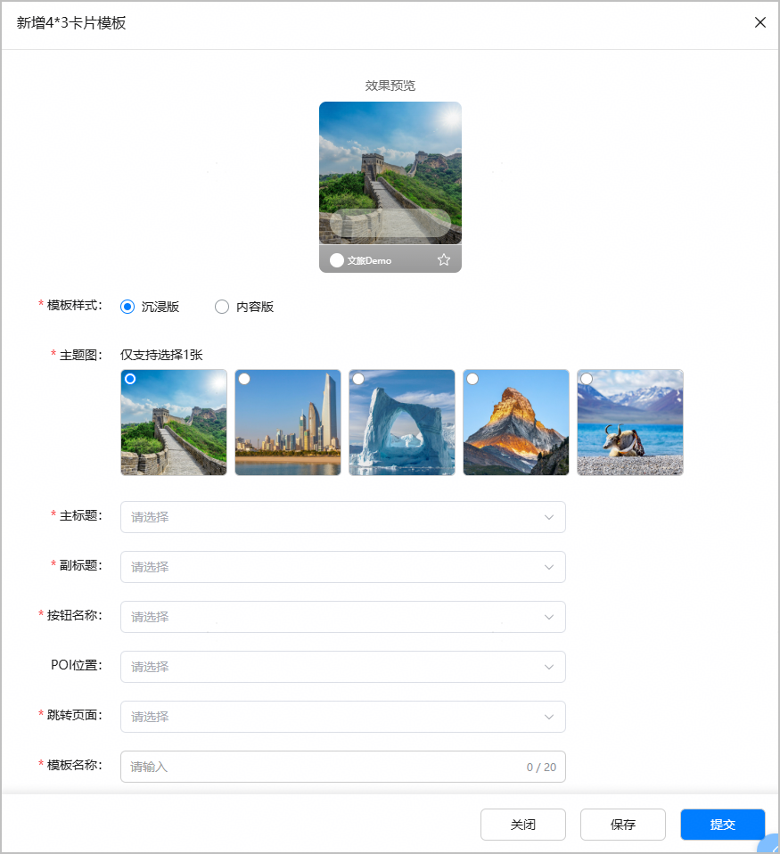

     | 配置项 | 说明 |
     | --- | --- |
     | 主题图 | 包含内容的主题图片。系统会自动同步您已在“素材管理”页面上传的600\*600px主题图供您选择，仅支持选择1张。 |
     | 主标题 | 对关键内容的简要说明。下拉框中选择您已在“素材管理”页面添加的主标题。 |
     | 副标题 | 对关键内容的阐述。下拉框中选择您已在“素材管理”页面添加的副标题。 |
     | 按钮名称 | 按钮上展示的内容。下拉框中选择您已在“素材管理”页面添加的按钮名称。 |
     | POI位置 | 模板卡片关联的POI信息。下拉框中选择您已在“素材管理”页面添加的POI位置，支持多选或全选。 |
     | 跳转页面 | 点击按钮后跳转的目标页面地址。下拉框中选择您已在“素材管理”页面添加的跳转页面。 |
     | 模板名称 | 在“模板管理”页面模板列表区域展示的模板名称。可根据模板使用场景定义，不超过20个字符。 |
   * 内容版（包含图片、文案、App、Logo信息）

     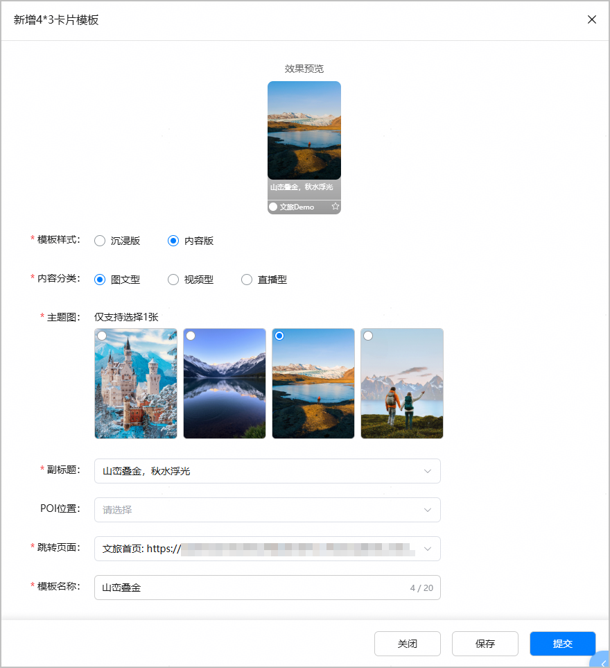

     | 配置项 | 说明 |
     | --- | --- |
     | 内容分类 | 目前支持图文、视频、直播三种类型的内容。 |
     | 主题图 | 包含内容的主题图片。系统会自动同步您已在“素材管理”页面上传的600\*800px主题图供您选择，仅支持选择1张。 |
     | 副标题 | 对关键内容的阐述。下拉框中选择您已在“素材管理”页面添加的副标题。 |
     | POI位置 | 模板卡片关联的POI信息。下拉框中选择您已在“素材管理”页面添加的POI位置，支持多选或全选。 |
     | 跳转页面 | 点击按钮后跳转的目标页面地址。下拉框中选择您已在“素材管理”页面添加的跳转页面。 |
     | 模板名称 | 在“模板管理”页面模板列表区域展示的模板名称。可根据模板使用场景定义，不超过20个字符。 |
6. 完成模板配置后，如果点击“保存”，则暂不提交审核，模板为“草稿”状态；如果点击“提交”，则提交模板上线，模板为“审核中”状态。华为运营人员会及时处理审核，审核通过后，模板将变更为“已上线”状态并高亮显示。

   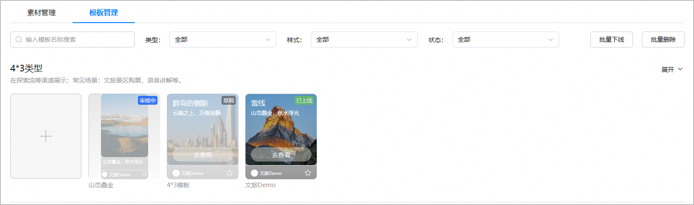

#### 编辑模板

“审核中”和“已上线”状态的模板不支持编辑。“草稿”状态的模板，点击后可在右侧滑出的“编辑4\*3卡片模板”窗口直接进行修改。其他处于“审核驳回”或“已下线”状态的模板，编辑方法类似。下文以编辑“审核驳回”状态的模板为例进行介绍。

1. 在“模板管理”页面的“4\*3类型”模板卡片区域，点击需要编辑的模板。
2. 页面右侧滑出模板详情窗口，点击页面底部的“编辑”。

   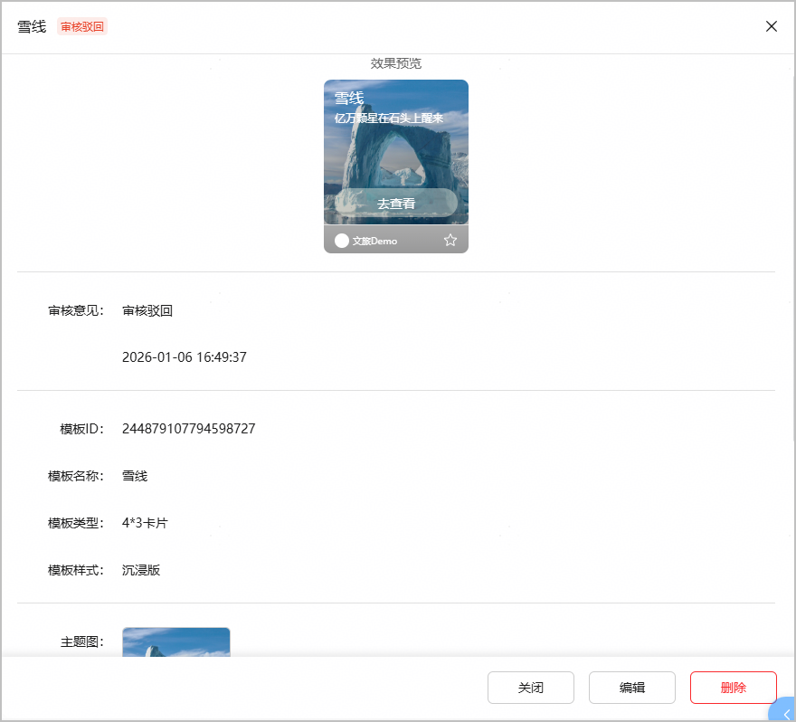
3. 在“编辑4\*3卡片模板”窗口，重新选择需要修改的模板信息，然后点击“保存”保存修改，或点击“提交”提交模板上线。

   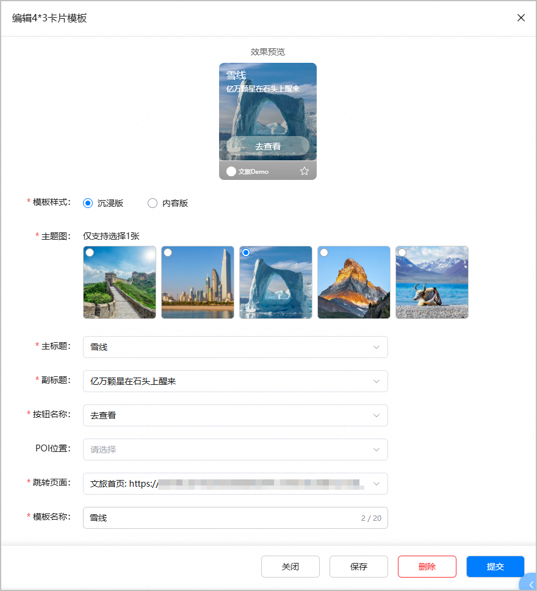

#### 下线模板

处于“已上线”状态的模板，如您需要将其下线，可以选择单个模板进行下线操作，也可以一次性批量下线多个模板。

#### [h2]下线单个模板

1. 在“模板管理”页面的“4\*3类型”模板卡片区域，点击需要下线的模板。
2. 页面右侧滑出模板详情窗口，点击页面底部的“下线模板”。

   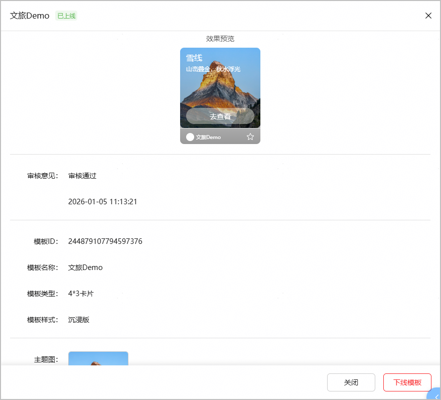
3. 在弹出的提示框中，确认无误后点击“下线”，即完成模板下线。

   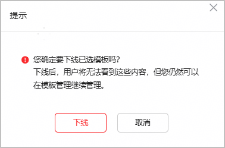

#### [h2]批量下线模板

1. 选择“模板管理”页签，点击页面右上角的“批量下线”。

   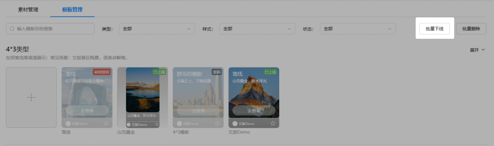
2. 每个已上线模板卡片的左上角将出现选框，勾选需要下线的4\*3类型模板。模板数量比较多时，可以点击页面右侧的“展开”。如需全部下线，可勾选“全选”前的选框。勾选完成后，点击页面右上角的“下线”。

   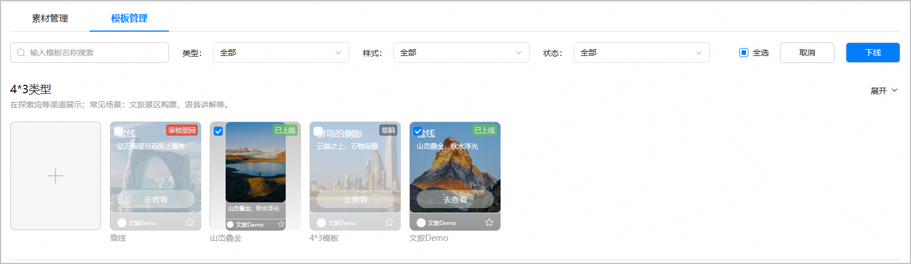
3. 在弹出的提示框中，确认无误后点击“下线”，即完成模板下线。

   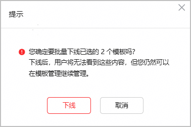

#### 删除模板

“审核中”和“已上线”状态的模板不支持删除。处于“草稿”、“审核驳回”、“已下线”状态的模板，如您需要将其删除，可以选择单个模板进行删除操作，也可以一次性批量删除多个模板。

#### [h2]删除单个模板

1. 在“模板管理”页面的“4\*3类型”模板卡片区域，点击需要删除的模板。
2. 页面右侧滑出模板编辑或详情窗口，点击页面底部的“删除”。

   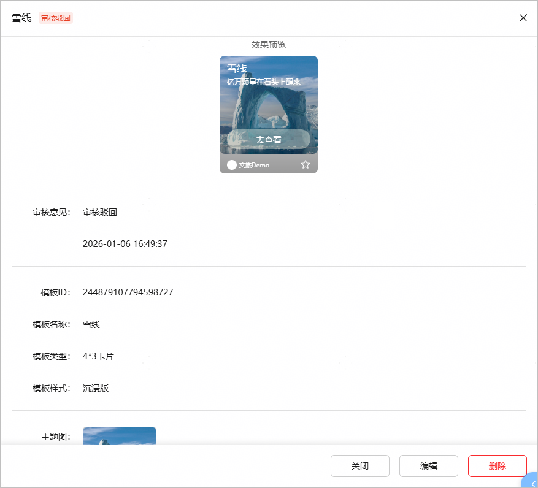
3. 在弹出的提示框中，确认无误后点击“删除”即删除完成。

   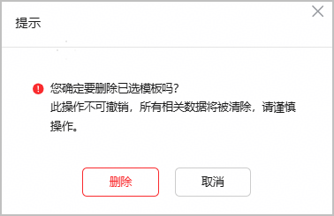

#### [h2]批量删除模板

1. 选择“模板管理”页签，点击页面右上角的“批量删除”。

   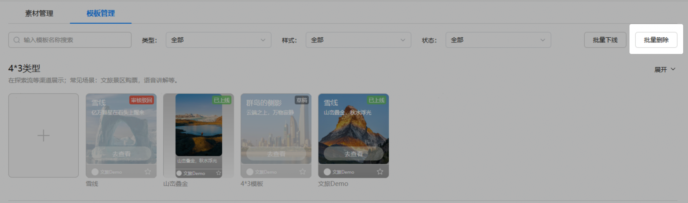
2. 每个已创建模板卡片的左上角将出现选框，勾选需要删除的4\*3类型模板。如需全部删除，可勾选“全选”前的选框。勾选完成后，点击页面右上角的“删除”。

   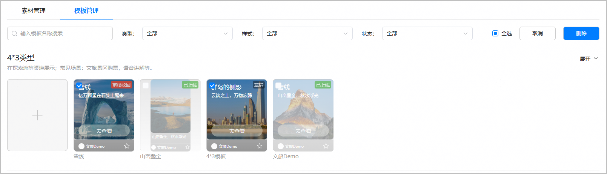
3. 在弹出的提示框中，确认无误后点击“删除”即删除完成。

   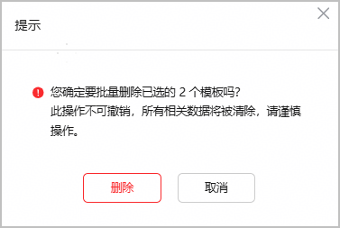
