#### 概述

元服务客服是元服务平台官方提供的、增强元服务服务能力和提升元服务服务质量的客服系统，帮助开发者与元服务用户进行快速高效的沟通。

#### 覆盖范围与前提条件

* 本功能仅适用于在华为应用市场上架的元服务。
* 本功能仅适用于分发至手机或平板设备的元服务。
* 您需要发送邮件至atomicservice@huawei.com申请，审核通过后方可使用元服务客服功能。
* 管理客服功能的操作账号必须是对元服务拥有“客服消息管理”权限的账号持有者、管理员、APP管理员、开发角色。

  使用客服工作台的操作账号必须是对应拥有“查看客服工作台”权限的客服角色（不包含账号持有者）。

  关于账号角色与权限的详细信息，可参考[角色与权限](https://developer.huawei.com/consumer/cn/doc/app/agc-help-rolepermission-0000002271930352)。

#### 开通元服务客服功能

1. 登录[AppGallery Connect](https://developer.huawei.com/consumer/cn/service/josp/agc/index.html)，点击“快速开始”中的“元服务一站式平台”卡片。

   
2. 在左上角下拉列表选择要查看的元服务。

   
3. 左侧导航选择“基础服务 > 客服管理”，进入客服管理页面，点击“立即开通”。

   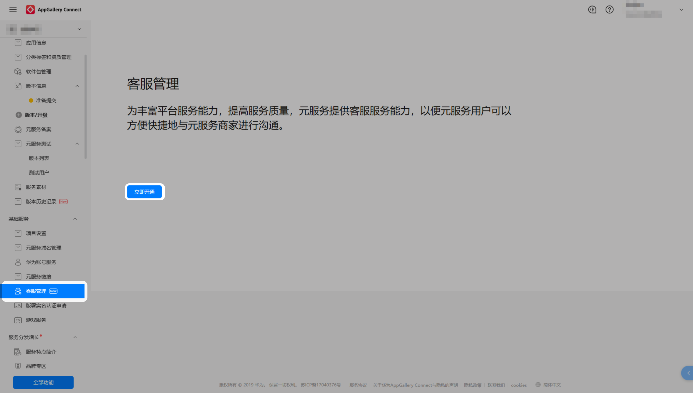

#### 配置客服人员

1. 登录[AppGallery Connect](https://developer.huawei.com/consumer/cn/service/josp/agc/index.html)，点击“用户与访问”，选择“用户 > 所有用户”，进入“所有用户”页面，点击“新增”。

   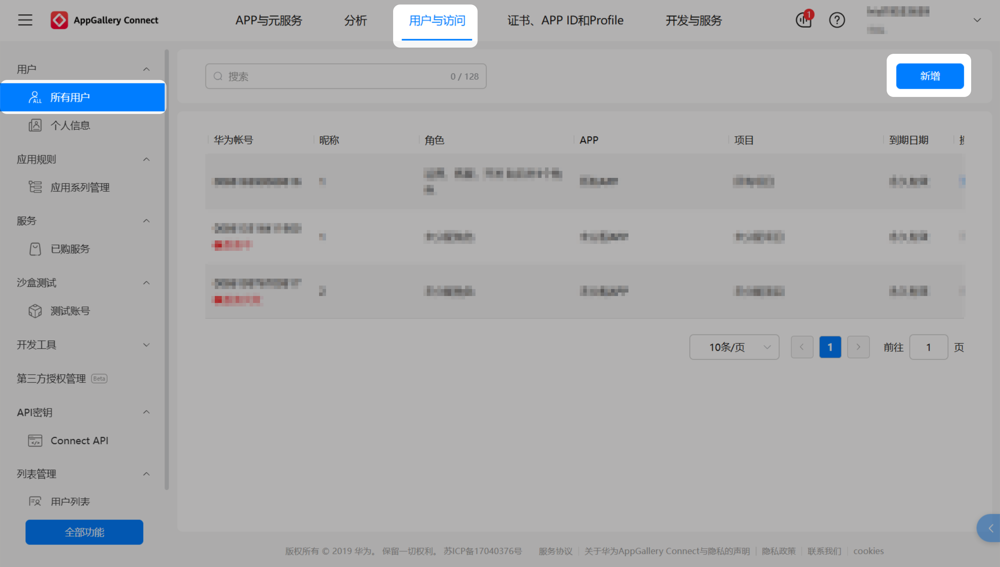
2. 前往联盟管理中心，点击“添加成员账号”邀请新用户加入团队。

   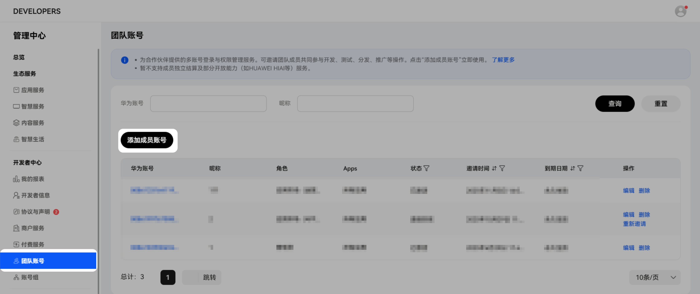
3. 选择客服角色与要该成员与用户会话的元服务，点击“提交”。

   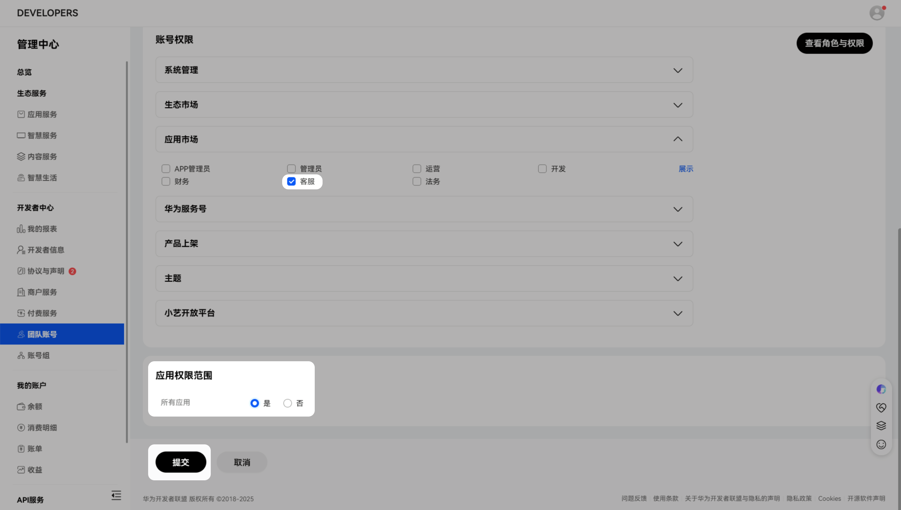
4. 添加成功后，被邀请成员需要登录联系邮箱接受邀请。

   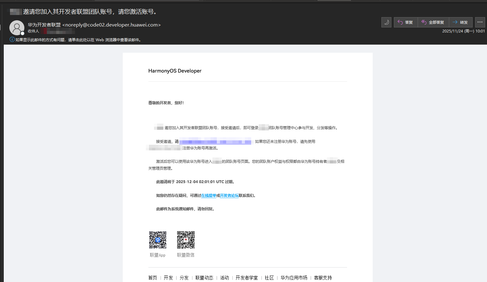

#### 进入客服工作台

1. 登录[AppGallery Connect](https://developer.huawei.com/consumer/cn/service/josp/agc/index.html)网站，点击“APP与元服务”，从列表中选择您的元服务。
2. 左侧导航选择选择“基础服务 > 客服工作台”，进入客服工作台页面。

   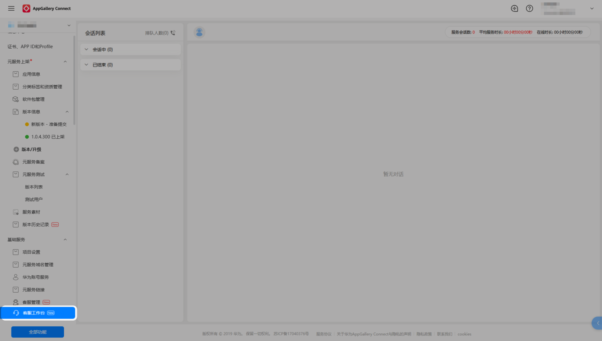

#### 切换客服状态

* 空闲状态：系统会自动接入5个会话。
* 小休或忙碌状态：系统将不会自动接入会话，您可以点击左上角排队人数手动接入会话。
* 下班状态：您将无法收到会话消息。

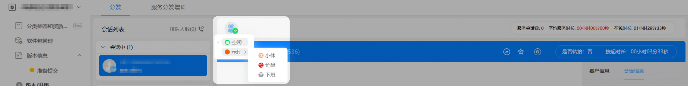

#### 接入会话消息与发送会话消息

您可以点击左上角排队人数手动接入会话，目前支持发送文本、图片、表情等类型的消息。

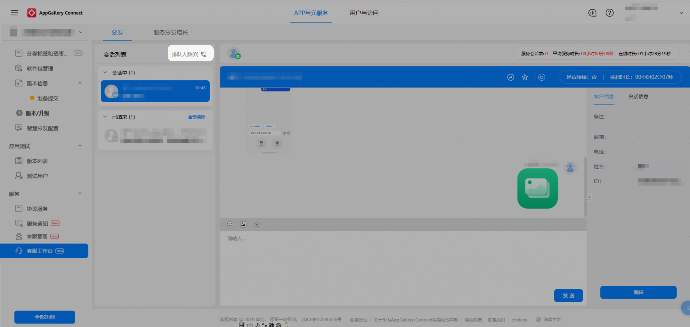

#### 转接会话

1. 您可以将会话转接给其他处于空闲状态的客服。

   
2. 选择空闲状态的客服后，点击“确定”转接会话。

   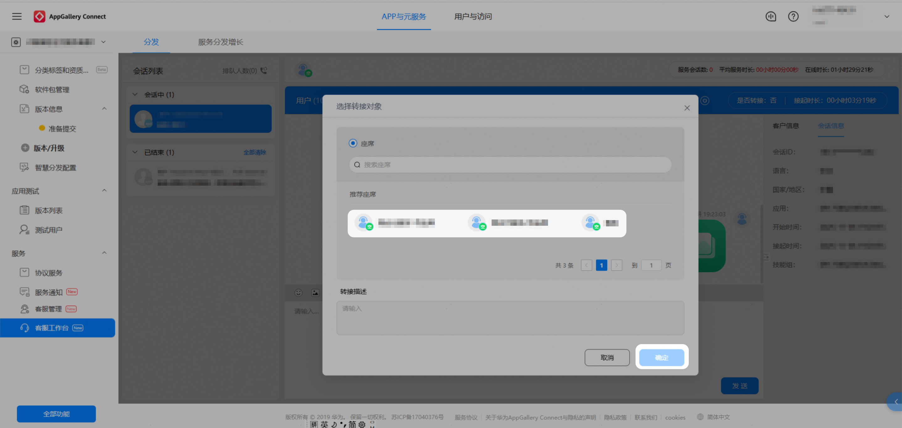

#### 结束会话

您可以主动结束会话。

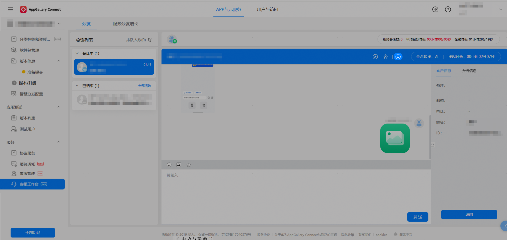

已结束的会话无法收发消息，操作后用户再次咨询，会话会重新排队后接入。

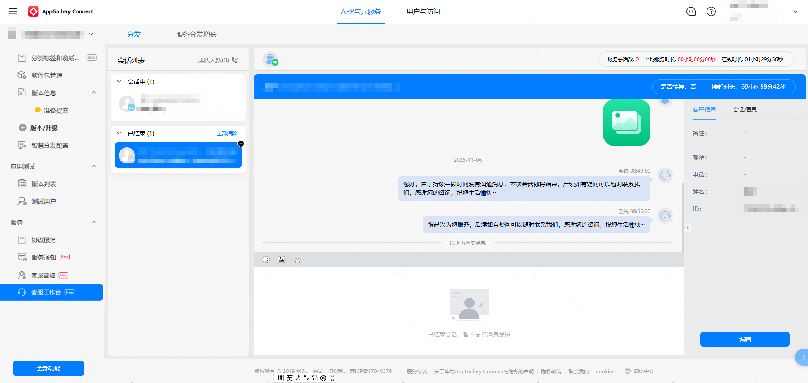

#### 邀请评价

您可以主动向用户发送评价邀请，收集用户对服务满意度、问题解决情况等方面的反馈。

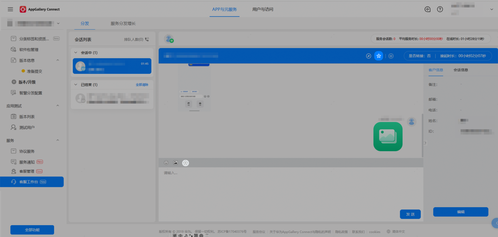

#### 使用原则

* 禁止使用客服功能向用户发送与用户发送的消息没有关联的、对用户造成骚扰的消息.
* 禁止使用客服功能营销向用户发送涉嫌虚假夸大的营销信息。
* 禁止使用客服功能向用户发送违规消息（如广告、涉赌、涉黄等）。

#### FAQ

#### [h2]元服务客服功能开通后，能否关闭客服功能？

元服务客服功能开通后，可在客服管理页面主动关闭功能。

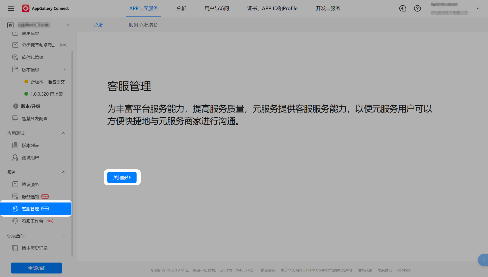

#### [h2]为什么联系客服入口没有对用户展示？

元服务联系客服入口需同时满足以下3个条件才会展示：

* 开通元服务功能。
* 已为对应元服务添加客服角色。
* 用户设备版本在HarmonyOS 5.1及以上。
