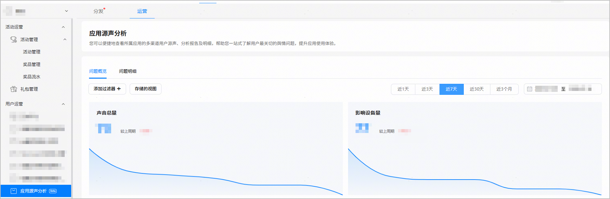
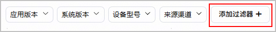
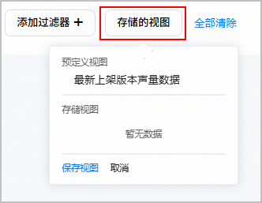
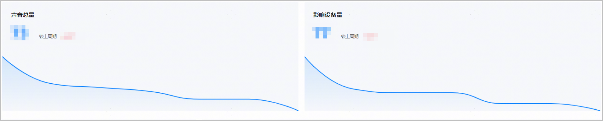
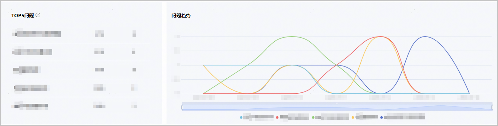
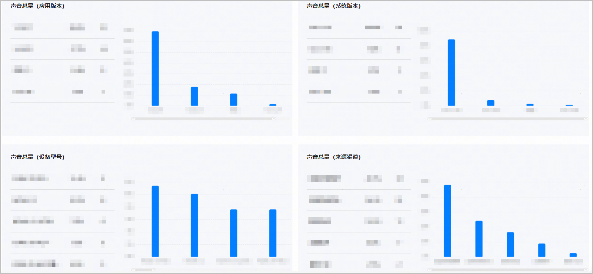
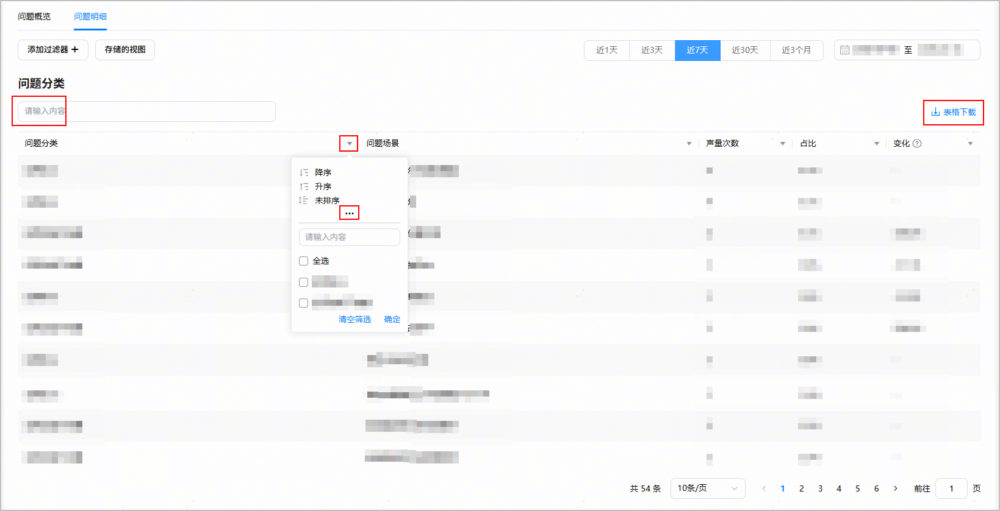
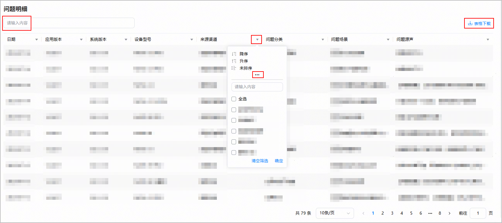

应用源声分析为您展示来自各个渠道和维度的用户声音反馈，帮助您更有效地分析应用的舆情数据，评估问题风险，并及时解决问题。

您可以在[AppGallery Connect](https://developer.huawei.com/consumer/cn/service/josp/agc/index.html)首页点击“APP与元服务”，从列表中选择您的应用，然后选择“运营 > 用户运营 > 应用源声分析”，进入应用源声分析页面，该页面包含[问题概览](#section1663094552810)和[问题明细](#section77161734442)。

* 点击“添加过滤器”，可以选择“来源渠道”、“应用版本”、“系统版本”或“设备型号”，并设置过滤条件，页面下方会展示对应维度的详细数据。

  
* 点击“存储的视图”，可以保存过滤条件。下次登录时，会展示上次保存的效果。

  
* 过滤指标说明。

  | 指标名称 | 指标说明 |
  | --- | --- |
  | 来源渠道 | 按照来源渠道筛选应用的用户声音反馈总数。  来源渠道为用户声音反馈渠道，目前支持以下渠道：  应用市场评论、反馈助手、回退问卷调研、服务热线、服务门店、NPS问卷调研、NSS问卷调研、线下零售门店、内测反馈、花粉论坛。 |
  | 应用版本 | 按照应用版本筛选应用的用户声音反馈总数。  应用版本为应用发布版本，如1.0.0。 |
  | 系统版本 | 按照系统版本筛选应用的用户声音反馈总数。  系统版本为HarmonyOS系统版本，如5.0.1.100。 |
  | 设备型号 | 按照设备型号筛选应用的用户声音反馈总数。  设备型号为手机的传播名，如MATE 60。 |

#### 问题概览

问题概览界面展示所选过滤条件和时间段内的“[核心指标](#section92302307535)”、“[TOP5问题](#section151421944165316)”和“[声音总量按各维度分类情况](#section755864410534)”。

#### [h2]核心指标

核心指标展示“声音总量”和“影响设备量”的总数据、较上周期的环比值及数据变化趋势。

数据指标说明。

| 指标名称 | 指标说明 |
| --- | --- |
| 声音总量 | 应用的用户声音反馈总数。 |
| 影响设备量 | 应用的用户声音反馈总设备数。 |

#### [h2]TOP5问题

TOP5问题展示用户反馈的TOP5问题名称、问题声量占比（问题的声量次数/所有问题的声量次数）、问题声量次数。问题趋势展示用户反馈的TOP5问题数在所选时间范围内的变化曲线图。具体指标说明可参见[问题分类](#ZH-CN_TOPIC_0000002338445526__li24541927864)。

#### [h2]声音总量按各维度分类情况

该模块展示声音总量指标按照四个维度（应用版本、系统版本、设备型号、来源渠道）降序排列的情况，页面默认显示TOP5数据。

数据指标说明。

| 指标名称 | 指标说明 |
| --- | --- |
| 声音总量（应用版本） | 按照应用版本分类统计应用的用户声音反馈总数，并降序排列。  应用版本为应用发布版本，如1.0.0。 |
| 声音总量（系统版本） | 按照系统版本分类统计应用的用户声音反馈总数，并降序排列。  系统版本为HarmonyOS系统版本，如5.0.1.100。 |
| 声音总量（设备型号） | 按照设备型号分类统计应用的用户声音反馈总数，并降序排列。  设备型号为手机的传播名，如MATE 60。 |
| 声音总量（来源渠道） | 按照来源渠道分类统计应用的用户声音反馈总数，并降序排列。  来源渠道为用户声音反馈渠道，目前支持以下渠道：  应用市场评论、反馈助手、回退问卷调研、服务热线、服务门店、NPS问卷调研、NSS问卷调研、线下零售门店、内测反馈、花粉论坛。 |

#### 问题明细

问题明细界面展示所选过滤条件和时间段内的“[问题分类](#section1567612349352)”和“[问题明细](#section1217210413364)”报表数据。

#### [h2]问题分类

问题分类报表展示用户反馈的问题分类和问题场景情况，包括问题声量次数、占比和变化值。

* 在文本框输入内容后，按回车键即可对所有数据进行模糊查询。
* 点击表格列的倒三角按钮，可以按该指标进行升序、降序排列。点击“...”，可以输入内容对指标数据进行模糊查询，或勾选指标分类进行筛选。
* 点击表格上方的“表格下载”按钮，可以将数据下载到本地。
* 数据指标说明。

  | 指标名称 | 指标说明 |
  | --- | --- |
  | 问题分类 | 用户反馈的问题类别，如应用BUG、应用功能不完善。 |
  | 问题场景 | 用户反馈的问题场景，如登录异常、接收消息延迟等。 |
  | 声量次数 | 用户反馈的问题场景次数。 |
  | 占比 | 用户反馈的问题场景次数占所有问题场景次数的比率。 |
  | 变化 | 用户反馈的问题场景次数与上一个时间周期相比的数据增减百分比。 |

#### [h2]问题明细

问题明细报表默认按日期降序展示问题源声内容详情。

* 在文本框输入内容后，按回车键即可对所有数据进行模糊查询。
* 点击表格列的倒三角按钮，可以按该指标进行升序、降序排列。点击“...”，可以输入内容对指标数据进行模糊查询，或勾选指标分类进行筛选。
* 点击表格上方的“表格下载”按钮，可以将数据下载到本地。
