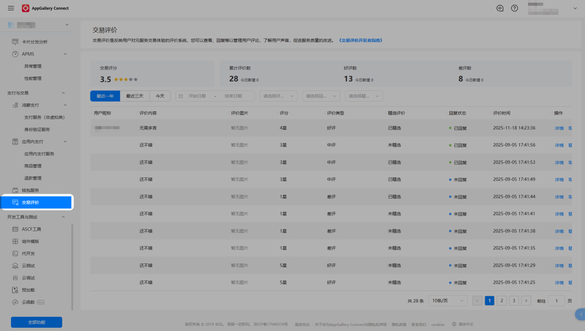
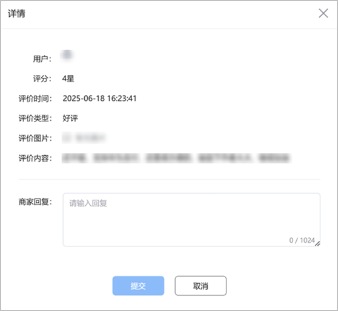

#### 功能简介

元服务交易评价是元服务平台官方提供的，反映用户对元服务交易体验的评价系统。在元服务中产生交易的用户，可以针对本元服务的交易体验进行打分、发表评论。

真实的评价内容可以帮助用户理解服务、辅助用户在元服务的交易决策，同时也能帮助开发者了解用户反馈，促进服务质量的改进。

#### 功能覆盖范围

* 在华为应用市场上架的元服务。
* 已开通华为支付。

#### 操作指导

1. 登录[AppGallery Connect](https://developer.huawei.com/consumer/cn/service/josp/agc/index.html)，点击“快速开始”中的“元服务一站式平台”卡片。

   
2. 在左上角下拉列表选择要查看的元服务。

   
3. 左侧导航选择“支付与交易 > 交易评价”，进入交易评价页面。

   

#### 查看评论

您可以查看交易评分、评论数及评论列表。评论列表支持根据用户评论的发布时间、评价类型和回复状态进行筛选，选择需要浏览的评论。

#### 回复评论

您可以在“用户评论 > 操作 > 详情”的详情弹框中对评论进行回复。每条评论仅有一次回复机会，回复带有开发者标识。已发布的回复内容支持删除。

#### 评论原则

评论及回复禁止引导用户到非华为渠道。

#### FAQ

#### [h2]为什么有些元服务有交易评分而有些没有，我是否可以选择关闭交易评价功能？

元服务交易评价是针对可以产生交易订单并通过华为支付方式完成交易的元服务建立的客观真实的评价体系，当前暂不支持对通过免密代扣、第三方支付等方式完成交易的元服务进行评价。

面向用户客观开放交易评价数据，开发者不能自主选择关闭交易评价功能。

#### [h2]交易评分可以人为修改吗？

交易评分是平台基于用户的真实评价数据，剔除违规评价后，结合模型计算得出，无法通过人为方式干预评分的计算。

#### [h2]面对用户恶意差评或发表不实评价，开发者该如何应对？

不支持开发者删除用户发表的交易评分和评价内容。

开发者可以通过管理台回复功能，对用户评价内容进行公开解释和说明。

若用户发表的评论内容涉及无意义评价、不实评价等，平台将根据用户内容举报的反馈情况进行审核处理。

#### [h2]如何提升元服务交易评分？

元服务需要持续优化以提升产品体验和服务质量，为用户提供长期满意的服务体验，并积累真实可信的优质评价。

#### [h2]交易评价的范围是什么？

交易评价的范围不限制，用户可以针对近期交易订单进行评价，评价内容可涵盖服务质量、交付速度、客服响应、售后服务等方面。

#### [h2]为什么用户发表或开发者回复的评论会被删除（评论没有显示）？

评论需要审核通过才会展示，如评论存在违规（如广告、涉赌、涉黄等）以及判定为恶意刷评论等行为，将不予通过。

#### [h2]差评、好评、中评如何理解？

* 差评：用户评分星级为：1星、2星。
* 中评：用户评分星级为：3星。
* 好评：用户评分星级为：4星、5星。

#### [h2]评论里“热门”、“最新”的排序逻辑是什么？

* 热门：满足一定条件后，系统自动识别在“热门”展示。
* 最新：按最新评论时间优先排序。

#### [h2]同一用户多次购买可以多次评价吗？

同一个用户针对一个元服务仅允许产生一条有效评价。
