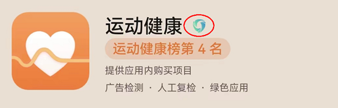
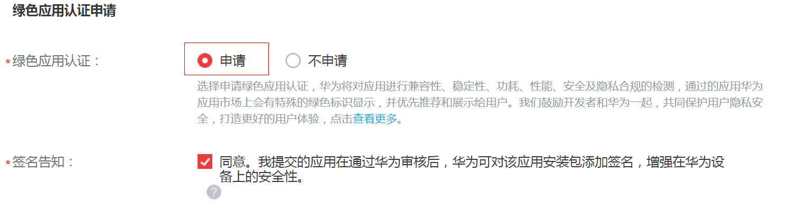

# 华为绿色应用检测认证FAQ

**[问题一]软件绿色联盟应用体验标准5.0是什么？**

为提高消费者应用体验，软件绿色联盟于2017年底发布《软件绿色联盟应用体验标准1.0》，从兼容性、稳定性、安全、功耗和性能五大方面对应用品质进行把关。

此后4年里，软件绿色联盟一直联合应用厂商、终端厂商、产学研机构为用户打造更高品质终端应用而不断努力。先后发布了《软件绿色联盟应用体验标准2.0》、《软件绿色联盟应用体验标准3.0》，并于2021年11月全新发布了《软件绿色联盟应用体验标准5.0》（以下简称绿标5.0）。绿标5.0不仅进一步增强了五项标准的技术要求及检测能力，更在安卓应用体验基础上拓展到泛智能终端应用体验的范畴。旨在通过绿标系列标准的制定与推广，为用户带来更安全、更安心的使用体验。

标准原文见如下链接：

[软件绿色联盟应用体验标准5.0\_兼容性标准.pdf](https://alliance-communityfile-drcn.dbankcdn.com/FileServer/getFile/cmtyPub/011/111/111/0000000000011111111.20260519095338.19853277585654807928632735357423%3A20260601001817%3A2800%3A8FD5A6DA5CD59610E57C7489F73BCDBBA5FA6F8524A56FF1DC2F97E45AD447D9.pdf?needInitFileName=true)

[软件绿色联盟应用体验标准5.0\_稳定性标准.pdf](https://alliance-communityfile-drcn.dbankcdn.com/FileServer/getFile/cmtyPub/011/111/111/0000000000011111111.20260519095338.16637637395957613816451807606979%3A20260601001817%3A2800%3A9A7F8D567DB8CB118B5D6C004F9395B0351ABAF53AECB7C876A271CCBAD014CB.pdf?needInitFileName=true)

[软件绿色联盟应用体验标准5.0\_性能标准.pdf](https://alliance-communityfile-drcn.dbankcdn.com/FileServer/getFile/cmtyPub/011/111/111/0000000000011111111.20260519095338.60582240639742348200981714518336%3A20260601001817%3A2800%3A474F7227566C39BB049BA21B9073F091D0548BB6716D31C56A64DE239B27D76A.pdf?needInitFileName=true)

[软件绿色联盟应用体验标准5.0\_功耗标准.pdf](https://alliance-communityfile-drcn.dbankcdn.com/FileServer/getFile/cmtyPub/011/111/111/0000000000011111111.20260519095338.21095586165412164963613047808154%3A20260601001817%3A2800%3AC95FB49A6C997B4C5326209E715042B16FBE3A58C943594BEE5F1840059110C3.pdf?needInitFileName=true)

[软件绿色联盟应用体验标准5.0\_安全标准.pdf](https://alliance-communityfile-drcn.dbankcdn.com/FileServer/getFile/cmtyPub/011/111/111/0000000000011111111.20260519095338.77479465963347172294928589369392%3A20260601001817%3A2800%3A43AEADA3B35F8069C72D3AF1EBAB88B0A5AFE00662529262E3E53620A584BE36.pdf?needInitFileName=true)

**[问题二]什么是绿色应用？**

绿色应用是指通过《软件绿色联盟应用体验标准5.0》兼容性、稳定性、安全、功耗和性能五大测试的应用。在华为应用市场绿色应用会获得“绿色标识”。

**[问题三]为什么要大力推广绿色应用？**

随着泛终端操作系统的发展，泛终端应用呈现百花齐放的态势，但在高速发展过程中也面临许多问题：

1. 安全问题突出，如超范围收集&使用个人信息、权限索取不当以及欺骗误导强迫用户等隐私问题频发，无论是国家监管机构还是消费者，均对APP提出了更高要求；
2. 应用要完成从适配传统安卓系统到适配泛终端操作系统的转变，兼容性、稳定性、性能、功耗等均影响着终端用户的使用体验，是应用在适配过程需要重点关注的。

绿色应用是通过安全、兼容性、稳定性、性能、功耗五方面测试的高品质应用，可以为用户带来体验的提升。华为作为国内TOP手机厂商，有责任和意愿，率先通过推广绿色应用，引导应用从基础体验到卓越体验的迈进。

**[问题四]****通过哪些措施来保障绿色应用认证的落地实施？**

主要通过以下措施来保障软件绿色联盟标准落地实施：

1. 提供检测上架的全流程支持：提供绿色应用申请 > 检测认证 > 标识的全流程功能，通过测试和认证的应用，在华为应用市场等界面上有显性的“绿色应用”标识。

2. 面向应用开发者的激励引导：通过华为应用市场的流量激励和软件绿色联盟的运营，引导开发者主动遵守标准，共建绿色应用生态。

3. 面向用户的推广宣传：通过多种营销渠道，向用户宣传绿色应用品质，推荐用户下载使用绿色应用，提升整体使用体验。

**[问题五]****华为对绿色应用的激励政策是什么？**

华为鼓励开发者共同建设绿色应用生态，统一纳入10亿资源的“耀星计划”，对优先达标的示范绿色应用提供耀星资源支持，包括但不限于华为应用市场耀星专区等首页推广。另外，通过绿色应用检测认证的应用，还会出现在华为应用市场“绿色应用专辑”中，增加消费者的信服力。

**[问题六]要通过绿色检测和认证，开发者要重点关注和适配标准中哪些内容？**

标准包括了兼容性、稳定性、安全、功耗和性能五个方面，标准关键信息及解读见《软件绿色联盟应用体验标准5.0》关键信息解读系列视频。

安全标准检测不通过是导致应用检测不通过的主要因素，开发者应重点关注。绿标5.0按照应用生命周期不同阶段分别对应用行为进行规范，较绿标3.0要求更全面并进一步增强，尤其加强了安全检测能力建设和检测力度，更好匹配国家监管机构对APP隐私治理的要求。

**[问题七]如何检测和认证绿色应用？**

1.检测流程：应用市场上架审核流程和绿色检测认证流程，相互独立，并行进行，绿色检测认证不影响和应用市场上架流程的速度

2.检测方式：以自动化检测为主，人工检测为辅。

3.检测时机：新应用首次提交上架申请，和存量应用提交更新上架申请，都会进行检测和认证。

4.检测反馈：在开发者联盟提交绿色申请的网站上，会有结果反馈；其通过检测和标识的时间，通常情况下不超过72小时。

5.检测沟通渠道：如果未通过，开发者可将认证不通过的原因发送至检测沟通邮箱sga@china-sga.com，技术支持人员将为您解答并给予指导。

**[问题八]如何在华为应用市场申请成为绿色应用？**

开发者可以在华为应用市场中，在首次创建新应用时（详见：文档“[创建并管理应用操作指南](https://developer.huawei.com/consumer/cn/doc/distribution/app/30204)”创建新应用章节2.3 分发信息设置），或者在提交应用更新时（详见：文档“[创建并管理应用操作指南](https://developer.huawei.com/consumer/cn/doc/distribution/app/30204)”升级应用章节3.3 分发信息设置），在页面上选择申请成为绿色应用：

**[问题九]****如何正确提交权限说明，以确保通过绿色应用检测认证**

开发者提交的截图需要满足以下条件，以确保通过：

1. 压缩包名字为APK包名，格式为zip；

2. 压缩包无目录，解压后平铺所有文件；

3. 图片格式为jpg或png格式；

4. 图片名称为Android定义的权限字符串名称，如精确位置权限对应的图片文件为android.permission.ACCESS\_FINE\_LOCATION.jpg；

5. 如果一个权限的使用场景需要用多张截图证明，应在图片名称尾部加上序号数字予以标识，如读取联系人权限对应两张图片，对应的图片文件名称应该为android.permission.READ\_CONTACTS-1.jpg，android.permission. READ\_CONTACTS-2.jpg；

6. 空白图片、截图内容与权限说明不符的截图将被视为不正确的截图，无法通过绿色应用检测认证。