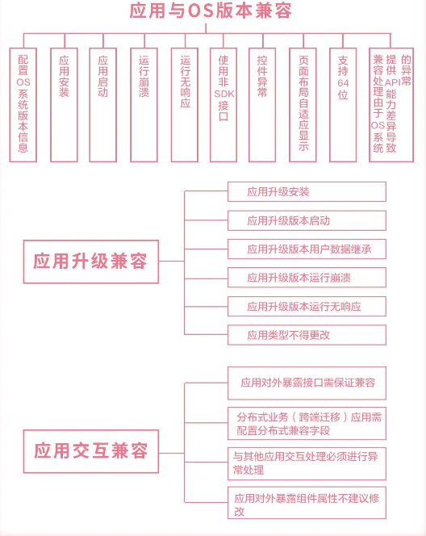
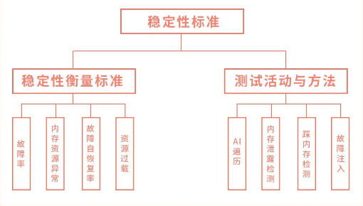
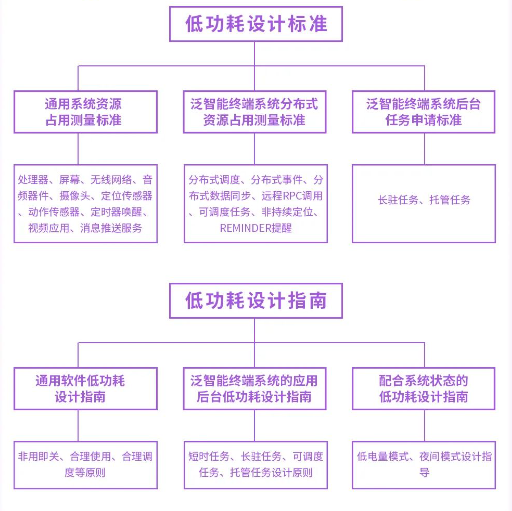
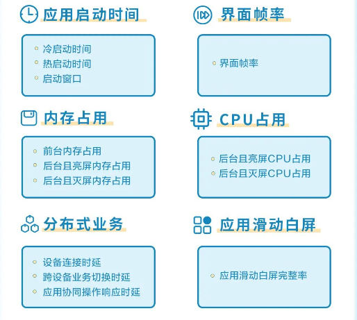
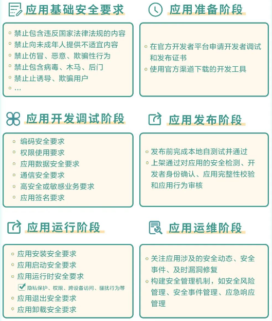
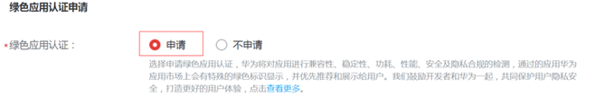
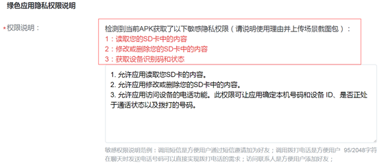

# 华为绿色应用认证指南

软件绿色联盟，成立于2016年11月14日，由阿里巴巴、百度、华为、腾讯、网易五家企业共同发起。

为了给用户提供更高质量的终端应用，自2017年12月起，华为根据《软件绿色联盟应用体验标准1.0》构建了绿色应用认证和打标系统，对在华为应用市场上架的应用，使用华为终端开放实验室DevEco云测平台进行兼容性、稳定性、安全、功耗和性能的检测，通过检测的应用，华为应用市场会打上绿色应用标识，作为绿色应用认证的标志，也是品质的象征。

为进一步规范应用行为，打造更佳的用户使用体验，软件绿色联盟于2018年、2019年，制定并发布了《软件绿色联盟应用体验标准2.0》、《软件绿色联盟应用体验标准3.0》，对五大标准持续更新。

随着泛终端操作系统的发展，泛终端应用呈现百花齐放的态势，在此背景下，软件绿色联盟于2021年11月全新发布了《软件绿色联盟应用体验标准5.0》（以下简称绿标5.0）。**绿色应用认证标准也随之更新，当前在华为应用市场上架的应用基于绿标5.0标准进行检测**。

作为国内TOP手机厂商，华为有责任和意愿，率先通过推广绿色应用，引导应用从基础体验到卓越体验的迈进，为用户带来更好的使用体验。为了帮助广大应用顺利通过绿色应用检测和认证，本文档将围绕**认证过程**和**注意事项**两方面进行介绍。

**1. 绿色应用奖励**

1.1 华为应用市场会对绿色应用标上特有的绿色标识，代表其通过华为终端开放实验室DevEco云测平台的兼容性、稳定性、安全、功耗和性能的检测和认证，是应用高品质的象征；

1.2 鼓励开发者共同建设绿色应用生态，统一纳入10亿资源的“耀星计划”，对优先达标的示范绿色应用提供耀星资源支持，包括但不限于华为应用市场耀星专区等首页推广；

1.3 通过多种营销渠道，向用户宣传绿色应用品质，推荐用户下载使用绿色应用，提升整体使用体验。

**2. 成为绿色应用**

想要成为绿色应用，享受华为应用市场的导流激励，需要应用开发者首先满足绿标5.0要求，然后在华为应用市场提交应用上架申请时，同时申请绿色检测认证。在通过华为终端开放实验室DevEco云测平台的兼容性、稳定性、安全、功耗和性能的检测和认证后，华为应用市场会对应用打上绿色标识。

**2.1 标准关键要求**

**兼容性标准：**

* 应用范围：由安卓系统应用兼容性扩展至泛智能终端操作系统应用兼容性衡量及测试方法；
* 测试方法：按照应用与OS版本兼容、应用升级兼容、应用交互兼容分类测试方法。

**稳定性标准：**

* 应用范围：统一泛智能终端操作系统应用相应的稳定性故障及衡量标准；
* 测试方法：不同操作系统的应用采用统一测试方法。

**功耗标准：**

规定了泛智能终端设备应用软件功耗设计要求和测量标准，较之前标准内容，新增了泛智能终端操作系统应用低功耗设计标准以及低功耗设计指南。

**性能标准：**

规定了运行于泛智能终端操作系统的应用基础性能质量和体验要求，较之前标准内容，增加了分布式应用相关性能要求及应用滑动白屏性能要求。

**安全标准：**

* 按照应用生命周期不同阶段分别对应用行为进行规范；
* 安全要求增强：参考最新《个人信息保护法》、工信部165号文等内容，对相关安全要求进行刷新和增强，以更好匹配国家监管机构对APP隐私治理的要求。

**2.2 绿色应用认证申请**

开发者可以在华为应用市场中，在首次创建新应用时（详见：文档“创建并管理应用操作指南”创建新应用章节2.3 分发信息设置），或者在提交应用更新时（详见：文档“创建并管理应用操作指南”升级应用章节3.3 分发信息设置），在页面上选择申请成为绿色应用：

在勾选申请绿色应用认证之后，开发者需要提交应用使用到的权限对应的截图，避免应用申请不需要使用的权限。请开发者仔细阅读系统检测提交APK申请的权限项，并且提供每个权限对应的截图，压缩后上传。

如果勾选了绿色应用申请，为了便于权限最小化的检测和审核，需要开发者提交应用所申请隐私权限的功能场景截图，包括高危权限和部分特殊权限。绿色应用认证的申请网站上，提供了权限使用场景截图的样例，开发者可自行下载并参考，需要注意以下事项：

1. 压缩包名字为APK包名，格式为zip；
2. 压缩包无目录，解压后平铺所有文件；
3. 图片格式为jpg或png格式；
4. 图片名称为Android定义的权限字符串名称，如精确位置权限对应的图片文件为android.permission.ACCESS\_FINE\_LOCATION.jpg。
5. 如果一个权限的使用场景需要用多张截图证明，应在图片名称尾部加上序号数字予以标识，如读取联系人权限对应两张图片，对应的图片文件名称应该为android.permission.READ\_CONTACTS-1.jpg，android.permission. READ\_CONTACTS-2.jpg

空白图片、截图内容以及与权限说明不符的截图将被视为不正确的截图，无法通过绿色应用检测认证。­­­举例说明：需提供“相机权限”说明截图时，要截取对应画面，同时对截图命名为“android.permission.CAMERA.jpg”，提供其他权限截图或用其他权限命名的都无法通过。

**2.3 华为绿色应用检测**

1. 检测流程：应用市场上架审核流程和绿色检测认证流程，相互独立，并行进行，绿色检测认证不影响在应用市场上架的速度；
2. 检测方式：以自动化检测为主，人工检测为辅；
3. 检测时机：新应用首次提交上架申请，和存量应用提交更新上架申请，都会进行检测和认证；
4. 检测反馈：在开发者联盟提交绿色申请的网站上，会有结果反馈；其通过检测和标识的时间，通常情况下不超过72小时；
5. 检测沟通渠道：如果未通过，开发者可以将认证不通过的原因发送至检测沟通邮箱sga@china-sga.com，技术支持人员将为您解答并给予指导。