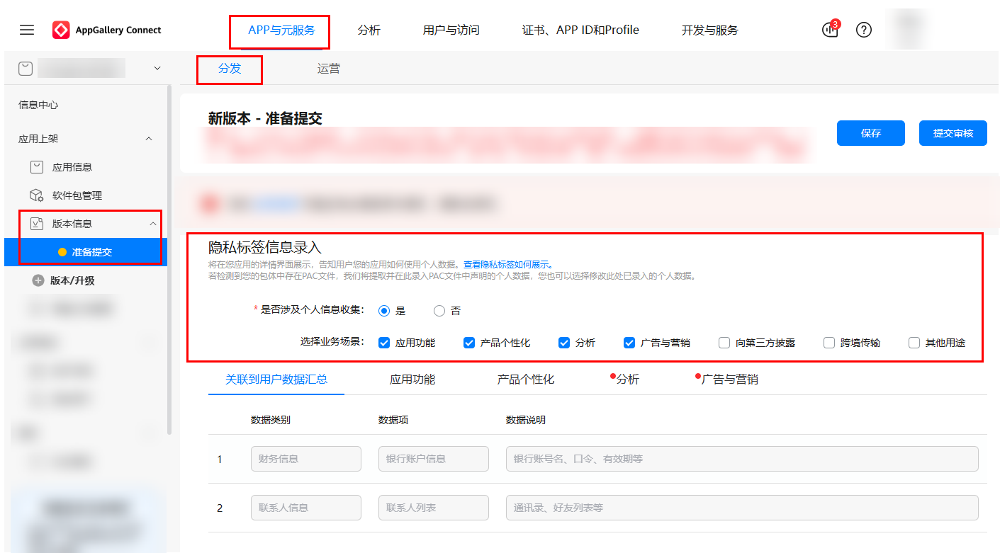
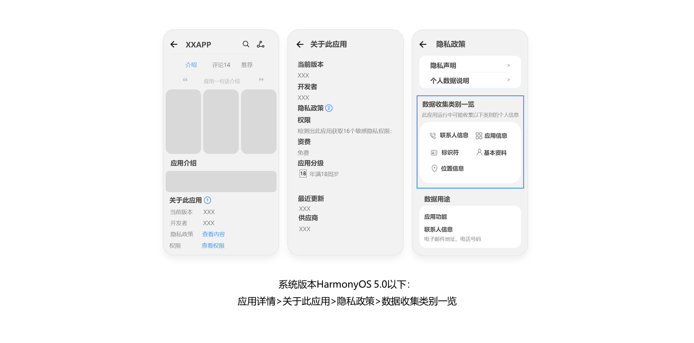
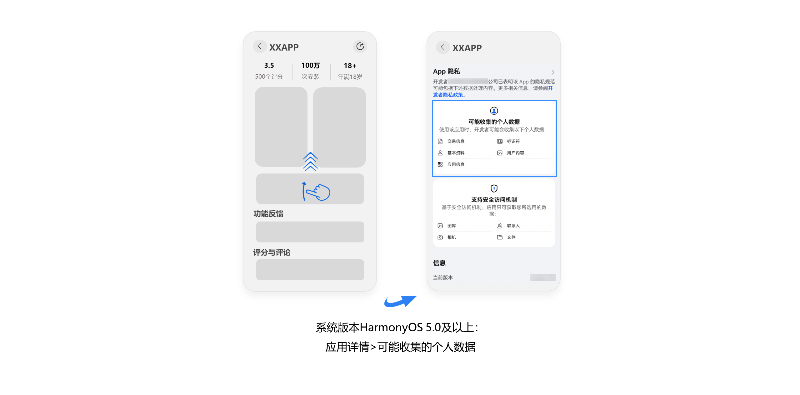

# AppGallery隐私标签服务说明

为了帮助终端用户在下载应用前方便快捷的了解您的应用使用其个人数据的情况，您在AppGallery Connect上架应用时，需要填写应用及应用中集成的第三方组件所需收集的个人数据项和数据使用目的，以便用户在AppGallery客户端应用详情中查看。

## **应用上架时录入隐私标签信息**

隐私标签填写入口：[AppGallery Connect网站](https://developer.huawei.com/consumer/cn/service/josp/agc/index.html#/) > [APP与元服务](https://developer.huawei.com/consumer/cn/service/josp/agc/index.html#/myApp) > 点击对应应用名称 > 版本信息 > 隐私标签信息录入。

您可根据应用是否收集用户的信息数据选择具体选项“是”或“否”。

* 如您的应用不涉及收集用户的信息数据，请选择“否”。
* 如您的应用涉及收集用户的信息数据，请选择“是”，并逐一完成每个场景下的数据项补充，您可在“关联到用户数据汇总”页签下查看您勾选的全部数据项。

## **应用上架时选择业务场景及数据**

a. 在“选择业务场景”项中，根据用户个人信息数据的使用场景进行对应选择。场景清单如下：

|  |  |
| --- | --- |
| **业务场景** | **场景描述** |
| 应用功能 | 应用提供基本功能、安全防护功能、确保应用正常运营以及客户支持。 |
| 产品个性化 | 按照不同用户差异化呈现应用内容。 |
| 分析 | 评估用户行为，了解现有产品功能的效果、进行服务改进。 |
| 广告与营销 | 用于在应用中显示广告或营销信息的数据。 |
| 向第三方披露 | 将数据共享至第三方运营主体，目的包括但不限于：共享至物流公司用于物品邮寄、共享至第三方用于广告投放效果评估、共享至第三方进行数据展示、评测/评估、研究、合作双方对账、由第三方提供运营、运维服务、论坛、社交等服务中公开披露。 |
| 跨境传输 | 将数据发送到境外的运营主体。 |
| 其他用途 | 用于未列出的其他用途。 |

b. 在您勾选的业务场景的对应页签下，可添加相关场景的数据项信息。详细数据清单如下：

|  |  |  |
| --- | --- | --- |
| **数据类(12大类)** | **数据项（91）** | **个人数据说明** |
| 联系人信息 | 联系人列表 | 通讯录、好友列表等 |
| 社交账号 | 社交应用中的联系人，包括微信、QQ、微博、Facebook、Twitter |
| 其他联系人信息 | 传真号等 |
| 运动健康信息 | 运动信息 | 步行/跑步轨迹，时长，健身和锻炼数据等 |
| 心率 | / |
| 血压 | / |
| 其他健康信息 | 个人因生病医治等产生的相关记录，如病症、医嘱单、检验报告、手术及麻醉记录、用药记录、药物食物过敏信息、生育信息、以往病史、诊治情况、家族病史等，以及与个人身体健康状况相关的信息，如体重、身高、肺活量等 |
| 财务信息 | 银行账户信息 | 银行账号名、口令、有效期等 |
| 其他金融账户信息 | / |
| 资产信息 | 信用等级、消费级别、收入信息、存款信息、投资信息、花币、数字货币、优惠券等 |
| 其他财务信息 | 房产信息、税务信息等 |
| 交易信息 | 交易记录 | 付款账号、收款账号、支付方式、付费信息等 |
| 订单信息 | 订单号、商品信息、订阅信息等 |
| 快递信息 | 快递编号、收件人、寄件人信息、邮寄物品信息等 |
| 其他交易信息 | / |
| 位置信息 | GPS 位置 | GPS精确坐标、GPS 轨迹等 |
| 网络位置 | / |
| 其他精确位置信息 | 经纬度信息，POI详情 |
| 其他大致位置信息 | 行政区域位置、GPS粗略坐标等 |
| 敏感信息 | 指纹 | / |
| 声纹 | / |
| 面部识别特征 | / |
| 其他生物特征 | 掌纹信息、耳廓信息、虹膜信息、基因信息等 |
| 其他敏感信息 | 种族或民族数据、性取向、宗教或哲学信仰、工会会员身份、政治观点等 |
| 标识符 | 用户标识符 | / |
| 身份证 | / |
| OAID | / |
| ODID | / |
| SSID | / |
| BSSID | / |
| ICCID | / |
| SN | / |
| IMEI | / |
| IMSI | / |
| MAC | / |
| MEID | / |
| 芯片ID | / |
| 其他身份信息 | 护照信息、驾驶证信息、工作证信息、出入证信息、社保信息、居住证信息、签证信息、军官证信息等 |
| 其他设备标识符 | 车架号、发动机号、车牌号、设备认证凭据等 |
| 基本资料 | 姓名 | / |
| 性别 | / |
| 年龄 | / |
| 出生日期 | / |
| 账号信息 | 头像、昵称、口令等 |
| 教育信息 | 教育程度、教育经历、培训记录、成绩单、专业背景、专业成就等 |
| 工作信息 | 个人职业、职位、工作单位、工作经历等 |
| 家庭信息 | 婚姻状况、家庭成员信息等 |
| 地址 | 家庭住址、邮寄地址、收件地址等 |
| 电话号码 | 手机号、座机号等 |
| 电子邮件地址 | 发件人地址、收件人地址等 |
| 日历 | / |
| 其他个人资料 | 国籍、出生地、身高、体重、日程等 |
| 用户内容 | 图片或视频 | 照片、视频等 |
| 音频 | / |
| 文字信息 | 问题反馈与建议等 |
| 搜索词 | 应用内主动输入或点击的搜索词 |
| 社交互动 | 发帖、评论、点赞等 |
| 游戏数据 | 游戏等级，排名，存档等 |
| 客户支持 | 与机器人或人工客服的交流信息 |
| 剪贴板 | / |
| 录音 | / |
| 短信内容 | / |
| 通话记录 | / |
| 其他通讯内容 | 电子邮件内容，通话内容等 |
| 应用安装软件列表 | / |
| 其他用户内容 | 合约信息、Word 文件、PDF 文件等 |
| 应用信息 | 浏览记录 | 页面点击、内容曝光记录等 |
| 收藏记录 | 喜爱的内容 |
| 应用基本信息 | 包名、版本号、开发者信息等 |
| 应用运行日志 | 崩溃、启动、能耗、诊断日志等 |
| 应用设置信息 | 应用功能设置等 |
| 应用运行状态 | 音乐播放中、已暂停、位置定位中、应用后台运行中等 |
| 其他使用应用的信息 | 用户点击播放开始、停止应用进入/退出记录等交互信息 |
| 设备信息 | 磁力计信息 | / |
| 屏幕方向传感器 | / |
| 重力传感器信息 | / |
| 操作系统信息 | / |
| 设备状态 | 设备的电池电量状态、充电状态、存储空间状态等 |
| 陀螺仪数据 | / |
| 加速器数据 | / |
| WiFi参数 | / |
| WiFi状态 | / |
| 网络类型 | / |
| 运营商 | PLMN、MNC、MCC |
| IP地址 | / |
| 光照传感器 | / |
| 气压计 | / |
| 旋转矢量传感器信息 | / |
| 其他软硬件参数/系统设置 | 设备型号、分辨率、语言、国家/地区、软件版本信息等 |
| 其他设备信息 | 屏幕点击位置等 |
| 其他数据 | 其他个人数据 | 以上未列举的数据 |

## **客户端展示效果**

在AppGallery客户端应用详情中，我们会向终端用户展示您提交的以下信息。

