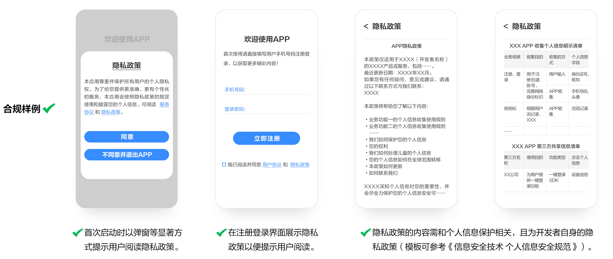
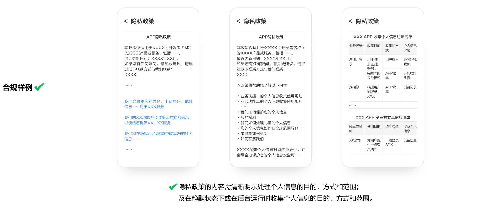
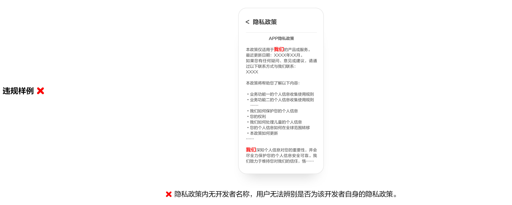
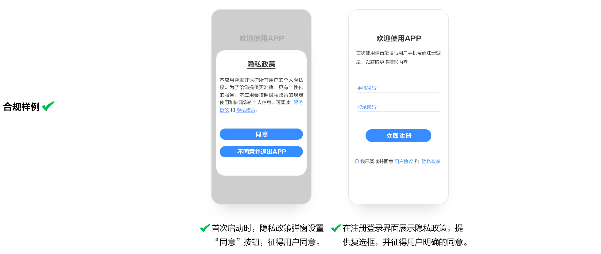
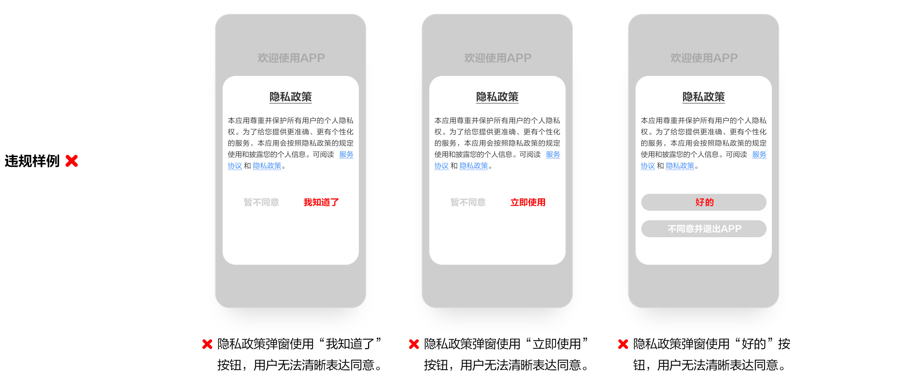
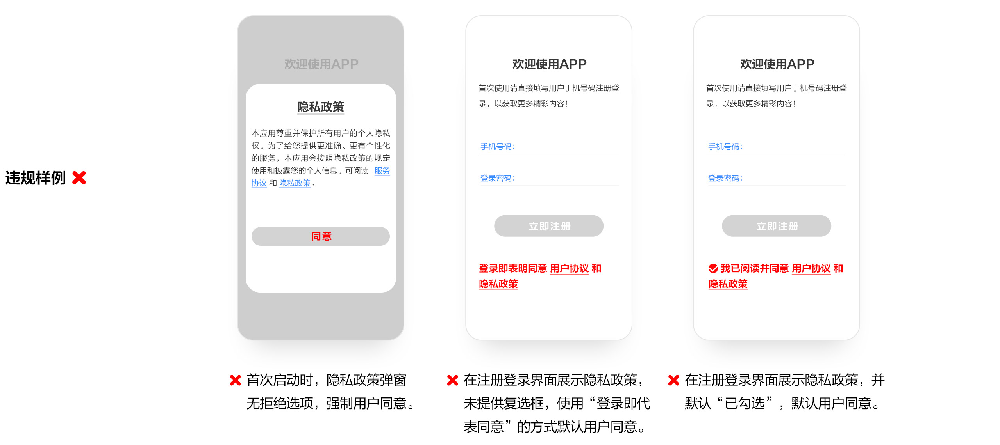
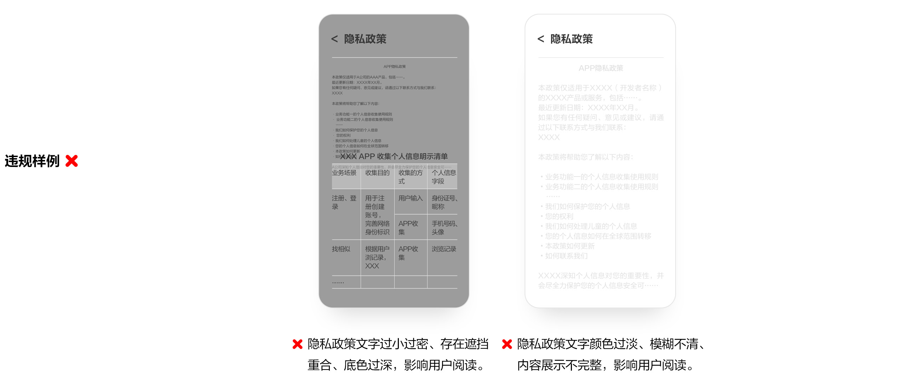
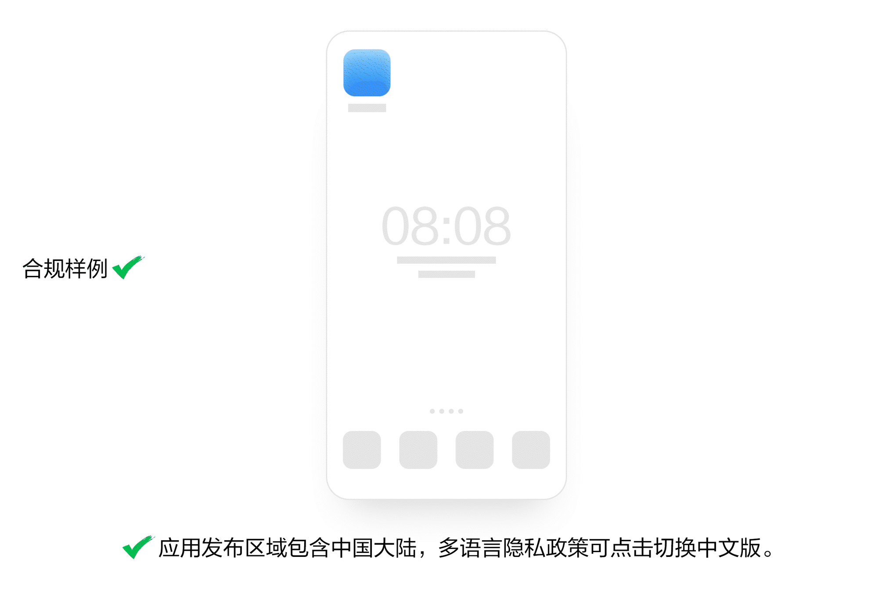

# 1. 违规收集个人信息

* 重点整治APP、SDK未告知用户收集个人信息的目的、方式、范围且未经用户同意，私自收集用户个人信息的行为。

  从事APP个人信息处理活动的，应当以清晰易懂的语言告知用户个人信息处理规则，由用户在充分知情的前提下，作出自愿、明确的意思表示。

  个人信息包含但不限于：IMEI、IMSI、设备MAC地址、软件安装列表、位置、联系人、通话记录、日历、短信、本机电话号码、图片、音视频等。详情请参考

  [《信息安全技术 个人信息安全规范》](http://openstd.samr.gov.cn/bzgk/gb/newGbInfo?hcno=4568F276E0F8346EB0FBA097AA0CE05E)。

## **1.1 未见明示**

APP未以个人信息处理规则弹窗等形式向用户明示个人信息处理的目的、方式和范围，不应收集个人信息。

隐私政策模版可参考[《信息安全技术 个人信息安全规范》](http://openstd.samr.gov.cn/bzgk/gb/newGbInfo?hcno=4568F276E0F8346EB0FBA097AA0CE05E)“附录D（资料性附录）个人信息保护政策模板”及[《隐私政策链接提交及内容规范参考FAQ》](https://developer.huawei.com/consumer/cn/doc/distribution/app/50128#h1-1678351326517-1)“2. 隐私政策内容规范参考”。

## **1.2 明示不清晰**

APP涉及“个人信息”处理，需要以个人信息处理规则（隐私政策）弹窗等形式清晰明示处理个人信息的目的、方式和范围；及在静默状态下或在后台运行时收集个人信息的目的、方式和范围。

隐私政策需包含：（1）收集的个人信息类型，目的、方式、范围；（2）是否存在静默/后台状态收集个人信息行为。

## **1.3** **未见明示SDK**

APP未以个人信息处理规则（隐私政策）弹窗等形式向用户明示第三方SDK处理个人信息的目的、方式和范围，第三方SDK不应收集个人信息。

## **1.4** **明示SDK不清晰**

APP集成的第三方SDK涉及“个人信息”处理，需要在隐私政策中逐一明示收集个人信息的目的、方式和范围。

在静默状态下或在后台运行时，APP集成的三方SDK涉及“个人信息”处理，需要在隐私政策中逐一明示收集个人信息的目的、方式和范围。

APP向用户明示集成的SDK信息需确保完整、准确，使用安全、合规，具体要求如下：

1、SDK信息需具备完整性：APP存在使用第三方SDK 均需在隐私政策中逐一明示。

2、SDK信息需具备准确性：APP隐私政策中明示的SDK 信息与“[全国SDK管理服务平台](https://sdk.caict.ac.cn/official/#/home)” 保持一致，**包括但不限于：SDK 名称、开发者名称、收集信息范围、使用目的、SDK 隐私政策链接**。

3、SDK使用需安全、合规：APP不应使用风险、违规SDK（早期版本存在风险/已不再运维），如自查发现风险、违规SDK，需进行更新、更换。

附：

1）[全国SDK管理服务平台](https://sdk.caict.ac.cn/official/#/home)

2）[SDK合规自检操作指导](https://developer.huawei.com/consumer/cn/forum/topic/0202176056468702846?fid=0102104600515103427)

## **1.5 未见明示开发者名称/名称信息不一致**

APP须提供开发者自身的隐私政策，且隐私政策内的开发者名称及应用名称均需与在AppGallery Connect上提交的信息一致。

常见问题：（1）隐私政策内无开发者名称；（2）隐私政策内的开发者名称与上传应用的开发者名称信息不一致；（3）隐私政策内的应用名称与开发者提交的应用名称信息不一致。

## **1.6 有明示未同意**

APP以个人信息处理规则（隐私政策）弹窗等形式向用户明示（包含第三方SDK）处理个人信息的目的、方式和范围，未经用户同意，APP（包含第三方SDK）不应收集个人信息，法律法规另有规定的除外。

**合规三要素**

1、个人信息处理规则（隐私政策）弹框有获取用户同意的选项；

2、个人信息处理规则（隐私政策）中需声明应用（包含第三方SDK）获取用户个人信息/权限，及处理个人信息/权限的目的、方式和范围；

3、用户未同意个人信息处理规则（隐私政策）前，应用及第三方SDK不应存在获取用户个人信息/权限的行为。

## **1.7 同意不清晰**

APP在征求用户同意环节，应提供明确的同意和拒绝选项，不应仅使用“好的”、“好”、“我知道了”、“我了解”、“我知晓”、“我已阅读”、“立即使用”、“下一步”等无法清晰表达用户同意的词语。

## **1.8 默认同意**

APP在征求用户同意环节，不应设置为默认同意。

常见的问题有：（1）隐私弹窗无拒绝选项；（2）无勾选框“登录即代表同意”；（3）默认勾选同意隐私政策等。

## 1.9 不易于阅读与理解

隐私政策等收集使用规则不应难以阅读，如文字过小过密、颜色过淡、模糊不清，文本冗长，展示不全，或未提供简体中文版等。

## 1.10 未突出显示敏感个人信息的处理目的、方式和范围

APP个人信息处理规则中未以字体加粗、增大字号、醒目颜色等方式突出展示 APP 处理个人敏感信息的目的、方式和范围。

个人敏感信息可参考[《网络安全标准实践指南——敏感个人信息识别指南》](https://www.tc260.org.cn/front/postDetail.html?id=20240918084858)