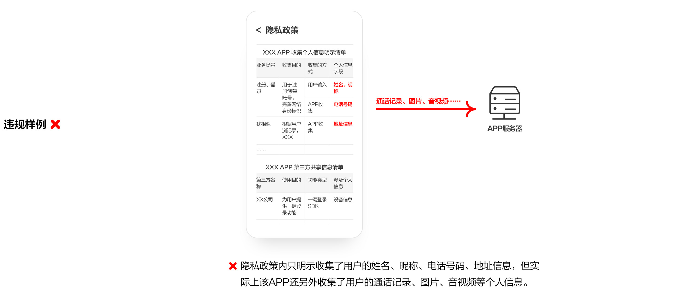

# 2. 超范围收集个人信息

* 重点整治APP、SDK非服务所必需或无合理应用场景，特别是在静默状态下或后台运行时，超范围收集个人信息。
* APP运营者收集、使用个人信息，应当遵循合法、正当、必要的原则，不得收集与其提供的服务无关的个人信息；不得因用户不同意收集非必要个人信息，而拒绝用户使用App基本功能服务。

常见问题：（1）APP（包括第三方SDK）超范围、超频次收集；（2）APP（包括第三方SDK）静默后台超范围、超频次收集。

APP或APP集成的第三方SDK收集个人信息的范围不要超出隐私政策中描述的范围；收集的频率不应超出其实现产品或服务的业务功能所必需的最低频率。

静默状态下或在后台运行时，APP或APP集成的第三方SDK收集个人信息的范围不应超出隐私政策中描述的范围；收集的频率不应超出其实现产品或服务的业务功能所必需的最低频率。

