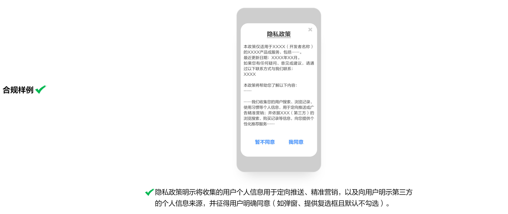

# 4. 定向推送行为

* 重点整治APP、SDK未以显著方式标示且未经用户同意，将收集到的用户搜索、浏览记录、使用习惯等个人信息，用于定向推送或广告精准营销，且未提供关闭该功能选项的行为。
* APP的定向推送功能提供的关闭按钮需真实有效。
* 不得以定向推送信息为由，强制要求用户同意超范围或者与服务场景无关的个人信息处理行为。

常见问题：应用存在定向推送功能，但（1）未在隐私政策中明示定向推送；（2）未在应用内显著标识定向推送；（3）未在应用内提供真实有效的定向推送关闭选项。

## 4.1 未在隐私政策中明示定向推送

若APP的业务功能存在定向推送功能，应以个人信息处理规则（隐私政策）弹窗等形式向用户明示，将收集的用户个人信息用于定向推送、精准营销。

若APP定向推送功能使用了第三方的个人信息来源，还需向用户明示第三方的个人信息来源。

## **4.2 未在应用内显著标识定向推送**

APP以个人信息处理规则（隐私政策）弹窗等形式明示存在定向推送功能，页面中应显著区分定向推送服务，显著方式包括但不限于：标明“个性化推荐”、“定推”、“猜你喜欢”等其他能显著区分的字样，或通过不同的栏目、版块、页面分别展示等。

## **4.3 未在应用内提供真实有效的定向推送关闭选项**

APP以个人信息处理规则（隐私政策）弹窗等形式明示存在定向推送功能，应提供退出或关闭个性化展示模式的选项，如拒绝接受定向推送信息，或停止、退出、关闭相应功能的机制。

关闭按钮需真实有效：用户拒绝接受定向推送信息，或停止、退出、关闭相应功能的机制后，应用不再将收集的用户个人信息用于定向推送、精准营销。

