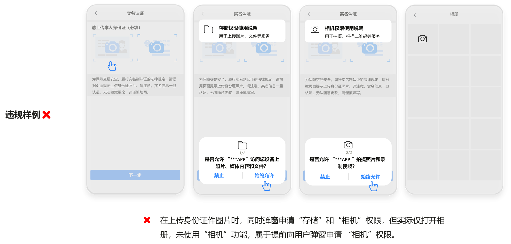
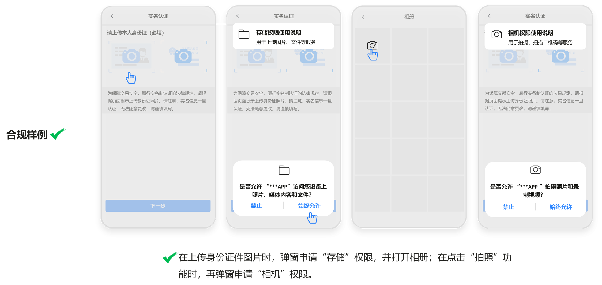
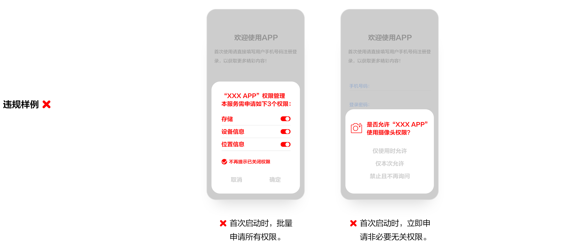
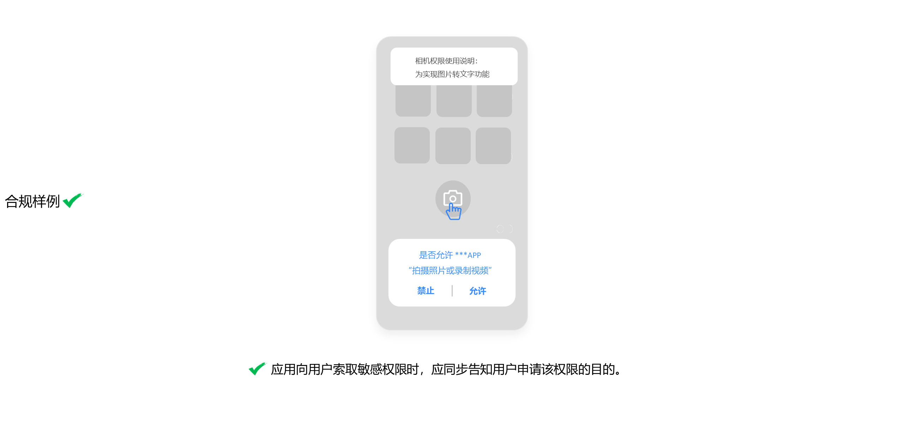
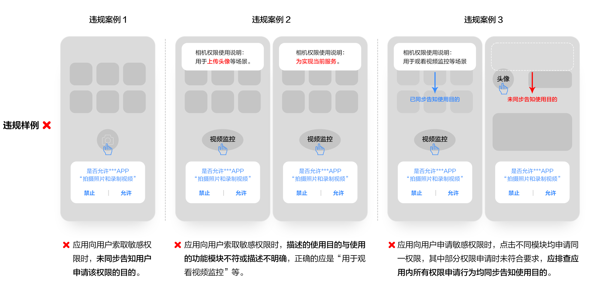
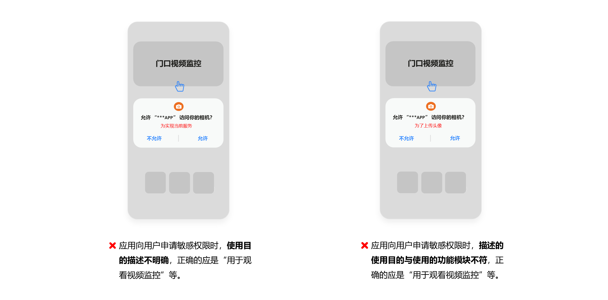

# 5. 权限索取行为

* 重点整治APP安装、运行和使用相关功能时，非服务所必需或无合理应用场景下，用户拒绝相关授权申请后，应用自动退出或关闭的行为。重点整治短时长、高频次，在用户明确拒绝权限申请后，频繁弹窗、反复申请与当前服务场景无关权限的行为。重点整治未及时明确告知用户索取权限的目的和用途，提前申请超出其业务功能等权限的行为。
* 用户拒绝相关授权申请后，不得强制退出或者关闭APP，不得提前申请超出其业务功能或者服务外的权限，不得利用频繁弹窗反复申请与当前服务场景无关的权限。

## **5.1 不给权限APP退出或关闭**

APP运行时，向用户索取电话、通讯录、定位、短信、录音、相机、存储、日历等权限，用户拒绝授权后，APP不应退出或关闭。

## **5.2 不给权限APP弹窗循环**

APP运行时，向用户索取权限，用户拒绝授权后，APP不应循环弹窗申请权限，使用户无法继续使用。

## **5.3 不给权限无法注册登录**

用户注册登录时，APP向用户索取权限，用户拒绝授权后，APP不应无法正常注册或登录。

## **5.4 频繁申请权限**

APP运行时，在用户明确拒绝权限申请后，不应向用户频繁弹窗申请与当前服务场景无关的权限，影响用户正常使用。APP重新运行时，也不应向用户频繁弹窗申请开启与当前服务场景无关的权限。

## **5.5 过度申请权限**

APP首次打开或运行中，未见使用权限对应的相关功能或服务时，不应提前向用户弹窗申请开启权限。

## **5.6 申请无关权限**

APP未见提供相关业务功能或服务，不应申请通讯录、定位、短信、录音、相机、日历等权限。

## 5.7 未同步告知权限申请的目的

APP 向用户索取敏感权限时，应同步告知用户申请该权限的目的。

敏感权限：电话、通讯录、定位、短信、麦克风（录音）、相机、存储、日历、身体传感器、通话记录、健康运动等；

同步告知：**需在应用内，权限弹窗申请的同时**，告知权限申请的使用目的。

**如下示例图适用于HarmonyOS 5.0以下的系统版本**

**如下示例图适用于HarmonyOS 5.0及以上的系统版本**

HarmonyOS 5.0及以上已开放系统权限弹窗编辑功能，请参考[reason字段的内容写作规范](/docs/dev/app-dev/system/system-security/access-control/app-permission-mgmt/request-app-permissions/declare-permissions#reason字段的内容写作规范及建议)及建议填写。