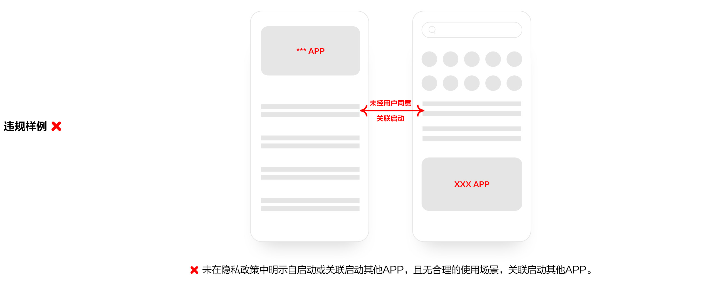
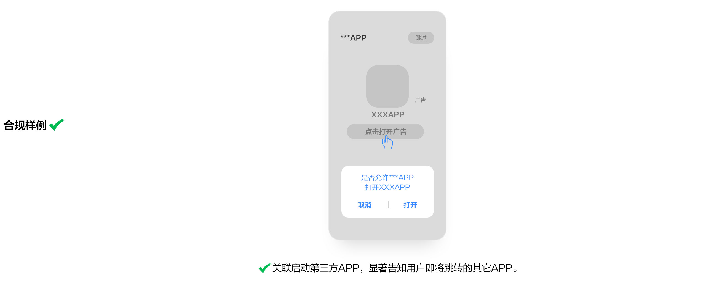

# 6. 自启动&关联启动

* 重点整治APP未向用户告知且未经用户同意，或无合理的使用场景，频繁自启动或关联启动第三方APP的行为。
* 在非服务所必需或者无合理场景下，不得自启动或者关联启动其他APP。

  6.1 APP未向用户明示未经用户同意，且无合理的使用场景，不应自启动或关联启动其它APP。

  6.2 APP向用户明示但未经用户同意，不应自启动或关联启动其它APP。

  6.3 APP非服务所必需或无合理应用场景，不应自启动或关联启动第三方APP。

  6.4 SDK非服务所必需或无合理应用场景，不应启动或关联启动APP。

  6.5 APP和SDK关联启动非用户主动发起，或未显著告知用户即将跳转的其它APP。

