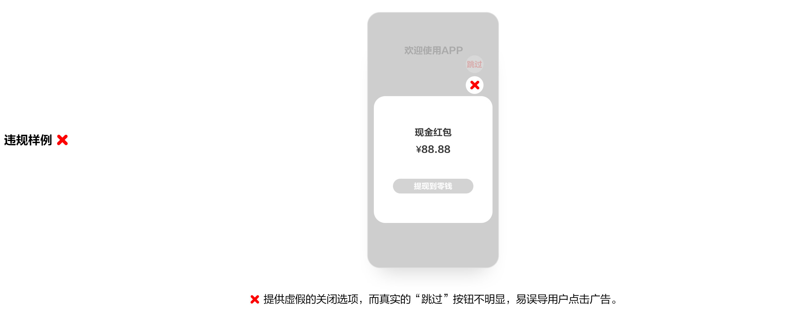
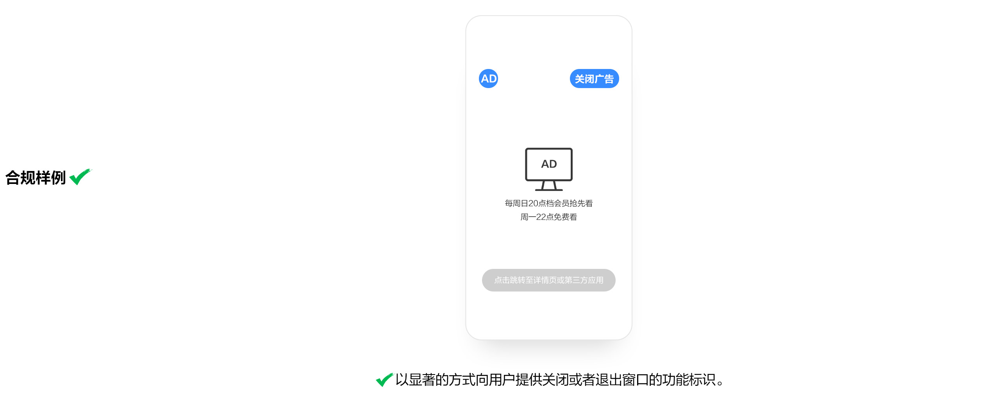
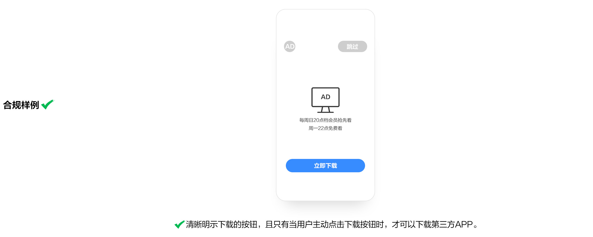

# 7. 下载分发行为

* 重点整治通过“偷梁换柱”、“移花接木”等方式欺骗误导用户下载APP，特别是具有分发功能的移动应用程序欺骗误导用户下载非用户所自愿下载APP的行为。
* 不得欺骗误导用户下载APP。
* 确保用户知情同意安装。向用户推荐下载APP应遵循公开、透明原则，真实、准确、完整地明示应用名称、开发运营者、应用版本、权限列表及用途、个人信息处理规则、应用功能等必要信息，并同步提供明显的取消选项，经用户确认同意后方可下载安装，切实保障用户知情权、选择权。

## **7.1 未提供真实关闭选项**

APP在用户终端弹出广告或者其他与终端软件功能无关的信息窗口的，应当以显著的方式向用户提供关闭或者退出窗口的功能标识。不应提供虚假、无效、标识不明显的关闭选项。

APP在用户终端弹出广告或者其他与终端软件功能无关的信息窗口的，应当以显著的方式向用户提供关闭或者退出窗口的功能标识。不应提供虚假、无效、标识不明显的关闭选项。

## **7.2 欺骗误导强迫用户下载、安装、开启应用**

APP信息窗口页面，下载、安装、开启第三方APP时，应以显著方式明示，并经用户主动选择同意。

常见问题：

（1）未显著明示且未经用户同意，点击任意位置即自动下载、安装、打开第三方APP。

（2）用户暂停或取消非主动点击触发下载、安装APP，关闭并重新运行本APP后，被用户暂停或取消下载、安装的APP自动恢复下载安装。

（3）APP信息窗口页面，通过“偷梁换柱”、“移花接木”等方式欺骗误导强迫用户下载、安装、开启第三方APP，包括但不限于“是否立即开始游戏”、“领取红包”等诱导方式。

（4）APP信息窗口页面，下载、安装、开启的APP与向用户所作的宣传或者承诺不符。

