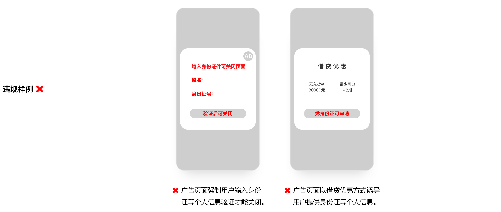

# 8. 违规获取个人信息

* 重点整治非服务所必需或无合理场景，通过积分、奖励、优惠等方式欺骗误导用户提供身份证号码及个人生物特征信息的行为。
* 处理种族、民族、宗教信仰、个人生物特征、医疗健康、金融账户、个人行踪等敏感个人信息的，应当对用户进行单独告知，取得用户同意后，方可处理敏感个人信息。

APP广告页面、开屏广告、主屏等功能页面，不应存在以积分、奖励、优惠等方式欺骗误导用户提供身份证号、人脸、指纹等个人信息的行为。

