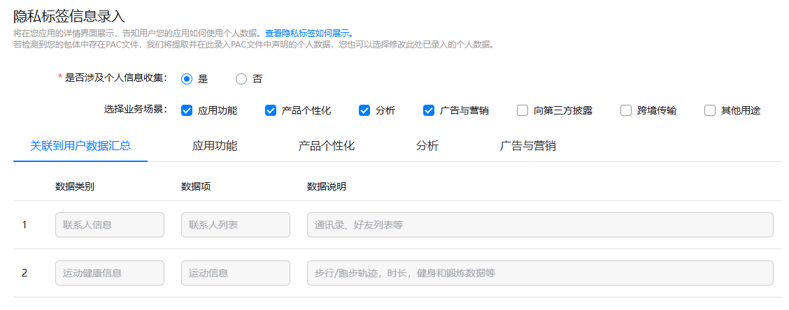
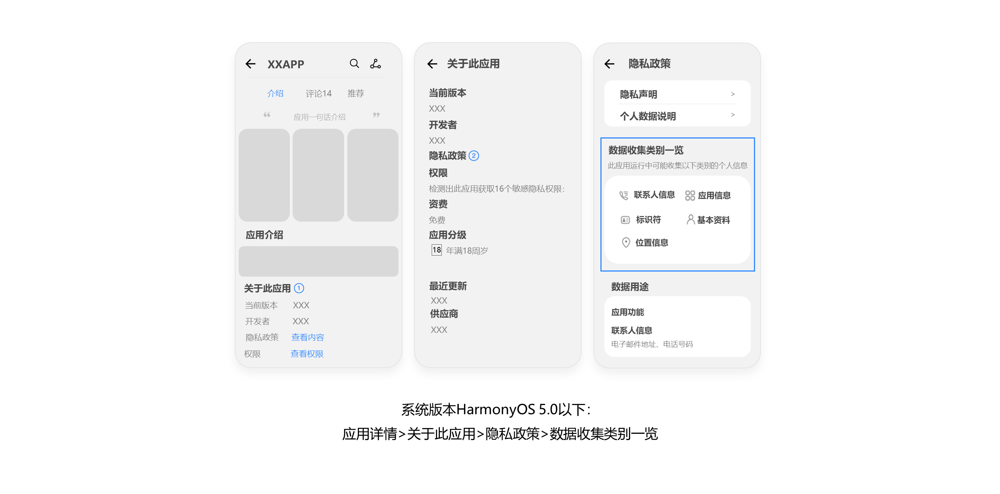

# 10. 开发者需提供真实有效的信息

## 10.1 APP应提供真实完整有效的开发者或运营者信息。

## 10.2 APP在AppGallery Connect上以及应用内，都应提供隐私政策，说明收集使用个人信息的内容、目的、方式和范围。

AppGallery Connect上隐私政策网址路径：[AppGallery Connect网站](https://developer.huawei.com/consumer/cn/service/josp/agc/index.html#/) > [APP与元服务](https://developer.huawei.com/consumer/cn/service/josp/agc/index.html#/myApp) > 点击对应应用名称 > 版本信息 > 隐私声明。

## 10.3 APP内展示的隐私政策内容与开发者在AppGallery Connect上提交的隐私政策网址内容应保持一致。

常见问题：1.开发者名称不一致；2.应用名称不一致；3.隐私政策内容不一致

## 10.4 为便于用户了解APP及APP中集成的第三方组件所需收集的个人信息项和使用目的，建议您在AppGallery Connect提交上架时，录入隐私标签信息。

隐私标签填写入口：[AppGallery Connect网站](https://developer.huawei.com/consumer/cn/service/josp/agc/index.html#/) > [APP与元服务](https://developer.huawei.com/consumer/cn/service/josp/agc/index.html#/myApp) > 点击对应应用名称 > 版本信息 > 隐私标签信息录入。

AppGallery Connect隐私标签信息录入界面

