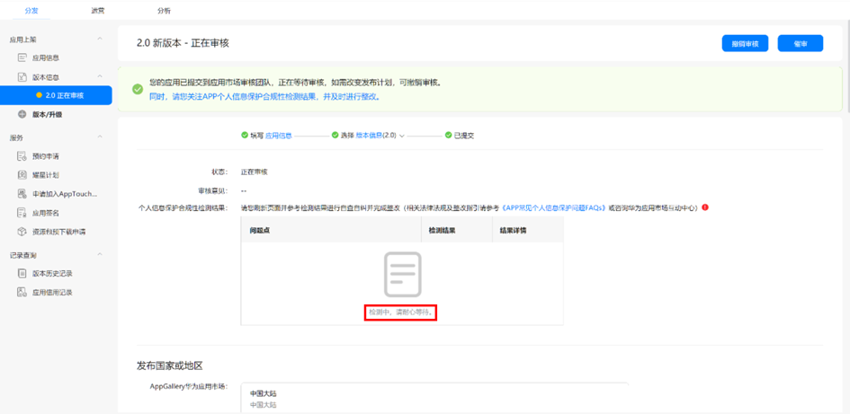
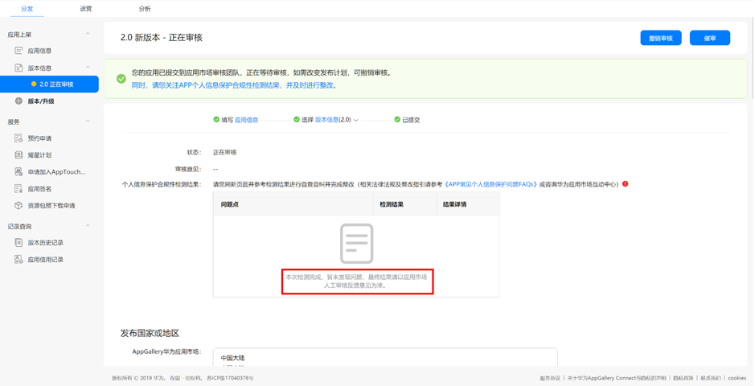
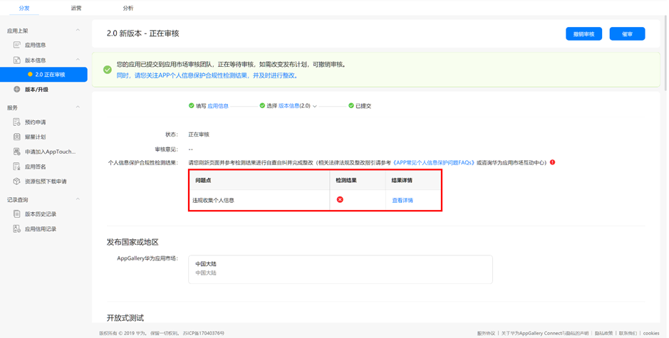

# 11.​​​​​​ 个人信息保护合规性检测服务介绍

## 11.1 个人信息保护合规性检测介绍

个人信息保护合规性检测是华为应用市场依据相关法律法规，通过云手机动态检测功能构建的个人信息保护检测能力，在应用提交上架前即可进行检测，协助开发者提前识别合规风险。

## 11.2 **个人信息保护合规性检测与人工审核的关系**

应用提交上架前会进行个人信息保护合规性检测，只针对个人信息安全相关项进行系统检测，应用提交上架申请后会经过人工审核，人工审核包含了功能、内容、安全等多项检测项。

您可在提交申请时，先参考个人信息保护合规性检测结果进行自查自纠，便于应用提交后尽早通过审核。

若个人信息保护合规性检测结果与人工审核意见存在不一致，应以人工审核意见为准。

## 11.3 **如何查看检测结果**

在AppGallery Connect点击提交审核后，“应用上架—版本信息”界面中显示应用状态为 “正在审核”，您可稍等片刻后刷新当前界面查看检测结果。

11.4 **检测状态说明**

**（1）检测中，请耐心等候**

该状态下，您的应用正在进行个人信息保护合规性检测，需等待系统检测完毕后返回检测结果。（检测时长超出三十分钟仍提示“检测中”的，建议重新提交检测或等待人工审核结果）

**（2）本次检测完成，暂未发现问题，最终结果请以应用市场人工审核反馈意见为准**

该状态下，您的应用暂未发现个人信息保护合规性问题，需等待人工审核结果，查看是否通过审核上架发布。

**（3）检测不通过**

该状态下，您的应用被发现存在个人信息保护合规风险，请点击“查看详情”进行问题的查看和定位，并耐心等待人工审核结果查看更详细的修改建议。

