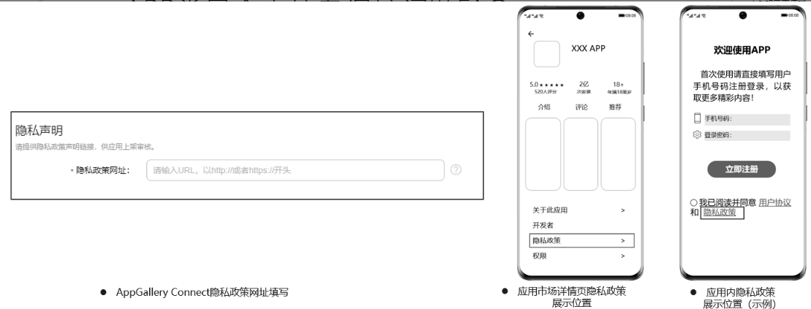
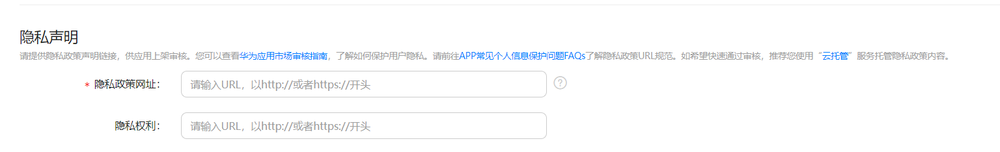
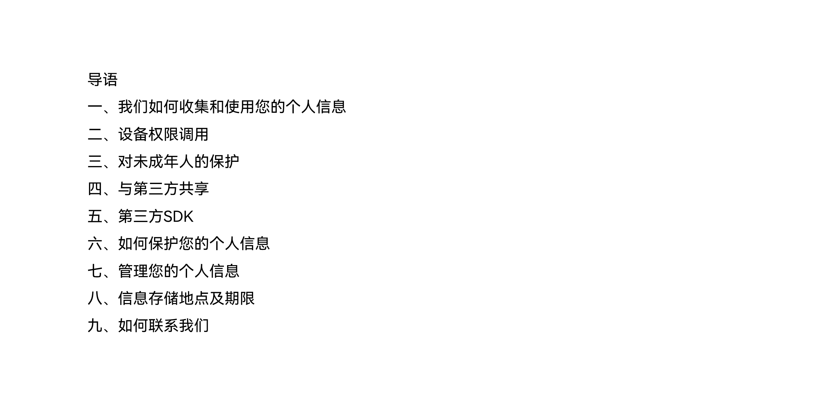
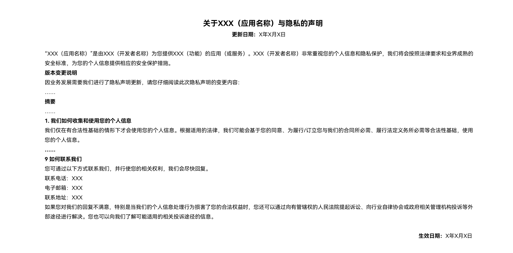

# 应用隐私政策链接提交及内容规范参考FAQ

## 1. 隐私政策链接填写规范参考

1.1 隐私政策链接填写

开发者在创建应用或更新版本时，必须提交APP隐私政策链接，该链接的内容必须与APP内的隐私政策保证完全一致，并且当您更新了APP内的隐私政策内容时，请您及时更新隐私政策链接的文本内容。

隐私政策链接提交入口：[AppGallery Connect 网站](https://developer.huawei.com/consumer/cn/service/josp/agc/index.html#/) > [APP与元服务](https://developer.huawei.com/consumer/cn/service/josp/agc/index.html#/myApp) > 点击对应应用名称 > 版本信息 > 隐私声明。

1.2 隐私政策链接格式参考

隐私政策自动化审核需要读取开发者提供的隐私政策，并进行自动化分析，如果提供的隐私协议链接不支持内容获取（比如PDF、图片格式等），可能会造成审核不通过，需要人工进行处理。如果希望快速通过审核，请开发者尽量提供符合规范的隐私政策链接。隐私政策链接规范如下：

1）标准url格式：如 http(s): //www.example.com/privacy/；

2）为静态html页面，用中文文字显示，统一一种字体，统一一种编码格式，无乱用符号，不需登录、点击、不需再跳转，允许对内容进行自动化分析、验证；

3）链接不能为博客、微博、Github和云笔记等；

4）不为pdf、word、图片等文件格式。

为了快速通过审核，华为为开发者提供隐私链接网站托管服务，详见[云托管服务](https://developer.huawei.com/consumer/cn/doc/development/AppGallery-connect-Guides/agc-cloudhosting-introductions-0000001057944575)；HarmonyOS版本4.0及以上，请使用[标准化隐私声明托管服务](https://developer.huawei.com/consumer/cn/doc/app/agc-help-privacy-policy-0000002316794885)。

## 2. 隐私政策内容规范参考

2.1 隐私政策内容结构大纲参考

隐私政策结构需清晰明了，有段落分层，易于用户阅读。建议您按照如下结构排版撰写隐私政策结构大纲：

2.2 隐私政策内容要求

请参考[隐私政策参考范本.zip](https://alliance-communityfile-drcn.dbankcdn.com/FileServer/getFile/cmtyManage/011/111/111/0000000000011111111.20260203211838.63574400314130540088896785748617%3A50001231000000%3A2800%3AD9D01E11790540DD45A888D6D54CE1C537BBC8324BA58DA5CC4D6F61B3369A85.zip?needInitFileName=true)

## 3. 个人信息标准表述及其他表述参考

以下列出了常见的APP收集的个人信息及同意/拒绝的标准表述，请您按照此名称对APP实际收集用户的个人信息在隐私政策内进行规范化的描述填写，并规范隐私政策明确同意/拒绝的选项表述。为保证隐私检测准确性，请使用规范化的表述。

|  |  |
| --- | --- |
| **一、个人信息标准表述参考** | |
| 此处列出了常见的APP收集的个人信息的规范化表述，请开发者按照下表对APP实际收集用户的个人信息在隐私政策内进行规范化的表述。（为保证隐私检测准确性，请在隐私政策中使用规范化的个人信息名称） | |
| **个人信息标准表述** | **其他规范化表述方式** |
| Android\_ID | 安卓ID、Android ID、ANDROID ID |
| IMEI | imei、国际移动设备识别码 |
| IMSI | imsi、国际移动用户识别码 |
| MAC地址 | MAC、Mac地址 |
| 软件安装列表 | 安装列表、应用列表、应用程序列表、软件列表 |
| 地理位置 | 位置信息、定位信息、位置 |
| 联系人信息 | 联系人、联系人信息、通讯录、通信录 |
| 短信 | SMS、短讯 |
| 通话记录 | 通讯记录、通话日志 |
| 手机号码 | 电话号码、本机号码 |
| 面部识别 | 面部识别特征、人脸识别、面部信息 |
| 身份证 | 身份ID、身份信息 |
| 日历 | 日期、日程 |
| 加速度传感器 | 惯性传感器、加速传感器、线性加速度传感器 |
| 陀螺仪传感器 | 陀螺仪、陀螺传感器 |
| 重力传感器 | 重力感应器 |
| 方向传感器 | / |
| 旋转矢量传感器 | / |
| 磁场传感器 | 霍尔传感器 |
| 剪切板 | 剪贴板、粘贴板 |
| 相机 | 摄像头、图片信息 |
| 录音 | 麦克风、录制音频 |
| 电话状态 | 通话状态、移动网络信息、设备信息 |
| OAID | 匿名设备标识符 |
| ICCID | 集成电路卡识别码、SIM卡信息 |
| SN | 手机序列号、设备序列号、硬件序列号 |
| MEID | 移动设备识别码 |
| 存储权限 | 图片、多媒体、视频、音频、照片 |
| BSSID | 基本服务集标识符 |
| SSID | 服务集标识符 |
| ODID | 开放设备标识符 |
| 运动健康 | 运动信息  （备注：运动信息包含运动心率、轨迹、步数、步频、时长、热量等） |
| **二、明确的同意和拒绝选项的表述参考** | |
| 同意 | 确定、确认、接受 |
| 拒绝 | 不同意、暂不同意、退出、退出应用 |