# 应用审核指南

## 概述

华为应用市场是华为终端官方应用分发平台，为用户提供应用的推荐、搜索、安装、管理、分享等服务。我们致力于为用户打造更安全且出色的应用体验，并帮助开发者在华为应用市场高效提升商业价值。

华为应用市场帮助开发者用技术实现心中的巧思创意，也需要开发者了解并遵循《华为应用市场审核指南》，向用户提供安全可信的 App。在您完成应用（包括游戏）开发提交上线前，请确保您的应用符合适用的法律法规、当代社会价值观以及指南要求。应用在华为应用市场上架发布后，默认授权华为应用市场为其在华为终端上的官方分发渠道，当检测到该应用通过其他渠道分发时，华为应用市场将提醒用户相关风险。华为应用市场持续优化用户体验，《华为应用市场审核指南》也会紧跟用户和产品的需求，针对新的问题不断修改更新。

本指南中应用的软件包类型包括：APK（Android应用）、RPK（快应用）、APP（HarmonyOS应用）、EXE（Windows应用）。

* **应用审核相关指南**

|  |  |  |
| --- | --- | --- |
| **模块** | **HarmonyOS 5及以上** | **HarmonyOS 3.1/4.0及以下** |
| （1）开发服务指南 | [应用开发导读](https://developer.huawei.com/consumer/cn/doc/harmonyos-guides/application-dev-guide)、[体验建议概述](/docs/experience-suggestions/experience-suggestions-overview) | [开发准备](https://developer.huawei.com/consumer/cn/doc/harmonyos-guides-V2/start-overview-0000001478061421-V2) |
| （2）设计指南 | [设计入门](https://developer.huawei.com/consumer/cn/design/devstart/) | [通用设计基础](https://developer.huawei.com/consumer/cn/doc/design-guides-V1/overview-0000001053563071-V1) |
| （3）创建应用指南 | [创建应用](https://developer.huawei.com/consumer/cn/doc/app/agc-help-app-0000002235710234) | [创建应用](https://developer.huawei.com/consumer/cn/doc/app/agc-help-createapp-0000001146718717) |
| （4）测试指南 | [云调试](/docs/distribute/agc/agc-help-clouddebug-0000002235870046/agc-help-clouddebug-introduction-0000002254916514)、[内部测试](https://developer.huawei.com/consumer/cn/doc/app/agc-help-internal-test-0000002270709477)、[邀请测试](/docs/distribute/agc/agc-help-invite-test-0000002270829393/agc-help-invite-test-overview-0000002287701773)、[公开测试](/docs/distribute/agc/agc-help-public-test-0000002287814841/agc-help-public-test-overview-0000002259136294)、[云测试](/docs/distribute/agc/agc-help-cloudtest-0000002235710242/agc-help-cloudtest-introduction-0000002255036400)、[DevEco Testing](/docs/dev/testing/deveco-testing) | [云调试](https://developer.huawei.com/consumer/cn/doc/AppGallery-connect-Guides/agc-clouddebug-introduction-0000001057034023)、[沙盒测试](https://developer.huawei.com/consumer/cn/doc/app/agc-help-testaccount-0000001146438651)、[云测试](https://developer.huawei.com/consumer/cn/doc/AppGallery-connect-Guides/agc-cloudtest-introduction-0000001083002880)、[DevEco Testing](/docs/dev/testing/deveco-testing) |
| （5）发布应用指南 | [发布应用](https://developer.huawei.com/consumer/cn/doc/app/agc-help-release-0000002235870050) | [发布应用](https://developer.huawei.com/consumer/cn/doc/app/agc-help-release-app-0000001146436545) |
| （6）游戏中心接入指南 | [游戏接入](/docs/distribute/app-dist/game-center/game-center-access-0000001239622337/game-center-preparation-work-0000001194305246) | |
| （7）鸿蒙应用受限开放权限参考 | [受限开放权限](/docs/dev/app-dev/system/system-security/access-control/app-permission-mgmt/app-permissions/restricted-permissions) | / |
| （8）应用推广指南参考 | [应用推广](/docs/monetize/promotion/bp-introduction-0000001309070266) | |

* **审核时长**

常规应用审核时效通常为 24 小时。如果您的应用较为复杂，例如涉及特殊功能、复杂架构或需要额外的测试评估，审核时间可能会延长。此外，遇到节假日或审核高峰期，审核时间也可能会有所延迟。

如您的应用因运营活动或其他需求，需要在特定时间节点前发布，请预留充足的应用审核和修改时间，提前安排您的应用发布计划。

如您的应用突发严重问题需紧急修复，可以申请加急审核。您可在[互动中心](https://developer.huawei.com/consumer/cn/service/josp/agc/index.html#/interactive)详细描述需加急审核的原因，审核人员将优先处理。

* **常见审核不通过原因及参考指南**

为了帮助您更好地准备应用提交审核，我们特别指出了一些最常见的问题，建议提前自查修改。在进入审核流程前，请您花几分钟参考[应用审核 Checklist](/docs/distribute/app-dist/app-market/x50000/x50170) 进行自检，以提前排查常见问题。请确认已完成所有检查项后，再前往 AppGallery Connect提交应用上架审核，并以最终审核意见为准。

1. APP未核准（备案）：请提前查阅[APP核准（APP备案）指引](/docs/distribute/app-dist/app-market/x50000/x50130)，按要求完成核准后再提交审核。

2. 资质材料缺失或不合规：请提前确认所需资质类型，准备齐全真实、有效的资质材料后再提交审核，可参考[应用资质审核要求](/docs/distribute/app-dist/app-market/x50000/x80301)。

3. 个人信息保护不合规：请确保隐私政策内容完整，合理申请权限并规范获取授权，符合个人信息保护具体审核要求，请参考《应用审核指南》 “[7. 用户隐私](https://developer.huawei.com/consumer/cn/doc/app/50104-07)”章节。

4. 功能异常：请确保应用功能正常稳定。应用功能具体审核要求，您可通过：[云测试](https://developer.huawei.com/consumer/cn/doc/AppGallery-connect-Guides/agc-cloudtest-introduction-0000001083002880)、[云调试](/docs/distribute/agc/agc-help-clouddebug-0000002235870046/agc-help-clouddebug-introduction-0000002254916514)、[DevEco Testing](/docs/dev/testing/deveco-testing)等工具完成自检。

5. UX设计不符合规范：请确保应用UX设计符合[《应用 UX 体验标准概述》](/docs/design/ux-standards/overview)要求，如深色模式下显示异常、色彩对比度未满足最小对比度要求等，影响用户使用体验。

6. 名称/图标/内容与他人应用相似：请优化应用差异化设计，突出自身功能特色，避免与他人应用重复或相似，杜绝侵权行为。

7. 包含测试数据或者提交测试版本：请提交不含测试信息的正式版本，或选择[HarmonyOS应用内部测试](https://developer.huawei.com/consumer/cn/doc/app/agc-help-harmonyos-internaltest-0000001937800101)和[邀请测试](https://developer.huawei.com/consumer/cn/doc/app/agc-help-harmonyos-testapp-0000001873653977#section22510401333)方式进行测试，确保应用达到公开发布标准后再提交审核。

* **支持与申诉**

您可查阅《应用审核指南》全文获取详细合规指引；若对审核问题存在疑问，可通过[互动中心](https://developer.huawei.com/consumer/cn/service/josp/agc/index.html#/interactive)咨询客服；对审核结论有异议，可按照平台流程提交申诉并说明合规依据，请参考[《联系我们》](https://developer.huawei.com/consumer/cn/doc/app/50000-FAQ)。

如您发现上传至华为应用市场的应用或内容侵犯了您的合法权益，可按流程对存疑内容进行投诉，请参考[《华为应用市场侵权投诉处理指引》](/docs/distribute/app-dist/app-market/x50000/x50120)。如果您的应用违反本指南，我们将采取相应处理措施，详细请参见：[开发者账号与应用处理原因及措施](https://developer.huawei.com/consumer/cn/doc/distribution/app/50109)。

## 1. 应用信息

您在上传应用时需提供完善和满足下列要求的应用信息，包括但不限于应用名称、应用图标、应用介绍（包括一句话简介、新版本特性）、应用截图和视频、应用分类及标签、语言、内容分级、开发者信息、隐私信息（如隐私政策、权限说明等）。同时应确保所提交的应用信息符合实际功能、用途，能够准确反映应用的核心体验。并请及时更新，以保持与新版本相应的最新状态。

1.1 应用名称长度不得超过15个汉字字符或30个其他语言字符。同时，上传的应用名称需与《计算机软件著作权登记证书》上软件名称/简称一致，如软件名称存在变更，须提供《计算机软件著作权登记事项变更或补充证明》。此外，游戏名称应与版号上的名称保持一致。

1.2 应用名称不得为广义归纳、普遍且不具辨识性的词汇或热门搜索词，避免干扰搜索结果及误导用户，包括但不限于使用商标术语、热门应用名称或别称、流行词、行业名词、职业名词、类别词、功能性描述的词汇，以及在名称中堆砌2个或以上关键词，如手机定位、手电筒、日历、视频剪辑去水印修图等。结合应用自身特色、经过精心构思的独特应用名称，可以帮助用户快速识别和了解您的应用，并建立对应用的记忆和品牌认知。

示例：

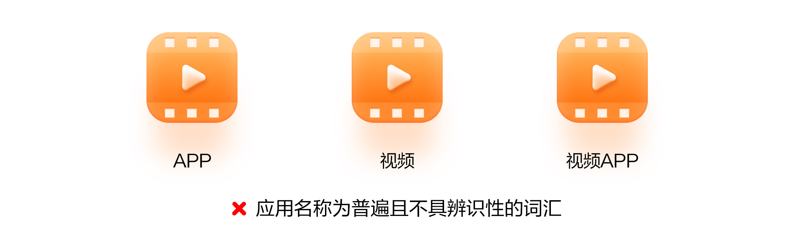

1.3 应用名称不得和其他应用名称相同，避免给用户造成混淆以及给您带来知识产权侵权索赔的风险。

1.4 应用名称不得含有占位符文本、乱码、表情符号、特殊符号 (如“\*” “&”“-”“( )”) 。

示例：

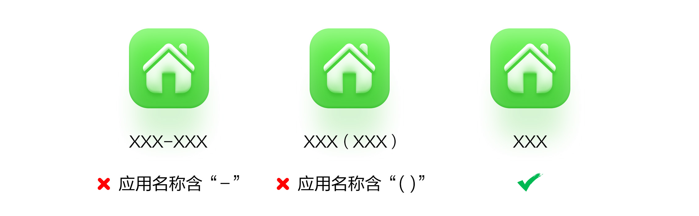

1.5 应用名称不得包含定价信息、价格、诱导赚钱等具有营销属性的商业化词汇（如免费、促销、清仓、XX元、￥XX、9块9、躺赚等），避免夸大宣传、误导用户。

示例①：

示例②：

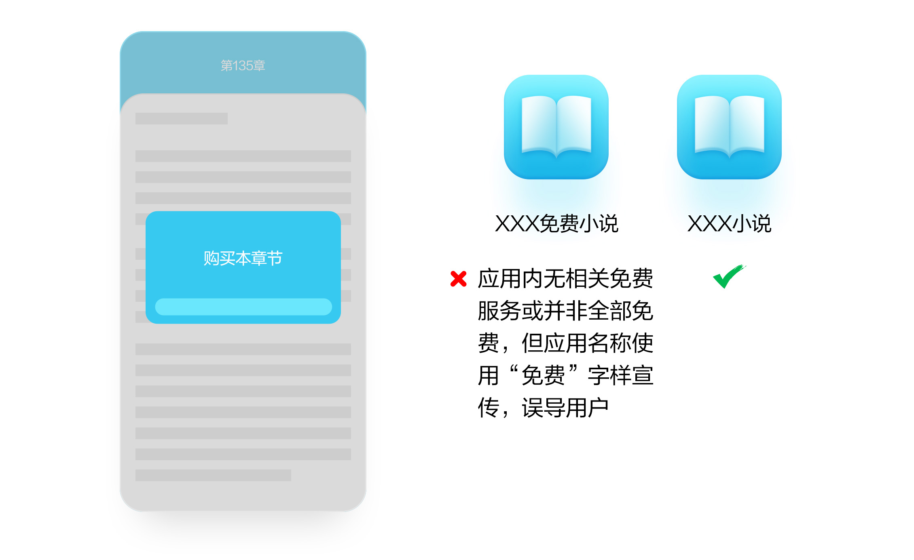

1.6 应用图标不得为系统图标，避免被用户误认为是系统应用。

示例：

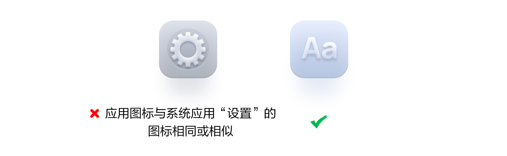

1.7 应用图标不得包含误导用户点击的元素，如在没有新消息的情况下显示代表有新消息的数字角标。

示例：

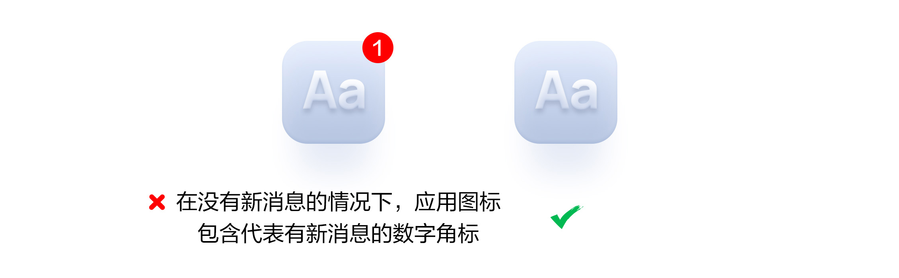

1.8 安装后的应用图标至多出现一个。

示例：

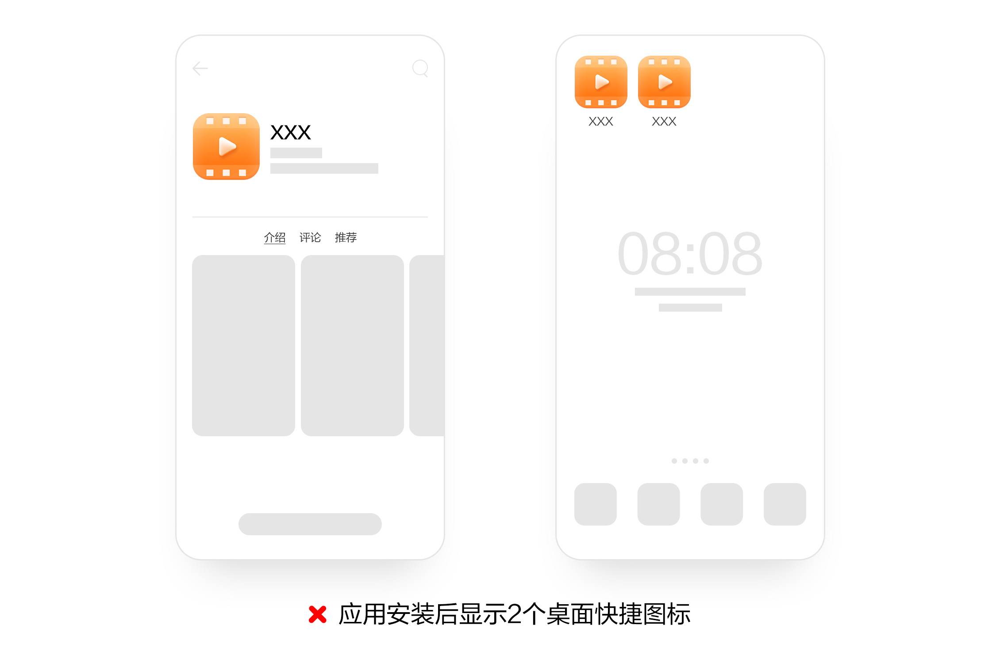

1.9 应用截图和视频上传时需选择正确的方向，应用截图需至少上传3张不同内容的图片，不得出现重复、模糊、拉伸、压缩、显示不完整、无法体现实际内容等情况。

示例：

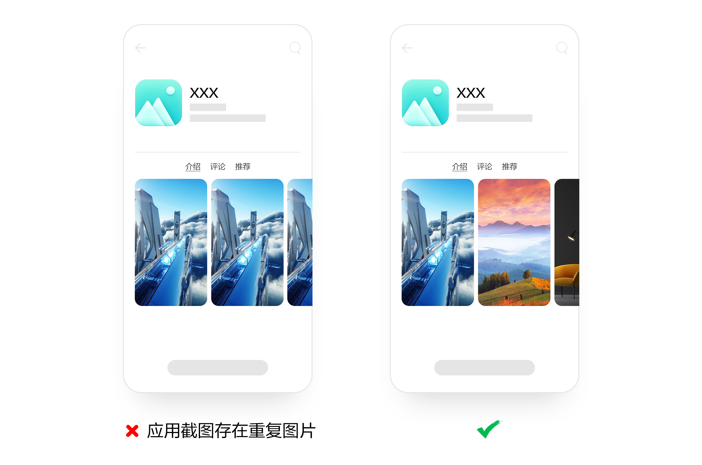

1.10 应用内容分级需如实填写，以标识应用适宜的用户年龄段。当您的应用内容发生变化时，需重新进行分级。

华为应用市场已上线年龄分级问卷服务，您可通过如实完成问卷作答，获取应用年龄分级建议，以便更好地服务用户，帮助用户找到适合其年龄的应用，协助您对应用内容进行年龄分级管理。详细请参见：[《华为应用市场应用年龄分级标准](/docs/distribute/app-dist/app-market/x50000/x50125)》、[年龄分级问卷FAQ](/docs/distribute/app-dist/app-market/x50000/x50142)。

此外，游戏年龄分级须遵守以下规范：

1. 游戏最终年龄分级结果，不得低于游戏内明确标注的适龄提示等级；

2. 游戏包含付费内容的，年龄分级不得低于 8+。

游戏内适龄提示设置需符合《网络游戏适龄提示》团体标准及以下要求：

1. 须在游戏登录界面展示适龄提示标识；无登录界面的，应在游戏启动界面显著位置展示；

2. 适龄提示标识颜色须与团体标准示例保持一致，并与游戏背景形成明显区分；

3. 游戏视频中，适龄提示标识展示时长不得少于 3 秒。

1.11 应用分类及标签需与实际功能和用途相符（详细请参见：[华为应用市场应用分类示例](https://developer.huawei.com/consumer/cn/doc/distribution/app/50103)（HarmonyOS 3.1/4.0及以下）；[鸿蒙应用分类](/docs/distribute/app-dist/app-services/classification-0000002068852289/classify-0000001960172909)（HarmonyOS 5及以上））。

游戏圈选“休闲游戏”或“网络游戏”需要与版号申报类别相符。

休闲游戏：主要指以休闲娱乐为主的游戏，如休闲竞技、体育竞速、塔防、沙盒、模拟经营、动作肉鸽和独立游戏等。注：免费单机游戏及版号申报类别为“移动 - 休闲益智”的游戏，请选择“休闲游戏”分类。

网络游戏：包含多人在线实时对战或协作的射击、MOBA、角色扮演、卡牌策略、战争策略（SLG）及二次元题材游戏，具备社交、养成、PVP/PVE等玩法，强调联网互动与持续内容更新。

示例：

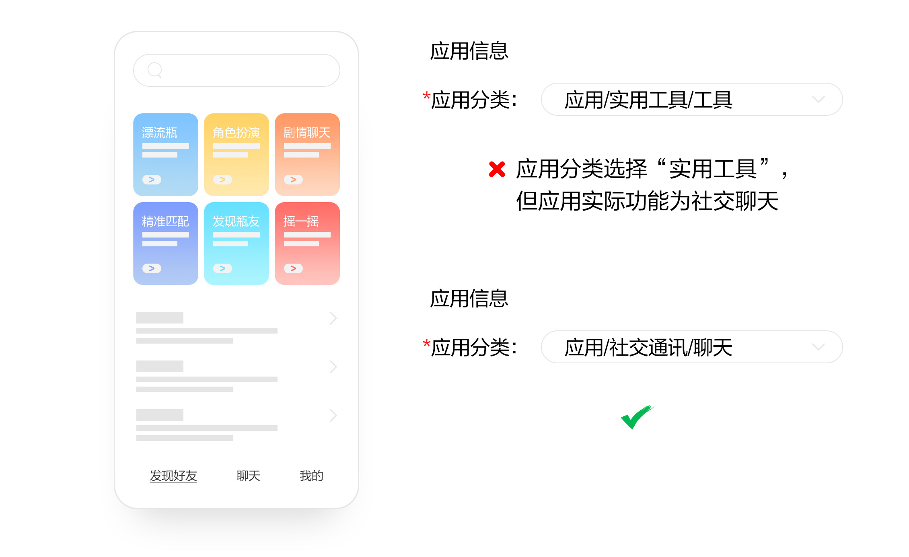

1.12 应用名称、图标、分类、标签和签名不得频繁更改。应用名称一个自然年内可支持修改2次。

1.13 应用需提供支持本地化的语言版本，应用信息及应用内容使用的语言需与选择的语言一致。

1.14 应用信息需与应用内容相符，不得包含误导性、不相关或不恰当的商业化用语、热门搜索词、流行词语，且不得宣传实际并不提供的内容或服务、以及做出无法证实的产品声明。应用信息不得误导或暗示应用的排名和表现，如使用官方、权威、推荐、精品等词汇。

示例①：

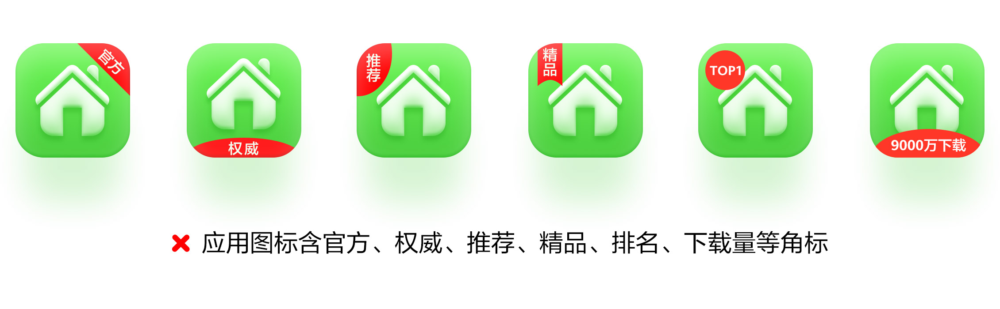

示例②：**x** 应用介绍中使用“国家级”、“最高级”、“最佳”等不符合《广告法》要求的用语

1.15 应用不得使用可能会误导用户以为应用及其内容来源于他人或与他人存在特定联系的应用信息，不得在未经授权的情况下使用或者变相使用代表政府实体或其他知名实体的标识及内容，如：非国家机构应用使用国旗、国徽、党旗、党徽等标识作为应用图标，误导用户认为该应用与国家机构之间存在关联；应用未经批准使用“电视台”、“广播电台”、“电台”、“TV”等广播电视专有名称开展业务。如果您的应用分发至全球多个国家或地区，提供的所有语言的应用信息均不得误导用户以为应用及其内容来源于他人或与他人存在特定联系。

1.16 应用信息不得带有其他终端品牌或移动应用平台的名称、图标或图像，确保应用信息注重应用本身功能及服务，不要包含无关信息。

1.17 应用信息不得存在低俗、性暗示、色情、暴力、恐怖、血腥、赌博及其他适用法律法规所禁止的内容。

1.18 应用信息需考虑对所有受众的影响，如：即使您的应用目标用户非儿童，应用信息也不应含有可能对儿童造成负面影响的元素。

1.19 应用信息不得展示真实的个人信息，如账号、身份信息等。

1.20 应用信息需与应用安装后的图标、名称、版本、开发者信息、应用内容一致。如果您的应用分发至全球多个国家或地区，提供的所有语言的应用信息同样需与应用安装后的图标、名称、版本、开发者信息、应用内容一致。

示例①：

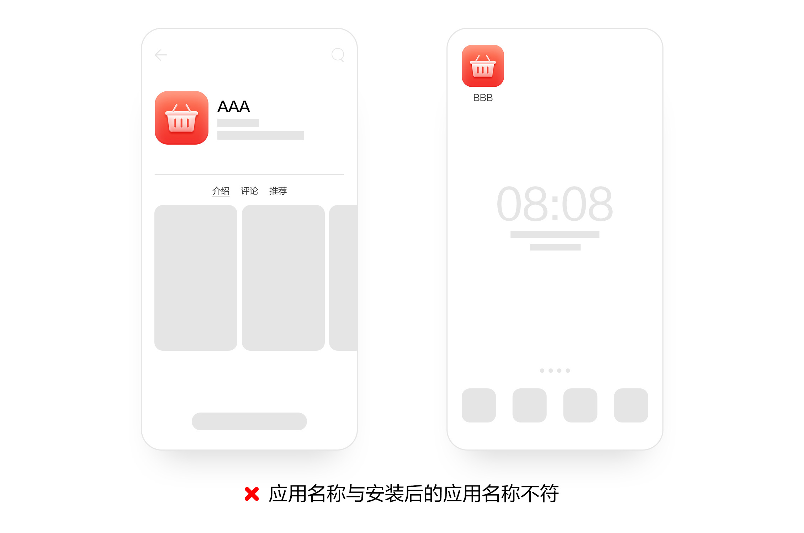

示例②：

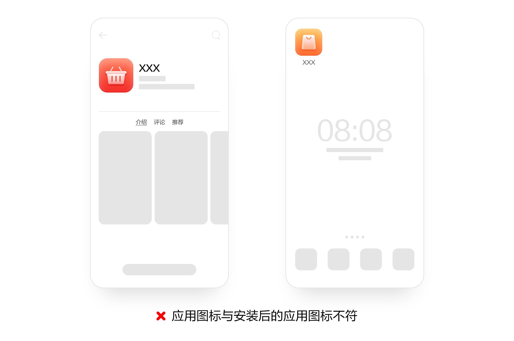

示例③：

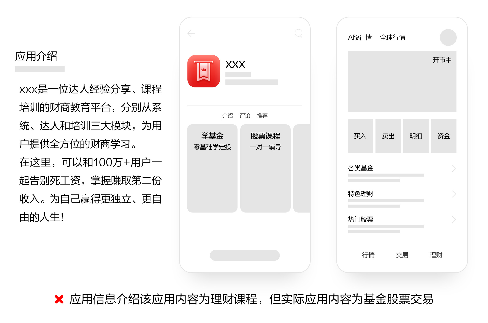

1.21 应用如需要账号才能使用，应提交有效可用的账号和登录信息，若应用内的功能需要连接设备或需要特殊的运行环境等场景才能使用，请您提供演示视频，以便我们完成对您应用的审核。

## 2. 应用安全

为了给用户提供安全可靠的使用环境，您的应用不得含有试图滥用或不当使用任何网络、设备以及干扰其他应用的安全隐患。

2.1 应用不得含有病毒、木马，包括但不限于通过可疑代码、文件及程序等形式对系统造成负面影响或侵害用户权益。

2.2 应用不得在用户不知情或未授权的情况下，通过隐蔽执行、欺骗用户点击等手段，订购各类收费业务（如发送付费短信、拨打付费电话号码、诱骗用户订阅及购买内容）或使用移动终端支付，导致用户经济损失。

2.3 应用不得存在劫持系统操作、利用漏洞或采取欺骗手段监控用户、窃取数据的恶意行为，包括但不限于劫持桌面、监听剪切板、设置钓鱼链接盗取用户账户或其他敏感信息。

2.4 应用不得允许远程攻击者控制手机，接收攻击者下发的远程控制指令，在用户未授权、未知情的情况下，侵害用户隐私、窃取用户资产或者执行其他恶意行为。

2.5 应用不得下载、安装或运行第三方恶意代码，以更改该应用或其他应用功能，包括但不限于滥用热更新或插件化技术动态加载恶意代码。

2.6 应用不得在用户不知情或未授权的情况下，通过自动拨打电话和发送短信、彩信、邮件，频繁连接网络等方式，导致用户资费损失。

2.7 应用不得利用系统和资源进行拒绝服务攻击 (DoS)，或作为分布式拒绝服务攻击（DDoS）的一环使用户无法得到服务。

2.8 应用不得在用户不知情的情况下利用系统和资源进行获利，包括但不限于加密货币挖矿、通过模拟人工点击广告或链接、下载软件、修改软件业务逻辑进行刷量刷榜等。

2.9 应用不得干扰、阻断、屏蔽或以未经授权的方式访问用户的通信功能、网络服务或其它合法业务，导致用户手机无法正常使用，损害用户利益。

2.10 应用不得诱导、欺骗用户，在用户主观不了解操作后果情况下，执行有损系统和应用安全的操作，包括但不限于下载或安装系统root工具、激活设备管理器选项、开启辅助功能等。

2.11 应用不得通过加密用户数据，窗口遮蔽，滥用锁屏、锁应用等权限，或者利用拒绝服务漏洞，影响用户对手机的正常使用，并以恢复正常使用为由向用户勒索。

2.12 应用或广告不得伪装和模仿操作系统功能和系统消息，如伪装和模仿操作系统或其他应用发送的通知或警告，欺骗和诱导用户执行操作。

示例：

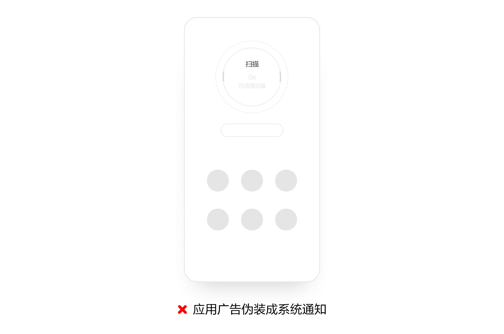

2.13 应用不得未经用户授权强制启动系统服务（例如：蓝牙，GPS等）。

2.14 应用不得提示或强制重启设备、不得诱导或强制更改用户设备上超出该应用范围的系统设置，包括但不限于安装后自动修改系统默认配置且未告知用户等。

2.15 应用不得诱导或强制更改系统默认的功能，导致系统功能异常，包括但不限于进程无法停止、功能键失灵（如按“返回键”后无法退出应用）等。

示例：

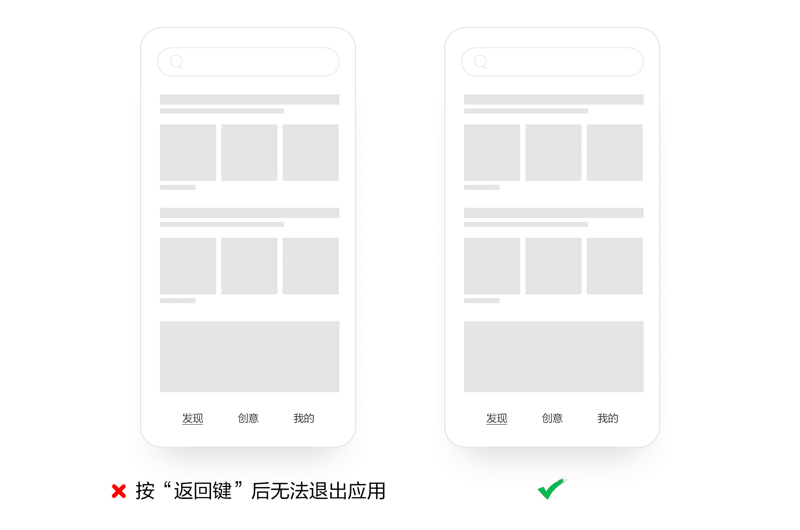

2.16 应用不得含有隐藏或不被用户感知或发现的功能，如隐藏或透明图标、在无合理使用场景的情况下隐藏最近任务列表，且不得滥用前台服务和悬浮窗权限，在桌面或其他应用界面上恶意弹窗。

2.17 应用不得含有修改其他应用数据、存档等内容的功能，不得恶意干扰、屏蔽、诱导或强制用户卸载其他应用。

2.18 应用不得在用户不知情或未授权的情况下霸占锁屏界面，如在锁屏界面展现广告。

示例：

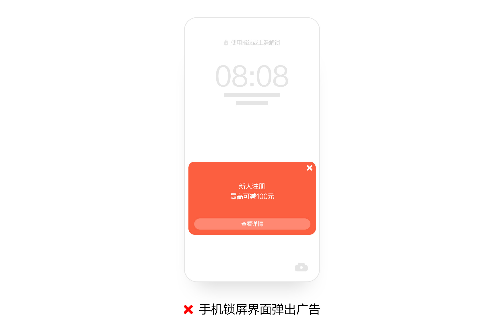

2.19 应用不得含有任何试图滥用或不当使用任何网络、系统机制、系统功能、系统漏洞、以及干扰其他应用或影响终端设备功能的恶意行为，影响用户的正常操作和体验。详细请参见：[恶意软件及行为](https://developer.huawei.com/consumer/cn/doc/50114)。

## 3. 应用功能

为了给用户提供优质的体验，请确保您的应用能够为用户提供正常完整、稳定流畅、有吸引力的功能。若您的应用已有面向用户提供的其他版本，在开发鸿蒙版本时，请保持不低于其他版本的质量与完善度，满足用户对体验一致性的期待。

3.1 应用应具备良好的兼容性，且需适配华为主流终端设备；应用需能够正常安装、启动、卸载，不得出现运行时崩溃、闪退、无响应或其他功能异常情况，不得出现需借助第三方软件才可安装、卸载的情况。

3.2 应用不得存在强制输入邀请码、推荐码等才可注册或登录使用的行为。

3.3 应用不得在注册或登录过程中出现异常，包括但不限于无法接收短信验证码、账号不可用等异常情况。

游戏类需注意，游戏启动调用华为账号登录时需拉起欢迎栏，欢迎栏内容需为中文并显示正确。详细请参见：[联运游戏自检checklist指导文档](https://developer.huawei.com/consumer/cn/doc/HMSCore-Guides/pre-release-check-0000001050121544)

示例：

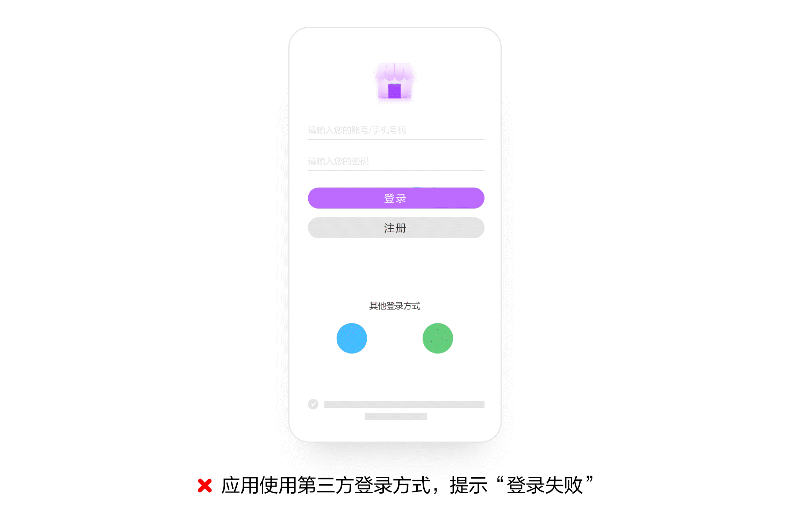

3.4 应用功能需确保已实现和使用正常，应用如存在未完善功能的情况可能会被拒绝，包括但不限于应用为测试版本、功能模块未开发完善或不能独立运行的非正式版本、点击主功能，跳转至三方小程序、APP等。

示例①：

示例②：

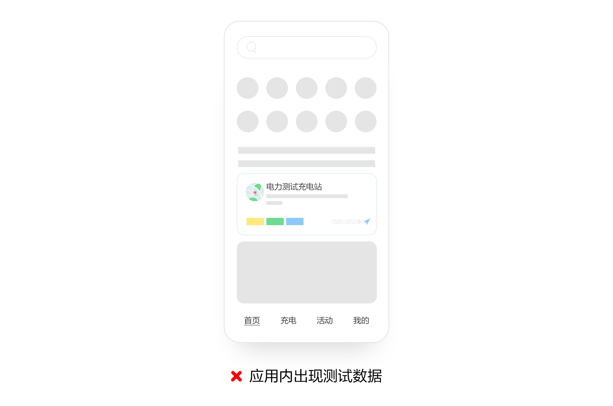

示例③：

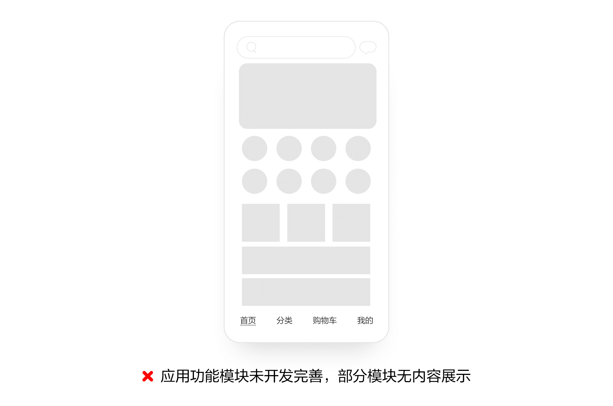

示例④：

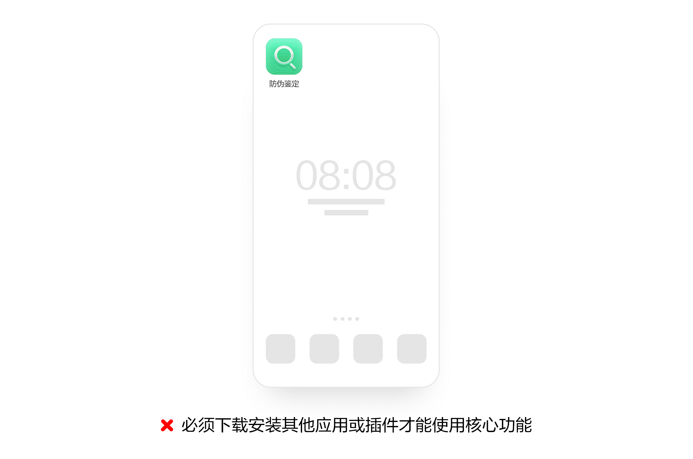

3.5 应用需具备实用价值，能为用户提供实质功能/服务，且需具备创意，不得为纯信息展示，包括但不限于单一图片、单一页面、单一影视剧集类、单一图书单行本类、单一非官方游戏攻略类等。应用不得是简单打包的网站页面或套用模板、内容聚合、罗列链接、广告推广等，或为手机系统自带的简易功能。

示例①：

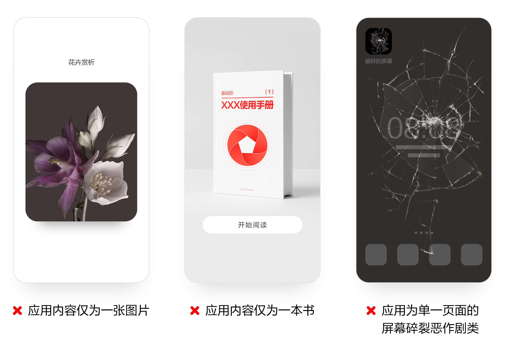

示例②：

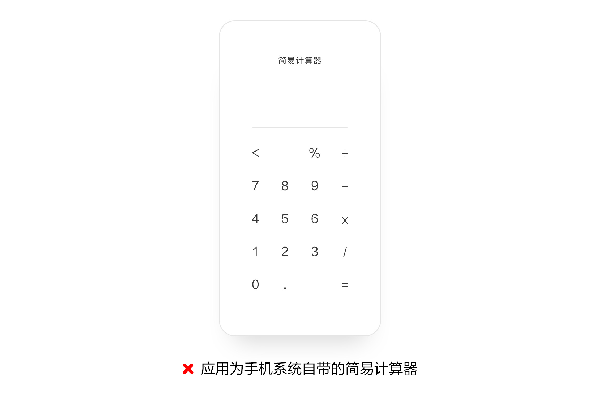

3.6 您不得重复提交2个及以上页面、内容、功能相同或高度相似的严重同质化应用，且不得针对特定人群、时间、运动/游玩项目、节目、物种、教育阶段、地区等场景的不同适用版本而提交多个类似内容的应用。请确保应用之间在名称、页面、内容、功能上相互具有可辨识性和不可替代性，避免给用户造成混淆，影响用户体验。

示例①：

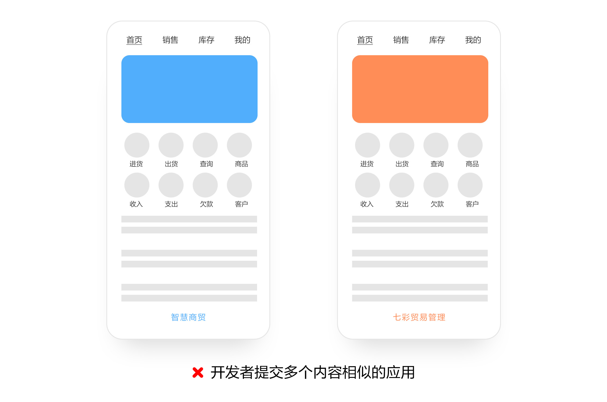

示例②：

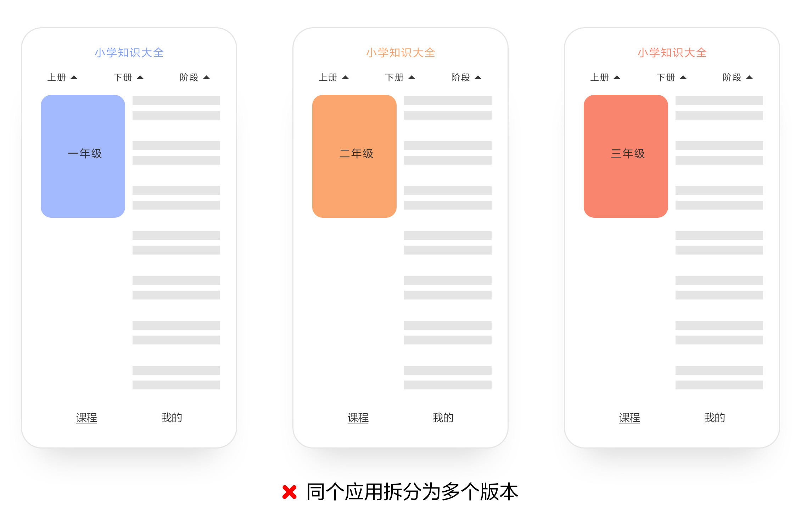

3.7 请避免继续在已有较多类似应用的类别下进行开发，如敲木鱼、随机选择、计算器、手电筒、记事本、记账、天气、数字大小写转换、日历、指南针、智能遥控、镜子、助眠睡眠、证件照、色彩助手、手持弹幕、播放器、万能遥控器、外卖跑腿聚合平台、生鲜买菜服务聚合平台、计时类、Wi-Fi管理类、Wi-Fi搜索连接类、Wi-Fi检测提速类等类别的应用，除非您的应用能够提供独特、高质量的体验，为用户提供多样、优质的功能和服务，否则您的应用可能会被拒绝或移除。

3.8 应用的发布版本不得为可调试版本。出于安全考虑，您需在发布应用前先关闭调试功能。

3.9 应用不得提供虚假或具有误导性的功能、信息或声明，如：声称提供某些功能（如驱蚊应用），但实际上不可能实现这些功能。

示例：

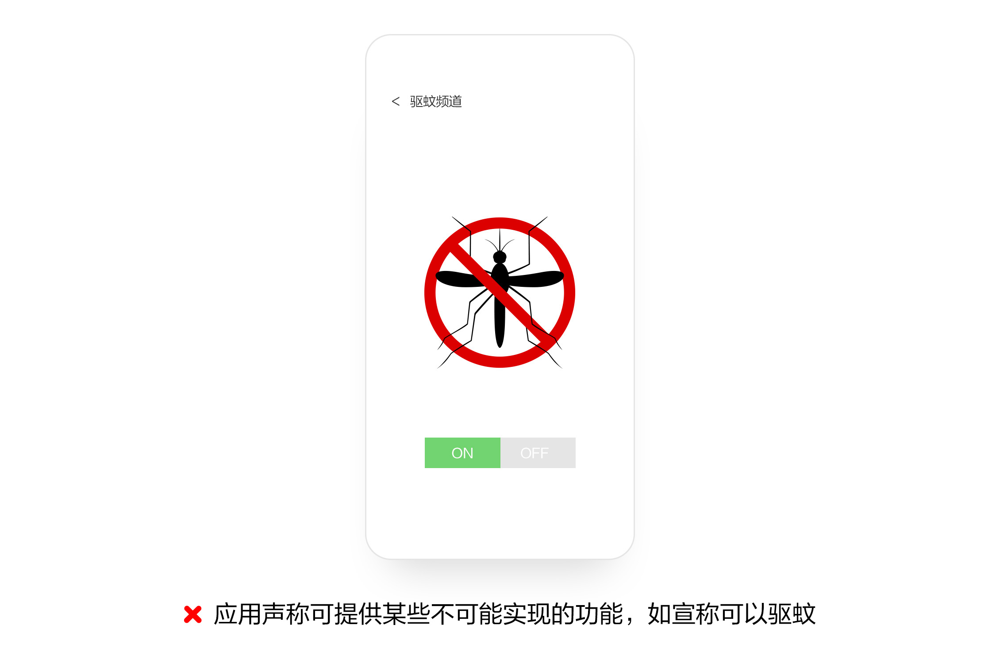

3.10 应用不得以任何方式协助用户误导他人或提供用于实现欺骗性行为或违法行为的功能，如生成或协助生成印章和身份信息等；也不得宣传或协助创建文字、图像和/或视频等以传达虚假或误导性的信息。

示例：

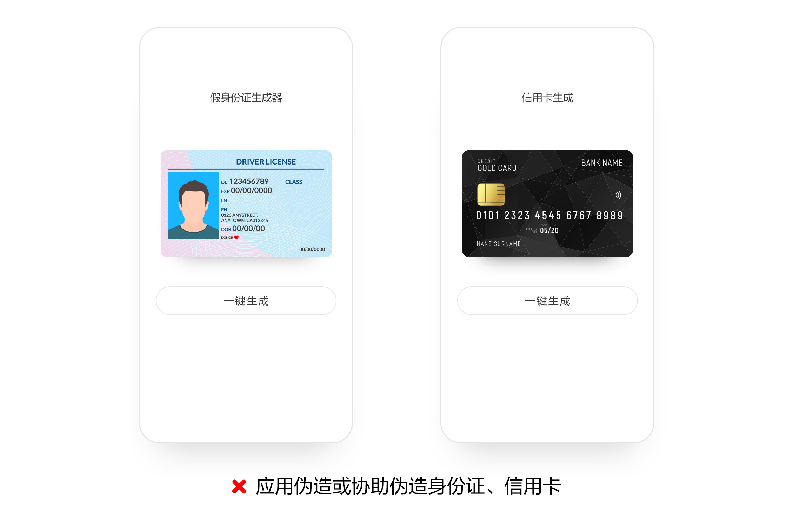

3.11 互联网弹窗信息功能应明示推送服务的具体形式、内容频次、取消渠道等，并显著标明弹窗信息推送服务提供者身份，不得以任何形式干扰或者影响用户关闭弹窗。详细的互联网弹窗信息内容要求与“[4. 应用内容](https://developer.huawei.com/consumer/cn/doc/distribution/app/50104-04)”章节的内容要求相同。

（1）应用应以服务协议等方式明确告知用户推送服务的具体形式、内容频次、取消渠道等；

（2）应用在通知栏的推送信息需确保可正常关闭；

（3）应用不得在通知栏推送包括但不限于产品推广、促销活动、商业合作广告等各类营销性质的信息，除非经用户明确、主动的许可，且确保用户可关闭接收此类信息；

（4）应用应显著标明弹窗信息推送服务提供者身份，不得出现匿名推送行为，消息通知不得隐藏应用名称和图标。

示例①：

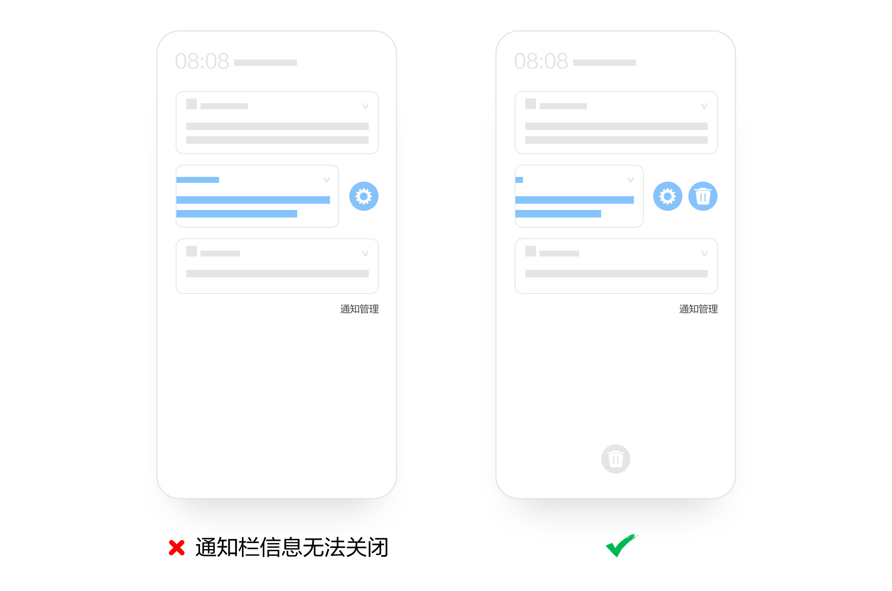

示例②：

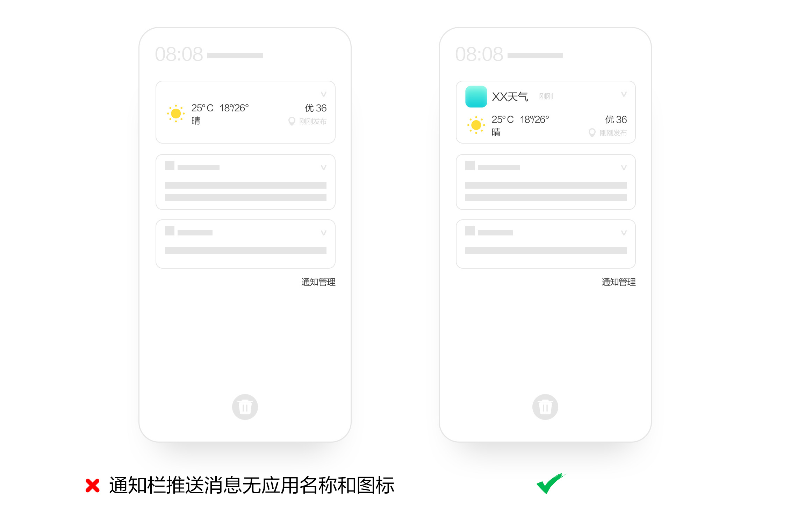

3.12 如应用主功能需付费才能激活使用，则应用需提供用户免费体验的功能。若付费后仍有其他使用限制条件，需在付费前向用户清晰明示。

示例：

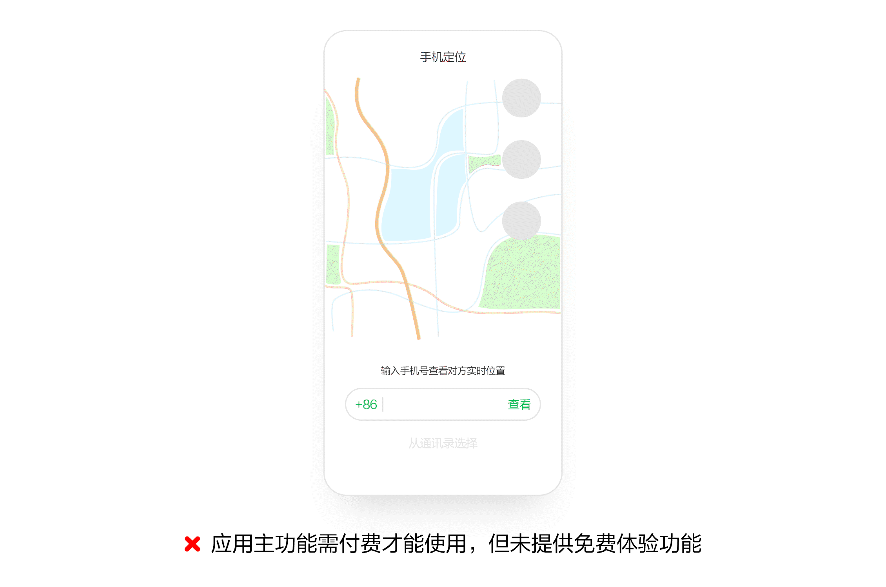

3.13 应用不得绕过审核机制进行自动更新 (应使用华为应用市场下载可执行应用更新的组件)；不得从其他来源下载、安装或执行会修改、替换或更新应用本身特性或功能的代码。

示例：

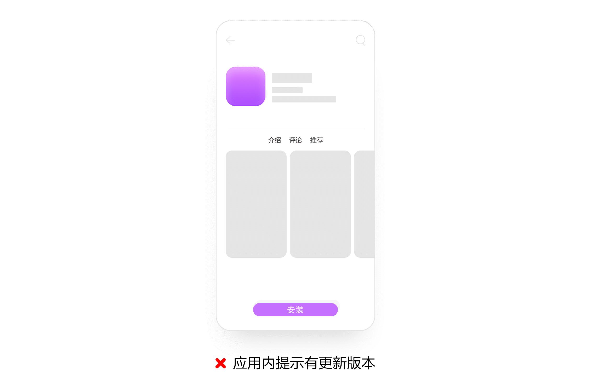

3.14 应用应支持在IPv6网络环境正常运行。

3.15 应用快捷方式/linkFeature需确保功能合理、完善且用户可正常使用，不得影响用户体验。包括但不限于：

（1）快捷方式的名称长度不得超过10个汉字字符或20个其他语言字符；

（2）快捷方式的名称/linkFeature属性所支持的特性功能需与应用内实际功能或内容相符；

（3）快捷方式在跳转自身应用时需要一步直达相关功能页面，linkFeature属性所支持的特性功能必须为应用自身服务功能，两者均不得跳转至三方应用或页面；

（4）快捷方式的功能不得与系统默认提供的功能（例如：分享、卸载等）重复；

（5）linkFeature声明的功能类型必须为系统提供的枚举值，请您参考《[应用链接说明](/docs/dev/app-dev/application-framework/ability-kit/stage-model-development/inter-app-redirection/directional-redirection/app-uri-config#linkfeature标签说明)》。

为了给用户提供更好的服务，请确保您的应用能够为用户提供绿色、独特、高质量的应用内容，不得出现对用户有害或者不当的内容，包括但不限于应用信息、应用内容、应用广告、互联网弹窗信息（指通过操作系统、应用软件、网站等，以弹出消息窗口形式向互联网用户提供的信息）等。

3.16 若应用支持用户使用第三方账号登录，则该应用需提供华为账号登录选项。

为了帮助用户省去多次输入不同应用账号登录的繁琐过程，华为应用市场为鸿蒙应用开发者提供了使用华为账号快捷登录的能力。如果应用支持用户使用第三方账号登录，则该应用需提供华为账号登录选项。用户可通过华为账号快捷地登录应用，并获得华为账号的安全配置。

您可参考[开发者使用Account Kit的登录能力的管理细则](/docs/dev/app-dev/application-services/account-kit-guide/account-detailedrules)。

3.17 游戏启动页信息展示规范

1、游戏启动页需完整、正确展示游戏著作权人、出版单位、审批文号、出版物号及健康游戏忠告信息，页面停留时间不得低于 2s。

2、游戏展示的著作权人、出版单位、审批文号、出版物号等信息需与该游戏资质文件信息保持一致。

在所有页面均需要确保展示信息清晰准确，字体颜色需与背景有明显区分，且不得被其他元素遮挡。

健康游戏忠告

抵制不良游戏，拒绝盗版游戏。

注意自我保护，谨防受骗上当。

适度游戏益脑，沉迷游戏伤身。

合理安排时间，享受健康生活。

## 4. 应用内容

**基本内容要求**

4.1 应用不得通过技术或其他方式，绕开、规避或对抗平台的审核规则，不得在提交审核时关闭或隐藏违规内容，在上架后通过技术手段开启或展示违规内容，或通过多个版本变更应用的主要功能和运营业务；不得通过代码隐藏手段绕过检测实施违规行为。如发现此类情况，我们将终止您与华为的协议和/或冻结、删除您的开发者账号。4.2 应用不得含有虚假或具有欺骗性的信息或内容，不得存在鼓励欺骗、企图欺骗、诱导消费或欺诈行为，如情节严重，我们将终止您与华为的协议和/或冻结、删除您的开发者账号。

4.3 应用不得以分发为主要目的，包括但不限于应用商店、游戏中心。

4.4 应用不得强制或误导用户下载、安装或跳转至其他应用，不得捆绑下载或跳转其他应用，包括但不限于：

（1）应用不得未经用户同意默认勾选下载、后台静默下载、自动下载安装其他应用，必须下载其他应用或插件才可使用，或在使用及退出应用的过程中无下载提示或提示不明显造成用户误点击，导致下载安装其他应用；

（2）应用不得在用户浏览页面内容时，未经用户同意或主动选择，自动或强制下载应用，或以折叠显示、主动弹窗、频繁提示等方式强迫用户下载、打开应用，影响用户正常浏览信息。无正当理由，不得将下载应用与阅读网页内容相绑定。

（3）应用在首屏、一级Tab页等显著界面，不得以平铺、整屏形式直接展示引导用户跳转至其他应用的内容。如需展示，应通过折叠、收起等非平铺式设计实现，并在入口处以清晰文字明确标注其性质。广告形式的交叉引流须符合相关法规及平台政策。

**不当内容**

4.5 应用不得含有非法金钱交易、赌博、危害国家安全、破坏统一、煽动民族仇恨歧视、侵害英雄烈士权益及危害国家安全、破坏统一、煽动民族仇恨歧视、侵害英雄烈士权益及其他适用法律所禁止的内容，以及不得宣传或助长任何非法活动。

4.6 应用不得含有或传播暴露、情色、低俗内容，包括但不限于应用信息、内容及广告存在低俗、性暗示、涉黄的资源（如文字、图片、漫画、音视频等）、涉黄网站名称、涉黄网址链接、以及诱导用户进行线下性交易的内容等。

4.7 应用内不得含有具有攻击性、不顾及他人感受、令人不安、惹人厌恶或低俗不堪的内容。

4.8 应用不得含有或传播暴力或其他危险活动，包括但不限于描绘对人类或动物遭到杀害、残害、酷刑、虐待的写实暴力行为或暴力威胁，以及自残、自杀、绝食或其他可能导致严重伤亡的行为。

4.9 应用不得含有或传播恐怖行动，组织暴力运动；不得鼓励非法使用武器、危险物品；不得为军火购买及销售提供便利，或提供制造炸药、枪支、弹药或其他武器的使用和改造说明等内容。

4.10 禁止恐怖组织及其成员、其他暴力行动组织及其参与者出于任何目的发布应用。

4.11 应用不得含有或传播邪教和封建迷信的内容，也不得含有关于宗教、种族、性取向、性别或其他目标群体的诽谤或恶意内容。

4.12 应用不得含有或传播非法使用毒品及管制药品、过量摄入酒精、酒驾、违反交通规则、鼓励消费烟草及电子烟产品等可能造成人身伤害的内容。

4.13 应用不得含有恶意炒作娱乐八卦、绯闻隐私、奢靡炫富、审丑扮丑等违背公序良俗内容，不得含有集中推送、炒作社会热点敏感事件、恶性案件、灾难事故等易引发社会恐慌的内容，也不得利用算法诱导用户沉迷、过度消费或过度推荐、恶意屏蔽信息。

4.14应用不得含有任何形式的骚扰、歧视、恐吓或霸凌行为，也不得鼓励他人实施任何上述行为。对于用户生成的内容中涉及上述行为的内容，开发者需设置过滤机制进行有效管控。骚扰行为包括但不限于向用户发送骚扰信息、诱导付费等。

示例：

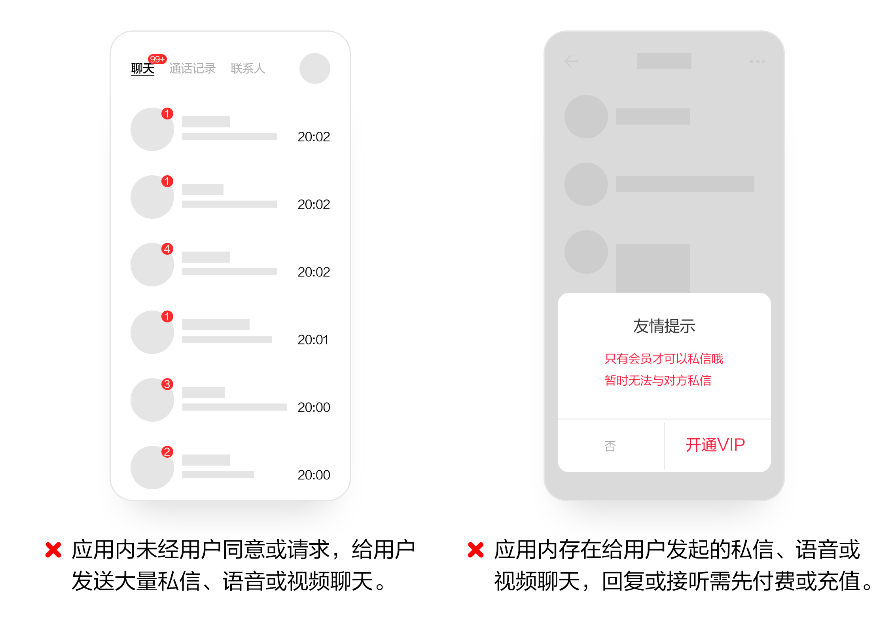

**用户生成的内容**

4.15 您应对用户生成的内容进行有效管控，包括但不限于：核验用户账号身份信息并保存有关记录；制定过滤机制对账号名称、昵称、简介、备注、标识、信息发布、评论等功能及内容中的违法有害信息进行防范处置并保存有关记录；制定举报机制并及时作出响应；实现服务关闭功能，对严重违规用户账号停止提供服务；公布联系信息，以便用户与您联系等。

示例：

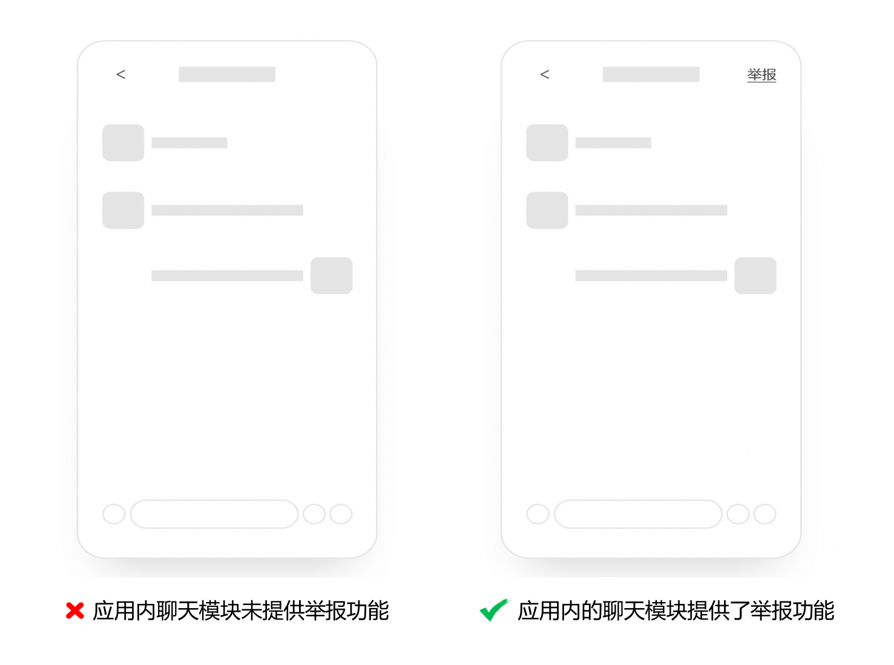

## 5. 应用广告

应用广告被视作应用的一部分，请确保您应用所展示的广告的投放行为以及内容符合适用的法律法规及指南要求，并适合应用的目标受众群体。应用广告只应在应用内展示，不得包含非法、误导性内容，且不得为恶意广告或干扰性广告。详细的广告内容要求与“[4. 应用内容](https://developer.huawei.com/consumer/cn/doc/distribution/app/50104-04)”章节的内容要求相同。（解读课程请参考：[APP广告审核规范标准解读](https://developer.huawei.com/consumer/cn/training/course/video/C101656554833164557)）。

5.1 应用广告的展示内容应当合法合规，以健康的表现形式表达广告内容，且具有可识别性，能够使消费者辨明其为广告。

（1）需清晰、显著标明“广告”字样，与其他非广告信息相区别，不得使用户产生误解；通过知识介绍、体验分享、消费测评等形式推销商品或者服务，并附加购物链接等购买方式的广告，也需显著标明“广告”字样；

（2）不得含有虚假或者引人误解的内容，不得欺骗、误导、诱导用户；

（3）对于需经审查的互联网广告，需严格按照审查通过的内容发布，不得剪辑、拼接、修改；

（4）含有链接的互联网广告，需确保前端广告内容与链接内容的一致性；

（5）其他广告内容要求与“[4. 应用内容](https://developer.huawei.com/consumer/cn/doc/distribution/app/50104-04)”章节的内容要求相同。

示例：

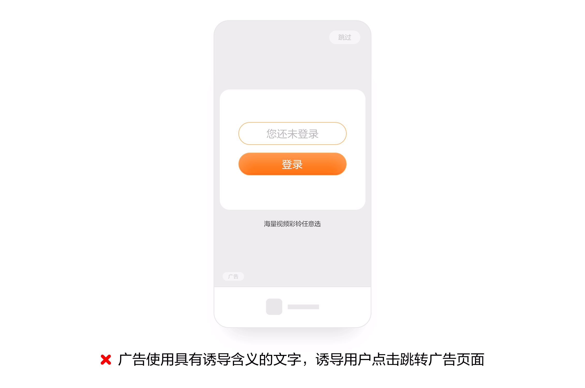

5.2 应用广告的弹出不得影响用户的正常操作体验，干扰其他应用或影响终端设备功能，包括但不限于：

（1）不得恶意频繁弹出广告，中断用户操作；

示例：

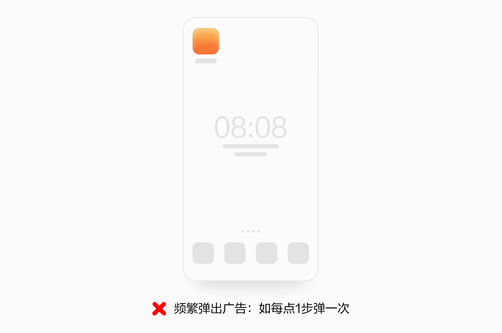

（2）不得在用户习惯点击的功能区域突然弹出广告；

（3）不得在用户点击返回键和主屏键等系统功能键时弹出广告；

示例：

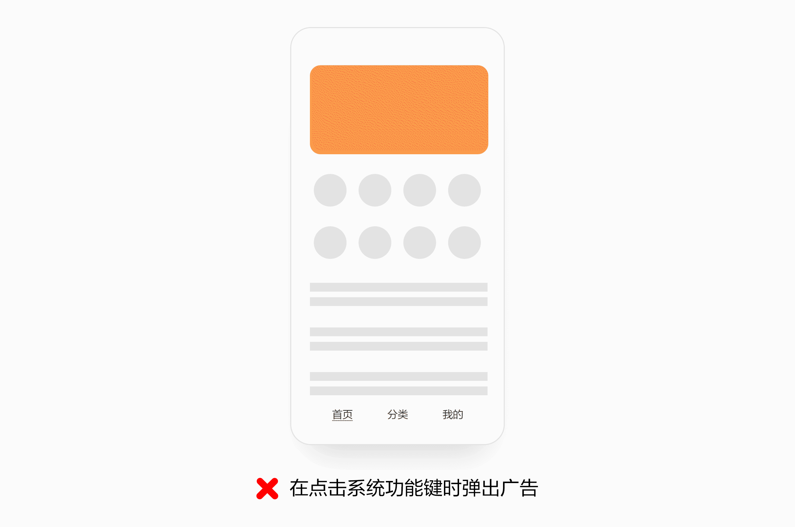

（4）不得在应用外弹出广告窗口；

（5）不得在应用退出或关闭后仍弹出广告；

（6）不得在锁屏界面展现广告；

（7）未经用户同意、请求或者用户明确表示拒绝的，不得在用户发送的电子邮件或者互联网即时通讯信息中附加广告或者广告链接；

（8）用户在使用应用的完整功能时，不得以强制用户点击、浏览广告等交互为前提，对用户正常使用应用造成不当干扰。应确保用户有权在不被广告干扰、无需进行不合理广告交互行为的前提下，自由、顺畅地访问和使用应用所提供的完整功能。

5.3 应用广告被点击后跳转、使用第三方应用或页面，以及跳转到其他广告页面或广告形式时，应当提示用户点击的范围和位置，并经用户主动选择点击该范围之后才进行跳转或使用。不得欺骗误导强迫用户点击广告。包括但不限于：

（1）不得通过使用整屏图片、视频等作为跳转或下载链接，诱导用户点击或易造成用户误点击；应用内同一广告位不得同时使用两种及以上的新型交互方式（摇动、滑动、转动等）。例如：不得在同一广告位同时设置“摇动跳转广告”和“滑动跳转广告”两种触发方式。

（2）不得存在诱导用户跳转其他页面的文字、图片或视频链接；

示例①：

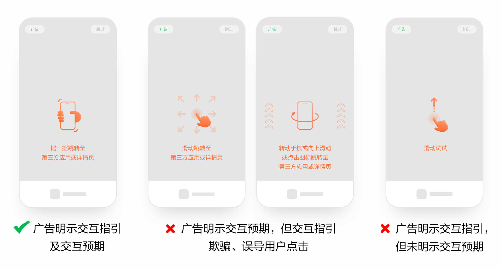

示例②：

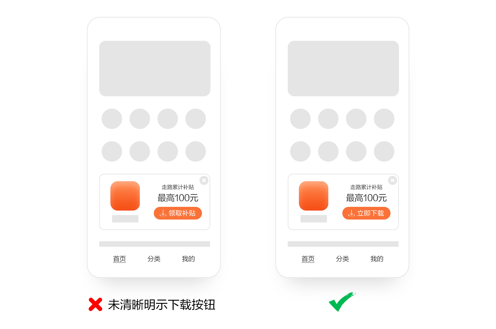

（3）不得存在欺骗误导强迫用户下载、安装、使用第三方应用的行为，包括但不限于使用“是否立即开始游戏”、“领取红包”、“手机卡顿”、“耗电太快”、“内存已满”等未清晰明示下载应用的诱导方式；

（4）不得存在以积分、奖励、优惠等方式欺骗误导用户提供个人信息的行为，包括但不限于身份证号、人脸、指纹等个人信息；

示例①：

（5）不得包含会导致儿童用户在无意间点击的内容；

（6）通过用户“摇一摇”等交互动作触发页面或第三方应用跳转的，需清晰明示用户需要执行的触发动作及交互预期，不得通过设置高灵敏度降低交互动作判定阈值，造成误导、强迫式跳转。(灵敏度参数设置请参考：[应用审核FAQ](https://developer.huawei.com/consumer/cn/doc/distribution/app/50106)“九、应用广告常见问题及注意事项”)

示例：

5.4 应用广告需确保用户能够一键关闭，需提供明显、清晰、有效的关闭标志。不得存在以下行为，包括但不限于：

（1）不得提供虚假、无效、标识不明显（如过小或非常隐蔽）的关闭标志；

示例：

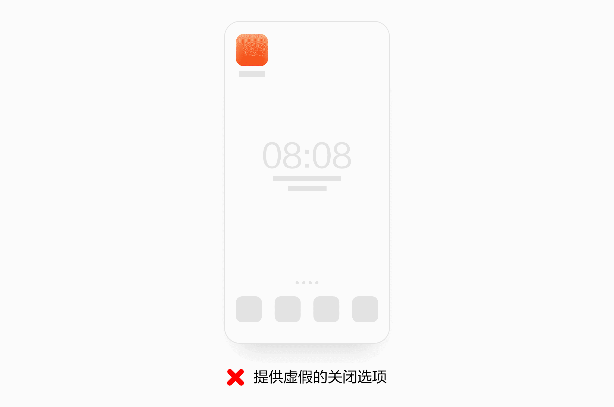

（2）不得在广告素材中出现诱导或者误导的关闭标志；

（3）不得延迟展示关闭标志，或需要倒计时结束才能关闭广告；

（4）不得在广告关闭后继续弹出广告；

（5）不得强制用户输入个人信息才能关闭广告。

5.5 应用广告分发行为需以显著方式明示分发应用的信息及下载选项，并经用户主动选择同意。需明示的分发应用信息包括：（1）应用名称、（2）应用开发者、（3）应用版本、（4）应用功能、（5）权限列表及用途、（6）收集使用个人信息的内容、目的、方式和范围。不得有强制安装软件或捆绑下载的行为。包括但不限于：

（1）不得点击任意位置即自动下载、安装、使用第三方应用；

（2）不得点击下载后无法暂停或者取消；

（3）不得在用户关闭并重新运行应用时，自动恢复已暂停或取消的下载任务；

（4）应用广告页面下载、安装、使用的应用不得与向用户所作的宣传或者承诺不符。

示例①：

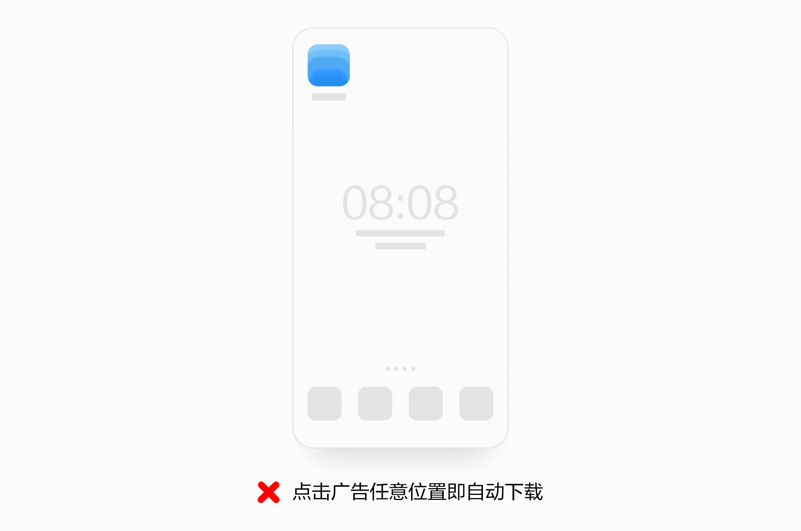

示例②：

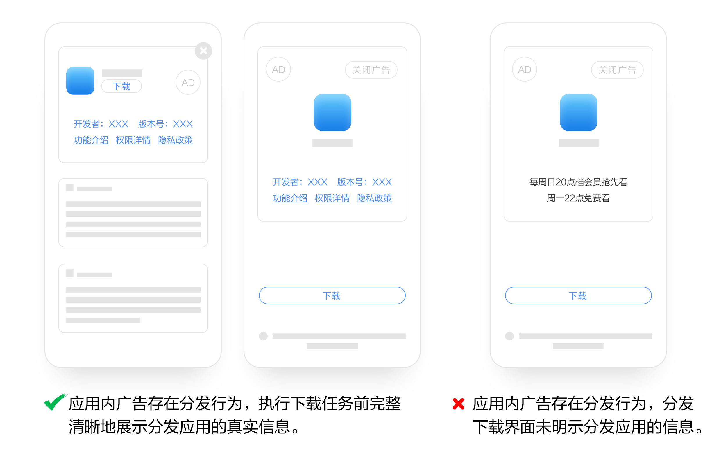

示例③：

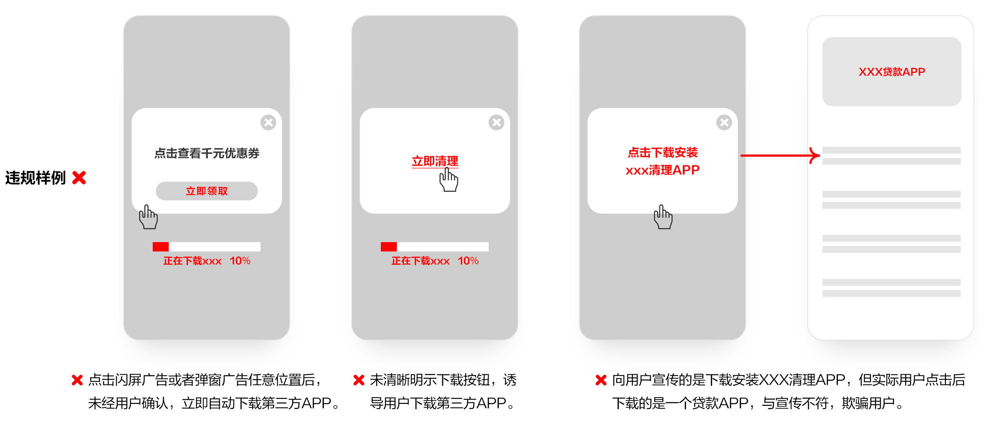

5.6 应用广告不得含有其他移动应用平台的相关推广。

5.7在应用内展示广告时，应设定合理的广告数量，避免在同一屏界面中堆砌3个及以上广告元素，影响内容呈现及连贯性。

示例：

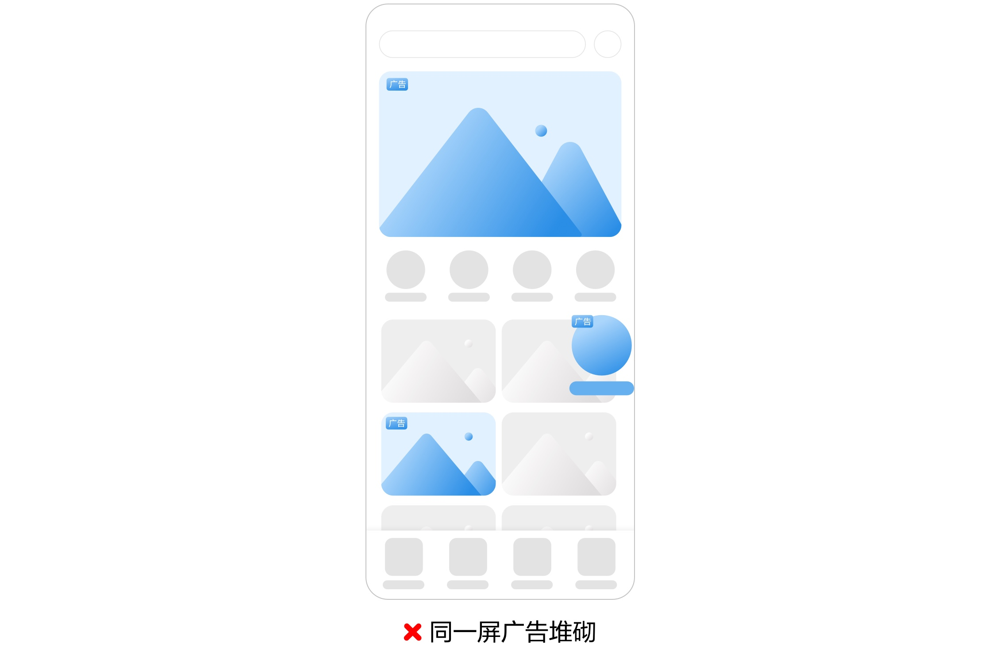

5.8 以最直接的方式解析“小艺对话”请求，不得在“小艺对话”请求与实现之间插入广告弹窗、语音广告等与用户请求无关或非必要信息，需确保服务响应的准确、高效、连贯。

5.9 不得在 APP widget 及各类扩展程序（包括但不限于分享、快捷操作等扩展类型）中植入任何形式的广告。APP 开发者及运营者应确保 APP widget 与扩展程序在为用户提供服务和功能时，保持纯净无广告的使用环境。

示例①：

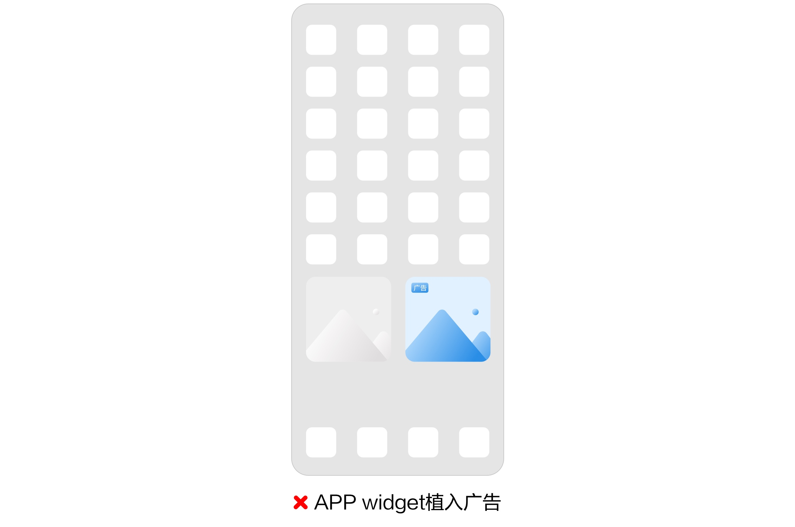

示例②：

## 6. 应用付费

如果您的应用为付费下载应用或应用内含付费项（包括但不限于应用内购买项、自动续费服务等），应为用户提供安全的支付模式，付费信息应清晰明了且显而易见，不得提供任何会误导用户的信息。您还应向用户提供周到的支持服务，以保障用户体验。

6.1 应用需根据自身情况选择免费或付费。付费应用需选择正确的付费类型。应用需合理定价，不得出现定价过高或价格欺诈的行为。（如是付费下载应用，详细请参见：[华为付费下载服务](https://developer.huawei.com/consumer/cn/doc/development/AppGallery-connect-Guides/appgallerykit-paidapps-introduction-0000001073582987)）

6.2 应用内提供自动续费服务，应遵循以下要求，包括但不限于：

（1）服务事项开通前应在显著位置全面、真实、准确、及时地披露付费服务信息和价格且征得用户主动同意，同步提供单次开通服务的选项，支付过程需由用户二次确认购买和支付的操作，不得默认勾选、欺骗诱导、强制捆绑开通。

合规要求1：

（1）费用信息明示应清晰，试用、优惠活动后，存在价格变动时，需以清晰易懂、简单显著的方式向用户进行明示；

（2）续订方式应清晰，在开通界面，应清晰告知用户所开通的服务为自动续费服务；

合规要求2：提供免费或低价试用功能的，试用结束后应征得用户同意再开通自动续费服务；存在优惠期结束后价格变动的情况，在服务开通前应以清晰易懂、简单显著的方式向用户进行明示。

注：免费试用是指在服务开通时没有发生用户支付的行为。

合规要求3：自动续费服务开通时，应同步提供单次开通服务的选项。

注：个人云存储等需持续存储用户数据的服务除外。

合规要求4：不应以恶意跳转、虚假图片视频等方式强制或诱导用户开通服务事项。

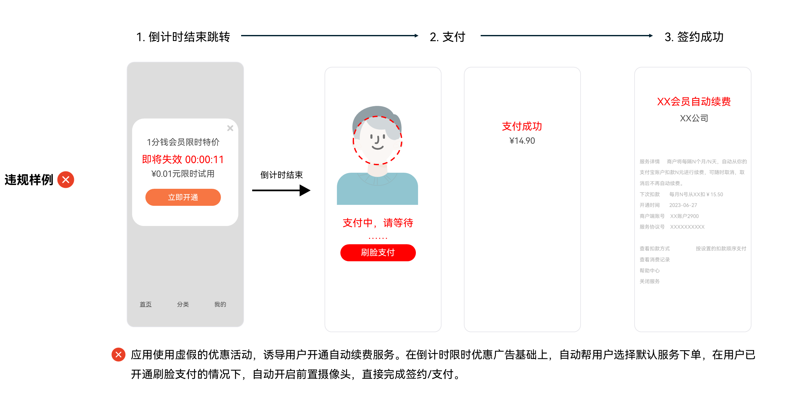

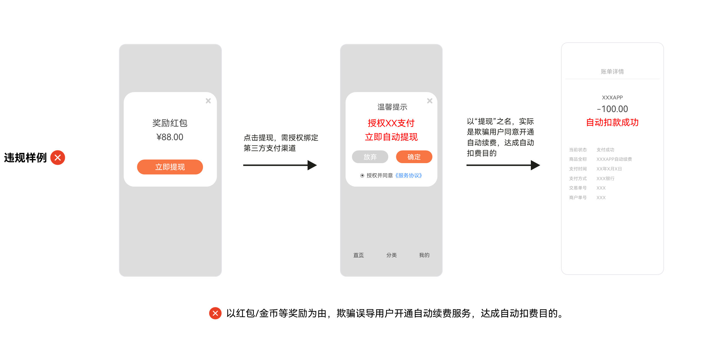

（2）服务事项有效期内，用户实际享受的服务应与明示的内容保持一致，若服务内容出现变动的，应提前告知用户并通过协商合理解决用户诉求；应用内应提供自动续费管理页面向用户展示其全部已购买且在有效期内的自动续费服务信息。

（3）服务续期前提醒需到位，告知方式需用户能明显感知、时机需在自动续费前5日，内容应包括所扣费用对应的服务、续费金额、续费时间及服务延长时间。

注：《自动续费服务协议》中需向用户明示自动续费前的告知方式（如短信）及告知时机（如自动续费前5日）。

（4）退订自动续费时的操作步骤应简单便捷，且不应设置不合理的条件。

合规要求1：退订自动续费时的操作步骤应简单便捷，且不应设置不合理的条件。例如需要提供超出在服务使用时提供的身份验证等；

合规要求2：自动续费新的服务周期未开始前，用户应可以随时申请退订，服务提供者不应以当前周期剩余时间不够等理由拒绝同意用户诉求；

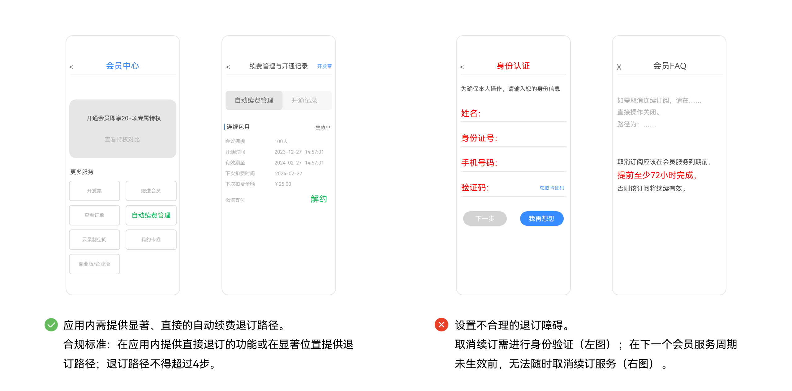

合规要求3：存在一账通账号体系且同一主体下不同产品存在单独自动续费服务的，不同产品的应用应向用户提供单独的退订方式；

合规要求4：同一产品在不同端（如APP/小程序）开通自动续费服务的，应提供便捷的退订方式，不应强制要求用户下载APP进行退订；

合规要求5：若用户注销时，账号存在自动续费服务的，应明确告知并引导用户取消自动续费服务。

6.3 应用如提供应用内付费，需清楚准确地明示用户应用内付费的条款和定价，提供清晰、准确、合理、完整的付费信息。不得存在虚假、诱导、欺诈信息。包括但不限于：

（1）应用内如提供开通会员服务，需显著、清晰明示产品功能权益及资费等内容， 未经明示，不得在提供产品服务过程中擅自添加限制性条件，并以此为由终止用户正常使用的产品功能和服务，或降低服务体验。比如说：自动续费服务开通前，需在商品购买或订阅支付界面醒目位置，明示自动续费服务协议，并征得用户主动同意。续费前应在显著位置向用户明示完整的关键信息，且自动续费服务收取的资费，应与向用户宣传、承诺的保持一致。

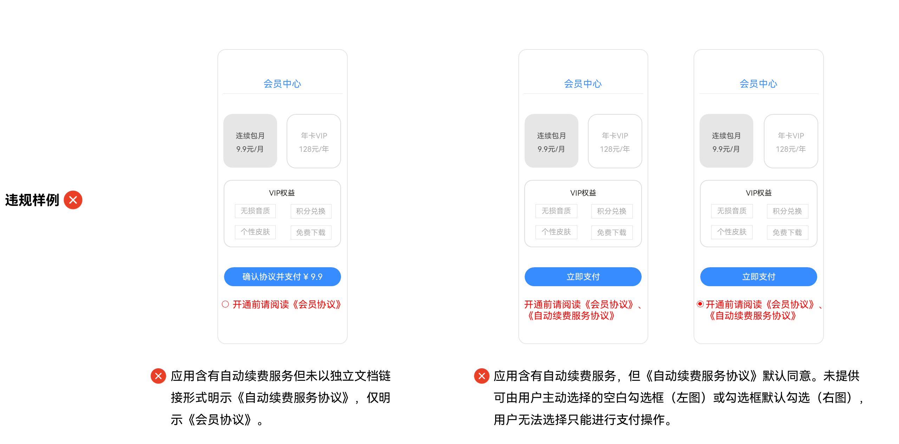

（2）应用如提供付费进行随机抽取物品的机制（如游戏内抽取道具、购买抽奖盲盒等），在用户购买前，需在醒目位置（如支付界面）明示抽取规则及获得每种类型物品的概率。

示例①：

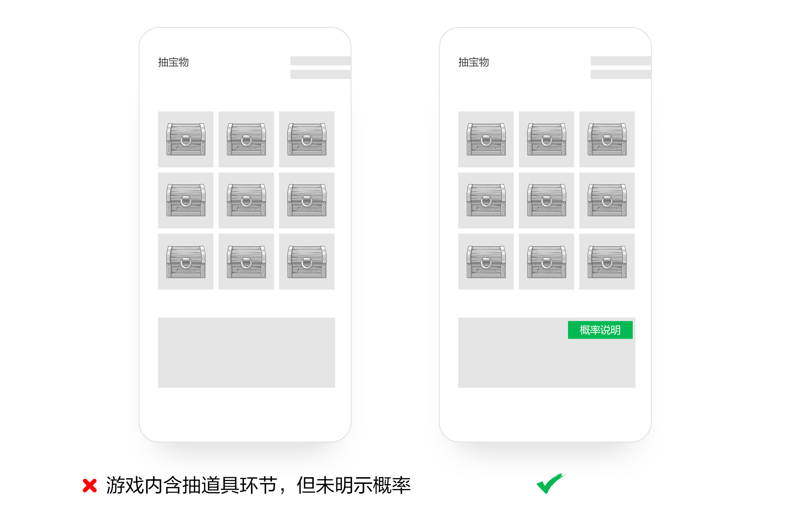

示例②：盲盒抽奖类应用需对用户明示商品抽奖概率/货物包邮条件/抽奖风险提示语/是否支持充值余额退款等规则。

（3）应用内的付费弹窗页面，需提供清晰、明确、有效的关闭按钮，并支持一键关闭，不得出现虚假按钮、无清晰关闭按钮、延时出现关闭或跳过按钮等情况。

示例①：

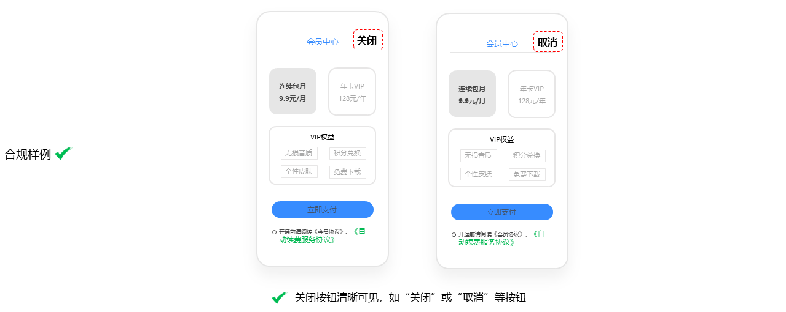

示例②：

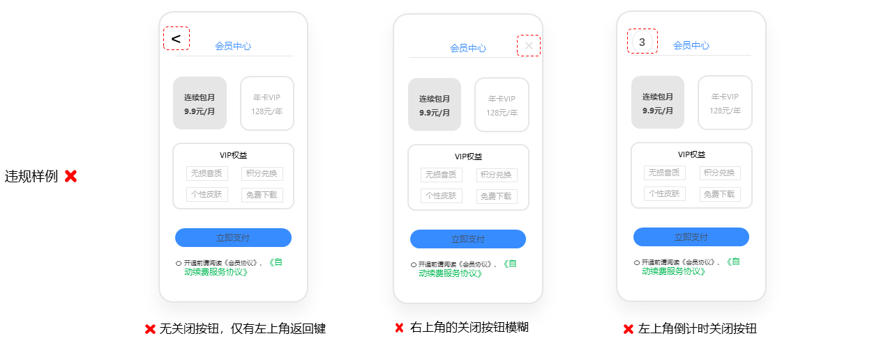

6.4 应用如提供应用内付费，推荐选择华为应用内支付（详细请参见：[华为联运服务](/docs/monetize/promotion/access-guide-0000001063305339)）。

6.5 应用内如提供数字商品，需在 [AppGallery Connect](https://developer.huawei.com/consumer/cn/service/josp/agc/index.html#/) 中选择正确的数字商品类型并添加数字商品的信息。（详情请参见：[创建数字商品](https://developer.huawei.com/consumer/cn/doc/app/create-digital-products-0000001958955105)）

6.6 游戏充值失败，充值过程中出现掉单情况需主动补单或引导用户补单。在用户完成消耗型商品的支付之后，若因网络错误、进程被中止等异常导致出现掉单情况，为避免影响用户体验，需自动补单，或在重启游戏时自动补单；若无法自动补单，则需在游戏内主动引导用户处理异常（如：使用弹窗提示等方式）。技术文档请参考：[（必要）消耗型商品的补单流程](https://developer.huawei.com/consumer/cn/doc/development/HMSCore-Guides/redelivering-consumables-0000001051356573)。

## 7. 用户隐私

您需小心谨慎处理用户个人信息，确保遵守适用的法律法规，履行个人信息保护义务，并遵循合法、正当、必要和诚信的处理原则，包括但不限于中国[《中华人民共和国个人信息保护法》](https://www.cac.gov.cn/2021-08/20/c_1631050028355286.htm)、《中华人民共和国网络安全法》、《中华人民共和国数据安全法》、[《App违法违规收集使用个人信息行为认定方法》](https://www.cac.gov.cn/2019-12/27/c_1578986455686625.htm)、[《关于开展纵深推进APP侵害用户权益专项整治行动的通知》](https://www.cac.gov.cn/2020-07/28/c_1597492913060262.htm)、[《信息安全技术 个人信息安全规范》](https://openstd.samr.gov.cn/bzgk/std/newGbInfo?hcno=4568F276E0F8346EB0FBA097AA0CE05E)、《APP用户权益保护评测规范》、[《工业和信息化部关于开展信息通信服务感知提升行动的通知》](https://www.miit.gov.cn/jgsj/xgj/fwjd/art/2021/art_e7b27425e0544a9db25963314aff682c.html)、[《工业和信息化部关于进一步提升移动互联网应用服务能力的通知》](https://www.miit.gov.cn/jgsj/xgj/wjfb/art/2023/art_7d51a56bcef04a1fad2b9a3d1e3115eb.html)、《互联网信息服务算法推荐管理规定》、[《常见类型移动互联网应用程序必要个人信息范围规定》](https://www.cac.gov.cn/2021-03/22/c_1617990997054277.htm)、《儿童个人信息网络保护规定》以及其他适用法律法规，中国香港《个人资料(私隐)条例》以及其他适用法律法规，欧盟《通用数据保护条例》以及其他适用法律法规，新加坡《个人数据保护法令》以及任何其他适用的法律法规等。

**AppGallery隐私标签服务说明**

为了帮助终端用户在下载应用前方便快捷的了解您的应用使用其个人数据的情况，您在AppGallery Connect上架应用时，需要填写应用及应用中集成的第三方组件所需收集的个人数据项和数据使用目的，以便用户在AppGallery客户端应用详情中查看。（请参考[《AppGallery隐私标签服务说明》](/docs/distribute/app-dist/app-market/privacy-label)相关要求）

**隐私政策**

7.1 开发者必须在AppGallery Connect应用分发平台及应用内部提供自身的可便捷查看的隐私政策链接。隐私政策内容需公开透明，且需和应用在运行中对用户个人信息的处理保持一致。开发者必须确保该链接始终能正常打开。

合规要求1：APP须提供开发者自身的隐私政策，隐私政策应包含真实完整有效的开发者或运营者信息。

常见问题：

（1）隐私政策内无开发者名称；

（2）隐私政策内的开发者名称与上传应用的开发者名称信息不一致；

（3）隐私政策内的应用名称与开发者提交的应用名称信息不一致；

（4）APP内展示的隐私政策内容与开发者在AppGallery Connect上提交的隐私政策网址内容不一致。

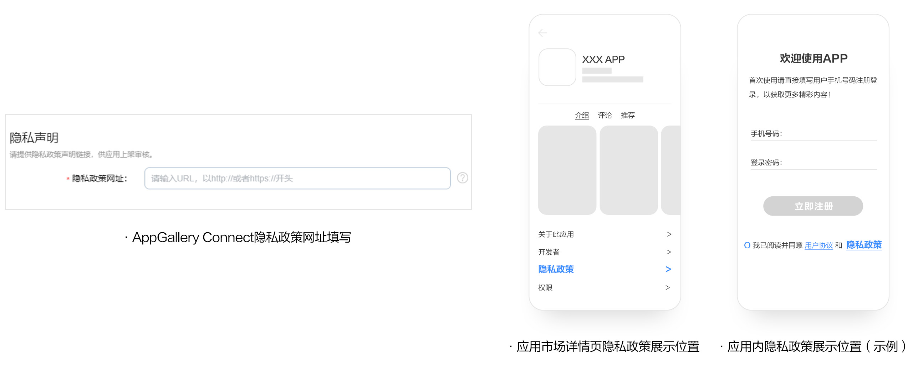

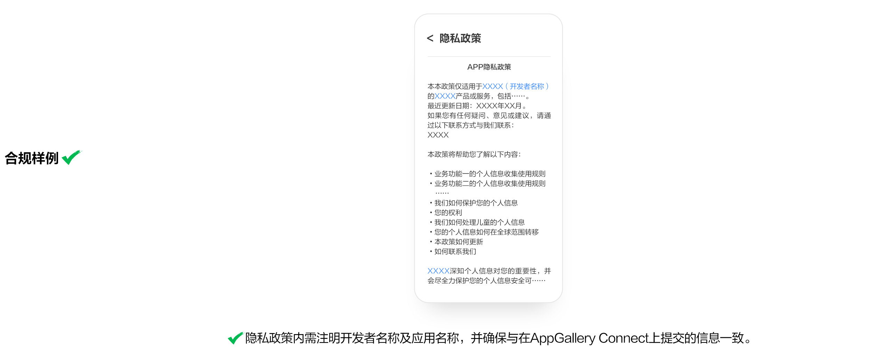

隐私政策模版可参考[《信息安全技术 个人信息安全规范》](http://openstd.samr.gov.cn/bzgk/gb/newGbInfo?hcno=4568F276E0F8346EB0FBA097AA0CE05E)“附录D（资料性附录）个人信息保护政策模板”及[《隐私政策链接提交及内容规范参考FAQ》](https://developer.huawei.com/consumer/cn/doc/distribution/app/50128#h1-1678351326517-1)“2. 隐私政策内容规范参考”。

合规要求2：隐私政策等收集使用规则不应难以阅读，如文字过小过密、列宽过大、行高过大、颜色过淡、模糊不清，文本冗长，晦涩难懂，展示不全，或未提供简体中文版等。

合规要求3：APP隐私政策中未以字体加粗、增大字号、醒目颜色等方式突出展示 APP 处理个人敏感信息的目的、方式和范围。

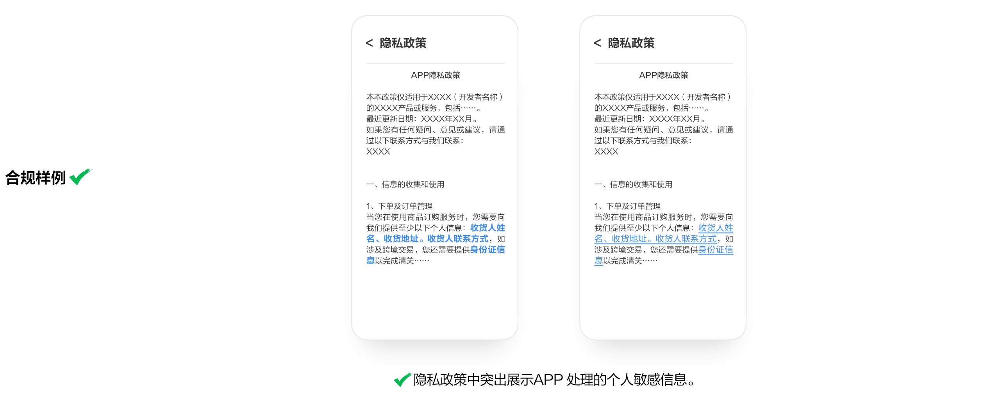

个人敏感信息可参考 [《数据安全技术 敏感个人信息处理安全要求》](https://openstd.samr.gov.cn/bzgk/gb/newGbInfo?hcno=F9F3A2EBF49E9B4D73AD8C8912986D5A)

7.2 应用的隐私政策链接指向的隐私政策应当包含应用程序（包括委托的第三方或嵌入的第三方代码、插件）收集和使用个人信息的目的、方式和范围。

合规要求：APP集成的第三方SDK（包括在静默状态下或在后台运行时）涉及“个人信息”处理，需要在隐私政策中逐一明示收集个人信息的目的、方式和范围。

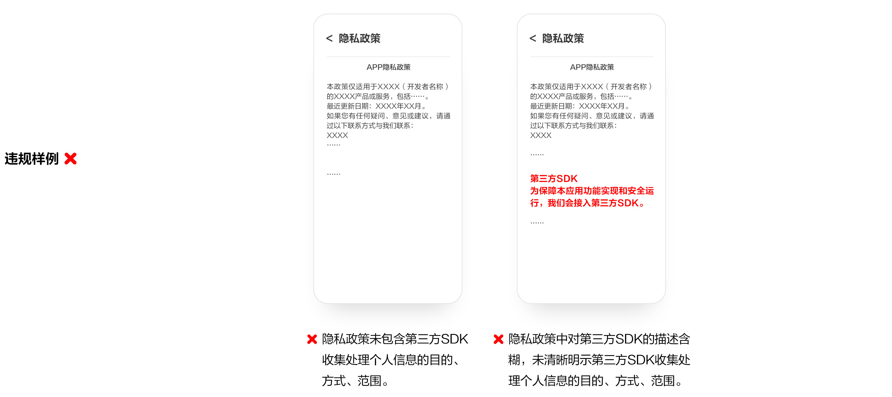

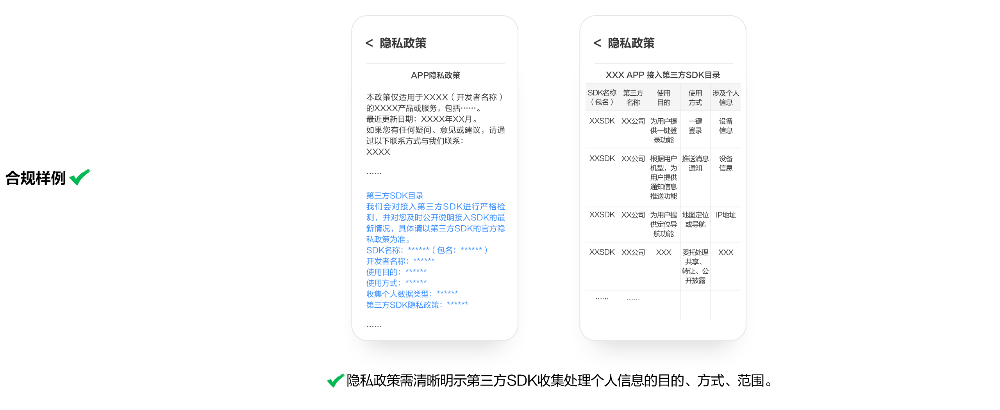

APP向用户明示集成的SDK信息需确保完整、准确，使用安全、合规，具体要求如下：

1、SDK信息需具备完整性：APP存在使用第三方SDK 均需在隐私政策中逐一明示。

2、SDK信息需具备准确性：APP隐私政策中明示的SDK 信息与“[全国SDK管理服务平台](https://sdk.caict.ac.cn/official/#/home)” 保持一致，**包括但不限于：SDK 名称、开发者名称、收集信息范围、使用目的、SDK 隐私政策链接**。

3、SDK使用需安全、合规：APP不应使用风险、违规SDK（早期版本存在风险/已不再运维），如自查发现风险、违规SDK，需进行更新、更换。

附：

1）[全国SDK管理服务平台](https://sdk.caict.ac.cn/official/#/home)

2）[SDK合规自检操作指导](https://developer.huawei.com/consumer/cn/forum/topic/0202176056468702846?fid=0102104600515103427)

7.3 应用内隐私政策应包含用户如何行使个人信息主体权利的信息，例如：用户如何撤销同意和/或请求删除数据的方式，用户对个人信息的查阅复制权，以及有效的用户隐私问题投诉、举报渠道，并在承诺时限内（承诺时限不得超过15个工作日，无承诺时限的，以15个工作日为限）受理并处理；应用如涉及账号体系，应为用户提供便捷的注销账号服务，不得设置不合理障碍，且需确保账号注销真实有效，账号注销服务处理时限不得超过15个工作日。（详细请参考：[账号注销常见问题](/docs/distribute/app-dist/app-market/x50000/FAQ-faq/FAQ-faq-11)）

7.4 应用访问、收集、使用或披露任何个人信息，需经用户的同意或遵守其他适用的法律法规。

合规要求：APP未经用户同意，不应将个人信息发送给第三方SDK等产品或服务。APP未向用户告知且未经用户同意，不应将设备识别信息、商品浏览记录、搜索使用习惯、软件安装列表等个人信息传输至APP服务器后，向第三方产品或服务提供其收集的个人信息。

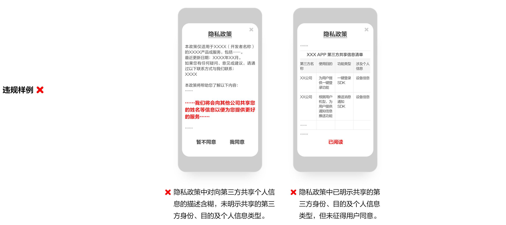

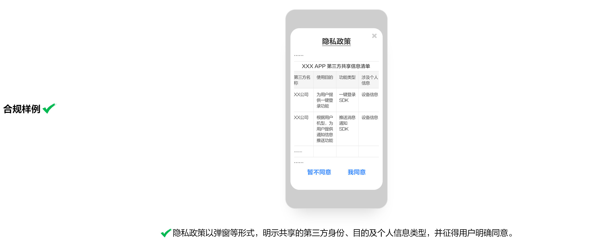

**用户同意**

7.5 应用必须以清楚明确的方式呈现隐私政策，收集和处理个人信息前须获取用户同意，该同意应当由用户在充分知情的前提下自愿、明确作出。

合规要求1：APP未以“隐私政策弹窗”等形式向用户明示个人信息处理的目的、方式和范围，不应收集个人信息。

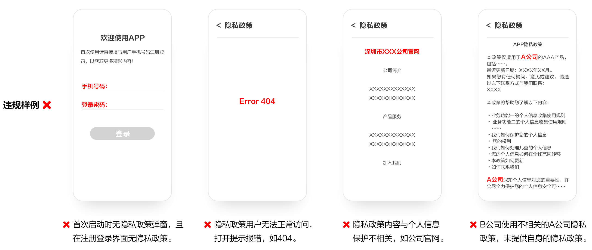

合规要求2：APP以个人信息处理规则（隐私政策）弹窗等形式向用户明示（包含第三方SDK）处理个人信息的目的、方式和范围，未经用户同意，APP（包含第三方SDK）不应收集个人信息，法律法规另有规定的除外。

**合规三要素**

1、个人信息处理规则（隐私政策）弹框有获取用户同意的选项；

2、个人信息处理规则（隐私政策）中需声明应用（包含第三方SDK）获取用户个人信息/权限，及处理个人信息/权限的目的、方式和范围；

3、用户未同意个人信息处理规则（隐私政策）前，应用及第三方SDK不应存在获取用户个人信息/权限的行为。

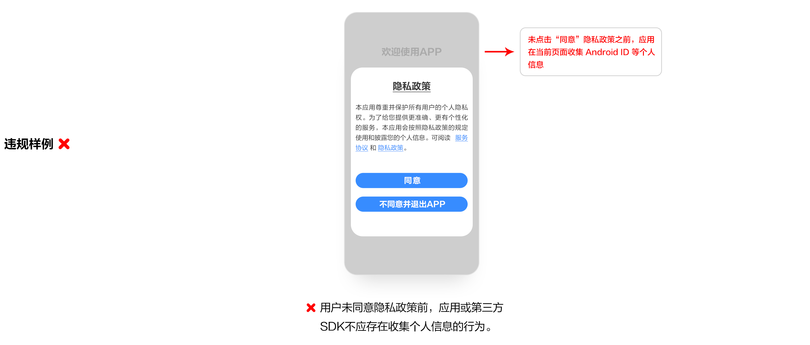

合规要求3：APP在征求用户同意环节，应提供明确的同意和拒绝选项，不应仅使用“好的”、“好”、“我知道了”、“我了解”、“我知晓”、“我已阅读”、“立即使用”、“下一步”等无法清晰表达用户同意的词语。

合规要求4：APP在征求用户同意环节，不应设置为默认同意。

常见的问题有：（1）隐私弹窗无拒绝选项；（2）无勾选框“登录即代表同意”；（3）默认勾选同意隐私政策等。

7.6 应用必须为用户提供简单易懂且易于操作的方式来撤销同意。

7.7 应用若使用个人信息用于个性化广告和精准营销，需在隐私政策中告知，并在应用内提供独立的关闭或拒绝选项。

常见问题：应用存在定向推送功能，但（1）未在隐私政策中明示定向推送；（2）未在应用内显著标识定向推送；（3）未在应用内提供真实有效的定向推送关闭选项。

（1）未在隐私政策中明示定向推送

若APP的业务功能存在定向推送功能，应以个人信息处理规则（隐私政策）弹窗等形式向用户明示，将收集的用户个人信息用于定向推送、精准营销，并清晰明示所使用定向推送功能的具体场景，以及退出或关闭相应功能的路径。

若APP定向推送功能使用了第三方的个人信息来源，还需向用户明示第三方的个人信息来源。

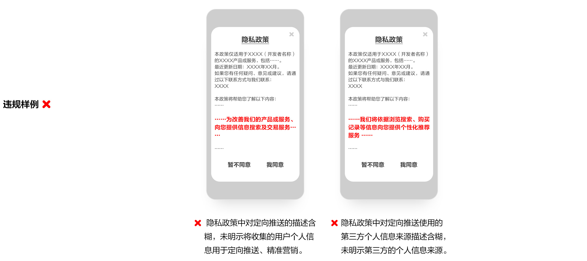

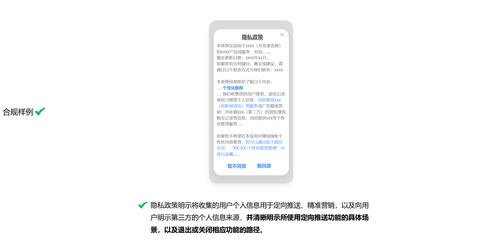

（2）未在应用内显著标识定向推送

APP以个人信息处理规则（隐私政策）弹窗等形式明示存在定向推送功能，页面中应显著区分定向推送服务，显著方式包括但不限于：标明“个性化推荐”、“定推”、“猜你喜欢”等其他能显著区分的字样，或通过不同的栏目、版块、页面分别展示等。

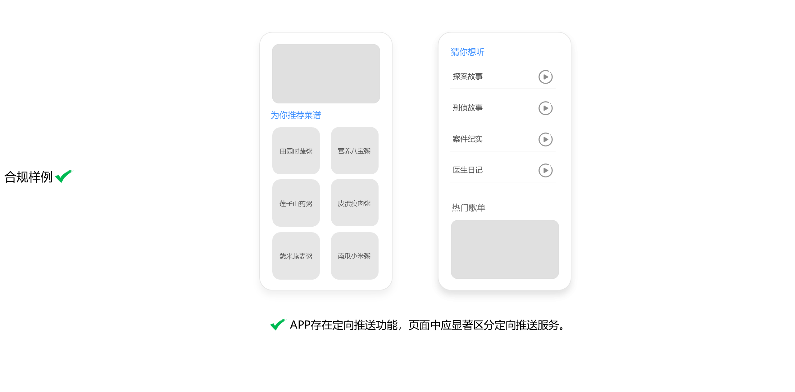

（3）未在应用内提供真实有效的定向推送关闭选项。

APP以个人信息处理规则（隐私政策）弹窗等形式明示存在定向推送功能，应提供退出或关闭个性化展示模式的选项，如拒绝接受定向推送信息，或停止、退出、关闭相应功能的机制。

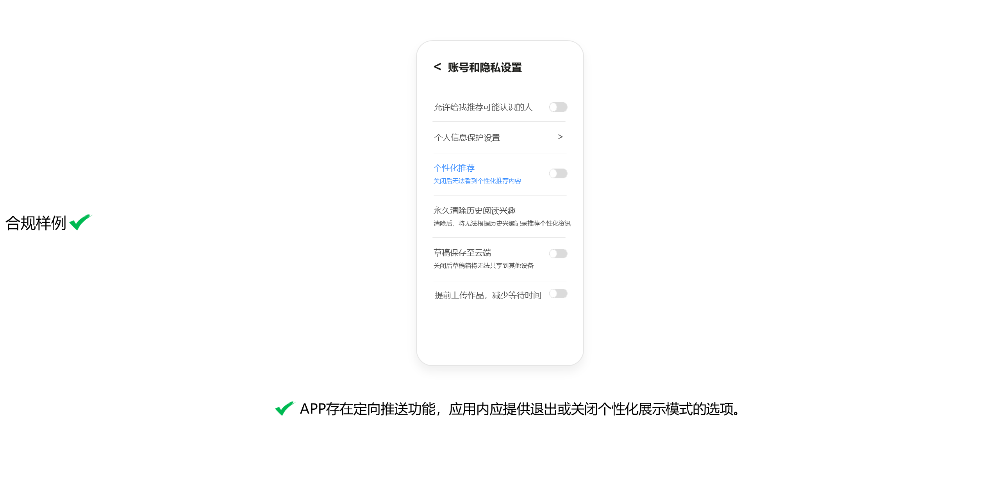

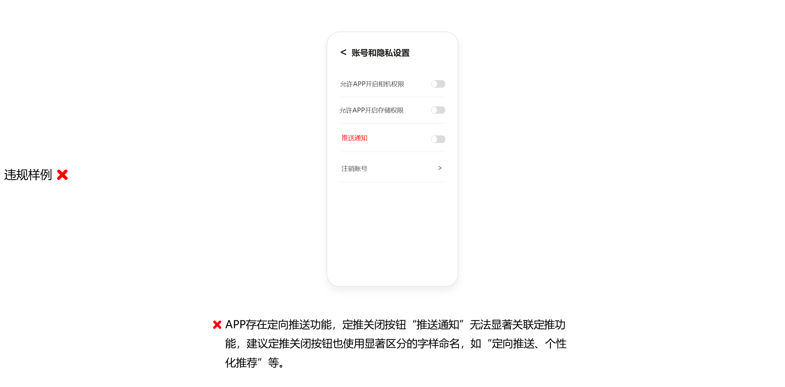

关闭按钮需真实有效：用户拒绝接受定向推送信息，或停止、退出、关闭相应功能的机制后，应用不再将收集的用户个人信息用于定向推送、精准营销。

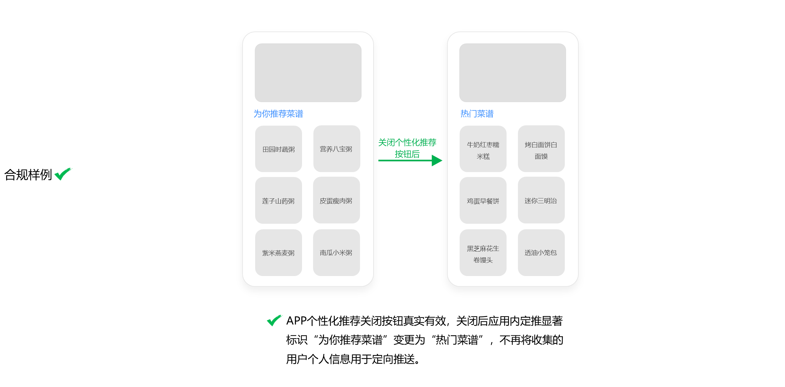

7.8 处理敏感个人信息应当获取用户的单独同意，并告知处理敏感个人信息的必要性以及对用户权益的影响。

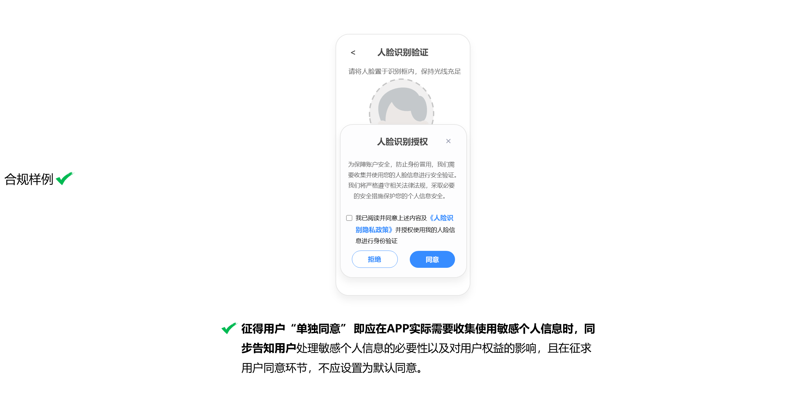

7.9 在非服务所必需或无合理场景下，应用不得自启动和关联启动其它应用，或进行唤醒、调用、更新等行为。关联启动前，应显著告知用户即将跳转的其它应用或由用户主动发起。

合规要求：

1、APP未向用户明示未经用户同意，且无合理的使用场景，不应自启动或关联启动其它APP；

2、APP向用户明示但未经用户同意，不应自启动或关联启动其它APP；

3、APP非服务所必需或无合理应用场景，不应自启动或关联启动其它APP；

4、SDK 非服务所必需或无合理应用场景，启动或关联启动APP；

5、APP和SDK关联启动非用户主动发起，或未显著告知用户即将跳转的其它APP。

**收集和使用**

7.10 应用收集和使用个人信息须遵守数据最小化原则，采取对用户权益影响最小的方式，限于实现处理目的的最小范围。个人信息的保存期限应当为实现处理目的所必要的最短时间（除法律、行政法规另有规定外）。

7.11 应用不得暗中收集和使用个人信息，不得超出服务所必需或无合理应用场景收集和使用个人信息。

合规要求1：APP（包括在静默状态下或在后台运行时）涉及“个人信息”处理，需要以个人信息处理规则（隐私政策）弹窗等形式清晰明示处理个人信息的目的、方式和范围

隐私政策需包含：（1）收集的个人信息类型，目的、方式、范围；（2）是否存在静默/后台状态收集个人信息行为。

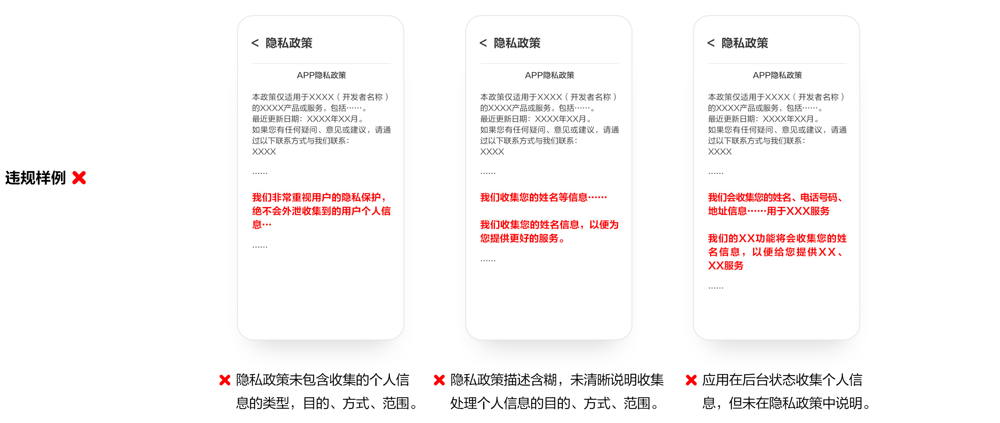

合规要求2：APP或APP集成的第三方SDK（包括在静默状态下或在后台运行时）收集个人信息的范围不要超出隐私政策中描述的范围；收集的频率不应超出其实现产品或服务的业务功能所必需的最低频率。

7.12 应用须使用加密技术（例如通过 HTTPS）等安全的方式处理用户的所有个人信息。

7.13 应用披露任何个人信息须在隐私政策中说明披露内容、目的和披露对象。

7.14 禁止应用出售用户的个人信息。

7.15 应用披露个人信息的任何第三方应提供与您的应用程序隐私政策所述及这些准则所要求相同或等同的个人信息保护措施。

7.16 应用不得将“通话记录”、“短信”、“生物特征”、“健康数据”、“行踪轨迹”等敏感个人信息用于服务改进、投放广告或营销等非业务核心功能。

7.17 应用申请和使用权限须遵守权限最小化原则，应在对应业务功能启动时，动态申请所需权限，不得要求用户一揽子同意多个非本业务功能的必要权限。不得以用户拒绝权限或者撤回同意为由，拒绝提供产品或者服务。(若您的鸿蒙版本应用涉及获取受限权限，请参考：[受限开放权限](/docs/dev/app-dev/system/system-security/access-control/app-permission-mgmt/app-permissions/restricted-permissions)）。

合规要求1：APP运行时，向用户索取电话、通讯录、定位、短信、录音、相机、存储、日历等权限，用户拒绝授权后，APP不应退出或关闭。

合规要求2：APP运行时，向用户索取权限，用户拒绝授权后，APP不应循环弹窗申请权限，使用户无法继续使用。

合规要求3：用户注册登录时，APP向用户索取权限，用户拒绝授权后，APP不应无法正常注册或登录。

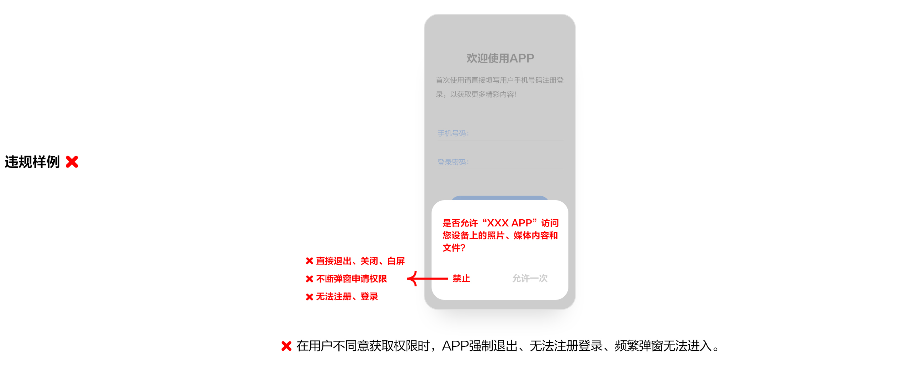

合规要求4：APP首次打开或运行中，未见使用权限对应的相关功能或服务时，不应提前向用户弹窗申请开启权限。

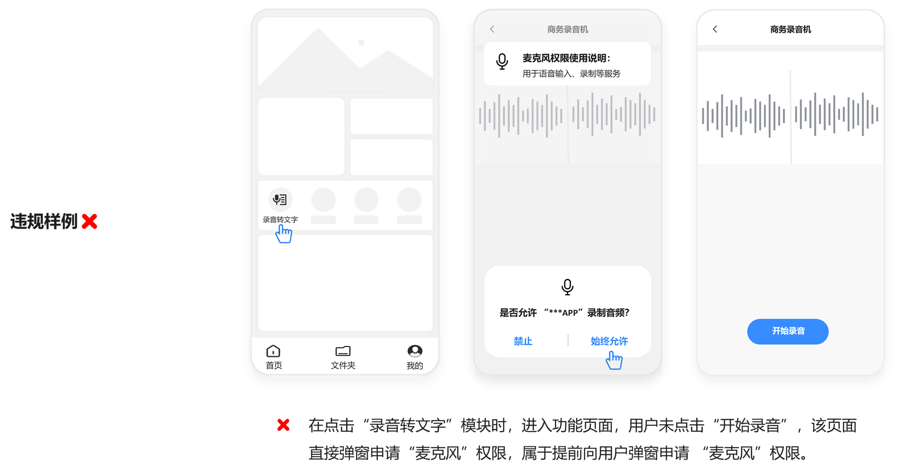

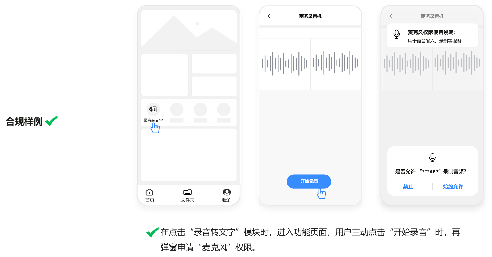

合规要求5：APP未见提供相关业务功能或服务，不应申请通讯录、定位、短信、录音、相机、日历等权限。

7.18 应用申请的权限，都必须有明确、合理的使用场景和功能说明，禁止诱导或误导用户授权，应用使用的权限必须与申请所述的一致。在申请敏感权限时，需同步告知用户申请该权限的目的。未经用户同意，不得更改用户权限授权状态。

敏感权限：电话、通讯录、定位、短信、麦克风（录音）、相机、存储、日历、身体传感器、通话记录、健康运动等；

同步告知：**需在应用内，权限弹窗申请的同时**，告知权限申请的使用目的。

**如下示例图适用于HarmonyOS 5.0以下的系统版本**

**如下示例图适用于HarmonyOS 5.0及以上的系统版本**

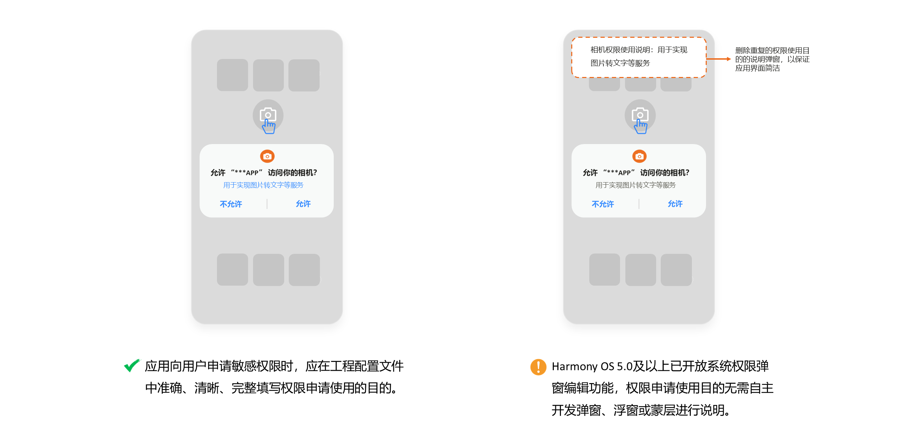

HarmonyOS 5.0及以上已开放系统权限弹窗编辑功能，请参考[reason字段的内容写作规范](/docs/dev/app-dev/system/system-security/access-control/app-permission-mgmt/request-app-permissions/declare-permissions#reason字段的内容写作规范及建议)及建议填写。

7.19 应用不应频繁申请权限，用户拒绝权限申请后，除非功能场景所必须，不应再次申请开启权限，影响用户正常使用。APP重新运行时，也不应向用户频繁弹窗申请开启与当前服务场景无关的权限。注 ：用户拒绝权限申请后，在非用户主动触发权限所涉及的业务场景的情况下，再次弹出权限弹窗即为频繁。

7.20 应用处理个人信息应具有明确合理的目的，不得仅以服务体验、产品研发、算法推荐、风险控制等为由，强制要求用户同意超范围或者与服务场景无关的个人信息处理行为。用户拒绝提供非当前服务所必需的个人信息时，不得影响用户使用该服务的基本功能。

**广告标识符**

我们禁止出于广告目的而强制用户必须点击广告或提交个人信息才能完整使用应用的行为。

7.21 应用内使用的广告标识符只能用于广告和用户分析。

7.22 在未获得用户明确许可的情况下，广告标识符(OAID)不得与个人身份信息或任何永久性设备标识符（例如：SN、MAC 地址、IMEI 等）相关联。

7.23 应用每次使用广告标识符时，都必须验证设备操作系统“限制广告跟踪“或类似设置的状态，如果用户已启用此设置，您不得基于广告标识符收集和使用数据。

7.24 广告标识符重置后，在未获得用户明确许可的情况下，新的广告标识符不得与先前的广告标识符或由其衍生的数据相关联。

7.25 应用若因业务所需而与任何第三方共享广告标识符，对方也必须遵守广告标识符相关条款。

**个人信息保护“双清单”**

根据《工业和信息化部关于开展信息通信服务感知提升行动的通知》（工信部信管函〔2021〕292号）要求，各相关企业应建立已收集个人信息清单和与第三方共享个人信息清单，并在APP二级菜单中展示，方便用户查询。

已收集个人信息清单：应简洁、清晰列出APP（包括内嵌第三方软件工具开发包SDK）已经收集到的用户个人信息基本情况，包括信息种类、使用目的、使用场景等。 第三方共享个人信息清单：应简洁、清晰列出APP与第三方共享的用户个人信息基本情况，包括与第三方共享的个人信息种类、使用目的、使用场景和共享方式等。

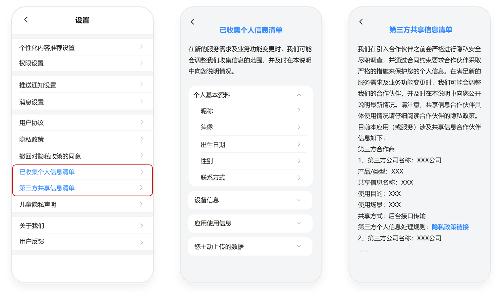

## 8. 未成年人保护

如果您的应用目标受众群体包括未成年人或是专为未成年人设计的，请确保应用所呈现的内容均适合未成年人，不得危害未成年人身心健康，并需遵守《中华人民共和国未成年人保护法》及其他适用法律法规和行业标准。当您的应用向未成年人收集任何个人信息和敏感数据时，您必须遵守适用的未成年人隐私保护法规，如欧盟《通用数据保护条例》（GDPR）、中国《个人信息保护法》、《App违法违规收集使用个人信息行为认定方法》 、《儿童个人信息网络保护规定》以及其他适用法律法规。如您的应用含有危害未成年人身心健康、侵害未成年人个人信息安全或对未成年人实施违法犯罪行为等内容，华为公司有权对您的应用进行下架、删除、断开相关应用服务、终止您与华为的协议和/或冻结、删除您的开发者账号，保存有关记录，并向有关部门报告。

8.1 非儿童类的应用信息中不得包含“适合幼儿”和“适合儿童”等暗示应用受众为儿童的词语。

示例：

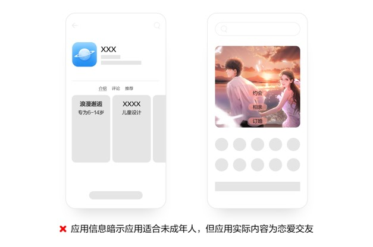

8.2 应用不得含有或传播危害未成年人身心健康的内容，或利用其网络服务对未成年人实施违法犯罪行为。应用如含有可能引发或者诱导未成年人模仿不安全行为、实施违反社会公德行为、产生不良情绪、养成不良嗜好等影响未成年人身心健康的信息，应当在信息展示前予以显著提示。

8.3 应用不得向未成年人提供诱导其沉迷的产品和服务，并需及时修改可能造成未成年人沉迷的内容、功能或者规则。网络游戏、网络直播、网络音视频、网络社交等网络服务提供者应当针对未成年人使用其服务设置相应的时间管理、权限管理、消费管理等功能。

游戏需注意，根据国家新闻出版署《关于开展网络游戏防沉迷实名认证系统接口对接工作的通知》，规定各游戏出版运营企业均须完成国家新闻出版署实名认证系统的接入。请您根据接入文档正确接入防沉迷。相关文档请参考：[游戏服务-防沉迷](https://developer.huawei.com/consumer/cn/doc/development/HMSCore-Guides/game-anti-indulgence-0000001050123479)、[防沉迷专题](https://developer.huawei.com/consumer/cn/doc/HMSCore-Guides/faq-anti-indulgence-0000001050164364)。

请先完成版署网络游戏防沉迷实名认证系统与华为平台的绑定，并在AGC提交BizID且审核通过，具体提交路径为：AGC后台-运营-版署实名认证申请。您可参考指导文档：[版署实名认证申请](/docs/distribute/app-dist/game-center/game-center-access-0000001239622337/game-center-identification-applyfor-0000001193982458)。

示例：

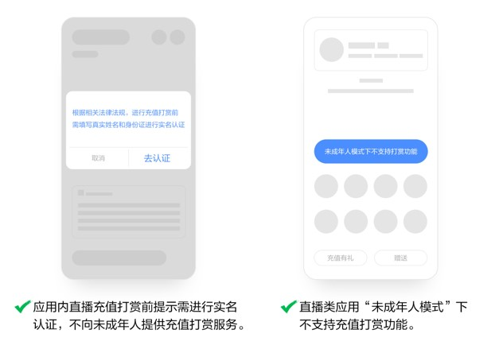

8.4 面向未成年人的应用内容需适合未成年人，不得含有会对未成年人造成干扰的内容，以及不利于未成年人身心健康和树立正向价值观的不良内容。

8.5 应用不得包含“一对一”“住家教师”“高端家政”“众筹私教”等违规校外培训信息，包括但不限于通过即时通讯、网络会议、直播平台等方式有偿开展校外培训。面向未成年人的应用不得提供超标超前培训的相关内容，不得提供境外教育课程，非学科类培训机构不得从事学科类培训。

8.6 面向未成年人的在线教育类应用不得含有网络游戏链接，以及推送广告等与教学无关的信息。

8.7 应用不得提供和传播“拍照搜题”等惰化中小学生思维能力、影响中小学生独立思考、违背教育教学规律的不良学习方法。

8.8 应用不得诱导中小学生家长使用分期贷款缴纳校外培训费用。

8.9 应用不得包含对未成年人实施侮辱、诽谤、威胁或者恶意损害形象等网络欺凌内容，亦不得以鼓动、诱导或帮助等方式，间接实施或参与网络欺凌行为。

8.10 应用内不得包含与未成年人相关的色情内容，包括但不限于恋童癖、针对未成年人的不当互动、儿童性虐待等。

8.11 面向未成年人的应用不得包含不适合未成年人的暴力、血腥或惊悚内容，以及描绘或鼓励有害、危险的活动。

8.12 应用不得向未成年人宣传或鼓动未成年人使用/贩卖酒精饮料、烟草制品、电子烟产品或管制药品。不得向未成年人宣传负面身体形象或自我形象，如描绘整形手术、减肥以及对个人外表进行的其他美容调整。

8.13 社交应用如涉及与陌生人聊天、秀场直播、提供约会交友服务、两性或婚姻建议等内容，不得以未成年人为目标用户。在部分国家或地区，未成年人使用社交应用受到明确的限制，如您的应用发布在这些受限国家或地区（例如澳大利亚、印度尼西亚），您应当按照当地法律法规要求采取合理的措施限制未成年人对应用的使用。

8.14 开发者应当建立便捷、合理、有效的投诉和举报渠道，公开投诉、举报方式等信息，及时受理并处理涉及未成年人的投诉、举报。

8.15 儿童类应用不得含有应用外链接、付费项目或其他会对儿童造成干扰的内容，除非其保留在受家长监控的指定区域中，防止儿童在父母或监护人不知情的情况下进行商业交易，或者从应用中链接至外部网站、社交网络或其他应用。

8.16 应用内面向未成年人投放广告的行为应符合相关法规和行业标准的要求，不得发布医疗、药品、保健食品、医疗器械、化妆品、酒类、美容、婚恋、孕育广告以及不利于未成年人身心健康的网络游戏广告。面向儿童的应用广告不得含有劝诱儿童要求家长购买广告商品或者服务，以及可能引发儿童模仿不安全行为的内容，不得发布医疗、药品、保健食品、医疗器械、化妆品、酒类、美容、婚恋、孕育广告以及不利于未成年人身心健康的网络游戏广告。面向儿童的应用广告不得含有劝诱儿童要求家长购买广告商品或者服务，以及可能引发儿童模仿不安全行为的内容。

8.17 收集和使用儿童个人信息的应用应制定专门的儿童隐私政策。

8.18 应用在收集和使用儿童的个人信息前，需获得父母或监护人的合法授权。

## 9. 知识产权

请确保您的应用及其内容具备完整权利或充分授权，不得侵犯他人知识产权（包括商标、版权、专利、商业秘密和其他专有权利）或其他合法权益。

9.1 开发者在应用内使用他人拥有版权的内容时，应事先获得授权，不得在无授权的情况下使用。

9.2 未经授权，应用不得是针对他人版权保护内容所开发的破解版、汉化版。

9.3 在不构成法定正当使用的情况下，开发者未经授权不得使用他人相同或近似商标，否则将有可能构成商标侵权或不正当竞争。

9.4 未经授权，开发者不得使用华为公司的商业名称、商标和其他标识。开发者不得虚假或引人误解地宣传与华为公司的关系，如暗示华为公司是应用的提供商或合作商，或者以任何形式表示华为公司认可或担保其质量或功能。

9.5 开发者不得实施混淆行为，误导用户认为应用及其内容来源于他人或与他人存在特定联系（如在任何语言下均不得使用与其他开发者应用相同/相似的外观、名称、主题等）。

9.6 应用不得销售或推广仿冒商品。

9.7 应用及其内容不得侵犯他人合法权益（包括但不限于肖像权、名誉权），亦不得以鼓动、诱导或帮助等方式，间接实施或参与侵权行为。

如您发现在华为应用市场运营的应用或内容侵犯了您的合法权益，可按流程对存疑内容进行投诉，详情请参见：[华为应用市场侵权投诉处理指引](https://developer.huawei.com/consumer/cn/doc/distribution/app/50120)。

## 10. 应用资质

10.1 开发者需提供资质文件，以证明应用及其内容符合法律、法规或政策的要求。

10.2 开发者提供的资质文件应确保完整、真实且有效，不得进行伪造、变造资质等行为。依据应用及其内容涉及的业务类型，应提供的资质文件有所不同，详情请参见：[应用资质审核要求](https://developer.huawei.com/consumer/cn/doc/distribution/app/80301)、[资质文件法规依据及示例](https://developer.huawei.com/consumer/cn/doc/distribution/app/50111)。

## 11. 开发者行为

开发者在应用发布和运营过程中扮演着最重要的角色。若您存在违规行为，华为公司有权对您的应用进行下架、删除、断开相关应用服务、终止您与华为的协议和/或冻结、删除您的开发者账号，开发者需承担由此产生的所有法律责任及华为由此遭受的全部损失，包括但不限于华为向权利人或用户赔偿而产生的损失、因此支出的合理费用开支等。若应用涉及侵害未成年人、诈骗等违法内容，除采取前述措施外，我们将向有关部门举报。

11.1 开发者需保证提供给华为公司的所有信息的真实性、准确性、完整性，包括但不限于公司名称、法人姓名、公司联系电话、电子邮箱等。开发者信息如有变更，需及时更新。

11.2 开发者需确保应用中包含真实有效的联系信息，以便用户在有疑问或需要支持时可以轻松与您取得联系，包括但不限于在线客服、电话号码、邮箱等。同时请您及时响应并处理用户的问题与反馈。

11.3 非政府官方机构不得提交涉及政府事务的应用，包括但不限于举报涉嫌犯罪活动、发布公共卫生事件的应用，除非发布方获得政府官方机构的全面授权。

11.4 提供涉及银行和金融服务、医疗保健服务等受到行业严格管控或需要敏感用户信息的应用，应由提供相应服务的法律实体提交，不能由个人开发者提交。

11.5 开发者需确保应用在华为应用市场是最新版本，确保应用可正常运行。

11.6 开发者已停止运营或体验下降的应用可能会被下架，且开发者需及时将已停止运营的应用信息告知用户及儿童用户的监护人，并按照应适用的法律要求停止收集个人信息的活动和处理持有的个人信息。

11.7 开发者不得通过操纵安装、评论、提供奖励、伪造反馈等手段来提高应用的排名。

示例：

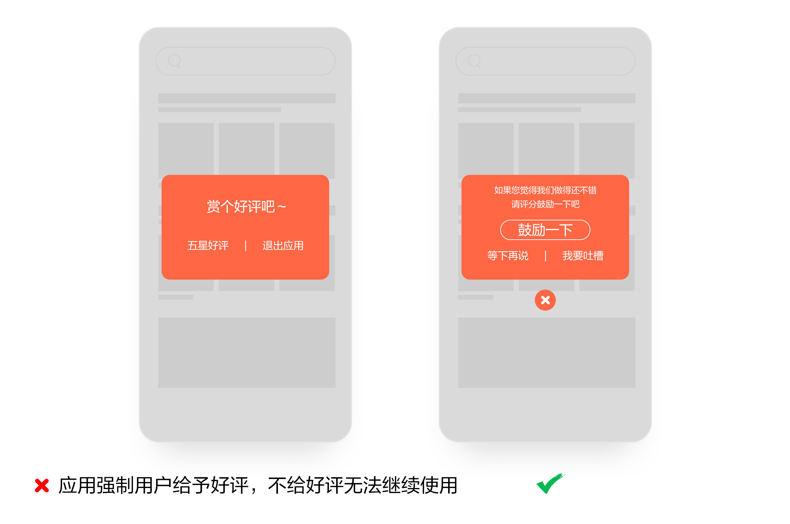

11.8 开发者在回复应用市场的用户评论时，应遵守适用的法律法规并保持尊重，且应重点关注并回复用户提出的与应用功能、体验相关的问题。不得提交或鼓动用户提交含有不当内容的评论，也不得在回复中含有个人信息、垃圾信息、广告、邀请码、激活码等营销信息。

## 12. 部分类型应用注意事项

如您的应用为以下类型，在满足审核指南的要求外，您还需要重点关注以下注意事项。

**1. 应用含直播、婚恋、娱乐陪玩、聊天**

注意事项：

1. 应用含直播、婚恋、娱乐陪玩、聊天

注意事项：

（1）该类应用信息中不得含有寂寞、勾搭等低俗用词。

（2）该类应用不得通过私信、聊天、语音、视频等功能骚扰用户，给用户发送骚扰信息，诱导用户付费，或存在涉黄行为。

（3）该类应用在应用内开设使用游戏积分押输赢、竞猜等游戏的，不得提供游戏积分交易、兑换或以“虚拟货币”等方式变相兑换现金、财物的服务，不得提供用户间赠予、转让等游戏积分转账服务，不得为网络赌博活动提供便利条件。

（4）该类应用需在相应模块需提供举报功能。

（5）该类应用在开通直播间、语音聊天室及主播/陪玩大神入驻时，需对直播用户进行基于移动电话号码等方式的真实身份信息认证，对直播发布者进行基于身份证件、营业执照、组织机构代码证等的认证登记。

（6）该类应用如涉及为用户提供信息发布、即时通讯等服务的，需对用户进行基于移动电话号码等方式的真实身份信息认证。

（7）该类应用年龄分级需为18+。

（8）该类应用资质要求请参见[资质审核要求](https://developer.huawei.com/consumer/cn/doc/distribution/app/80301)。

（9）其他要求请参见[审核指南](https://developer.huawei.com/consumer/cn/doc/app/50104-overview)。

**2. 应用含保健服务**

（如：按摩、SPA、足浴等）

注意事项：

（1）该类应用资质要求请参见[资质审核要求](/docs/distribute/app-dist/app-market/x50000/x80301)。

（2）该类应用信息和应用内容不得出现低俗、性暗示、色情擦边球、诱导进行线下性交易等内容，包括但不限于文字、图片、音视频等形式。

（3）该类应用内需对技师或入驻门店进行实名/资质管理。

资质示例：店铺的《营业执照》、《卫生许可证》，个人的《康复理疗师》、《高级按摩师》、《经络调理师》、《中医执业医师》等可验证身份信息的资料。

（4）该类应用不得含有直接与技师聊天的功能模块，如：在线聊天、评论（评论技师）、拨打电话（联系技师）、技师联系方式展示等，应用内仅允许商家与用户进行沟通。

（5）该类应用内需提供申诉、退款功能。

（6）该类应用年龄分级需为18+。

（7）暂不收录个人开发者以个人名义提交的含上门保健服务的应用（如按摩、SPA、足浴等）。

（8）暂不收录支持技师以个人身份入驻线上平台的应用。

（9）其他要求请参见[审核指南](https://developer.huawei.com/consumer/cn/doc/app/50104-overview)。

**3. 应用含游戏账号买卖/租赁服务**

注意事项：

（1）该类应用内必须含有实名认证，买卖双方均必须通过身份证实名认证后才可进行交易。

（2）该类应用需在商品页面中增加限制未成年人使用的提示，并对未成年人买卖或租用账号进行限制。

（3）该类应用年龄分级需为18+。

（4）其他要求请参见[审核指南](https://developer.huawei.com/consumer/cn/doc/app/50104-overview)。

**4. 应用含剧本杀内容**

（如：在线剧本杀游戏、剧本在线阅读、剧本下载、剧本杀社交平台如资讯/讨论/线下组局/剧本杀商户管理等）

注意事项：

（1）该类应用具备移动网络游戏基本特征的（如：在线剧本杀游戏等），按照游戏管理要求，需提供版号、接入防沉迷实名验证系统，并在醒目位置进行适龄提示。

（2）该类应用年龄分级需为18+。

（3）暂不收录含恐怖剧本杀内容的应用。

（4）其他要求请参见[审核指南](https://developer.huawei.com/consumer/cn/doc/app/50104-overview)。

**5. 应用含盲盒商品交易**

注意事项：

（1）该类应用需在应用首页、商品信息页及付款页面等显著位置清楚描述是否支持充值余额退款、货物包邮条件、商品抽取概率及抽奖风险提示语“商品抽奖存在概率性，付费请谨慎”。

（2）该类应用禁止提供商品回收功能。

（3）该类应用内单个商品价格不超过200元。

（4）该类应用年龄分级需为12+。

（5）暂不收录含交友盲盒、活体动物盲盒、现金盲盒、金融经营活动类盲盒（金融经营活动一般指小额贷、融资租赁、互联网保险等）等盲盒商品的应用。

（6）其他要求请参见[审核指南](https://developer.huawei.com/consumer/cn/doc/app/50104-overview)。

**6. 应用含手机定位功能**

注意事项：

（1）该类应用需在应用首页、添加好友页面或付款页面醒目位置提示用户需双方安装或付费才可实现定位。

（2）该类应用定位他人位置前，需明确获得对方同意，如发送验证申请获取同意、输入验证码。

（3）该类应用如主功能需先付费才能激活使用，则必须在用户付费前提供实际可用的免费体验功能，且免费体验功能需在二级页面内，不得为虚拟功能或隐藏过深。

（4）该类应用注册方式不得为“任意数字/任意账号名/任意手机号+密码”。

（5）其他要求请参见[审核指南](https://developer.huawei.com/consumer/cn/doc/app/50104-overview)。

**7. 应用含数据恢复功能**

（如：应用内含手机图片视频数据恢复、聊天记录恢复等功能）

注意事项：

（1）该类应用需确保实际功能与宣传承诺相符，不得为虚假功能。

（2）该类应用需在应用描述、付款界面等位置清楚明示能恢复的数据范围和恢复场景。

（3）该类应用内需提供申诉、退款功能。

（4）其他要求请参见[审核指南](https://developer.huawei.com/consumer/cn/doc/app/50104-overview)。

**8. 应用含需与指定软件、设备或功能配合才可使用的功能**

（如：插件类应用、手机遥控器应用）

注意事项：

（1）该类应用需在应用详情描述内明确适用范围。

（2）其他要求请参见[审核指南](https://developer.huawei.com/consumer/cn/doc/app/50104-overview)。

**9. 网赚类应用**

注意事项：

（1）该类应用需在应用内明示提现规则并确保活动真实性，且应用提现条件不得随意变更。

（2）其他要求请参见[审核指南](https://developer.huawei.com/consumer/cn/doc/app/50104-overview)。

**10. 应用含拍卖**

注意事项：

（1）该类应用在拍卖前如需要支付保证金，在竞拍协议中应注明拍卖失败后必须退还全额。

（2）该类应用资质要求请参见[资质审核要求](https://developer.huawei.com/consumer/cn/doc/distribution/app/80301)。

（3）其他要求请参见[审核指南](https://developer.huawei.com/consumer/cn/doc/app/50104-overview)。

**11. 应用含加油卡充值**

注意事项：

（1）含加油卡充值的应用，如含有“中石油”、“中石化”、“中海油”等知名企业且包含官方、官方授权等字眼，需提供合作授权。

（2）含分期返还加油卡的应用，需提供与“中石油”、“中石化”、“中海油”等企业总公司的合作协议、三方对该业务进行担保的《担保函》，同时还需授权方官方邮箱发送邮件至developer@huawei.com说明授权关系真实。

（3）含分期返还加油卡的应用，需提供发卡企业（即中石油、中石化或中海油总公司）在商务部的备案查询信息。

（4）开发者需及时响应并处理用户的申诉反馈。

（5）其他要求请参见[审核指南](https://developer.huawei.com/consumer/cn/doc/app/50104-overview)。

**12. 应用含宗教相关内容**

（如：涉及宗教教义教规、宗教知识、宗教文化、宗教活动的应用）

注意事项：

（1）应用名称不得使用宗教团体、宗教院校和宗教活动场所等名称。

（2）应用不得包含以宗教名义进行商业宣传，或含有募捐、经销宗教用品的功能或内容。

（3）应用涉及宗教信息发布、信息传播的，需验证用户真实身份信息。

（4）含宗教相关内容的应用资质要求请参见[资质审核要求](https://developer.huawei.com/consumer/cn/doc/distribution/app/80301)。

（5）含宗教相关内容的应用原则上不推荐。

（6）其他要求请参见[审核指南](https://developer.huawei.com/consumer/cn/doc/distribution/app/50104-overview)。

**13. 应用含数字藏品相关内容**

注意事项：

（1）含数字藏品展示或一级交易功能/内容的应用，资质要求请参见[资质审核要求](https://developer.huawei.com/consumer/cn/doc/distribution/app/80301)。

（2）暂不收录含数字藏品二级交易的应用。

（3）其他要求请参见[审核指南](https://developer.huawei.com/consumer/cn/doc/app/50104-overview)。

**14. 应用含游戏代练服务**

注意事项：

（1）该类应用内必须含有实名认证，用户必须通过身份证实名认证后才可进行游戏代练接单。

（2）该类应用需在接单/实名认证页面中增加限制未成年人接单的提示，并对未成年人接单进行限制。

（3）其他要求请参见[审核指南](https://developer.huawei.com/consumer/cn/doc/app/50104-overview)。

**15. 应用含街机游戏内容**

注意事项：

（1）该类应用只能包含在线操控线下实体机的直播玩法内容，不得含有电子游戏内容，包括但不限于虚拟游戏玩法（如虚拟抓娃娃）、街机游戏（如口红机、万圣夜、魔鬼城、金币传说等）。

（2）该类应用不得以现金或者有价证券（股票、基金份额、票据等）作为奖励，或存在奖励提现功能。

（3）其他要求请参见[审核指南](https://developer.huawei.com/consumer/cn/doc/app/50104-overview)。

**16. 应用含在线办理车驾管业务**

（如：违章查询、罚单代缴、驾照查分、车辆年检代办等服务）

注意事项：

（1）该类应用需提供政府交通管理部门官方授权许可，并在应用内对应的功能模块内注明数据来源。

（2）其他要求请参见[审核指南](https://developer.huawei.com/consumer/cn/doc/app/50104-overview)。

**17. 应用含深度合成或生成式人工智能服务**

注意事项：

（1）提供具有舆论属性或者社会动员能力的深度合成/生成式人工智能服务类应用，资质要求请参见[资质审核要求](https://developer.huawei.com/consumer/cn/doc/distribution/app/80301)。

（2）该类应用需在生成或者编辑的信息内容的合理位置、区域对图片、视频等生成内容进行标识：

a）应当对文本、音频、图片、视频、虚拟场景等生成合成内容添加显式标识；

b）在提供生成合成内容下载、复制、导出等功能时，应当确保文件中含有满足要求的显式标识；

c）应当在生成合成内容的文件元数据中添加隐式标识；

d）应当提供[人工智能生成合成内容标识相关材料](/docs/distribute/app-dist/app-market/x50000/x50111/x50111-10)。

（3）该类应用需在用户服务协议中明确说明生成合成内容标识的方法、样式等规范内容，并提示用户仔细阅读并理解相关的标识管理要求。

（4）该类应用需健全投诉、举报机制，设置便捷的投诉、举报入口。

（5）该类应用在提供服务前，需进行真实身份信息认证，包括但不限于在注册/登录时使用移动电话号码、身份证件号码、统一社会信用代码等可核实实名制信息的方式。

（6）其他要求请参见[审核指南](https://developer.huawei.com/consumer/cn/doc/app/50104-overview)。

**18. 应用含求职招聘功能**

注意事项：

（1）该类应用资质要求请参见[资质审核要求](https://developer.huawei.com/consumer/cn/doc/distribution/app/80301)。

（2）该类应用需在应用内提供公开透明无障碍的举报功能，设置举报制度，或提供举报途径。

（3）该类应用需在其应用首页等显著位置公示《营业执照》、《人力资源服务许可证》信息，或者上述信息的链接标识。

（4）其他要求请参见[审核指南](https://developer.huawei.com/consumer/cn/doc/app/50104-overview)。

**19. 贷款平台类应用**

（如：贷款超市、助贷等）

注意事项：

（1）该类应用资质要求请参见[资质审核要求](/docs/distribute/app-dist/app-market/x50000/x80301)。

（2）该类应用需提供可以核实到应用内部真实贷款利率的测试账号和密码。

（3）该类应用需清晰、明确展示贷款年化利率或综合年化利率（包括但不限于会员费、借款服务费、借款利息等）的利率上限，综合融资成本不得超过法律法规规定的上限。

（4）该类应用在要求用户进行实名认证前需展示全部贷款产品。

（5）该类应用内贷款产品需在《合作明细》内，不得在上架后变更为《合作明细》范围外的贷款产品。

（6）该类应用不得为其他贷款应用提供导流服务，包括但不限于：引导用户下载三方贷款应用以及诱导用户点击跳转至应用外的H5页面、快应用等。

（7）其他要求请参见[审核指南](https://developer.huawei.com/consumer/cn/doc/app/50104-overview)。

**20. 应用含互联网地图服务**

注意事项：

（1）该类应用资质要求请参见[资质审核要求](/docs/distribute/app-dist/app-market/x50000/x80301)。

（2）该类应用需使用经过测绘行政主管部门审核批准的互联网地图。在互联网上登载、复制、发送、转发、引用、嵌入互联网地图，须在应用内地图页面显著位置标明地图审图号和著作权信息，并应经互联网地图著作权人的同意。

（3）其他要求请参见[审核指南](https://developer.huawei.com/consumer/cn/doc/app/50104-overview)。

**21. 应用含移动通信转售业务**

注意事项：

（1）该类应用在电话号码小号交易时需进行真实身份信息认证，包括但不限于使用身份证件号码、统一社会信用代码等可核实实名制信息的方式。

（2）该类应用资质要求请参见[资质审核要求](/docs/distribute/app-dist/app-market/x50000/x80301)。

（3）其他要求请参见[审核指南](https://developer.huawei.com/consumer/cn/doc/app/50104-overview)。

**22. 应用含血压、血氧、心率等测量功能**

注意事项：

（1）该类应用需在应用信息及功能实现界面提醒用户“非医疗专业设备检测的结果仅供参考，未咨询具备专业资质的医护人员前，请勿用作自行诊断或治疗的依据”

（2）其他要求请参见[审核指南](https://developer.huawei.com/consumer/cn/doc/app/50104-overview)。

**23. 应用含个人求助网络服务平台内容**

注意事项：

（1）该类应用资质要求请参见[资质审核要求](/docs/distribute/app-dist/app-market/x50000/x80301)。

（2）该类应用需公布投诉、举报方式，在服务页面设置便捷的投诉、举报入口。

（3）其他要求请参见[审核指南](https://developer.huawei.com/consumer/cn/doc/app/50104-overview)。

**24. 应用含加速器功能**

注意事项：

（1）该类应用资质要求请参见[资质审核要求](/docs/distribute/app-dist/app-market/x50000/x80301)。

（2）该类应用需在应用信息处添加提示语：应用仅支持加速境内、境外法律法规允许访问的内容，无翻墙功能或类似表述。

（3）该类应用需在应用付费时，弹窗提示用户“应用仅支持加速境内、境外法律法规允许访问的内容，无翻墙功能” 或类似表述。

（4）其他要求请参见[审核指南](/docs/distribute/app-dist/app-market/x50000/x50104/x50104-overview)。

**25. 应用含典当内容**

注意事项：

（1）该类应用资质要求请参见[资质审核要求](/docs/distribute/app-dist/app-market/x50000/x80301)。

（2）需提供已实名认证的测试账号和密码。

（3）禁止含有未经有关部门许可，以典当名义发布的吸收存款、发放信用贷款等内容或与许可不相符的内容。

（4）不得以“无抵押”、“无质押”、“免审核”等宣传用语进行虚假宣传。

（5）典当当金利率应按照中国人民银行公布的银行机构6个月期法定贷款利率及典当期限折算后执行。典当综合费用包括各种服务及管理费用，具体标准如下：

动产质押典当的月综合费率不得超过当金的4.2%；

房地产抵押典当的月综合费率不得超过当金的2.7%；

财产权利质押典当的月综合费率不得超过当金的2.4%。

（6）其他要求请参见[审核指南](/docs/distribute/app-dist/app-market/x50000/x50104/x50104-overview)。

**26. 应用含互联网药品医疗器械信息服务**

注意事项：

（1）该类应用资质要求请参见[资质审核要求](/docs/distribute/app-dist/app-market/x50000/x80301)。

（2）该类应用需在首页或者主页面的显著位置持续公示互联网药品医疗器械信息服务备案编号。

（3）其他要求请参见[审核指南](/docs/distribute/app-dist/app-market/x50000/x50104/x50104-overview)。

## 13. 不收录类型

根据《民法典》、《刑法》、《网络安全法》、《反电信网络诈骗法》、《互联网信息服务管理办法》 、 《网络信息内容生态治理规定》、《移动互联网应用程序信息服务管理规定》、《移动智能终端应用软件预置和分发管理暂行规定》等法律法规及政策要求，华为应用市场暂不收录含有以下内容的应用：

1. 应用含非法集资、非法众筹、非法竞拍、传销、诈骗类内容，包括但不限于以网络借贷、投资入股、委托理财、融资租赁、投资“养老项目”、光伏投资、股权众筹、云种植、云养殖等方式非法吸收资金。
2. 应用含伪造/变造/买卖居民身份证、社会保障号、护照、文凭、驾照等国家机关公文证件或印章的违法内容。
3. 应用含鼓励非法使用、制造、买卖、运输、邮寄、储存枪支/弹药/武器/爆炸物等危险物品的内容。
4. 应用含非法猎捕、杀害、滥食国家重点保护的珍贵、濒危野生动物的，或者非法收购、运输、出售国家重点保护的珍贵、濒危野生动物及其制品的内容。
5. 应用含违法违规辅助偷拍功能、售卖偷拍图片或视频的内容。
6. 应用含代孕咨询、性别筛选、供精供卵、非法买卖精子卵子，以及为上述行为引流的违法违规内容。
7. 应用未经批准擅自利用互联网销售彩票，以及利用发布彩票资讯等方式开展非法经营彩票业务的行为。
8. 应用含虚拟货币交易、购物、支付、资讯等非法金融活动的内容。
9. 应用含非法开展期货、股票配资杠杆等业务的内容。
10. 应用含非法开展外汇按金交易的内容。
11. 应用含P2P理财相关内容。
12. 应用含向大学生发放互联网消费贷款的内容。
13. 应用含伪造/变造/买卖信用卡等金融票证，或含信用卡套现功能的违法内容。
14. 应用含线上销售POS机（包括MPOS）、刷卡器等终端的违法违规功能/内容。
15. 应用含可破坏系统安全的root功能、以及需要申请root权限或引导对手机进行root刷机的内容。
16. 应用含未经批准自行建立或租用专线（含虚拟专用网络VPN）等其他信道开展跨境经营活动的内容。
17. 应用含烟草专卖品及电子烟销售、推广、社区及其他相关内容（如电子烟设备配套APP等）。
18. 应用含非法买卖、出租、出借电话卡、物联网卡、银行账户、支付账户等内容。
19. 应用含以宗教名义进行商业宣传和开展募捐，或含有经销、发送宗教用品、宗教内部资料性出版物和非法出版物的功能或内容。
20. 应用含非法制造/买卖/提供或使用用于实施电信网络诈骗等违法犯罪的设备/软件的违法违规功能或内容，包括但不限于：（一）电话卡批量插入设备；（二）具有改变主叫号码、虚拟拨号、互联网电话违规接入公用电信网络等功能的设备、软件，如应用为改号软件以及含有改号功能与内容；（三）批量账号、网络地址自动切换系统，批量接收提供短信验证、语音验证的平台，如应用为接码软件以及含有批量接码功能与内容；（四）电话、短信轰炸类软件；应用提供“防封号”、“防封卡”等方式侵扰他人的私人生活安宁； （五）其他用于实施电信网络诈骗等违法犯罪的设备、软件。
21. 应用含未经用户同意或者请求的短信群发功能及内容。
22. 应用含非法生产、销售、宣传或推广违禁药物的功能或内容。
23. 应用含以欺诈、伪造证明材料、虚构个人信息、虚构劳动关系、使用伪造/变造/盗用他人可用于证明身份的证件等手段骗取社会保险待遇的功能和内容，包括但不限于非法社保代缴、补缴、代办、挂靠等。
24. 应用含非法侵入、非法控制、破坏计算机信息系统的功能及内容，以及非法获取公民个人信息的功能及内容，包括但不限于手机号直接定位、虚拟定位等恶意功能。
25. 应用含通过机器或人工刷粉、刷赞、刷票、刷量、刷单、刷评、删帖、删差评等“网络水军”及相关黑灰产内容，包括但不限于买卖粉丝数/点赞数/投票数、利用兼职类应用发布下载任务/招聘“网络水军”等方式，或应用含有为上述行为提供工具或服务的功能与内容。
26. 应用为危害计算机信息网络安全、破坏计算机软件程序的外挂类、作弊器类、破解类应用，如第三方刷分辅助、记牌器、游戏破解工具、自动抢红包等。
27. 应用含动态IP代理服务。
28. 应用含算命、占卜、打卦或风水等封建迷信内容，或向未成年人宣扬占卜、诱导提供占卜服务、由未成年人发布占卜信息。
29. 应用含虚拟网络祭奠相关违规内容，如建立未死亡人士的网络墓碑、编造/添加造谣的生平简介、虚构英烈等。
30. 应用含赌博性质的抢红包、扫雷、埋雷、避雷、体育竞猜奖励提现等违规内容。
31. 应用含“一元夺宝”、“一元购”性质的违法违规内容。
32. 应用为含有涉赌信息的球赛资讯类应用，涉赌信息包括但不限于引流至赌博平台信息、存在赌博平台名称指数信息等。
33. 应用含造假功能，如素材造假、微信聊天记录或转账截图造假等内容。
34. 应用含交友盲盒、现金盲盒、金融经营活动类盲盒（金融经营活动一般指小额贷、融资租赁、互联网保险等）以及以盲盒形式销售食品、化妆品、药品、医疗器械、有毒有害物品、易燃易爆物品、活体动物等在使用条件、存储运输、检验检疫等方面有严格要求的商品等违规内容。
35. 应用含违法违规的“线上租友”功能及内容。
36. 应用含数字藏品二级交易的违规内容。
37. 应用含非法买卖流通人民币的功能或内容。
38. 应用含饭圈相关的违规内容，包括但不限于存在明星艺人榜单、投票打榜、应援集资等违规的饭圈行为。
39. 应用含色情、恐怖、暴力剧本杀内容。
40. 应用含绕开监管实名认证防沉迷要求，向未成年提供破解防沉迷服务的违法违规功能/内容。
41. 应用以分发为主要目的，包括但不限于应用商店、游戏中心、手游云游戏平台。
42. 应用含需投入法定货币参与的随机性玩法，如输赢、抽取、押注竞猜等，且存在变相赌博的场景。
43. 应用含非官方游戏商城充值功能或内容。
44. 应用存在窃取或者以其他非法方式获取个人信息，非法出售或者非法向他人提供个人信息的行为。
45. 应用含恶意删除、篡改、伪造、隐匿法律规定的生成合成内容标识的功能，如提供去除、涂抹、消除、覆盖AI水印等违规行为。
46. 应用含向劳动者收取求职押金、提供以“内部推荐”等为名收取高额费用、介绍挂靠“残疾人证”牟取不正当利益、诱导个人参与贷款、以培训等名目设置求职招聘陷阱骗取财物等违规行为。