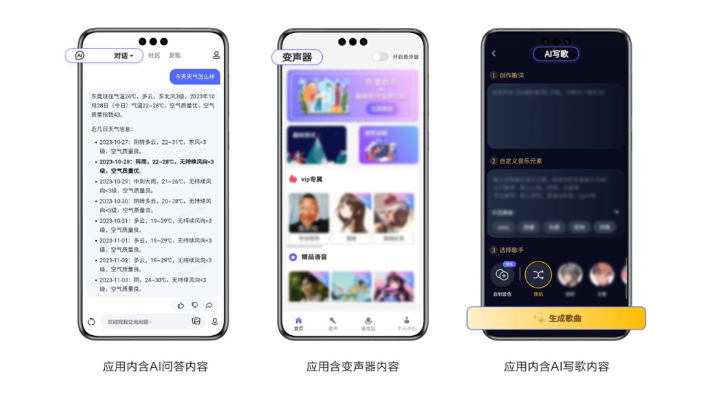
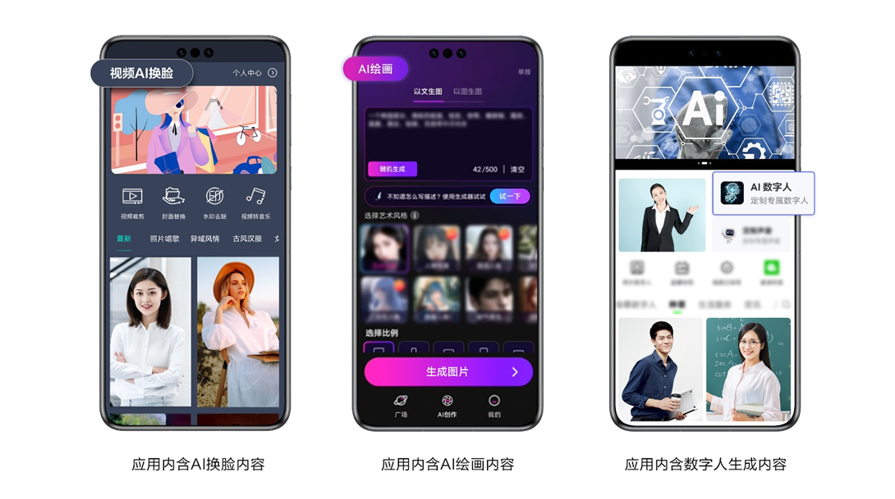

# 应用审核FAQ

## **一、鸿蒙应用在上架审核过程中有哪些常见问题？**

感谢您参与鸿蒙应用开发，若您的应用已有面向用户提供的其他版本，在开发鸿蒙版本时，请保持不低于其他版本的质量与完善度，满足用户对体验一致性的期待；请注意鸿蒙应用/元服务备案要求与APP备案一致，均由接入商代为备案，请在接入商备案系统填写材料时选择“鸿蒙”平台；若您的应用涉及获取受限权限，可参考[受限开放权限](/docs/dev/app-dev/system/system-security/access-control/app-permission-mgmt/app-permissions/restricted-permissions)进行申请。

更多详细信息可参考[《鸿蒙应用审核FAQ》](https://developer.huawei.com/consumer/cn/doc/50180)，我们梳理了鸿蒙应用审核常见的问题及相关指引，希望能够帮助到您。

## 二、**华为应用市场的应用审核需要多长时间？**

应用审核通常需要1-3个工作日。如果您的应用较为复杂，例如涉及特殊功能、复杂架构或需要额外的测试评估，审核时间可能会延长。此外，遇到节假日或审核高峰期，审核时间也可能会有所延迟。如您的应用因做活动或其他需求，需要在特定时间节点前发布，请预留充足的应用审核和修改时间，提前安排您的应用发布计划。如您的应用临时出现严重错误，需要紧急修复，可以申请加急审核。您可在[互动中心](https://developer.huawei.com/consumer/cn/service/josp/agc/index.html#/interactive)详细描述需加急审核的原因，工作人员将尽快安排审核。

## **三、常见的应用信息问题有哪些？**

应用信息，包括但不限于应用名称、应用图标、应用介绍（包括一句话简介、新版本特性）、应用截图和视频、应用分类、语言、内容分级、开发者信息、隐私信息（如隐私政策、权限说明等）。

1、应用信息不得出现低俗、涉黄、涉赌、涉毒等违法违规内容。2、应用信息需与应用内容相符。3、应用信息中如使用其他品牌或含有其他应用信息，为避免给用户造成混淆以及带来知识产权侵权索赔的风险，需提前获得授权。4、应用名称需独特。请不要使用广义归纳、普遍且不具辨识性的词汇或热门搜索词，避免干扰搜索结果及误导用户，包括但不限于使用商标术语、热门应用名称或别称、流行词、类别词、功能性描述的词汇，以及在名称中堆砌多个关键词，如手机定位、手电筒、日历、视频剪辑去水印修图等。5、应用名称不得含有占位符文本、乱码、表情符号、特殊符号 (如“\*” “&”“-”“( )”) 。

应用信息具体审核要求，请参考审核指南“[1. 应用信息](https://developer.huawei.com/consumer/cn/doc/app/50104-01)”章节。

## 四、内容合规具体要求有哪些？

1、危害国家安全，泄露国家秘密，颠覆国家政权，破坏国家统一的；

2、损害国家荣誉和利益的；

3、歪曲、丑化、亵渎、否定英雄烈士事迹和精神，以侮辱、诽谤或者其他方式侵害英雄烈士的姓名、肖像、名誉、荣誉的；

4、宣扬恐怖主义、极端主义或者煽动实施恐怖活动、极端主义活动的；

5、煽动民族仇恨、民族歧视，破坏民族团结的；

6、破坏国家宗教政策，宣扬邪教和封建迷信的；

7、散布谣言，扰乱经济秩序和社会秩序的；

8、散布淫秽、色情、赌博、暴力、凶杀、恐怖或者教唆犯罪的；

9、侮辱或者诽谤他人，侵害他人名誉、隐私和其他合法权益的；

10、法律、行政法规禁止的其他内容。

## 五、常见的内容安全违规主要体现在哪些场景？

用户昵称模块、AIGC 功能模块、商品模块、搜索引擎模块、藏头诗模块、换脸功能，用户评论等功能模块。

## 六、应用审核结果提示有同名应用/游戏在华为应用市场平台已存在，如何处理？

根据《华为应用市场审核指南》，应用名称不得和其他应用名称相同。如您发现其他应用侵犯了您的合法权益，可按指引对侵权行为进行投诉，请参考[华为应用市场侵权投诉处理指引](https://developer.huawei.com/consumer/cn/doc/distribution/app/50120)。

## 七、应用提交审核时，为什么提示“应用名称最多可支持修改2次。您本年度的修改次数已达上限，无法继续修改”？

为更好的保护开发者权益，提升用户体验，华为应用市场对应用名称修改次数进行了限制。应用一个自然年内最多可支持修改2次，未用完次数不可累积。超过规定的修改次数后将无法继续提交。

如需再次修改，需提供商标等证明文件并说明修改原因，请您谨慎修改。如有疑问可在华为应用市场[互动中心](https://developer.huawei.com/consumer/cn/service/josp/agc/index.html#/interactive)咨询。

## 八、华为应用市场不允许应用含有的恶意行为有哪些？

详细请参见：[恶意软件及行为](https://developer.huawei.com/consumer/cn/doc/50114)。

## 九、常见的应用功能问题有哪些？

1、应用不得存在启动闪退、启动白屏、无法启动、UI界面显示不全等问题。

2、应用不得存在功能模块点击无响应、运行时闪退的问题。

3、应用不得存在主功能模块未开发完善，应用内模块无内容、数据展示的问题。

应用功能具体审核要求，请参考审核指南“[3. 应用功能](https://developer.huawei.com/consumer/cn/doc/app/50104-03)”章节。

如使用应用时有特殊配置或特殊使用环境，请在提交审核时备注说明所需的相关资源或信息。

为协助您尽快定位功能异常问题，华为应用市场提供了云测试/云调试服务，您可参考[云测试](https://developer.huawei.com/consumer/cn/doc/development/AppGallery-connect-Guides/agc-cloudtest-introduction-0000001083002880)/[云调试](https://developer.huawei.com/consumer/cn/doc/development/AppGallery-connect-Guides/agc-clouddebug-introduction-0000001057034023)检测指南。请注意，云测试/云调试仅作为开发者自检工具，部分功能问题可能无法覆盖，请以最终的审核结果为准。

如以上指引仍无法解决您的问题，您可在华为应用市场[互动中心](https://developer.huawei.com/consumer/cn/service/josp/agc/index.html#/interactive)咨询，我们将协助您定位相关问题。

## 十、为什么应用被判定为功能内容相似？

1、应用与其他应用属于同类型，且主功能界面相同或基本相似。为提供更好的用户体验，请勿重复上传内容相似的应用，确保您的应用与其它应用功能内容不相似，并避免继续在已有大量相似应用的类别下进行开发。

2、应用与其他开发者的应用的名称、图标、外观、内容等相同或相似。请修改应用名称、图标、外观、内容，或者提供相关授权或商标权属证明。如您已取得了权利人的有效授权，请确保该权利授权方名下无名称、图标、外观、内容相似的应用。

3、针对特定教育阶段、景点、地区等场景的不同适用版本而提交多个应用。例如：中国地图拆分成广东省地图、广西省地图等分包。请优化合并成一个应用进行提交。

如您发现在华为应用市场运营的应用或内容侵犯了您的合法权益，可按流程对存疑内容进行投诉，详细请参见：[华为应用市场侵权投诉处理指引](https://developer.huawei.com/consumer/cn/doc/distribution/app/50120)。

## 十一、为什么应用需要提供举报功能？

根据《移动互联网应用程序信息服务管理规定》，要求应用程序提供者自觉接受社会监督，设置醒目、便捷的投诉举报入口，公布投诉举报方式，健全受理、处置、反馈等机制，及时处理公众投诉举报。

如您的应用向用户提供文字、图片、语音、视频等信息制作、复制、发布、传播等服务的活动，包括即时通讯、新闻资讯、知识问答、论坛社区、网络直播、电子商务、网络音视频、生活服务等类型，请提供显著易识别的举报功能，如：应用含有聊天、交友、直播、婚恋等模块，需在相应的聊天模块设置“举报”按钮。

## 十**二、**应用广告常见问题及注意事项

1、广告如果使用“摇一摇”等交互动作触发页面或第三方应用跳转，灵敏度参数应设置为多少，才不易造成用户误触发？

触发用户跳转的交互动作可参照如设备加速度不小于 15m/s²，转动角度不小于 35°，操作时间不少于 3s，或同时考虑加速度值与方向、转动角度的方式，或与前述单一触发条件等效的其他参数设置，确保用户在走路、乘车、拾起放下移动智能终端等日常生活中，非用户主动触发跳转的情况下，不会出现误导、强迫跳转。（可参考《APP 用户权益保护测评规范 第 7 部分：欺骗误导强迫行为》）

2、应用广告其他常见问题及注意事项，详细请参见：审核指南“[5. 应用广告](https://developer.huawei.com/consumer/cn/doc/app/50104-05)”章节、[APP广告审核规范标准解读](https://developer.huawei.com/consumer/cn/training/course/video/C101656554833164557)。

## 十三、个人信息保护常见问题及注意事项

如您的应用发布区域包含中国大陆，个人信息保护常见问题及注意事项，详细请参见：[APP常见个人信息保护问题FAQ](https://developer.huawei.com/consumer/cn/doc/distribution/app/FAQ-faq)、[APP个人信息安全保护审核标准解读](https://developer.huawei.com/consumer/cn/training/course/video/101628758824836911)。

## 十四、应用资质常见问题及注意事项

如您的应用发布区域包含中国大陆，应用资质常见问题及注意事项，详细请参见：[应用资质FAQ](https://developer.huawei.com/consumer/cn/doc/distribution/app/50111)。

部分行业的资质要求及资质模板文件可参考：[资质审核要求](https://developer.huawei.com/consumer/cn/doc/distribution/app/80301)。由于应用内容包含的业务类型繁多以及审核规则在不同时期的调整更新，资质说明并未详尽，如有疑问可[咨询客服](https://developer.huawei.com/consumer/cn/service/josp/agc/index.html#/interactive)，并以最终审核意见为准。

## 十五、应用内含支付项，但未在应用内提供客服联系方式，应如何修改？

您应在应用内显著位置（例如，在应用首页或商品详情页等）清楚标明有效的客服联系方式，如在线客服、客服联系电话/邮箱等。请注意，应用内某链接中（如隐私政策、用户协议等）的联系方式，因位置过于隐蔽，不足以作为在应用内提供的有效客服联系方式。

## **十六、华为应用市场暂不收录哪些应用类型？**

根据《民法典》、《刑法》、《网络安全法》、《互联网信息服务管理办法》、《网络信息内容生态治理规定》、《移动互联网应用程序信息服务管理规定》、《移动智能终端应用软件预置和分发管理暂行规定》等法律法规及政策要求，华为应用市场暂不收录含有以下内容的应用，详细请参见：[不收录类型](https://developer.huawei.com/consumer/cn/doc/50117)。

## **十七、如果我的应用违反《华为应用市场审核指南》，华为应用市场将会采取哪些处理措施？**

详细请参见：[开发者账号与应用处理原因及措施](https://developer.huawei.com/consumer/cn/doc/distribution/app/50109)。

## **十八、我的应用在其他平台能上架，但为什么无法通过华为应用市场的审核？**

各应用市场针对应用上架存在不同标准。为给用户提供更安全放心的应用，华为应用市场具有专业的安全检测机制，并严格遵循《华为应用市场审核指南》，向用户提供值得信赖的应用。

## **十九、目前我在华为应用市场上发现存在部分同样也不符合标准的问题应用，为什么我的应用却不能上架？**

如您发现平台上存在应用违反审核指南，可通过如下路径进行投诉与举报：在应用市场搜索该应用名称 > 点击进入应用详情页 > 问题反馈，或前往应用市场 我的 > 帮助与客服 > 在线客服 进行反馈。华为应用市场收到投诉后，将会展开核查，一经核实，将予以相应处理。

## **二十、如何进行应用转移？**

应用转移操作指引，详细请参见：[应用转移](https://developer.huawei.com/consumer/cn/doc/distribution/app/agc-help-transferapp-0000001099998802)。

## 二十一、哪些属于深度合成或生成式人工智能服务类应用？

依照《互联网信息服务深度合成管理规定》第二十三条、《生成式人工智能服务管理暂行办法》第二条规定，深度合成或生成式人工智能服务类应用指的是利用深度合成或生成式人工智能技术向公众提供生成文本、图片、音频、视频、虚拟场景等功能或内容的应用，包括且不局限于以下场景：

1、篇章生成、文本风格转换、问答对话等生成或者编辑文本内容，如AI问答类应用；

2、文本转语音、语音转换、语音属性编辑等生成或者编辑语音内容，如变声器类应用；

3、音乐生成、场景声编辑等生成或者编辑非语音内容，如AI写歌类应用；

4、人脸生成、人脸替换、人物属性编辑、人脸操控、姿态操控等生成或者编辑图像、视频内容中的生物特征，如换脸类应用；

5、图像生成、图像增强、图像修复等生成或者编辑图像、视频内容中的非生物特征，如AI绘画类应用；

6、三维重建、数字仿真等生成或者编辑数字人物、虚拟场景，如数字人生成类应用。

**典型场景举例：**

