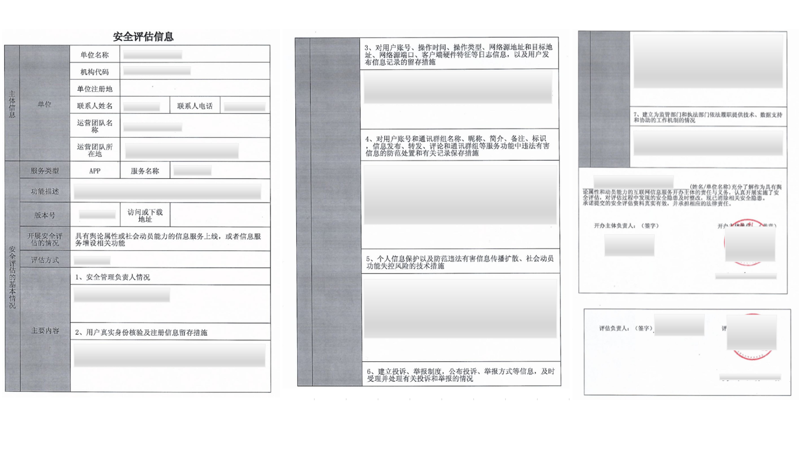
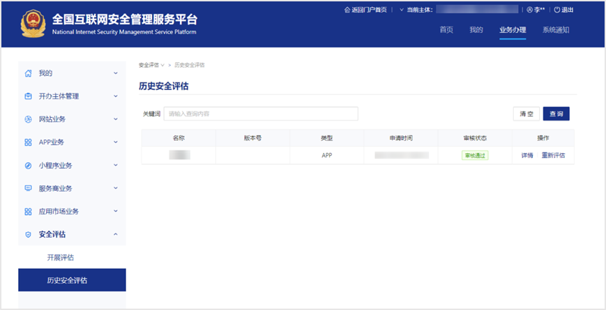
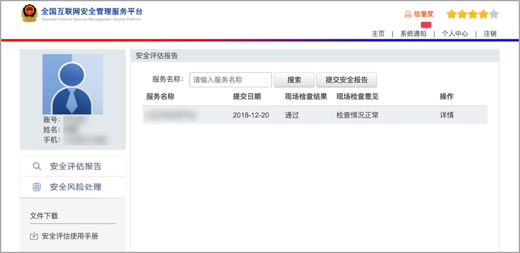
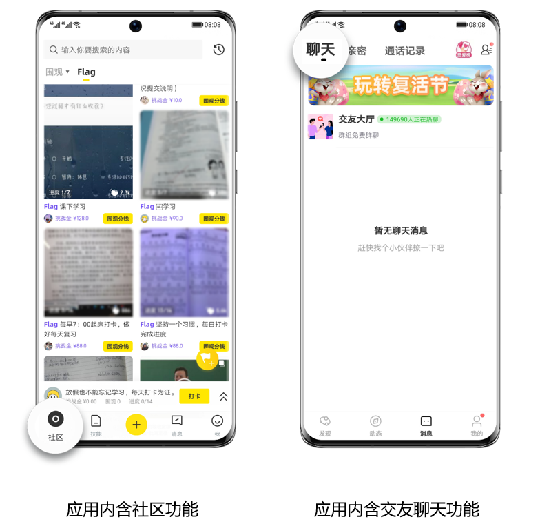
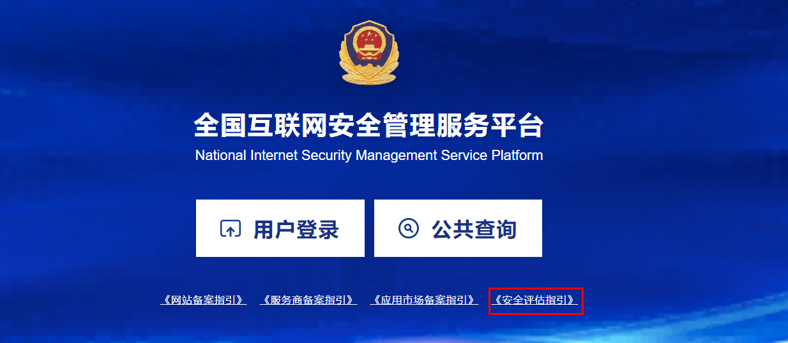

# 《安全评估报告》

## **一、法规依据**

**《具有舆论属性或社会动员能力的互联网信息服务安全评估规定》**

**第二条：**本规定所称具有舆论属性或社会动员能力的互联网信息服务，包括下列情形：

（一）开办论坛、博客、微博客、聊天室、通讯群组、公众账号、短视频、网络直播、信息分享、小程序等信息服务或者附设相应功能；

（二）开办提供公众舆论表达渠道或者具有发动社会公众从事特定活动能力的其他互联网信息服务。

**第三条：**互联网信息服务提供者具有下列情形之一的，应当依照本规定自行开展安全评估，并对评估结果负责：

（一）具有舆论属性或社会动员能力的信息服务上线，或者信息服务增设相关功能的；

（二）使用新技术新应用，使信息服务的功能属性、技术实现方式、基础资源配置等发生重大变更，导致舆论属性或者社会动员能力发生重大变化的；

（三）用户规模显著增加，导致信息服务的舆论属性或者社会动员能力发生重大变化的；

（四）发生违法有害信息传播扩散，表明已有安全措施难以有效防控网络安全风险的；

（五）地市级以上网信部门或者公安机关书面通知需要进行安全评估的其他情形。

第四条 互联网信息服务提供者可以自行实施安全评估，也可以委托第三方安全评估机构实施。

**第七条：**互联网信息服务提供者应当将安全评估报告通过全国互联网安全管理服务平台提交所在地地市级以上网信部门和公安机关。

具有本规定第三条第一项、第二项情形的，互联网信息服务提供者应当在信息服务、新技术新应用上线或者功能增设前提交安全评估报告；具有本规定第三条第三、四、五项情形的，应当自相关情形发生之日起30个工作日内提交安全评估报告。

**第八条：**地市级以上网信部门和公安机关应当依据各自职责对安全评估报告进行书面审查。

发现安全评估报告内容、项目缺失，或者安全评估方法明显不当的，应当责令互联网信息服务提供者限期重新评估。

发现安全评估报告内容不清的，可以责令互联网信息服务提供者补充说明。

## **二、资质示例**

**安全评估报告示例：**

注意事项：

1、 《安全评估报告》上服务名称需与上传的应用名称一致，单位名称需与开发者名称一致。

2、 《安全评估报告》尾页均须申请人（开办主体单位）及评估单位签字、盖章，并填写日期。

**提交结果截图示例：**

示例①：

示例②：

1、《安全评估报告》在全国互联网安全服务管理平台的提交结果截图且现场检查结果为“通过”或审核状态为“审核通过”。

2、截图上“服务名称”或“名称”需与上传的应用名称一致。

3、截图上主体名称需与开发者名称一致。

## **三、FAQ**

## **1. 哪些应用需要提交？**

## **2. 在哪里向相关部门提交《安全评估报告》的审查？**

登录[全国互联网安全服务管理平台](https://www.beian.gov.cn/portal/index.do)，申请流程请参考平台上的《安全评估指引》。

## **3.《安全评估报告》****上服务名称可以和应用名称不一致吗？**

不可以。需确保服务名称和单位名称与上传的应用名称及开发者名称一致。

## **4.《****安全评估报告》上的评估单位可以为本公司吗？**

可以。根据规定，互联网信息服务提供者可以自行实施安全评估，也可以委托第三方安全评估机构实施。如选择自评估方式，评估负责人为公司负责人，评估单位为本公司。如选择第三方评估方式，评估负责人为第三方公司负责人，评估单位为第三方公司。

## **5.《安全评估****报告》可以授权给他人使用吗？**

不可以。根据规定，互联网信息服务提供者应当依照规定自行开展安全评估，对自身信息服务和新技术新应用的合法性，落实法律、行政法规、部门规章和标准规定的安全措施的有效性，防控安全风险的有效性等情况进行全面评估，对评估结果负责，并及时整改安全隐患。

## **6. 如何获取《安全评估报告》的审查进展？**

如需了解安全评估其他相关问题及现场检查进展，请咨询归属地网信部门和公安机关进行核实。

FAQ会依据最新的政策要求进行更新。

如上述指引未能解答您的问题，请于华为应用市场[互动中心](https://developer.huawei.com/consumer/cn/service/josp/agc/index.html#/interactive)咨询，感谢您的支持！

附：

[《生成式人工智能服务管理暂行办法》](http://www.cac.gov.cn/2023-07/13/c_1690898327029107.htm)

[《互联网信息服务深度合成管理规定》](http://www.cac.gov.cn/2022-12/11/c_1672221949354811.htm)

[《国家互联网信息办公室、公安部加强对语音社交软件和涉深度伪造技术的互联网新技术新应用安全评估》](http://www.cac.gov.cn/2021-03/18/c_1617648089558637.htm)

[《具有舆论属性或社会动员能力的互联网信息服务安全评估规定》](http://www.cac.gov.cn/2018-11/15/c_1123716072.htm)

[应用市场-APP资质审核规范标准解读：安全评估报告](https://developer.huawei.com/consumer/cn/training/course/video/C101656554636974630)