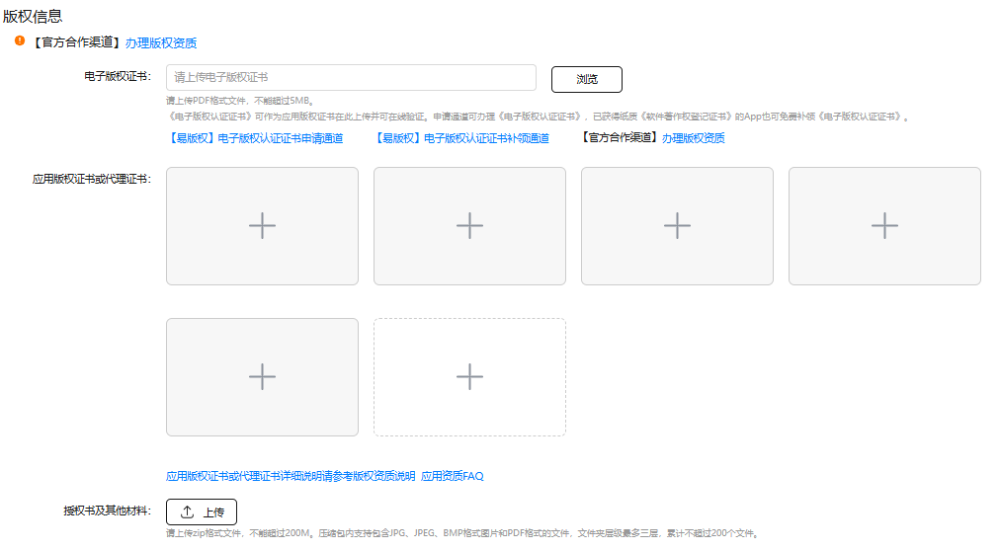

# 资质提交入口

**资质文件在哪里上传？**

应用版权资质上传入口：[AppGallery Connect 网站](https://developer.huawei.com/consumer/cn/service/josp/agc/index.html#/) > [APP与元服务](https://developer.huawei.com/consumer/cn/service/josp/agc/index.html#/myApp) > 点击对应应用名称 > 版本信息 > 版权信息。

游戏资质和版号上传入口：[AppGallery Connect 网站](https://developer.huawei.com/consumer/cn/service/josp/agc/index.html#/) > [APP与元服务](https://developer.huawei.com/consumer/cn/service/josp/agc/index.html#/myApp) > 点击对应游戏名称 > 版本信息 > 版权信息和版号。

