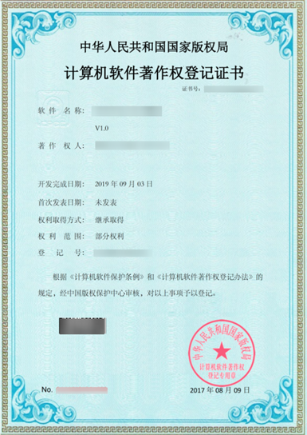
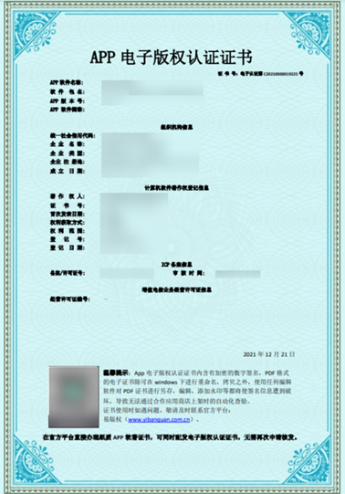
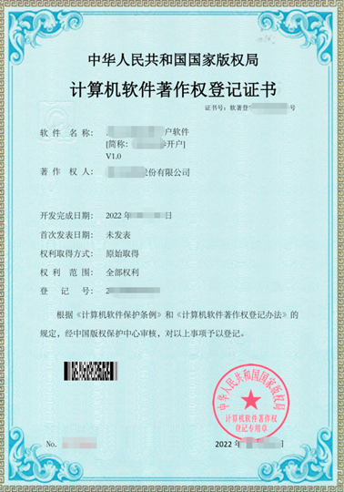
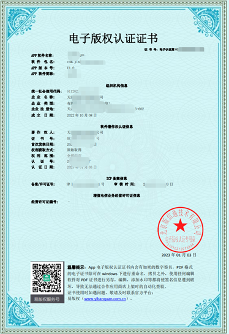
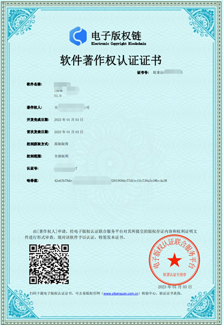
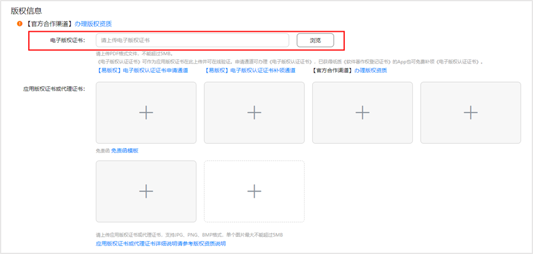
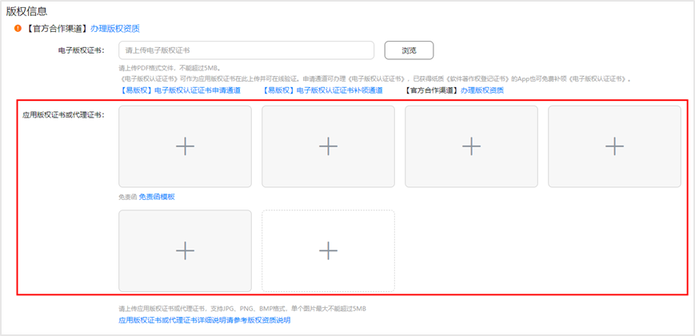
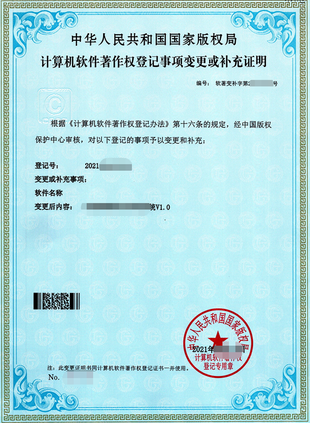

# 计算机软件著作权证书

## 1. 计算机软件著作权证书有哪些形式？

计算机软件著作权证书主要有《计算机软件著作权登记证书》、《APP电子版权认证证书》以及《软件著作权认证证书》三种形式。

《计算机软件著作权登记证书》示例：

《APP电子版权认证证书》示例：

《软件著作权认证证书》示例：

## 2. 计算机软件著作权证书如何上传？

1）电子版权证书上传入口：[AppGallery Connect 网站](https://developer.huawei.com/consumer/cn/service/josp/agc/index.html#/) > [APP与元服务](https://developer.huawei.com/consumer/cn/service/josp/agc/index.html#/myApp) > 点击对应应用名称 > 版本信息 > 版权信息 > 电子版权证书 。

2）纸质版权证书上传入口：[AppGallery Connect 网站](https://developer.huawei.com/consumer/cn/service/josp/agc/index.html#/) > [APP与元服务](https://developer.huawei.com/consumer/cn/service/josp/agc/index.html#/myApp) > 点击对应应用名称 > 版本信息 > 版权信息 > 应用版权证书或代理证书 。

## 3. 计算机软件著作权证书上软件名称可以和华为应用市场上传的应用名称不一致吗？

不可以。《计算机软件著作权登记证书》上软件名称/简称需与上传的应用名称一致。如软件名称存在变更，需提供《计算机软件著作权登记事项变更或补充证明》。

《计算机软件著作权登记事项变更或补充证明》示例：

## 4. 计算机软件著作权证书上著作权人可以和华为应用市场上传应用的开发者名称不一致吗？

计算机软件著作权证书上著作权人需与上传应用的开发者名称一致，如由第三方授权运营，请提供应用版权授权书。

应用版权授权书模板可参考[应用版权授权书模板.zip](https://alliance-communityfile-drcn.dbankcdn.com/FileServer/getFile/cmtyManage/011/111/111/0000000000011111111.20251024181949.81228916011090136165326999348678%3A50001231000000%3A2800%3A9C771B72E483542EA8238D6459422B675BD2AF5726D08FBADF5F124D2C8E310C.zip?needInitFileName=true)，游戏版权授权书模板可参考[游戏版权、版号授权书模板.zip](https://alliance-communityfile-drcn.dbankcdn.com/FileServer/getFile/cmtyManage/011/111/111/0000000000011111111.20251024181929.40413086041474827281317529620254%3A50001231000000%3A2800%3A8A17A01C921666FDF74ECA56985FB5B661A03F46B99F7505803947CBFEA4DF27.zip?needInitFileName=true)；。

## 5. 已取得计算机软件著作权证书，应用上架时，发现应用名称被占用，怎么办？

如您发现线上的同名应用侵犯了您的合法权益，请前往华为应用市场[互动中心](https://developer.huawei.com/consumer/cn/service/josp/agc/index.html#/interactive)进行同名应用侵权申诉，详情见[侵权投诉处理指引](https://developer.huawei.com/consumer/cn/doc/50120)。