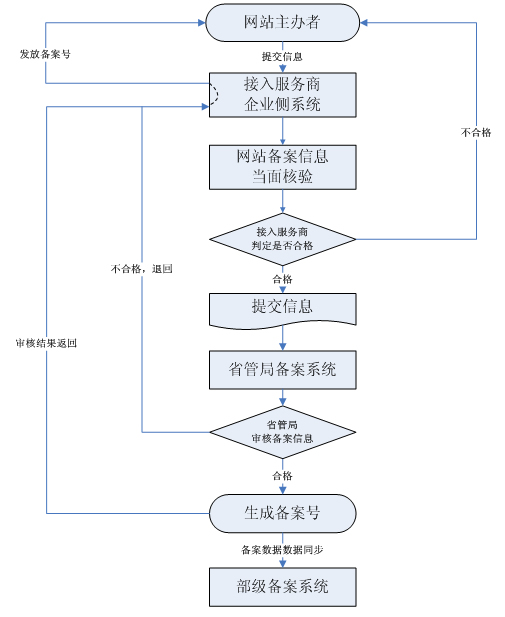
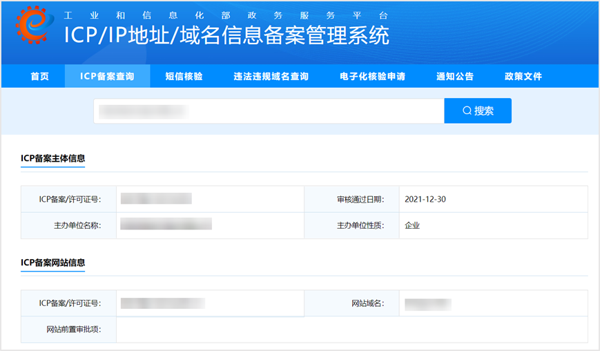
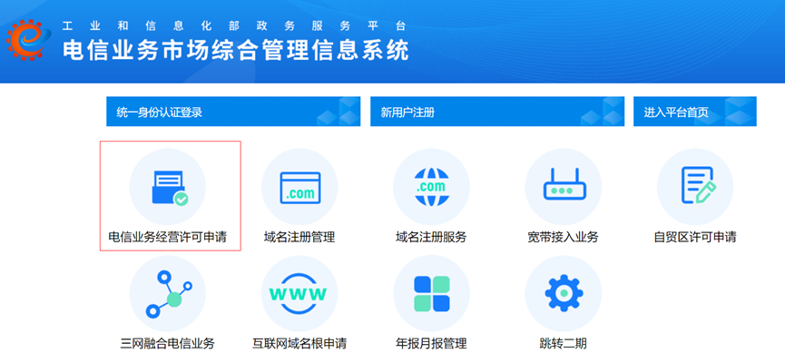
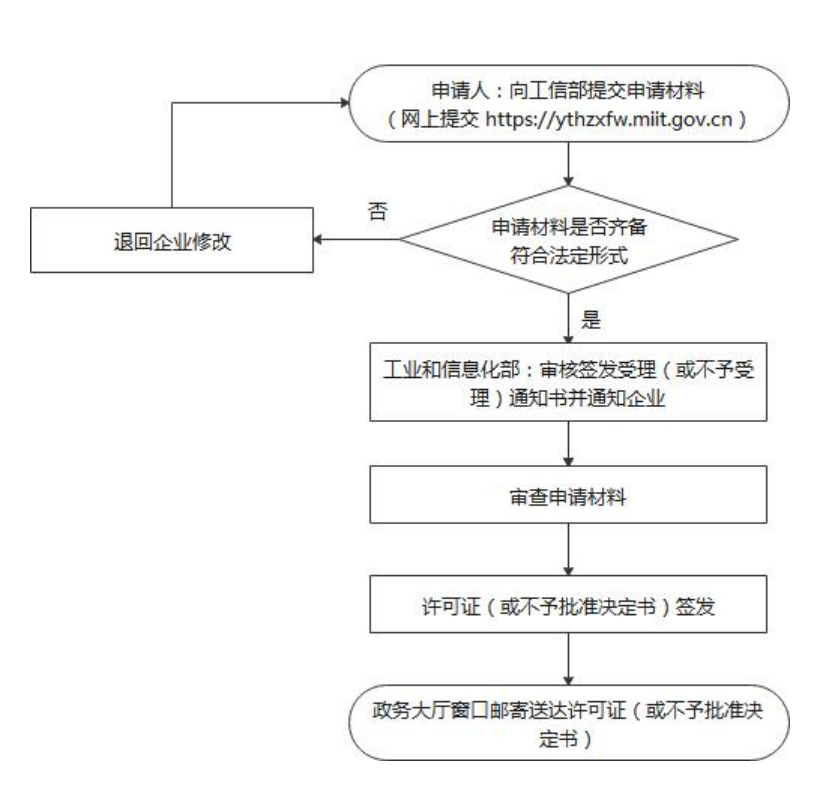
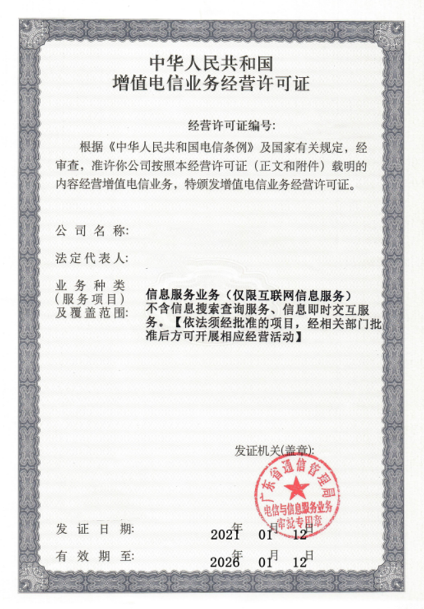

# ICP备案/ICP证

## 1. 哪些应用需要提供？

依照《互联网信息服务管理办法》，未取得许可或者未履行备案手续的，不得从事互联网信息服务。从事非经营性互联网信息服务需进行ICP备案，从事经营性互联网信息服务需取得ICP证。

## 2. ICP备案如何申请？

ICP备案由国家工信部颁发的，具体详情可进入[ICP/IP地址/域名信息备案管理系统](https://beian.miit.gov.cn/#/Integrated/index)查看。

### ICP信息报备流程示例：

### ICP备案示例：

## 3. ICP许可证如何申请？

登录[电信业务市场综合管理信息系统网站](https://dxzhgl.miit.gov.cn/#/home)，点击“电信业务经营许可申请”，申请ICP许可证。

### ICP许可证申请流程示例：

### ICP许可证示例：

## 4. ICP备案上主办单位名称可以和华为应用市场上传应用的开发者名称不一致吗？

不可以。同时，上传的ICP备案上主办单位名称、备案号、网站名称等信息需与工业和信息化部ICP信息备案管理系统上信息保持一致。