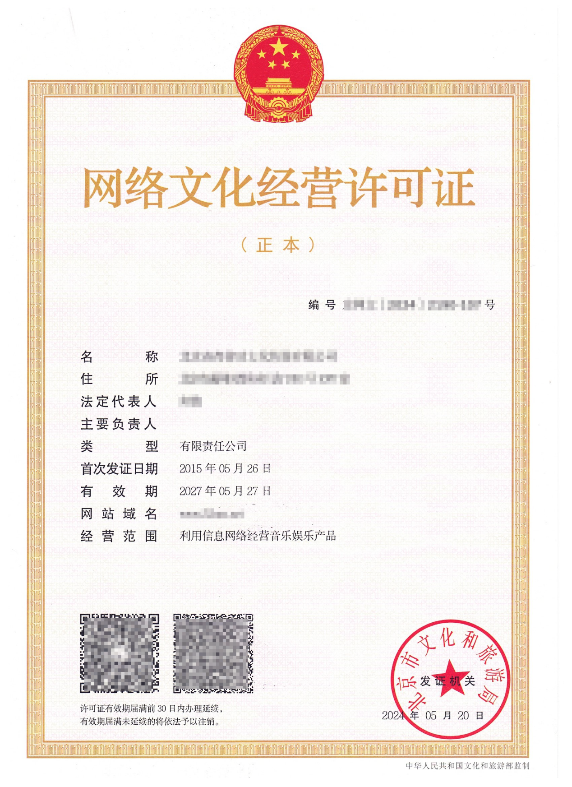

# 《网络文化经营许可证》

## **一、法规依据**

### 出版物

**《互联网文化管理暂行规定》**

**第二条：**本规定所称互联网文化产品是指通过互联网生产、传播和流通的文化产品，主要包括：

（一）专门为互联网而生产的网络音乐娱乐、网络游戏、网络演出剧（节）目、网络表演、网络艺术品、网络动漫等互联网文化产品；

（二）将音乐娱乐、游戏、演出剧（节）目、表演、艺术品、动漫等文化产品以一定的技术手段制作、复制到互联网上传播的互联网文化产品。

**第八条：**申请从事经营性互联网文化活动，应当向所在地省、自治区、直辖市人民政府文化行政部门提出申请，由省、自治区、直辖市人民政府文化行政部门审核批准。

**第九条：**对申请从事经营性互联网文化活动的，省、自治区、直辖市人民政府文化行政部门应当自受理申请之日起20日内做出批准或者不批准的决定。批准的，核发《网络文化经营许可证》，并向社会公告；不批准的，应当书面通知申请人并说明理由。

《网络文化经营许可证》有效期为3年。有效期届满，需继续从事经营的，应当于有效期届满30日前申请续办。

### 直播

**《关于加强网络直播规范管理工作的指导意见》**

四、建立健全制度规范

9．强化准入备案管理。开展经营性网络表演活动的直播平台须持有《网络文化经营许可证》并进行ICP备案。

### 网吧网咖

**《互联网上网服务营业场所管理条例》**

**第二条：**本条例所称互联网上网服务营业场所，是指通过计算机等装置向公众提供互联网上网服务的网吧、电脑休闲室等营业性场所。

**第七条：**国家对互联网上网服务营业场所经营单位的经营活动实行许可制度。未经许可，任何组织和个人不得从事互联网上网服务经营活动。

**第十条：**互联网上网服务营业场所经营单位申请从事互联网上网服务经营活动，应当向县级以上地方人民政府文化行政部门提出申请。

**第十一条：**文化行政部门应当自收到申请之日起20个工作日内作出决定；经审查，符合条件的，发给同意筹建的批准文件。申请人还应当依照有关消防管理法律法规的规定办理审批手续。

申请人取得消防安全批准文件后，向文化行政部门申请最终审核。文化行政部门应当自收到申请之日起15个工作日内依据本条例第八条的规定作出决定；经实地检查并审核合格的，发给《网络文化经营许可证》。

## **二、资质示例**

## **三、FAQ**

### 哪些应用需要提供？

依照《互联网文化管理暂行规定》（以下简称“规定”），从事经营性互联网文化活动的互联网文化单位，应当向省、自治区、直辖市人民政府文化行政部门申请《网络文化经营许可证》。

根据规定，提供互联网文化产品及其服务的活动需要提供《网络文化经营许可证》，其中，互联网文化产品包括：专门为互联网而生产的网络音乐娱乐、网络动漫、网络演出剧（节）目、网络表演、网络艺术品等互联网文化产品，将音乐娱乐、动漫、演出剧（节）目、表演、艺术品等文化产品以一定的技术手段制作、复制到互联网上传播的互联网文化产品。