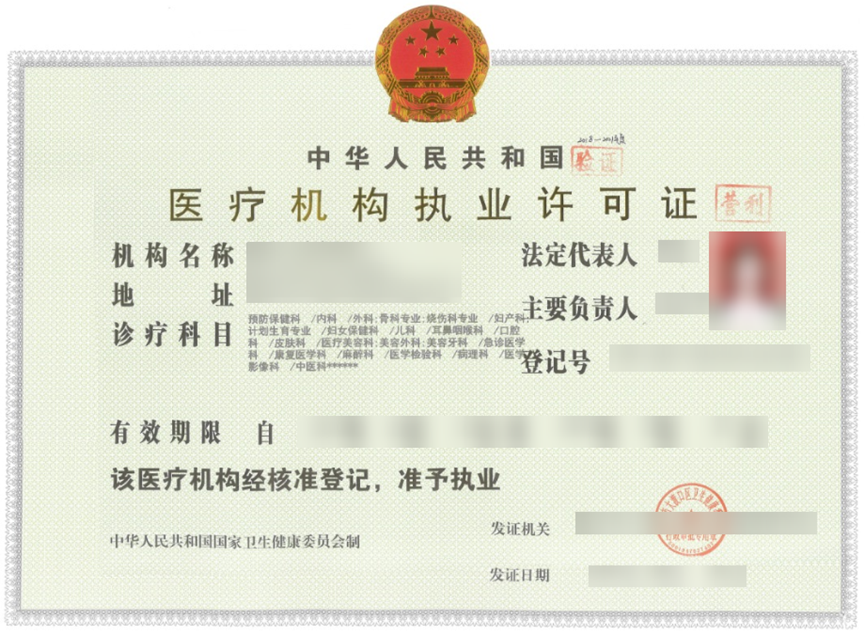

# 《医疗机构执业许可证》

## **一、法规依据**

### 医疗服务

**1****、《医疗机构管理条例》**

**第二条：**本条例适用于从事疾病诊断、治疗活动的医院、卫生院、疗养院、门诊部、诊所、卫生所(室)以及急救站等医疗机构。

**第十四条：**医疗机构执业，必须进行登记，领取《医疗机构执业许可证》；诊所按照国务院卫生行政部门的规定向所在地的县级人民政府卫生行政部门备案后，可以执业。

**第十八条：**县级以上地方人民政府卫生行政部门自受理执业登记申请之日起45日内，根据本条例和医疗机构基本标准进行审核。审核合格的，予以登记，发给《医疗机构执业许可证》；审核不合格的，将审核结果以书面形式通知申请人。

**第二十三条：**任何单位或者个人，未取得《医疗机构执业许可证》或者未经备案，不得开展诊疗活动。

**2****、《互联网医院管理办法（试行）》**

**第二条：**本办法所称互联网医院包括作为实体医疗机构第二名称的互联网医院，以及依托实体医疗机构独立设置的互联网医院（互联网医院基本标准见附录）。

**第十二条：**互联网医院的命名应当符合有关规定，并满足以下要求：

（一）实体医疗机构独立申请互联网医院作为第二名称，应当包括“本机构名称+互联网医院”；

（二）实体医疗机构与第三方机构合作申请互联网医院作为第二名称，应当包括“本机构名称+合作方识别名称+互联网医院”；

（三）独立设置的互联网医院，名称应当包括“申请设置方识别名称+互联网医院”。

**3****、《互联网诊疗管理办法（试行）》**

**第二条：**本办法所称互联网诊疗是指医疗机构利用在本机构注册的医师，通过互联网等信息技术开展部分常见病、慢性病复诊和“互联网+”家庭医生签约服务。

**第五条：**互联网诊疗活动应当由取得《医疗机构执业许可证》的医疗机构提供。

**第九条：**执业登记机关按照有关法律法规和规章对医疗机构登记申请材料进行审核。审核合格的，予以登记，在《医疗机构执业许可证》副本服务方式中增加“互联网诊疗”。审核不合格的，将审核结果以书面形式通知申请人。

### 体检

**《健康体检管理暂行规定》**

**第二条：**本规定所称健康体检是指通过医学手段和方法对受检者进行身体检查，了解受检者健康状况、早期发现疾病线索和健康隐患的诊疗行为。

第五条　医疗机构向核发其《医疗机构执业许可证》的卫生行政部门（以下简称登记机关）申请开展健康体检。

**第六条：**登记机关应当按照第四条规定的条件对申请开展健康体检的医疗机构进行审核和评估，具备条件的允许其开展健康体检，并在《医疗机构执业许可证》副本备注栏中予以登记。

## **二、资质示例**

## **三、FAQ**

### 哪些应用需要提供？

依照《医疗机构管理条例》（以下简称“规定”），医疗机构执业，必须进行登记，领取《医疗机构执业许可证》。根据规定，应用内提供医疗服务，如医美诊疗，医美产品，医美信息资讯、医疗问诊、心理健康问诊等，需要提供《医疗机构执业许可证》。