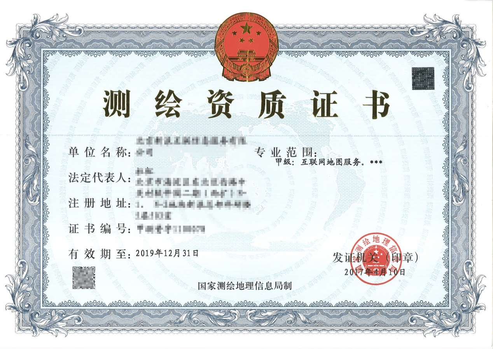
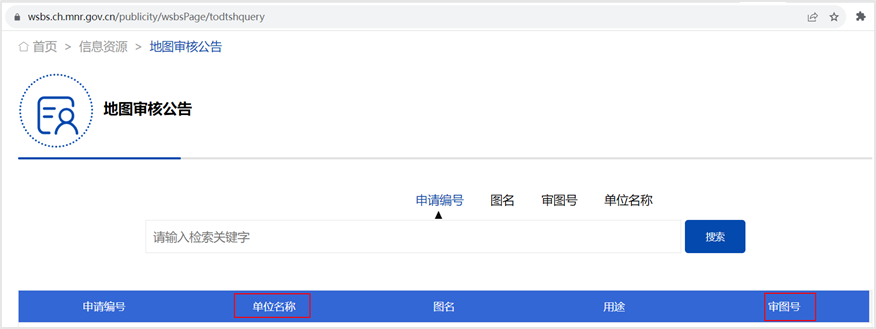

# 《测绘资质证书》

## **一、法规依据**

**1****、《国家测绘局关于加强互联网地图管理工作的通知》**

一、互联网地图服务单位应当依法取得相应的互联网地图服务测绘资质，并在资质许可的范围内提供互联网地图服务。

二、互联网地图服务单位提供增值服务（包括浏览、搜索、导航、定位、标注、复制、链接、发送、转发、引用、嵌入、下载等）必须使用经测绘行政主管部门审核批准的互联网地图。

三、互联网地图的编制（包括编辑加工、格式转换、质量测评）、更新等活动，必须由取得相应电子地图编制或者导航电子地图制作专业范围测绘资质的单位承担。

编制、更新互联网地图，必须遵守公开地图内容表示等有关地图管理规定。

**2****、《测绘资质管理办法》**

一、在中华人民共和国领域和中华人民共和国管辖的其他海域从事测绘活动的单位，应当依照本办法的规定取得测绘资质证书，并在测绘资质等级许可的专业类别和作业限制范围内从事测绘活动。

二、测绘资质分为甲、乙两个等级。

测绘资质的专业类别分为大地测量、测绘航空摄影、摄影测量与遥感、工程测量、海洋测绘、界线与不动产测绘、地理信息系统工程、地图编制、导航电子地图制作、互联网地图服务。

三、导航电子地图制作甲级测绘资质的审批和管理，由自然资源部负责。

前款规定以外的测绘资质的审批和管理，由省、自治区、直辖市人民政府自然资源主管部门负责。

十、审批机关自受理之日起十五个工作日内作出是否批准测绘资质的书面决定。

因特殊情况在十五个工作日内不能作出决定的，经本审批机关负责人批准，可以延长十个工作日，并将延长期限的理由告知申请单位。

十一、审批机关作出批准测绘资质决定的，应当自作出决定之日起十个工作日内，向申请单位颁发测绘资质证书；审批机关作出不予批准测绘资质决定的，应当说明理由，并告知申请单位享有依法申请行政复议或者提起行政诉讼的权利。

十二、测绘资质证书有效期五年。测绘资质证书包括纸质证书和电子证书，纸质证书和电子证书具有同等法律效力。

测绘资质证书样式由自然资源部统一规定。

## **二、资质示例**

## 三、FAQ

## 1. 哪些应用需要提供？

依照《关于加强互联网地图管理工作的通知》（以下简称“规定”），互联网地图服务单位应当依法取得相应的互联网地图服务测绘资质，并在资质许可的范围内提供互联网地图服务。

根据规定，应用内含有实景地图、地图搜索、位置定位等互联网地图服务内容，需提供《测绘资质证书》并在专业范围中注明互联网地图服务。

## 2. 《测绘资质证书》如何申请？

《测绘资质证书》向测绘资质审批机关申请，详细可登录[全国测绘资质管理信息系统](https://zz.ch.mnr.gov.cn/Main/WorkEntrance.aspx)查看。

## 3. 接入的是第三方平台的地图服务，应该如何提供资质文件？

若涉及与测绘单位进行合作的，可提供双方合作协议（授权证明），同时需在应用内地图显著位置标明审图号和合作单位，审图号及合作单位名称需与[自然资源部官网](https://zwfw.mnr.gov.cn/flow/open/dtshGs)公开的信息一致。

自然资源部官网地图审核公告截图示例：

