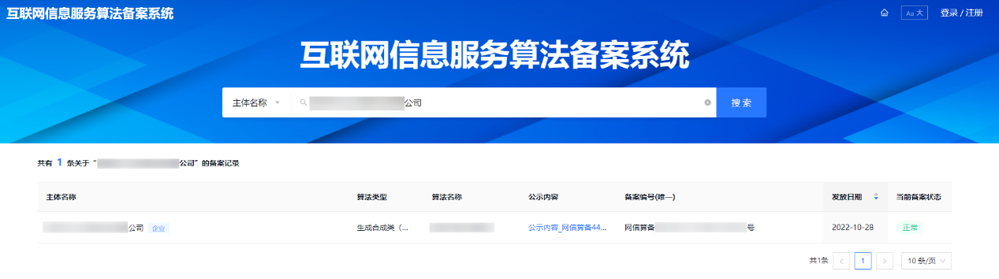
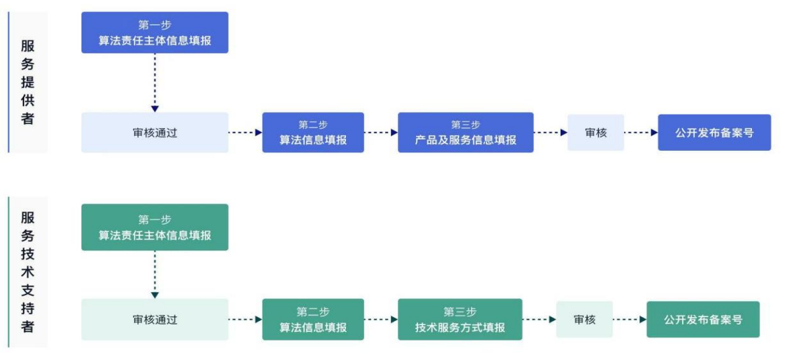

# 《互联网信息服务算法备案》

## **一、法规依据**

**1****、《互联网信息服务深度合成管理规定》**

**第二条：**在中华人民共和国境内应用深度合成技术提供互联网信息服务（以下简称深度合成服务），适用本规定。法律、行政法规另有规定的，依照其规定。

**第十九条：**具有舆论属性或者社会动员能力的深度合成服务提供者，应当按照《互联网信息服务算法推荐管理规定》履行备案和变更、注销备案手续。

深度合成服务技术支持者应当参照前款规定履行备案和变更、注销备案手续。

完成备案的深度合成服务提供者和技术支持者应当在其对外提供服务的网站、应用程序等的显著位置标明其备案编号并提供公示信息链接。

**第二十条：**深度合成服务提供者开发上线具有舆论属性或者社会动员能力的新产品、新应用、新功能的，应当按照国家有关规定开展安全评估。

**第二十三条：**本规定中下列用语的含义：

深度合成技术，是指利用深度学习、虚拟现实等生成合成类算法制作文本、图像、音频、视频、虚拟场景等网络信息的技术，包括但不限于：

（一）篇章生成、文本风格转换、问答对话等生成或者编辑文本内容的技术；

（二）文本转语音、语音转换、语音属性编辑等生成或者编辑语音内容的技术；

（三）音乐生成、场景声编辑等生成或者编辑非语音内容的技术；

（四）人脸生成、人脸替换、人物属性编辑、人脸操控、姿态操控等生成或者编辑图像、视频内容中生物特征的技术；

（五）图像生成、图像增强、图像修复等生成或者编辑图像、视频内容中非生物特征的技术；

（六）三维重建、数字仿真等生成或者编辑数字人物、虚拟场景的技术。

深度合成服务提供者，是指提供深度合成服务的组织、个人。

深度合成服务技术支持者，是指为深度合成服务提供技术支持的组织、个人。

深度合成服务使用者，是指使用深度合成服务制作、复制、发布、传播信息的组织、个人。

训练数据，是指被用于训练机器学习模型的标注或者基准数据集。

沉浸式拟真场景，是指应用深度合成技术生成或者编辑的、可供参与者体验或者互动的、具有高度真实感的虚拟场景。

**2****、《生成式人工智能服务管理暂行办法》**

**第二条：**利用生成式人工智能技术向中华人民共和国境内公众提供生成文本、图片、音频、视频等内容的服务（以下称生成式人工智能服务），适用本办法。

**第十七条：**提供具有舆论属性或者社会动员能力的生成式人工智能服务的，应当按照国家有关规定开展安全评估，并按照《互联网信息服务算法推荐管理规定》履行算法备案和变更、注销备案手续。

**第二十二条：**本办法下列用语的含义是：

（一）生成式人工智能技术，是指具有文本、图片、音频、视频等内容生成能力的模型及相关技术。

（二）生成式人工智能服务提供者，是指利用生成式人工智能技术提供生成式人工智能服务（包括通过提供可编程接口等方式提供生成式人工智能服务）的组织、个人。

（三）生成式人工智能服务使用者，是指使用生成式人工智能服务生成内容的组织、个人。

**3****、《互联网信息服务算法推荐管理规定》**

**第二条：**在中华人民共和国境内应用算法推荐技术提供互联网信息服务（以下简称算法推荐服务），适用本规定。法律、行政法规另有规定的，依照其规定。

前款所称应用算法推荐技术，是指利用生成合成类、个性化推送类、排序精选类、检索过滤类、调度决策类等算法技术向用户提供信息。

**第二十四条：**具有舆论属性或者社会动员能力的算法推荐服务提供者应当在提供服务之日起十个工作日内通过互联网信息服务算法备案系统填报服务提供者的名称、服务形式、应用领域、算法类型、算法自评估报告、拟公示内容等信息，履行备案手续。

算法推荐服务提供者的备案信息发生变更的，应当在变更之日起十个工作日内办理变更手续。

算法推荐服务提供者终止服务的，应当在终止服务之日起二十个工作日内办理注销备案手续，并作出妥善安排。

**第二十五条：**国家和省、自治区、直辖市网信部门收到备案人提交的备案材料后，材料齐全的，应当在三十个工作日内予以备案，发放备案编号并进行公示；材料不齐全的，不予备案，并应当在三十个工作日内通知备案人并说明理由。

**第二十六条：**完成备案的算法推荐服务提供者应当在其对外提供服务的网站、应用程序等的显著位置标明其备案编号并提供公示信息链接。

**第二十七条：**具有舆论属性或者社会动员能力的算法推荐服务提供者应当按照国家有关规定开展安全评估。

## **二、资质示例**

[算法备案查询](https://beian.cac.gov.cn/)页面示例：

## **三、FAQ**

### 互联网信息服务算法备案如何申请？

登录[互联网信息服务算法备案系统](https://beian.cac.gov.cn/)进行深度合成或生成式人工智能服务备案填报，备案填报包括三个步骤：一是填报主体信息；二是填报算法信息；三是关联产品及功能信息或填报技术服务方式。

根据填报人员角色不同（“服务提供者”是指提供深度合成或生成式人工智能服务的组织、个人；“服务技术支持者”是指为深度合成或生成式人工智能服务提供技术支持的组织、个人），

填报流程如下：

