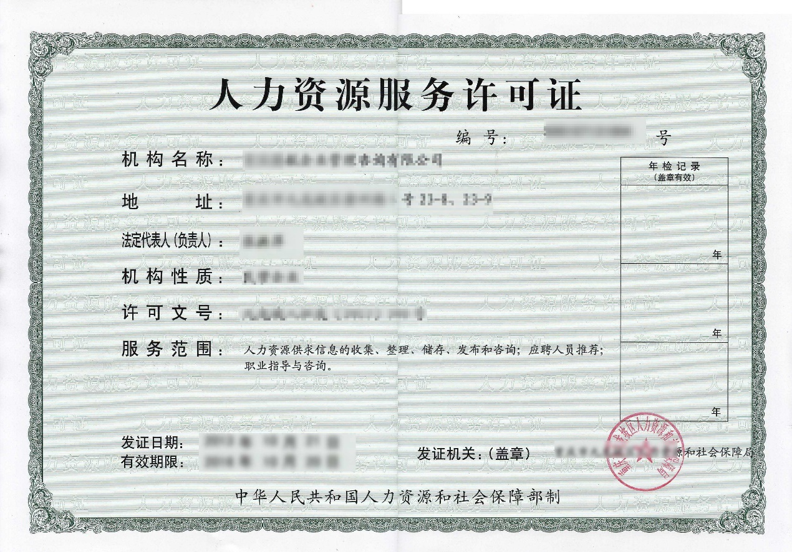
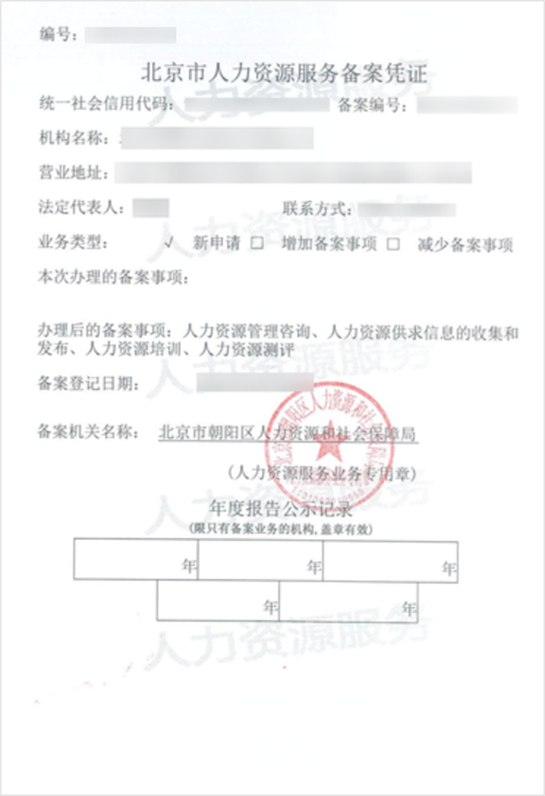

# 《人力资源服务许可证》及机构登记备案

## **一、法规依据**

**1、《网络招聘服务管理规定》**

第二条：本规定所称网络招聘服务，是指人力资源服务机构在中华人民共和国境内通过互联网等信息网络，以网络招聘服务平台、平台内经营、自建网站或者其他网络服务方式，为劳动者求职和用人单位招用人员提供的求职、招聘服务。

人力资源服务机构包括公共人力资源服务机构和经营性人力资源服务机构。

**第三条：**国务院人力资源社会保障行政部门负责全国网络招聘服务的综合管理。

县级以上地方人民政府人力资源社会保障行政部门负责本行政区域网络招聘服务的管理工作。

县级以上人民政府有关部门在各自职责范围内依法对网络招聘服务实施管理。

**第九条：**经营性人力资源服务机构从事网络招聘服务，应当依法取得人力资源服务许可证。涉及经营电信业务的，还应当依法取得电信业务经营许可证。

**第十条：**对从事网络招聘服务的经营性人力资源服务机构，人力资源社会保障行政部门应当在其服务范围中注明“开展网络招聘服务”。

**第十一条：**网络招聘服务包括下列业务：

（一）为劳动者介绍用人单位；

（二）为用人单位推荐劳动者；

（三）举办网络招聘会；

（四）开展高级人才寻访服务；

（五）其他网络求职、招聘服务。

**2、《人力资源市场暂行条例》**

**第二条：**在中华人民共和国境内通过人力资源市场求职、招聘和开展人力资源服务，适用本条例。

法律、行政法规和国务院规定对求职、招聘和开展人力资源服务另有规定的，从其规定。

**第十四条：**本条例所称人力资源服务机构，包括公共人力资源服务机构和经营性人力资源服务机构。

公共人力资源服务机构，是指县级以上人民政府设立的公共就业和人才服务机构。

经营性人力资源服务机构，是指依法设立的从事人力资源服务经营活动的机构。

**第十八条：**经营性人力资源服务机构从事职业中介活动的，应当依法向人力资源社会保障行政部门申请行政许可，取得人力资源服务许可证。

**第十九条：**人力资源社会保障行政部门应当自收到经营性人力资源服务机构从事职业中介活动的申请之日起20日内依法作出行政许可决定。符合条件的，颁发人力资源服务许可证；不符合条件的，作出不予批准的书面决定并说明理由。

## **二、资质示例**

《人力资源服务许可证》示例：

人力资源服务机构登记备案示例：

## **三、FAQ**

### 为什么《人力资源服务许可证》上的服务范围需注明“开展网络招聘”？

依照[《网络招聘服务管理规定》](http://www.mohrss.gov.cn/xxgk2020/gzk/gz/202112/t20211229_431807.html)第十条：对从事网络招聘服务的经营性人力资源服务机构，人力资源社会保障行政部门应当在其服务范围中注明“开展网络招聘服务”。