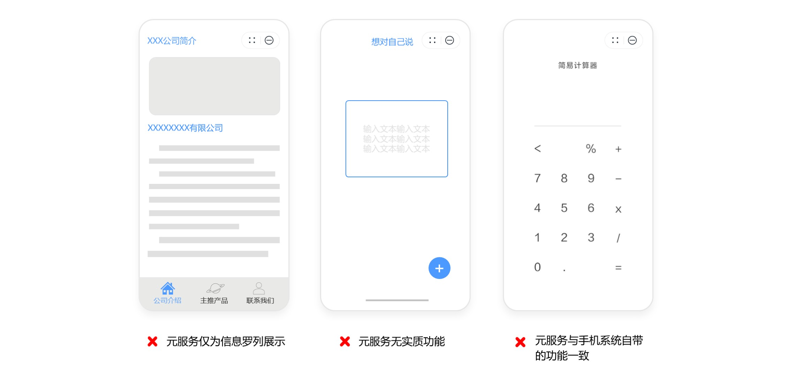
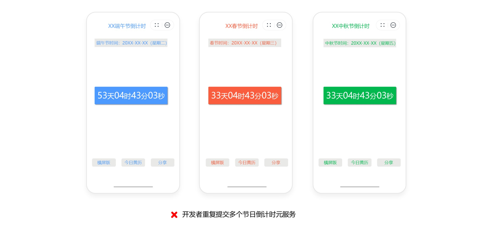
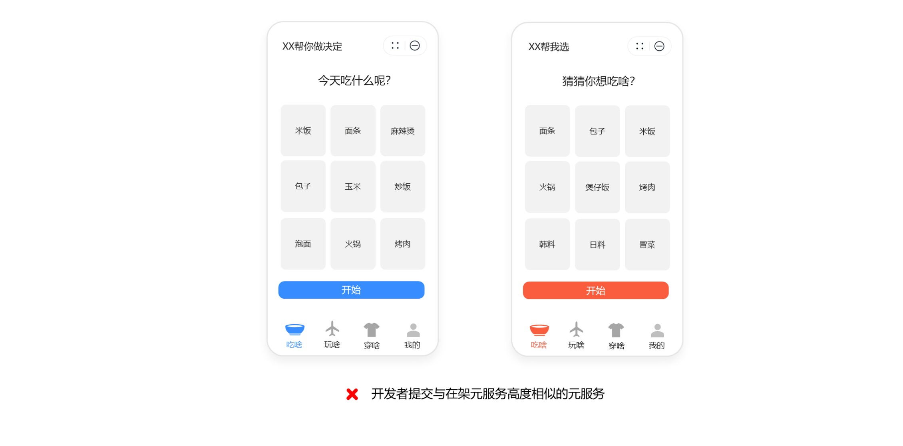
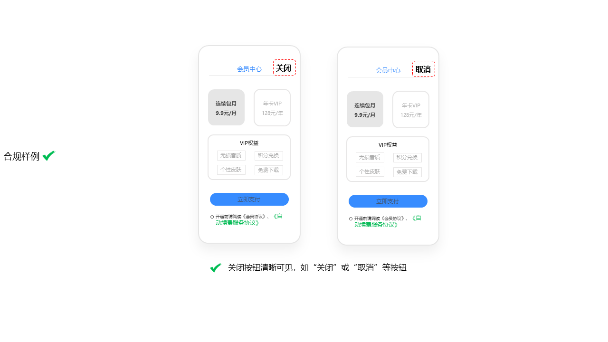
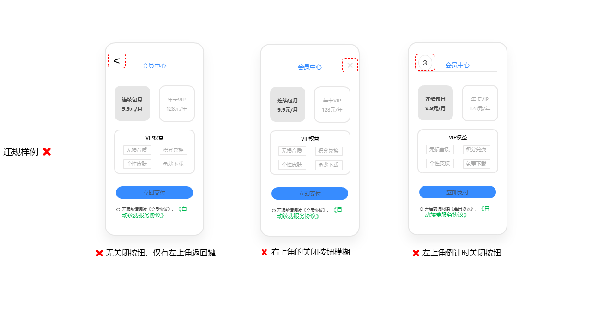

# 元服务审核指南

## 概述

在您完成元服务开发提交上线前，请确保您的元服务符合适用的法律法规、当代社会价值观以及指南要求。我们一直在不断优化用户体验，《元服务审核指南》也会紧跟用户和产品的需求，针对新的问题不断修改更新。

* **元服务相关指南**

（1）开发服务指南参考：[元服务概述](/docs/dev/atomic-dev/atomic-service/atomic-service)

（2）调试服务指南参考：[运行调试元服务](/docs/dev/atomic-dev/atomic-running-debugging/atomic-running-debugging)

（3）应用市场接入指南参考：[发布元服务](https://developer.huawei.com/consumer/cn/doc/app/agc-help-release-atomic-0000002327731065)

（4）元服务设计规范：[元服务设计](/docs/design/atomic-service-design/overview)、[元服务 UX 体验标准](/docs/design/ux-standards/atomic-service-ux)

* **审核时长**

常规元服务审核时效通常为 24 小时。如果您的元服务较为复杂，例如涉及特殊功能、复杂架构或需要额外的测试评估，审核时间可能会延长。此外，遇到节假日或审核高峰期，审核时间也可能会有所延迟。

如您的元服务因运营活动或其他需求，需要在特定时间节点前发布，请预留充足的元服务审核和修改时间，提前安排您的元服务发布计划。

如您的元服务突发严重问题需紧急修复，可以申请加急审核。您可在[互动中心](https://developer.huawei.com/consumer/cn/service/josp/agc/index.html#/interactive)详细描述需加急审核的原因，审核人员将优先处理。

* **常见审核不通过原因及参考指南**

为了帮助您更好地准备元服务提交审核，我们特别指出了一些最常见的问题，请提前排查，做好准备。

1. APP未核准（备案）：所有元服务均需完成核准（备案），您可基于[元服务核准（备案）指导](/docs/dev/atomic-dev/atomic-service-filing/atomic-service-filing)直接前往[华为云核准（备案）平台](https://beian.huaweicloud.com/?utm_source=HUAWEI%2BDeveloper&utm_adplace=AdPlace099034)元服务通道进行核准（备案）。

2. 元服务标签与实际功能和用途不相符：请根据元服务实际功能和标签的定义选择相符的标签，如您的元服务内容涉及资质要求，请提前确认所需资质类型，准备齐全真实、有效的资质材料后再提交审核。请参考：[元服务分类](/docs/distribute/app-dist/app-services/classification-0000002068852289/ability-0000002032931302)；[元服务资质要求](/docs/distribute/app-dist/app-market/x50000/x80302)

3. 功能异常：请确保元服务功能正常稳定，您可进行自检：[云测试](/docs/distribute/agc/agc-help-cloudtest-0000002235710242/agc-help-cloudtest-introduction-0000002255036400)、[云调试](/docs/distribute/agc/agc-help-clouddebug-0000002235870046/agc-help-clouddebug-introduction-0000002254916514)、[DevEco Testing](/docs/dev/testing/deveco-testing)等工具完成自检。

4. UX设计不符合UX规范：请确保元服务UX设计符合[《元服务 UX 体验标准》](/docs/design/ux-standards/overview)要求。

5. 个人信息保护不合规：请确保隐私政策内容完整，合理申请权限并规范获取授权，符合个人信息保护具体审核要求，请参考《应用审核指南》 “[7. 用户隐私](https://developer.huawei.com/consumer/cn/doc/app/50104-07)”章节。

6. 包含测试数据或者提交测试版本：请提交无测试数据的正式版本，或选择[HarmonyOS应用内部测试](https://developer.huawei.com/consumer/cn/doc/app/agc-help-harmonyos-internaltest-0000001937800101)和[邀请测试](https://developer.huawei.com/consumer/cn/doc/app/agc-help-harmonyos-testapp-0000001873653977#section22510401333)方式进行测试，确保元服务达到上线标准后再提交审核。

* **支持与申诉**

您可查阅《元服务审核指南》全文获取详细合规指引；若对审核问题存在疑问，可通过[互动中心](https://developer.huawei.com/consumer/cn/service/josp/agc/index.html#/interactive)咨询客服；对审核结论有异议，可按照平台流程提交申诉并说明合规理由，请参考[《联系我们》](https://developer.huawei.com/consumer/cn/doc/app/50000-FAQ)。

如您发现上传至华为应用市场的应用或内容侵犯了您的合法权益，可按流程对存疑内容进行投诉，请参考[《华为应用市场侵权投诉处理指引》](/docs/distribute/app-dist/app-market/x50000/x50120)。如果您的应用违反本指南，我们将采取相应处理措施，详细请参见：[开发者账号与应用处理原因及措施](https://developer.huawei.com/consumer/cn/doc/distribution/app/50109)。

## 1. 元服务信息

您在上传元服务时需提供完善和满足下列要求的元服务信息，包括但不限于元服务名称、元服务图标、元服务介绍（包括一句话简介、新版本特性）、元服务分类及标签、语言、内容分级、开发者信息、隐私信息（如隐私政策、权限说明等）。同时应确保所提交的元服务信息符合实际功能、用途，能够准确反映元服务的核心体验。并请及时更新，以保持与新版本相应的最新状态。

1.1 元服务名称长度不得超过15个汉字字符或30个其他语言字符。

1.2 元服务名称不得为广义归纳、普遍且不具辨识性的词汇或热门搜索词，避免干扰搜索结果及误导用户，包括但不限于使用商标术语、热门应用名称或别称、流行词、行业名词、职业名词、类别词、功能性描述的词汇，以及在名称中堆砌2个或以上关键词，如手机定位、手电筒、日历、视频剪辑去水印修图等。结合元服务自身特色、经过精心构思的独特元服务名称，可以帮助用户快速识别和了解您的元服务，并建立对元服务的记忆和品牌认知。

1.3 元服务名称不得和其他元服务名称相同，避免给用户造成混淆以及给您带来知识产权侵权索赔的风险。

1.4 元服务名称不得含有占位符文本、乱码、表情符号、特殊符号 (如“\*” “&”“-”“( )”) 。

1.5 元服务名称不得包含定价信息、价格、诱导赚钱等具有营销属性的商业化词汇（如免费、促销、清仓、XX元、￥XX、9块9、躺赚等），避免夸大宣传、误导用户。

1.6 元服务图标不得为系统图标，避免被用户误认为是系统元服务。

1.7 元服务内容分级需如实填写，以标识元服务适宜的用户年龄段。当您的元服务内容发生变化时，需重新进行分级。

详细请参见：[华为应用市场应用年龄分级标准](/docs/distribute/app-dist/app-market/x50000/x50125)；[年龄分级问卷FAQ](/docs/distribute/app-dist/app-market/x50000/x50142)。

1.8 元服务分类及标签需与实际功能和用途相符（请参考[元服务分类及其标签](/docs/distribute/app-dist/app-services/classification-0000002068852289/ability-0000002032931302)）。

1.9 元服务名称、图标、分类、标签和签名不得频繁更改。元服务名称一个自然年内可支持修改2次。

1.10 元服务信息及元服务内容使用的语言需与选择的语言一致。

1.11 元服务信息需与元服务内容相符，不得包含误导性、不相关或不恰当的商业化用语、热门搜索词、流行词语，且不得宣传实际并不提供的内容或服务、以及做出无法证实的产品声明。元服务信息不得误导或暗示元服务的排名和表现，如使用官方、权威、推荐、精品等词汇。

1.12 元服务不得使用可能会误导用户以为元服务及其内容来源于他人或与他人存在特定联系的元服务信息，不得在未经授权的情况下使用或者变相使用代表政府实体或其他知名实体的标识及内容，如：非国家机构元服务使用国旗、国徽、党旗、党徽等标识作为元服务图标，误导用户认为该元服务与国家机构之间存在关联；元服务未经批准使用“电视台”、“广播电台”、“电台”、“TV”等广播电视专有名称开展业务。

1.13 元服务信息不得带有其他终端品牌或移动应用平台的名称、图标或图像，确保元服务信息注重元服务本身功能及服务，不要包含无关信息。

1.14 元服务信息不得存在低俗、性暗示、色情、暴力、恐怖、血腥、赌博及其他适用法律法规所禁止的内容。

1.15 元服务信息需考虑对所有受众的影响，如：即使您的元服务目标用户非儿童，元服务信息也不应含有可能对儿童造成负面影响的元素。

1.16 元服务信息不得展示真实的个人信息，如账号、身份信息等。

1.17 元服务展示的图标、名称、版本、开发者信息和内容需与提交时填写信息相符。

1.18 元服务如需要账号才能使用，应提交有效可用的账号信息，以便我们完成对您元服务的审核。

## 2. 元服务安全

为了给用户提供安全可靠的使用环境，您的元服务不得含有试图滥用或不当使用任何网络、设备以及干扰其他元服务的安全隐患。

2.1 元服务不得含有病毒、木马，包括但不限于通过可疑代码、文件及程序等形式对系统造成负面影响或侵害用户权益。

2.2 元服务不得在用户不知情或未授权的情况下，通过隐蔽执行、欺骗用户点击等手段，订购各类收费业务（如发送付费短信、拨打付费电话号码、诱骗用户订阅及购买内容）或使用移动终端支付，导致用户经济损失。

2.3 元服务不得存在劫持系统操作、利用漏洞或采取欺骗手段监控用户、窃取数据的恶意行为，包括但不限于劫持桌面、监听剪切板、设置钓鱼链接盗取用户账户或其他敏感信息。

2.4 元服务不得允许远程攻击者控制手机，接收攻击者下发的远程控制指令，在用户未授权、未知情的情况下，侵害用户隐私、窃取用户资产或者执行其他恶意行为。

2.5 元服务不得下载、安装或运行第三方恶意代码，以更改该元服务或其他元服务功能，包括但不限于滥用热更新或插件化技术动态加载恶意代码。

2.6 元服务不得在用户不知情或未授权的情况下，通过自动拨打电话和发送短信、彩信、邮件，频繁连接网络等方式，导致用户资费损失。

2.7 元服务不得利用系统和资源进行拒绝服务攻击 (DoS)，或作为分布式拒绝服务攻击（DDoS）的一环使用户无法得到服务。

2.8 元服务不得在用户不知情的情况下利用系统和资源进行获利，包括但不限于加密货币挖矿、通过模拟人工点击广告或链接、下载软件、修改软件业务逻辑进行刷量刷榜等。

2.9 元服务不得干扰、阻断、屏蔽或以未经授权的方式访问用户的通信功能、网络服务或其它合法业务，导致用户手机无法正常使用，损害用户利益。

2.10 元服务不得诱导、欺骗用户，在用户主观不了解操作后果情况下，执行有损系统和元服务安全的操作，包括但不限于下载或安装系统root工具、激活设备管理器选项、开启辅助功能等。

2.11 元服务不得通过加密用户数据，窗口遮蔽，滥用锁屏、锁应用等权限，或者利用拒绝服务漏洞，影响用户对手机的正常使用，并以恢复正常使用为由向用户勒索。

2.12 元服务或广告不得伪装和模仿操作系统功能和系统消息，如伪装和模仿操作系统或其他元服务发送的通知或警告，欺骗和诱导用户执行操作。

2.13 元服务不得未经用户授权强制启动系统服务（例如：蓝牙，GPS等）。

2.14 元服务不得提示或强制重启设备、不得诱导或强制更改用户设备上超出该元服务范围的系统设置，包括但不限于安装后自动修改系统默认配置且未告知用户等。

2.15 元服务不得诱导或强制更改系统默认的功能，导致系统功能异常，包括但不限于进程无法停止、功能键失灵（如按“返回键”后无法退出元服务）等。

2.16 元服务不得含有隐藏或不被用户感知或发现的功能，如在无合理使用场景的情况下隐藏最近任务列表，且不得滥用前台服务和悬浮窗权限，在桌面或其他服务界面上恶意弹窗。

2.17 元服务不得含有修改其他元服务数据、存档等内容的功能，不得恶意干扰、屏蔽、诱导或强制用户卸载其他元服务。

2.18 元服务不得在用户不知情或未授权的情况下霸占锁屏界面，如在锁屏界面展现广告。

2.19 元服务不得含有任何试图滥用或不当使用任何网络、系统机制、系统功能、系统漏洞、以及干扰其他元服务或影响终端设备功能的恶意行为，影响用户的正常操作和体验。

## 3. 元服务功能

为了给用户提供优质的用户体验，请确保您的元服务能够为用户提供正常完整、稳定流畅、可实现、有吸引力的功能，不得含有影响用户体验的不合理功能。

3.1 元服务应具备良好的兼容性，且需适配华为主流终端设备；元服务需能够正常启动、卸载，不得出现运行时崩溃、闪退、无响应或其他功能异常情况，不得出现需借助第三方软件才可启动、卸载的情况。

3.2 元服务不得在注册或关联等账号使用过程中出现异常，包括但不限于无法接收短信验证码、账号不可用等异常情况。且不得存在强制输入邀请码、推荐码等才可注册使用的行为。

3.3 元服务功能需确保已实现和使用正常，元服务如存在未完善功能的情况可能会被拒绝，包括但不限于元服务为测试版本、功能模块未开发完善或不能独立运行的非正式版本、点击主功能，跳转至三方小程序、APP等。

3.4 元服务需具备实用价值，能为用户提供实质功能/服务，且需具备创意，不得为纯信息展示或为手机系统自带的简易功能。

3.5 您不得重复提交2个及以上页面、内容、功能相同或高度相似的严重同质化元服务，且不得针对特定人群、时间、运动/游玩项目、节目、物种、教育阶段、地区等场景的不同适用版本而提交多个类似内容的元服务。请确保元服务之间在名称、页面、内容、功能上相互具有可辨识性和不可替代性，避免给用户造成混淆，影响用户体验。

示例：

3.6 请避免继续在已有较多类似元服务的类别下进行开发，如敲木鱼、随机选择、计时类、计算器、手电筒、记事本、记账、天气、数字大小写转换、日历、指南针、智能遥控、镜子、助眠睡眠、证件照、色彩助手、手持弹幕、播放器等类别的元服务，除非您的元服务能够提供独特、高质量的体验，为用户提供多样、优质的功能和服务，否则您的元服务可能会被拒绝或移除。

示例：

3.7 元服务不得出现过度营销、诱导跳转等有损用户利益的行为。元服务需确保功能可在元服务内实现，即不得以使用其他应用/元服务为前提条件，且不得含有跳转至元服务外的恶意或不明链接，包括但不限于：（1）不得从事纯跳转等恶意导流行为，即不得在并不实际向用户提供特定服务的情况下，仅通过领红包、做任务领权益等形式，诱导用户点击跳转到第三方服务、应用、网页等相关内容或由其他方提供的页面。（2）不得在未实现基础功能、上架功能的情况下，诱导跳转至应用或应用下载界面。（3）不得对元服务或对其他应用实施推荐、推广、排行或集中设立跳转等诱导点击或跳转行为，也不得为上述行为提供任何协助或便利。（4）不得强行中断元服务内的功能或业务的完整流程、要求用户跳转/下载应用后才能继续下一步操作。如：跳转/下载应用后才可解锁相关功能或元服务、跳转/下载应用后才可完整体验业务流程、在元服务内有能力提供相关功能或服务时，仍要求跳转/下载应用等。

3.8 元服务的发布版本不得为可调试版本。出于安全考虑，您需在发布元服务前先关闭调试功能。

3.9 元服务不得提供虚假或具有误导性的功能、信息或声明，如：声称提供某些功能（如驱蚊），但实际上不可能实现这些功能。

3.10 元服务不得以任何方式协助用户误导他人或提供用于实现欺骗性行为或违法行为的功能，如生成或协助生成印章和身份信息等；也不得宣传或协助创建文字、图像和/或视频等以传达虚假或误导性的信息。

3.11 互联网弹窗信息功能应明示推送服务的具体形式、内容频次、取消渠道等，并显著标明弹窗信息推送服务提供者身份，不得以任何形式干扰或者影响用户关闭弹窗。详细的互联网弹窗信息内容要求与“[4. 元服务内容](https://developer.huawei.com/consumer/cn/doc/distribution/app/50129-04)”章节的内容要求相同。

（1）元服务应以服务协议等方式明确告知用户推送服务的具体形式、内容频次、取消渠道等；

（2）元服务在通知栏的推送信息需确保可正常关闭；

（3）元服务不得在通知栏推送与自身产品无关的内容；

（4）元服务应显著标明弹窗信息推送服务提供者身份，不得出现匿名推送行为，消息通知不得隐藏元服务名称和图标。

3.12 如元服务主功能需付费才能激活使用，则元服务需提供用户免费体验的功能。若付费后仍有其他使用限制条件，需在付费前向用户清晰明示。

3.13 元服务不得绕过审核机制进行自动更新 (应使用华为应用市场下载可执行元服务更新的组件)；不得从其他来源下载、安装或执行会修改、替换或更新元服务本身特性或功能的代码。

3.14 元服务应支持在IPv6网络环境正常运行。

3.15 元服务的linkFeature需确保功能合理、完善且用户可正常使用，不得影响用户体验。包括但不限于：

（1）linkFeature属性所支持的特性功能需与元服务内实际功能或内容相符；

（2）linkFeature属性所支持的特性功能必须为元服务自身服务功能，不得跳转至其他元服务/三方应用或页面。

（3）linkFeature声明的功能类型必须为系统提供的枚举值，请您参考[《应用链接说明》](/docs/dev/app-dev/application-framework/ability-kit/stage-model-development/inter-app-redirection/directional-redirection/app-uri-config#linkfeature标签说明)。

3.16 如元服务需要构建账号体系，需使用华为账号登录能力。请规范使用平台提供的登录能力，无需设计登录/注册功能及页面，不可使用自行设计实现的登录页面、登录面板等登录界面。

详情请参见：[登录开发指导文档](/docs/dev/atomic-dev/atomic-account-development/account-atomic-silent-login)、[华为账号登录管理细则](/docs/dev/atomic-dev/atomic-account-development/account-guide-atomic-detailedrules)、[开发者可以使用自行设计的登录界面吗？](https://developer.huawei.com/consumer/cn/doc/atomic-faqs/faqs-common-account-5) 。

## 4. 元服务内容

为了给用户提供更好的服务，请确保您的元服务能够为用户提供绿色、独特、高质量的元服务内容，不得出现对用户有害或者不当的内容，包括但不限于元服务信息、元服务内容、元服务广告、互联网弹窗信息（指通过操作系统、应用软件、网站等，以弹出消息窗口形式向互联网用户提供的信息）等。

**基本内容要求**

4.1 元服务不得在提交审核时关闭或隐藏违规内容，在上架后通过技术手段开启或展示违规内容。或元服务不得通过多个版本变更元服务的主要功能和运营业务。

4.2 元服务不得含有虚假或具有欺骗性的信息或内容，不得存在鼓励欺骗、企图欺骗、诱导消费或欺诈行为。

**不当内容**

4.3 元服务不得含有非法金钱交易、赌博、危害国家安全、破坏统一、煽动民族仇恨歧视、侵害英雄烈士权益及其他适用法律所禁止的内容，以及不得宣传或助长任何非法活动。

4.4 元服务不得含有或传播暴露、情色、低俗内容，包括但不限于元服务信息、内容及广告存在低俗、性暗示、涉黄的资源（如文字、图片、漫画、音视频等）、涉黄网站名称、涉黄网址链接、以及诱导用户进行线下性交易的内容等。

4.5 元服务内不得含有具有攻击性、不顾及他人感受、令人不安、惹人厌恶或低俗不堪的内容。

4.6 元服务不得含有或传播暴力或其他危险活动，包括但不限于描绘对人类或动物遭到杀害、残害、酷刑、虐待的写实暴力行为或暴力威胁，以及自残、自杀、绝食或其他可能导致严重伤亡的行为。

4.7 元服务不得含有或传播恐怖行动，组织暴力运动；不得鼓励非法使用武器、危险物品；不得为军火购买及销售提供便利，或提供制造炸药、枪支、弹药或其他武器的使用和改造说明等内容。

4.8 禁止恐怖组织及其成员、其他暴力行动组织及其参与者出于任何目的发布元服务。

4.9 元服务不得含有或传播邪教和封建迷信的内容，也不得含有关于宗教、种族、性取向、性别或其他目标群体的诽谤或恶意内容。

4.10 元服务不得含有或传播非法使用毒品及管制药品、过量摄入酒精、酒驾、违反交通规则、鼓励消费烟草及电子烟产品等可能造成人身伤害的内容。

4.11 元服务不得含有恶意炒作娱乐八卦、绯闻隐私、奢靡炫富、审丑扮丑等违背公序良俗内容，不得含有集中推送、炒作社会热点敏感事件、恶性案件、灾难事故等易引发社会恐慌的内容，也不得利用算法诱导用户沉迷、过度消费或过度推荐、恶意屏蔽信息。

4.12 元服务不得含有任何形式的骚扰、歧视、恐吓或霸凌行为，也不得鼓励他人实施任何上述行为。对于用户生成的内容中涉及上述行为的内容，开发者需设置过滤机制进行有效管控。骚扰行为包括但不限于向用户发送骚扰信息、诱导付费等。

**用户生成的内容**

4.13 您应对用户生成的内容进行有效管控，包括但不限于：核验用户账号身份信息并保存有关记录；制定过滤机制对账号名称、昵称、简介、备注、标识、信息发布、评论等功能及内容中的违法有害信息进行防范处置并保存有关记录；制定举报机制并及时作出响应；实现服务关闭功能，对严重违规用户账号停止提供服务；公布联系信息，以便用户与您联系等。

## 5. 元服务广告

元服务广告被视作元服务的一部分，请确保您元服务所展示的广告的投放行为以及内容符合适用的法律法规及指南要求，并适合元服务的目标受众群体。元服务广告只应在元服务内展示，不得包含非法、误导性内容，且不得为恶意广告或干扰性广告。详细的广告内容要求与“[4. 元服务内容](https://developer.huawei.com/consumer/cn/doc/distribution/app/50129-04)”章节的内容要求相同。

5.1 元服务广告的展示内容应当合法合规，以健康的表现形式表达广告内容，且具有可识别性，能够使消费者辨明其为广告。

（1）需清晰、显著标明“广告”字样，与其他非广告信息相区别，不得使用户产生误解；通过知识介绍、体验分享、消费测评等形式推销商品或者服务，并附加购物链接等购买方式的广告，也需显著标明“广告”字样；

（2）不得含有虚假或者引人误解的内容，不得欺骗、误导、诱导用户；

（3）对于需经审查的互联网广告，需严格按照审查通过的内容发布，不得剪辑、拼接、修改；

（4）含有链接的互联网广告，需确保前端广告内容与链接内容的一致性；

（5）其他广告内容要求与“[4. 元服务内容](https://developer.huawei.com/consumer/cn/doc/distribution/app/50129-04)”章节的内容要求相同。

5.2 元服务广告的弹出不得影响用户的正常操作体验，干扰其他元服务或影响终端设备功能，包括但不限于：

（1）不得恶意频繁弹出广告，中断用户操作，如每点1步弹一次；

（2）不得在用户习惯点击的功能区域突然弹出广告；

（3）不得在用户点击返回键和主屏键等系统功能键时弹出广告；

（4）不得在元服务外弹出广告窗口；

（5）不得在元服务退出或关闭后仍弹出广告；

（6）不得在锁屏界面展现广告；

（7）未经用户同意、请求或者用户明确表示拒绝的，不得在用户发送的电子邮件或者互联网即时通讯信息中附加广告或者广告链接；

（8）用户进入元服务，使用正常功能服务过程中，不得通过自动弹出广告页面等方式，诱导或强制用户点击、浏览广告，中断用户正常使用体验。

示例：

5.3 元服务广告被点击后跳转、使用第三方应用或页面，以及跳转到其他广告页面或广告形式时，应当提示用户点击的范围和位置，并经用户主动选择点击该范围之后才进行跳转或使用。不得欺骗误导强迫用户点击广告。包括但不限于：

（1）不得通过使用整屏图片、视频等作为跳转或下载链接，诱导用户点击或易造成用户误点击；元服务内同一广告位不得同时使用两种及以上的新型交互方式（摇动、滑动、转动等）。例如：不得在同一广告位同时设置“摇动跳转广告”和“滑动跳转广告”两种触发方式。

（2）不得存在诱导用户跳转其他页面的文字、图片或视频链接；

（3）不得存在欺骗误导强迫用户下载、安装、使用第三方应用的行为，包括但不限于使用“是否立即开始游戏”、“领取红包”、“手机卡顿”、“耗电太快”、“内存已满”等未清晰明示下载应用的诱导方式；

（4）不得存在以积分、奖励、优惠等方式欺骗误导用户提供个人信息的行为，包括但不限于身份证号、人脸、指纹等个人信息；

（5）不得包含会导致儿童用户在无意间点击的内容；

（6）通过用户“摇一摇”等交互动作触发页面或第三方应用跳转的，需清晰明示用户需要执行的触发动作及交互预期，不得通过设置高灵敏度降低交互动作判定阈值，造成误导、强迫式跳转。

5.4 元服务广告需确保用户能够一键关闭，需提供明显、清晰、有效的关闭标志。不得存在以下行为，包括但不限于：

（1）不得提供虚假、无效、标识不明显（如过小或非常隐蔽）的关闭标志；

（2）不得在广告素材中出现诱导或者误导的关闭标志；

（3）不得延迟展示关闭标志，或需要倒计时结束才能关闭广告；

（4）不得在广告关闭后继续弹出广告；

（5）不得强制用户输入个人信息才能关闭广告。

5.5 元服务广告分发行为需以显著方式明示分发应用的信息及下载选项，并经用户主动选择同意。需明示的分发应用信息包括：

（1）应用名称、（2）应用开发者、（3）应用版本、（4）应用功能、（5）权限列表及用途、（6）收集使用个人信息的内容、目的、方式和范围。不得有强制安装软件或捆绑下载的行为。包括但不限于：

（1）不得点击任意位置即自动下载、安装、使用第三方应用；

（2）不得点击下载后无法暂停或者取消；

（3）不得在用户关闭并重新运行元服务时，自动恢复已暂停或取消的下载任务；

（4）服务广告页面下载、安装、使用的应用不得与向用户所作的宣传或者承诺不符。

5.6 为保障用户体验，契合元服务便捷高效的服务特性，元服务页面内容应聚焦核心功能，不得主要用于营销或广告用途（如空白广告位、招商广告等），违规示例：（1）漂浮悬浮广告，含有功能使用的页面中的广告展示比例超过50%，广告遮挡功能；

（2）在单屏内容里展示两个及以上banner、原生广告位、视频前贴、视频广告位等。

示例：

5.7 为保障用户进入元服务的流畅与便捷体验，在用户进入元服务时不得出现开屏广告。

示例：

5.8 元服务通过智能推荐入口（如小艺建议推荐）访问时，不应出现广告，例如首页首屏广告，以确保用户无干扰地访问元服务内容，获得流畅的使用体验。

示例：

## 6. 元服务付费

如果您的元服务内含付费项（包括但不限于元服务内购买项、自动续费服务等），付费信息应清晰明了且显而易见，不得提供任何会误导用户的信息。您还应向用户提供周到的支持服务，以保障用户体验。

6.1 元服务内购买项需合理定价，不得出现定价过高或价格欺诈的行为。

6.2 元服务内提供自动续费服务，应遵循以下要求，包括但不限于：

（1）服务事项开通前应在显著位置全面、真实、准确、及时地披露付费服务信息和价格且征得用户主动同意，同步提供单次开通服务的选项，支付过程需由用户二次确认购买和支付的操作，不得默认勾选、欺骗诱导、强制捆绑开通。

（2）服务事项有效期内，用户实际享受的服务应与明示的内容保持一致，若服务内容出现变动的，应提前告知用户并通过协商合理解决用户诉求；元服务内应提供自动续费管理页面向用户展示其全部已购买且在有效期内的自动续费服务信息。

（3）服务续期前提醒需到位，告知方式需用户能明显感知、时机需在自动续费前5日、内容应包括所扣费用对应的服务、续费金额、续费时间及服务延长时间。

（4）元服务内应向用户提供单独的退订方式，服务退订操作步骤应简单便捷，且不应设置不合理的条件，新的服务周期未开始前，用户应可以随时申请退订，若用户注销时账号含自动续费服务的，应明确告知并引导用户取消。

6.3 元服务如提供元服务内付费，需清楚准确地明示用户元服务内付费的条款和定价，提供清晰、准确、合理、完整的付费信息。不得存在虚假、诱导、欺诈信息。包括但不限于：

（1）元服务内如提供开通会员服务，需显著、清晰明示产品功能权益及资费等内容， 未经明示，不得在提供产品服务过程中擅自添加限制性条件，并以此为由终止用户正常使用的产品功能和服务，或降低服务体验。

（2）元服务如提供付费进行随机抽取物品的机制（如游戏内抽取道具、购买抽奖盲盒等），在用户购买前，需在醒目位置（如支付界面）明示抽取规则及获得每种类型物品的概率。

（3）元服务内的付费弹窗页面，需提供清晰、明确、有效的关闭按钮，并支持一键关闭，不得出现虚假按钮、无清晰关闭按钮、延时出现关闭或跳过按钮等情况。

示例①：

示例②：

6.4 元服务内如提供数字商品，需在 [AppGallery Connect](https://developer.huawei.com/consumer/cn/service/josp/agc/index.html#/) 中选择正确的数字商品类型并添加数字商品的信息。（详情请参见：[创建数字商品](https://developer.huawei.com/consumer/cn/doc/app/create-digital-products-0000001958955105)）

## 7. 用户隐私

您需小心谨慎处理用户个人信息，确保遵守适用的法律法规，履行个人信息保护义务，并遵循合法、正当、必要和诚信的处理原则，包括但不限于《中华人民共和国个人信息保护法》、《中华人民共和国网络安全法》、《中华人民共和国数据安全法》、《App违法违规收集使用个人信息行为认定方法》、《关于开展纵深推进APP侵害用户权益专项整治行动的通知》、《信息安全技术 个人信息安全规范》、《APP用户权益保护评测规范》、《工业和信息化部关于开展信息通信服务感知提升行动的通知》、《工业和信息化部关于进一步提升移动互联网应用服务能力的通知》、《互联网信息服务算法推荐管理规定》、《常见类型移动互联网应用程序必要个人信息范围规定》、《儿童个人信息网络保护规定》以及其他适用法律法规等。

**隐私政策**

7.1 开发者必须在AppGallery Connect应用分发平台及元服务内部提供自身的可便捷查看的隐私政策链接。隐私政策内容需公开透明，且需和元服务在运行中对用户个人信息的处理保持一致。开发者必须确保该链接始终能正常打开。

7.2 元服务的隐私政策链接指向的隐私政策应当包含元服务（包括委托的第三方或嵌入的第三方代码、插件）收集和使用个人信息的目的、方式和范围。

7.3 元服务内隐私政策应包含用户如何行使个人信息主体权利的信息，例如：用户如何撤销同意和/或请求删除数据的方式，用户对个人信息的查阅复制权，以及有效的用户隐私问题投诉、举报渠道，并在承诺时限内（承诺时限不得超过15个工作日，无承诺时限的，以15个工作日为限）受理并处理；元服务如涉及账号体系，应根据账号使用场景，为用户提供便捷的删除非账号信息/删除用户数据服务、注销自有账号服务，并明确注销对象，不得设置不合理障碍，且需确保账号注销真实有效，账号注销元服务处理时限不得超过15个工作日。（[账号注销常见问题](/docs/distribute/app-dist/app-market/x50000/FAQ-faq/FAQ-faq-11)）

7.4 元服务访问、收集、使用或披露任何个人信息，需经用户的同意或遵守其他适用的法律法规。

**用户同意**

7.5 元服务必须以清楚明确的方式呈现隐私政策，收集和处理个人信息前须获取用户同意，该同意应当由用户在充分知情的前提下自愿、明确作出。

7.6 元服务必须为用户提供简单易懂且易于操作的方式来撤销同意。

7.7 元服务若使用个人信息用于个性化广告和精准营销，需在隐私政策中告知，并在元服务内提供独立的关闭或拒绝选项。

7.8 处理敏感个人信息应当获取用户的单独同意，并告知处理敏感个人信息的必要性以及对用户权益的影响。

7.9 在非服务所必需或无合理场景下，元服务不得自启动和关联启动其它应用/元服务，或进行唤醒、调用、更新等行为。关联启动前，应显著告知用户即将跳转的其它应用或由用户主动发起。

**收集和使用**

7.10 元服务收集和使用个人信息须遵守数据最小化原则，采取对用户权益影响最小的方式，限于实现处理目的的最小范围。

7.11 元服务不得暗中收集和使用个人信息，不得超出服务所必需或无合理应用场景收集和使用个人信息。

7.12 元服务须使用加密技术（例如通过 HTTPS）等安全的方式处理用户的所有个人信息。

7.13 元服务披露任何个人信息须在隐私政策中说明披露内容、目的和披露对象。

7.14 禁止元服务出售用户的个人信息。

7.15 元服务披露个人信息的任何第三方应提供与您的元服务隐私政策所述及这些准则所要求相同或等同的个人信息保护措施。

7.16 元服务不得将“通话记录”、“短信”、“生物特征”、“健康数据”、“行踪轨迹”等敏感个人信息用于服务改进、投放广告或营销等非业务核心功能。

7.17 元服务申请和使用权限须遵守权限最小化原则，应在对应业务功能启动时，动态申请所需权限，不得要求用户一揽子同意多个非本业务功能的必要权限。不得以用户拒绝权限或者撤回同意为由，拒绝提供产品或者服务。

7.18 元服务申请的权限，都必须有明确、合理的使用场景和功能说明，禁止诱导或误导用户授权，元服务使用的权限必须与申请所述的一致。在申请敏感权限时，需同步告知用户申请该权限的目的。未经用户同意，不得更改用户权限授权状态。

7.19 元服务不应频繁申请权限，用户拒绝权限申请后，除非功能场景所必须，不应再次申请开启权限，影响用户正常使用。注 ：用户拒绝权限申请后，在非用户主动触发权限所涉及的业务场景的情况下，再次弹出权限弹窗即为频繁。

7.20 元服务处理个人信息应具有明确合理的目的，不得仅以服务体验、产品研发、算法推荐、风险控制等为由，强制要求用户同意超范围或者与服务场景无关的个人信息处理行为。用户拒绝提供非当前服务所必需的个人信息时，不得影响用户使用该服务的基本功能。

7.21 元服务应规范使用平台提供的开放能力，向用户申请华为账号下的手机号等个人信息授权时，应遵循用户隐私要求。

## 8. 未成年人保护

如果您的元服务目标受众群体包括未成年人或是专为未成年人设计的，请确保元服务所呈现的内容均适合未成年人，不得危害未成年人身心健康，并需遵守《中华人民共和国未成年人保护法》及其他适用法律法规和行业标准。当您的元服务向未成年人收集任何个人信息和敏感数据时，您必须遵守适用的未成年人隐私保护法规，如《个人信息保护法》、《App违法违规收集使用个人信息行为认定方法》 、《儿童个人信息网络保护规定》以及其他适用法律法规。如您的元服务含有危害未成年人身心健康、侵害未成年人个人信息安全或对未成年人实施违法犯罪行为等内容，华为公司有权对您的元服务进行下架、删除、断开相关服务、终止您与华为的协议和/或冻结、删除您的开发者账号，保存有关记录，并向有关部门报告。

8.1 非儿童类的元服务信息中不得包含“适合幼儿”和“适合儿童”等暗示元服务受众为儿童的词语。

8.2 元服务不得含有或传播危害未成年人身心健康的内容，或利用其网络服务对未成年人实施违法犯罪行为。元服务如含有可能引发或者诱导未成年人模仿不安全行为、实施违反社会公德行为、产生不良情绪、养成不良嗜好等影响未成年人身心健康的信息，应当在信息展示前予以显著提示。

8.3 元服务不得向未成年人提供诱导其沉迷的产品和服务，并需及时修改可能造成未成年人沉迷的内容、功能或者规则。网络游戏、网络直播、网络音视频、网络社交等网络元服务提供者应当针对未成年人使用其元服务设置相应的时间管理、权限管理、消费管理等功能。

8.4 面向未成年人的元服务内容需适合未成年人，不得含有会对未成年人造成干扰的内容，以及不利于未成年人身心健康和树立正向价值观的不良内容。

8.5 元服务不得包含“一对一”“住家教师”“高端家政”“众筹私教”等违规校外培训信息，包括但不限于通过即时通讯、网络会议、直播平台等方式有偿开展校外培训。面向未成年人的元服务不得提供超标超前培训的相关内容，不得提供境外教育课程，非学科类培训机构不得从事学科类培训。

8.6 面向未成年人的在线教育类元服务不得含有网络游戏链接，以及推送广告等与教学无关的信息。

8.7 元服务不得提供和传播“拍照搜题”等惰化中小学生思维能力、影响中小学生独立思考、违背教育教学规律的不良学习方法。

8.8 元服务不得诱导中小学生家长使用分期贷款缴纳校外培训费用。

8.9 元服务不得包含对未成年人实施侮辱、诽谤、威胁或者恶意损害形象等网络欺凌内容，亦不得以鼓动、诱导或帮助等方式，间接实施或参与网络欺凌行为。

8.10 元服务内不得包含与未成年人相关的色情内容，包括但不限于恋童癖、针对未成年人的不当互动、儿童性虐待等。

8.11 面向未成年人的元服务不得包含不适合未成年人的暴力、血腥或惊悚内容，以及描绘或鼓励有害、危险的活动。

8.12 元服务不得向未成年人宣传或鼓动未成年人使用/贩卖酒精饮料、烟草制品、电子烟产品或管制药品。不得向未成年人宣传负面身体形象或自我形象，如描绘整形手术、减肥以及对个人外表进行的其他美容调整。

8.13 社交元服务如涉及与陌生人聊天、提供约会交友服务、两性或婚姻建议等内容，不得以未成年人为目标用户，如在线配对聊天、开放聊天室、秀场直播等。

8.14 开发者应当建立便捷、合理、有效的投诉和举报渠道，公开投诉、举报方式等信息，及时受理并处理涉及未成年人的投诉、举报。

8.15 儿童类元服务不得含有元服务外链接、付费项目或其他会对儿童造成干扰的内容，除非其保留在受家长监控的指定区域中，防止儿童在父母或监护人不知情的情况下进行商业交易，或者从元服务中链接至外部网站、社交网络或其他元服务。

8.16 元服务内面向未成年人投放广告的行为应符合相关法规和行业标准的要求，不得发布医疗、药品、保健食品、医疗器械、化妆品、酒类、美容、婚恋、孕育广告以及不利于未成年人身心健康的网络游戏广告。面向儿童的元服务广告不得含有劝诱儿童要求家长购买广告商品或者服务，以及可能引发儿童模仿不安全行为的内容。

8.17 收集和使用儿童个人信息的元服务应制定专门的儿童隐私政策。

8.18 元服务在收集和使用儿童的个人信息前，需获得父母或监护人的合法授权。

## 9. 知识产权

请确保您的元服务及其内容具备完整权利或充分授权，不得侵犯他人知识产权（包括商标、版权、专利、商业秘密和其他专有权利）或其他合法权益。

9.1 开发者在元服务内使用他人拥有版权的内容时，应事先获得授权，不得在无授权的情况下使用。

9.2 未经授权，元服务不得是针对他人版权保护内容所开发的破解版、汉化版。

9.3 在不构成法定正当使用的情况下，开发者未经授权不得使用他人相同或近似商标，否则将有可能构成商标侵权或不正当竞争。

9.4 未经授权，开发者不得使用华为公司的商业名称、商标和其他标识。开发者不得虚假或引人误解地宣传与华为公司的关系，如暗示华为公司是元服务的提供商或合作商，或者以任何形式表示华为公司认可或担保其质量或功能。

9.5 开发者不得实施混淆行为，误导用户认为元服务及其内容来源于他人或与他人存在特定联系（如在任何语言下均不得使用与其他开发者元服务相同/相似的外观、名称、主题等）。品牌方与服务商存在授权关系的，需提供合作授权，授权书可参照模板：[元服务运营授权书模板.zip](https://alliance-communityfile-drcn.dbankcdn.com/FileServer/getFile/cmtyPub/011/111/111/0000000000011111111.20260519095338.24486065531030415709104610763034%3A20260601001742%3A2800%3A69620A6D89D7AC49FC4E50F43E66CB4B1044407F0642A668346A4438D5C815BB.zip?needInitFileName=true)。

9.6 元服务不得销售或推广仿冒商品。

9.7 元服务及其内容不得侵犯他人合法权益（包括但不限于肖像权、名誉权），亦不得以鼓动、诱导或帮助等方式，间接实施或参与侵权行为。

如您发现在华为应用市场运营的元服务或内容侵犯了您的合法权益，可按流程对存疑内容进行投诉，详情请参见：[华为应用市场侵权投诉处理指引](https://developer.huawei.com/consumer/cn/doc/distribution/app/50120)。

## 10. 元服务资质

10.1 开发者需提供资质文件，以证明元服务及其内容符合法律、法规或政策的要求。

10.2 开发者提供的资质文件应确保完整、真实且有效，不得进行伪造、变造资质等行为。依据元服务及其内容涉及的业务类型，应提供的资质文件有所不同，详细请参见：[元服务资质审核要求](/docs/distribute/app-dist/app-market/x50000/x80302)。

## 11. 开发者行为

开发者在元服务发布和运营过程中扮演着最重要的角色。若您存在违规行为，华为公司有权对您的元服务进行下架、删除、断开相关服务、终止您与华为的协议和/或冻结、删除您的开发者账号，开发者需承担由此产生的所有法律责任及华为由此遭受的全部损失，包括但不限于华为向权利人或用户赔偿而产生的损失、因此支出的合理费用开支等。若元服务涉及侵害未成年人、诈骗等违法内容，除采取前述措施外，我们将向有关部门举报。

11.1 开发者需保证提供给华为公司的所有信息的真实性、准确性、完整性，包括但不限于公司名称、法人姓名、公司联系电话、电子邮箱等。开发者信息如有变更，需及时更新。

11.2 开发者需确保元服务中包含真实有效的联系信息，以便用户在有疑问或需要支持时可以轻松与您取得联系，包括但不限于在线客服、电话号码、邮箱等。同时请您及时响应并处理用户的问题与反馈。

11.3 非政府官方机构不得提交涉及政府事务的元服务，包括但不限于举报涉嫌犯罪活动、发布公共卫生事件的元服务，除非发布方获得政府官方机构的全面授权。

11.4 提供涉及银行和金融服务、医疗保健服务等受到行业严格管控或需要敏感用户信息的元服务，应由提供相应服务的法律实体提交，不能由个人开发者提交。

11.5 开发者需确保元服务在华为应用市场是最新版本，确保元服务可正常运行。

11.6 开发者已停止运营或体验下降的元服务可能会被下架，且开发者需及时将已停止运营的元服务信息告知用户及儿童用户的监护人，并按照应适用的法律要求停止收集个人信息的活动和处理持有的个人信息。