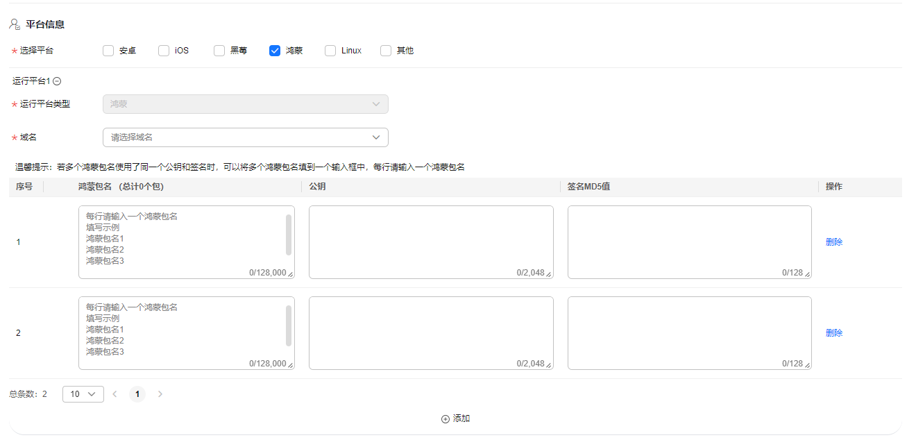
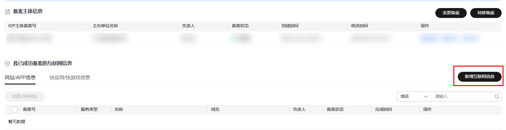
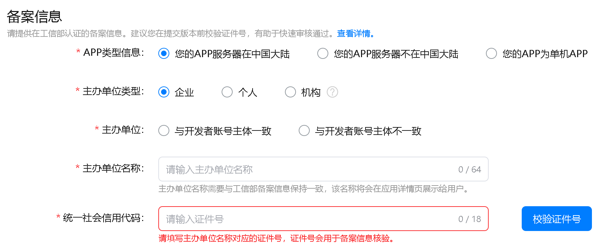
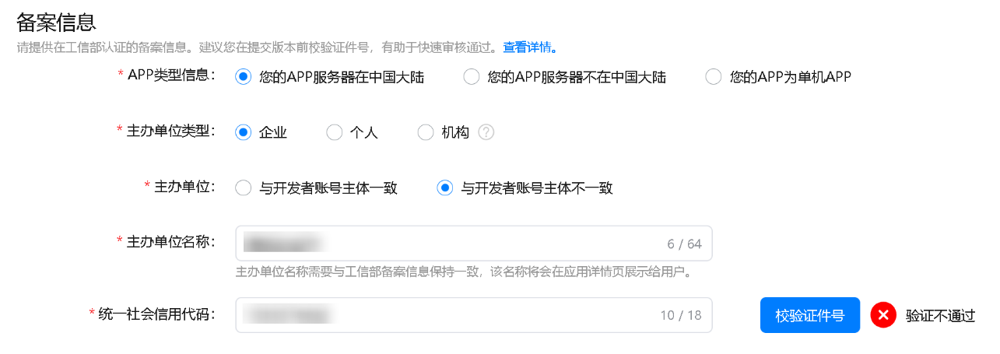
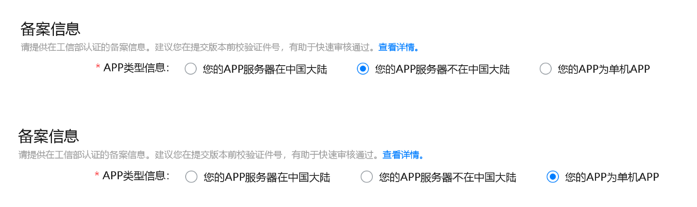
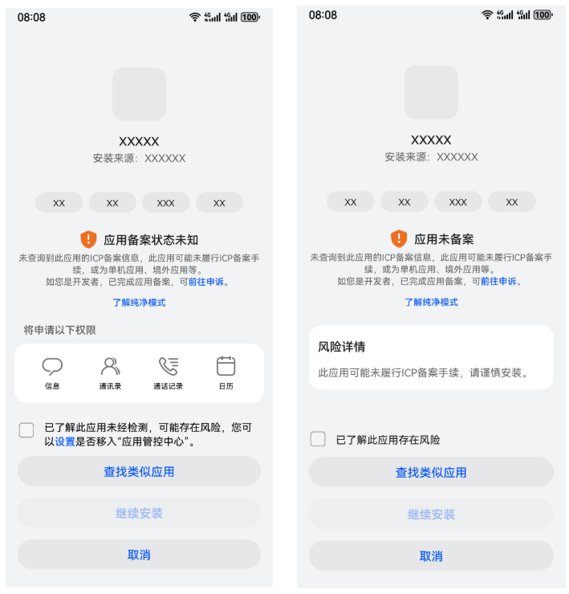

# APP核准（APP备案）指引

## 1. 概述

根据[《工业和信息化部关于开展移动互联网应用程序备案工作的通知》](https://www.miit.gov.cn/zwgk/zcwj/wjfb/tz/art/2023/art_920db564162e4312916a01bed6540ad8.html)要求，APP主办者应当依照[《中华人民共和国反电信网络诈骗法》](https://www.miit.gov.cn/jgsj/zfs/fl/art/2022/art_d30139b442a141f48f05775d8c0b3cee.html)第二十三条“设立移动互联网应用程序应当按照国家有关规定向电信主管部门办理许可或者备案手续”相关规定履行核准（备案）手续。未履行核准（备案）手续的，不得从事APP互联网信息服务。

## 2. APP核准（APP备案）路径及相关指引

不同类型的应用核准（备案）路径不同。

### 2.1 Android应用核准（备案）

请在您所选择的服务器提供商进行核准（备案），目前常见的有：华为云、阿里云、腾讯云、移动云、天翼云、联通云等。

[华为云核准（备案）](https://beian.huaweicloud.com/?utm_source=HUAWEI%2BDeveloper&utm_adplace=AdPlace099034)指引：&lt;https://support.huaweicloud.com/usermanual-icp/zh-cn_topic_0000002127712329.html&gt;

阿里云核准（备案）指引：&lt;https://help.aliyun.com/zh/icp-filing/basic-icp-service/user-guide/for-the-first-time-the-record-process?spm=a2c4g.11186623.0.0.abb4bcecUMrfca&gt;

腾讯云核准（备案）指引：&lt;https://cloud.tencent.com/document/product/243/97668&gt;

移动云核准（备案）指引：&lt;https://ecloud.10086.cn/op-help-center/doc/outline/35512&gt;

天翼云核准（备案）指引：&lt;https://www.ctyun.cn/document/10000037/10747389&gt;

联通云核准（备案）指引：&lt;https://support.cucloud.cn/document/127/593/756.html?id=756&arcid=1063&gt;

### 2.2 HarmonyOS应用核准（备案）

HarmonyOS应用核准（备案）要求与APP核准（备案）一致，均由接入商代为核准（备案）。请注意，在接入商核准（备案）系统填写材料时需选择“鸿蒙”平台。

示例：以华为云接入商为例，可在APP核准（备案）信息中的平台信息中进行选择（多选）。

同一主体下不同APP名称不可重复，不同运行平台下的同一款APP名称应保持一致。

1、如APP为首次核准（备案），按照实际APP上架平台选择平台类型即可，如上架平台为鸿蒙平台，则选择鸿蒙平台，并添加鸿蒙包名等信息。如存在多个包名，所有包名均需核准（备案）（可添加多个）。

2、如同一款APP已核准（备案）安卓或iOS等平台，需要新增上架鸿蒙平台（HarmonyOS应用），可申请变更核准（备案），增加勾选鸿蒙平台，并对应增加鸿蒙平台的包名等信息（可添加多个）。

### 2.3 元服务核准（备案）

元服务可基于[元服务核准（备案）指导](https://developer.huawei.com/consumer/cn/doc/atomic-guides/atomic-service-filing)直接前往[华为云核准（备案）平台](https://beian.huaweicloud.com/?utm_source=HUAWEI%2BDeveloper&utm_adplace=AdPlace099034)元服务通道进行核准（备案）。

### 2.4 快应用/快游戏核准（备案）

快应用/快游戏需要在华为云核准（备案）系统进行核准（备案），详细流程请参考[快应用核准（备案）指引](https://developer.huawei.com/consumer/cn/doc/quickApp-Guides/quickapp-icp-introduction-0000001773178236)、[快游戏核准（备案）指引](https://developer.huawei.com/consumer/cn/doc/quickApp-Guides/quickgame-filing-introduction-0000001806446261)。

1、如主体信息和快应用信息均未在任何接入商进行核准（备案），请参考[首次核准（备案）流程](https://developer.huawei.com/consumer/cn/doc/quickApp-Guides/quickapp-icp-system-first-0000001773327886)。

2、如主体信息已核准（备案），但快应用信息未在任何接入商进行核准（备案），请参考[新增互联网信息流程](https://developer.huawei.com/consumer/cn/doc/quickApp-Guides/quickapp-icp-system-add-0000001820007913)。

3、如主体信息和快应用信息已在其它接入商成功核准（备案），但未在华为云进行核准（备案），请参考[新增接入流程](https://developer.huawei.com/consumer/cn/doc/quickApp-Guides/quickapp-icp-system-access-0000001773168234)。

### 2.5 包名、APPID、公钥、签名等信息查询方式

**1、HarmonyOS应用查询包名方式**

登录 [AppGallery Connect](https://developer.huawei.com/consumer/cn/service/josp/agc/index.html#/) ，点击“APP与元服务”，输入应用名称可查询到需要核准（备案）的HarmonyOS应用包名。

**2、****快应用/快游戏获取APPID方式**

在填写快应用/快游戏核准（备案）信息时需输入APPID，获取方式请参考[获取APPID](https://developer.huawei.com/consumer/cn/doc/quickApp-Guides/quickapp-create-quickapp-0000001079835824#section975713401464)。请注意，核准（备案）时输入的APPID需与提交上架审核的APPID保持一致。

**3、****公钥、签名****MD5值等其他****特征信息****获取****方式**

可参考[App特征信息及其获取方式](https://support.huaweicloud.com/usermanual-icp/zh-cn_topic_0000002085120221.html)进行获取。

## 3. APP上架环节核准（备案）校验

根据[《工业和信息化部关于开展移动互联网应用程序备案工作的通知》](https://www.miit.gov.cn/zwgk/zcwj/wjfb/tz/art/2023/art_920db564162e4312916a01bed6540ad8.html)要求，“分发平台应在显著位置标明其分发的APP备案编号信息，并向电信主管部门报送分发的APP有关信息”，华为应用市场作为应用分发平台，需要对您的APP是否完成核准（备案）进行校验，校验成功后，对外显示您的APP核准（备案）编号信息并向相关部门报送。

若您的应用未完成APP核准（备案），请完成核准（备案）后再提交上架，否则将影响您的应用在华为应用市场的搜索和展示。

### 3.1 核准（备案）信息填写

请根据您的实际情况选择，“您的APP服务器在中国大陆”、 “您的服务器不在中国大陆”、“您的APP为单机APP”。我们的审核系统将对您填写的核准（备案）信息进行校验和审核，请如实填写。

**1、应用已核准（备案）**

（1）请选择APP类型信息：如您的应用已完成核准（备案），请选择“您的APP服务器在中国大陆”；

（2）请确认主办单位类型，请根据核准（备案）主办单位的实际情况勾选企业、个人或机构；

（3）请确认APP核准（备案）主办单位与开发者账号主体是否一致，如您的APP核准（备案）主办单位与开发者账号主体一致，请勾选与开发者账号主体一致，我们将使用您的账号主体信息与应用信息在监管侧系统进行核准（备案）校验。

勾选主办单位与开发者账号主体一致时，需确保上述主办单位类型勾选正确，否则无法正常完成校验，如您的核准（备案）主办单位类型为企业，请勿勾选个人。

（4）如APP主办单位与开发者账号主体不一致，请您手动录入核准（备案）主办单位名称、核准（备案）主办单位证件号信息，我们将根据您填写的核准（备案）信息和应用信息在监管侧系统进行核准（备案）校验。请确保您填写的核准（备案）主办单位名称和证件号信息与核准（备案）时填写的一致，并确保您的应用及其内容具备完整权利或充分授权，不得侵犯他人知识产权（包括商标、版权、专利、商业秘密和其他专有权利）或其他合法权益；

（5）您在提交版本前可以校验证件号，系统将根据您填写的证件号进行核准（备案）信息核验，如果您填写的“主体证件号”或APP核准（备案）的应用包名、应用名称、主办单位名称有误，均可能导致验证不通过。

在填写“主体证件号”时，要区分“数字5”和“字母S”，“数字1”和“字母I”，“数字0”和“字母O”。

**2、应用无需核准（备案）**

如您的应用由境外主体运营，且服务器仅放置在境外，可勾选“您的APP服务器不在中国大陆”；如您的应用为单机应用，可选择“您的APP为单机APP”。您需要提前了解我们对单机应用和境外应用的要求。

单机应用定义：

未通过连接公共互联网提供互联网信息服务的移动应用程序。

境外应用定义：

由境外主体运营且服务器仅放置在境外的移动互联网应用程序。

**3、已完成核准（备案），但APP核准（备案）校验未通过的原因**

如果您在AGC填写的“主体证件号”有误或APP核准（备案）的应用包名、应用名称、主体信息与在架信息不一致，均可能导致您的APP核准（备案）校验未通过。

3.2 核准（备案）信息补充填写

若您的应用尚未在华为应用市场发布，您可前往华为开发者联盟官网[注册账号](https://developer.huawei.com/consumer/cn/doc/start/registration-and-verification-0000001053628148)，并使用华为开发者账号登录[AppGallery Connect](https://developer.huawei.com/consumer/cn/service/josp/agc/index.html#/)（以下简称AGC），注册账号并完成实名认证后，即可在AGC中发布应用或使用AGC的服务。在AGC应用信息页面的“核准（备案）信息”模块可直接录入核准（备案）信息。

若您的应用已在华为应用市场发布，您可通过版本更新，并在“核准（备案）信息”模块录入核准（备案）信息。

### 3.3 核准（备案）信息需与在架信息一致

APP核准（备案）的应用包名、应用名称、主体信息与在架信息需保持一致，如果已经不一致，需要进行修改。

**1、 核准（备案）信息与在架信息不一致时修改建议**

（1）应用包名不一致：建议您直接在接入商的APP核准（备案）页面履行APP信息变更手续（具体可参考3.3-2“变更应用包名”）；

（2）应用名称不一致： 您可以选择在接入商的APP核准（备案）页面履行APP信息变更手续（具体可参考3.3-2“变更应用名称”），或者在AGC页面，修改上架应用名称；

如果修改上架应用名称，需要确保修改后的信息符合上架审核要求，否则可能会被驳回，具体以审核意见为准。

（3）主体信息不一致：①如果核准（备案）主体在AGC有账号，可以进行[应用转移](https://developer.huawei.com/consumer/cn/doc/app/agc-help-transferapp-0000001099998802)手续，将已核准（备案）的应用转移到已核准（备案）的主体下，然后重新提交上架申请，在AGC页面填写正确的主体信息；②如果核准（备案）主体在AGC没有账号，可以用核准（备案）主体新建一个账号并进行[应用转移](https://developer.huawei.com/consumer/cn/doc/app/agc-help-transferapp-0000001099998802)手续，或在接入商的APP核准（备案）页面进行主体变更（具体可参考3.3-2“变更主体信息”），将核准（备案）主体变更为上架的开发者；③您也可以在AppGallery Connect应用信息配置页面的“核准（备案）信息”栏中勾选“与开发者账号主体不一致”，同时填写APP核准（备案）主体（主办单位）的信息，包括主办单位名称和证件号。

请确保您的应用及其内容具备完整权利或充分授权，不得侵犯他人知识产权（包括商标、版权、专利、商业秘密和其他专有权利）或其他合法权益。

**2、核准（备案）页面履行APP信息变更手续操作指导**

APP信息变更手续需要在核准（备案）的接入商进行操作，以[华为云接入商](https://support.huaweicloud.com/pi-icp/icp_03_0007.html)为例，登录[华为云核准（备案）系统](https://auth.huaweicloud.com/authui/login.html?service=https://console.huaweicloud.com/beian/#/login)，在“我的ICP核准（备案）”找到“已完成核准（备案）”的信息：

（1）变更应用包名：选择 “变更互联网信息”，根据实际情况选择对应APP，单击“变更”，点击APP信息-平台信息- APP包名，填写上架的应用包名（上架的APP包名可以登录[AppGallery Connect网站](https://developer.huawei.com/consumer/cn/service/josp/agc/index.html#/)，选择“我的项目” ，在“应用”信息下，页面中的 “包名”即为**应用包名**）修改后单击“保存”；

（2）变更应用名称：选择 “变更互联网信息”，根据实际情况选择对应APP，单击“变更”，点击APP信息- APP名称，填写上架的应用名称，修改后单击“保存”；

（3）变更主体信息：选择 “变更主体”，点击主办单位信息-单位名称，修改为在架应用的开发者名称后单击“保存”。

4. APP安装环节核准（备案）提示申诉指引

根据[《工业和信息化部关于开展移动互联网应用程序备案工作的通知》](https://www.miit.gov.cn/zwgk/zcwj/wjfb/tz/art/2023/art_920db564162e4312916a01bed6540ad8.html)要求，“智能终端生产企业不得为未履行备案手续的APP提供网络接入、分发、预置等服务”，华为作为智能终端生产企业，在应用安装环节需对未核准（备案）的应用进行校验。因此有部分应用在安装器上安装时会提示“应用核准（备案）状态未知”或“应用未核准（备案）”。如您是开发者，且已完成核准（备案），可按以下指引进行申诉，上报核准（备案）信息，解除提示。

4.1 手机端提示“应用核准（备案）状态未知”或“应用未核准（备案）”

场景一：提示“应用核准（备案）状态未知”，通常原因为应用首次安装，核准（备案）状态未知。

场景二：提示“应用未核准（备案）”，通常为系统核准（备案）校验不通过。

如果您的应用已完成核准（备案）但仍遇到以上两种场景，可点击[链接](https://developer.huawei.com/consumer/cn/service/josp/agc/index.html#/interactive/feedback)进行问题反馈：

提供主办者（主办单位）的真实身份信息、应用基本信息(应用名称、包名等)、网络接入信息等。我们将使用这些信息作为条件查询监管侧系统，核准（备案）校验通过，安装器上的应用未核准（备案）提示将会解除。

4.2 收到核准（备案）提示的原因

为避免您的手机受到恶意应用侵扰，保护您的隐私和数据安全，[纯净模式](https://tips-p01-drcn.dbankcdn.cn/MODEL/EMUI/C00B031/resource/ug/202403221idnj6/zh-cn/content/17_safety/SF-10044537_f102.html?share=domestic)构建了系统基础保护机制，为您提供更安全可靠的应用安装和运行环境。在纯净模式下，当您安装通过浏览器等非华为应用市场来源下载的应用时，将收到安全提醒。

4.3 应用无法继续安装的原因

如您开启了[纯净模式](https://tips-p01-drcn.dbankcdn.cn/MODEL/EMUI/C00B031/resource/ug/202403221idnj6/zh-cn/content/17_safety/SF-10044537_f102.html?share=domestic)增强防护开关，将获得更高等级和更便捷的安全防护。开启后，手机仅支持安装经华为应用市场安全检测的应用。未经华为应用市场安全检测的应用将禁止安装。

## 5. 咨询及反馈

若您还有其他核准（备案）相关疑问，可点击[链接](https://developer.huawei.com/consumer/cn/service/josp/agc/index.html#/interactive/feedback)进行问题反馈；若您未注册华为应用市场账号，请发邮件至 developer@huawei.com（应用类），game.business@huawei.com（游戏类）进行咨询。