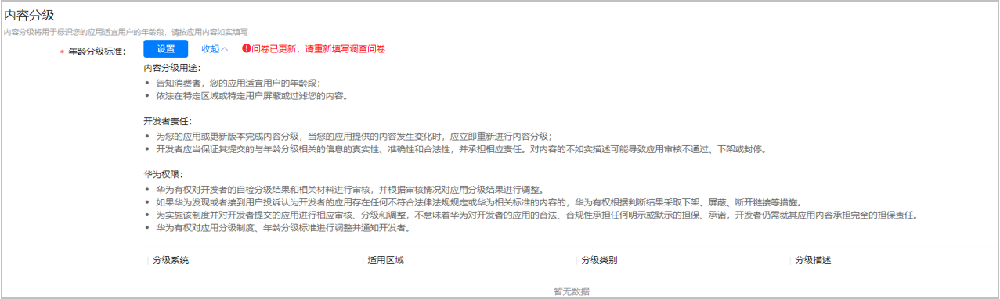
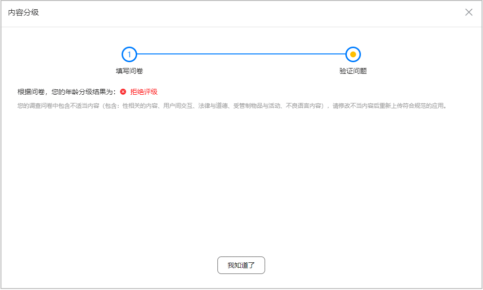
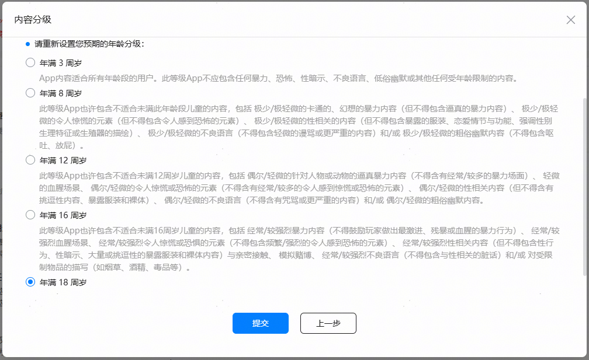
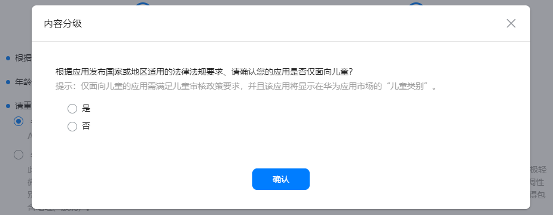
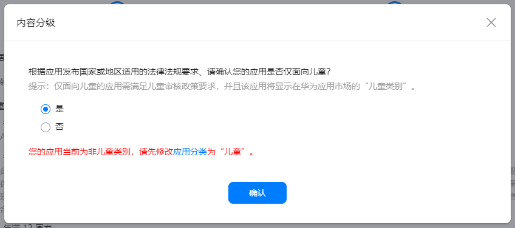

# 应用年龄分级问卷FAQ

年龄分级作为应用的必填信息，便于开发者向用户说明应用的适用对象。年龄分级作为应用的重要属性在华为应用市场直接展示给用户，帮助用户找到适合其年龄等级的应用，进一步为未成年人用户打造纯净的使用环境。

## 一、为什么要填写年龄分级问卷来获取年龄分级结果？

为了更好的服务用户，帮助用户找到适合其年龄的APP，协助开发者对APP内容进行年龄分级管理，华为应用市场上线年龄分级问卷服务，您可通过如实回答年龄分级问卷问题，获得应用的年龄分级结果。

## 二、如何填写年龄分级问卷？

您可在应用上架—版本信息—内容分级模块进行年龄分级问卷填写，详细的操作指导以及注意事项，请查看操作指导文档[《发布应用》中的【设置内容分级】章节](https://developer.huawei.com/consumer/cn/doc/distribution/app/agc-help-releaseapkrpk-0000001106463276#section71301229497)。

## 三、每次提交上架申请都需要重新填写年龄分级问卷吗？

1、年龄分级问卷服务新能力上线，所有应用上架均需要填写一次年龄分级问卷，获得年龄分级结果。

2、如果您的应用内容、功能发生变化，请您重新自行填写年龄分级问卷，请务必据实回答年龄分级调查问卷中的问题，对应用内容的虚假陈述可能会导致应用被下架或冻结。

3、年龄分级问卷可能会不定期更新。如果年龄分级问卷内容发生变更，系统会提醒您“问卷已更新，请重新填写调查问卷”。

## 四、年龄分级问卷结果显示为“拒绝评级”，是什么含义？

如果点击“验证”后年龄分级结果显示为“拒绝评级”，可能是因为应用含有色情、恶意攻击他人、烟草等违法违规内容，您可以通过查看页面中拒绝评级的详细描述了解具体原因，并可以在修改不当内容后重新上传符合规范的应用。

## 五、年龄分级问卷中，选择预期的年龄分级是什么意思？

基于年龄分级问卷填写结果，您可获得应用适用的最低年龄分级，在此基础上，您可结合自身应用的目标受众，选择预期的年龄分级作为您应用最终的年龄分级结果。

例如：如果应用的年龄分级问卷验证结果显示为“16+” ，但您认为其内容更适合18岁以上的用户，则可以在“请重新设置您预期的年龄分级”下方选择“年满18周岁”，则在AppGallery上，该应用的最终年龄分级将显示为“18+”。

## 六、为什么怎么填写年龄分级问卷，年龄分级结果都是18+？

1、请先检查应用分类/标签是否已填写，如应用分类/标签未填写，或导致年龄分级结果锁定为18+。

2、如应用分类/标签已填写，年龄分级结果仍为18+，则表示您的应用内可能包含不适合未满18周岁未成年人的内容，您可调整应用内容后，重新填写年龄分级问卷。

## 七、年龄分级结果对应用有什么影响？

年龄分级结果作为应用的重要属性在华为应用市场直接展示给用户，帮助用户找到适合其年龄等级的应用。

如用户在“内容访问限制”中设置了“应用等级”信息，那么只有所设置年龄等级或低于该年龄等级的应用才允许被用户安装使用。

## 八、年龄分级结果与审核意见不符，应该如何修改？

请按照审核意见进行相应的修改，根据应用内容、功能如实填写年龄分级问卷，如果问卷的最低年龄分级结果仍不满足审核要求，您可在年龄分级问卷中的验证页面“预期的年龄分级”选择适用的年龄分级。

## 九、年龄分级问卷新增的目标受众确认选项，不同的选择结果对应用分别有何影响？

当您完成年龄分级问卷填写后，如您应用的年龄分级结果适用于儿童，请您按照年龄分级问卷弹窗的提示信息（图一），确认“您的应用是否仅面向儿童？”如您的应用仅面向儿童，请选择“是”（图二），并确保应用分类至“儿童”类别，否则您的应用将无法发布或更新。请根据相关提示，进行修改 。

图一：

图二：

如您还有其他疑问，请于华为应用市场[互动中心](https://developer.huawei.com/consumer/cn/service/josp/agc/index.html#/interactive)咨询。