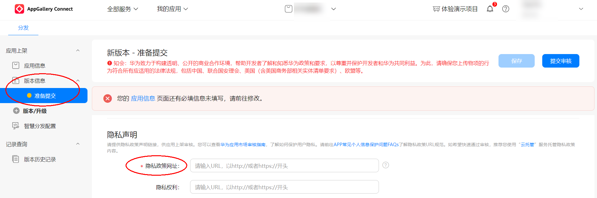
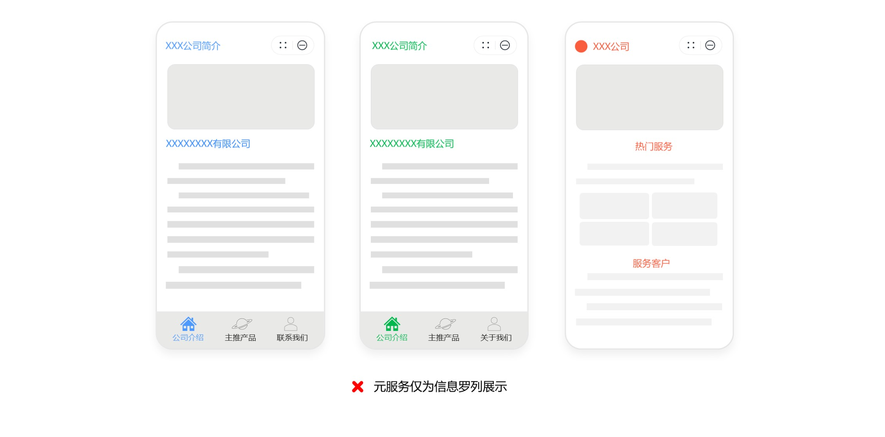
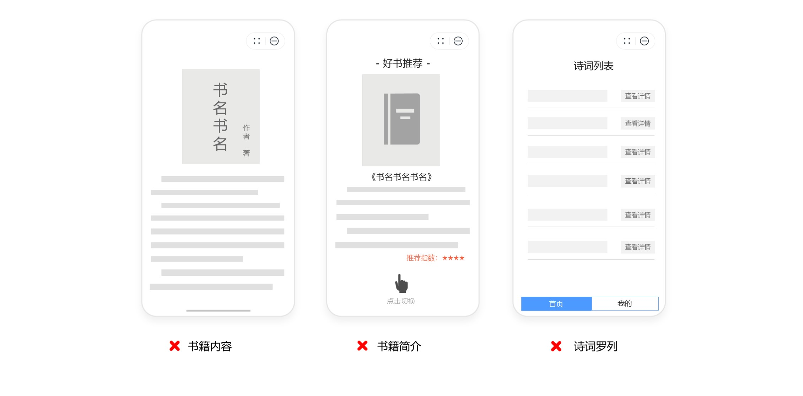
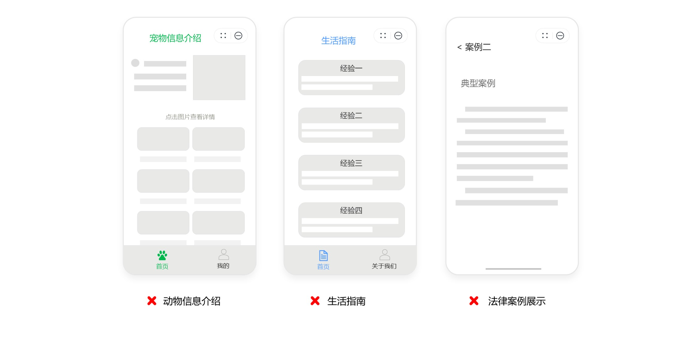
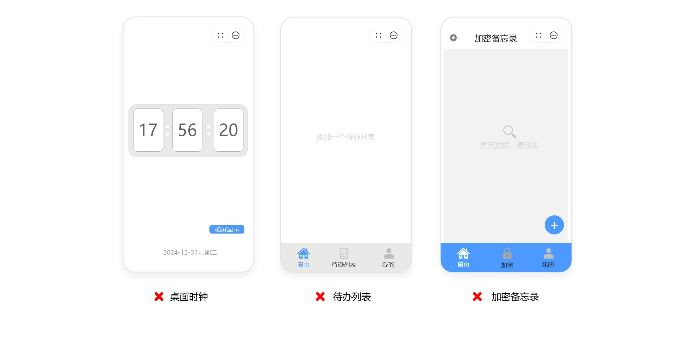
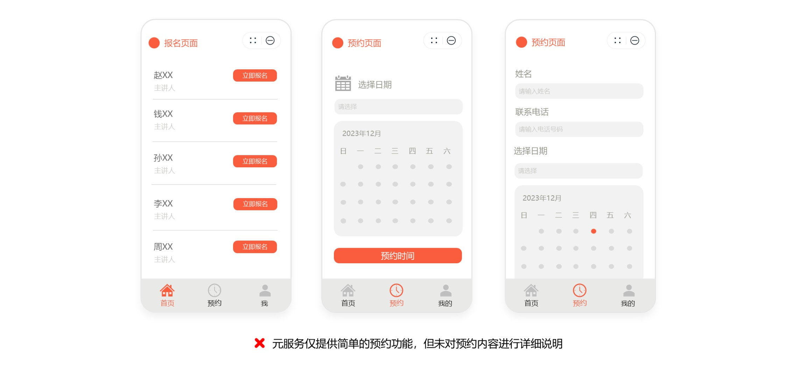
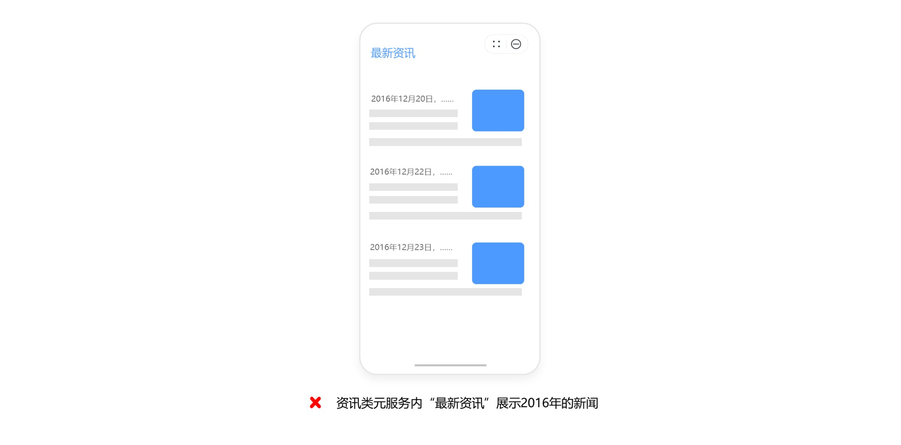
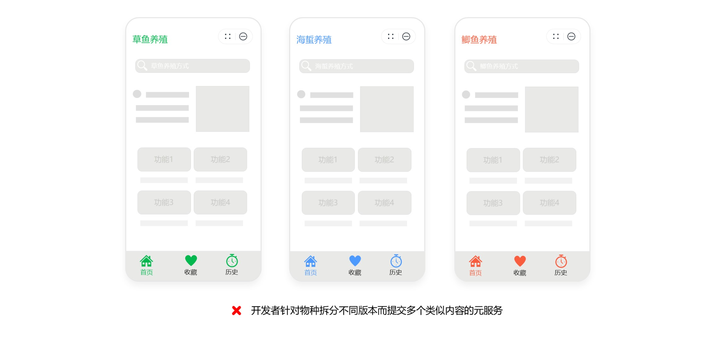
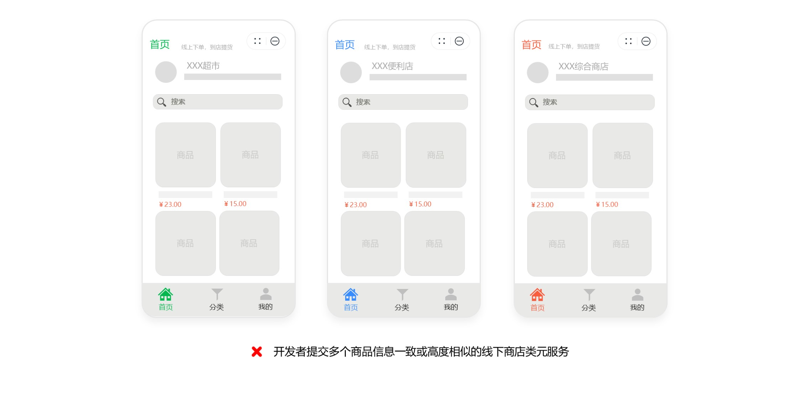

# 元服务审核FAQ

## 一、华为应用市场的元服务审核需要多长时间？

元服务审核一般需要1-3个工作日。如遇到您的元服务审核未通过，我们会邮件通知您修正后再提交审核。如您的元服务因做活动或其他需求，需要在特定时间节点前发布，请预留充足的元服务审核和修改时间，提前安排您的元服务发布计划。如您的元服务临时出现严重错误，需要紧急修复，可以申请加急审核。您可在互动中心详细描述需加急审核的原因，工作人员将尽快安排审核。

## 二、元服务常见的驳回/下架原因有哪些？

1、元服务存在功能异常/功能不完善的问题，如：启动白屏、无内容展示、深色模式下显示异常、点击无响应、运行时闪退、报错等。

2、元服务存在不符合设计规范的问题，如：图标与模板重合度较差、组件圆角大小不符合规范、服务卡片有圆角裁切、四周安全边距不符合设计要求等。元服务设计规范请参考：[元服务设计](https://developer.huawei.com/consumer/cn/doc/design-guides/ux-guidelines-overview-0000001938867005)、[元服务 UX 体验标准](https://developer.huawei.com/consumer/cn/doc/design-guides/ux-standard-overview-0000002019655177)。

3、元服务图标存在不符合设计规范的问题，如：图标尺寸不符合标准（512px \* 512px）、外圈样式与睫毛图标不重合或者内部圆形表示不完整独立、未配置透明图标背景、元服务图标外圈装饰线HSB值为黑色/白色等。您可参考：[元服务图标生成工具生成使用步骤](https://developer.huawei.com/consumer/cn/doc/atomic-guides/atomic-service-icon-generation)、[元服务图标设计规范](https://developer.huawei.com/consumer/cn/doc/design-guides/ux-guidelines-overview-0000001900384976)。

4、元服务存在隐私不合规问题，如：未在首次启动元服务时显著提示用户阅读隐私政策、元服务涉及定向推送但未在元服务内提供关闭选项或未在主功能界面进行显著标识、向用户提前索权等。

5、元服务欠缺独特性和实用价值，如：仅为信息罗列展示、与手机系统自带的功能重复、功能设计无法让用户清晰地感知到元服务实质功能及价值、资讯类元服务内容老旧过时等。（详细请参见：[问题十二](https://developer.huawei.com/consumer/cn/doc/app/50150#h1-1735607280122-0)）

6、同质化元服务，如：提供的功能高度相似，没有差异化的亮点功能；图标样式、页面布局、交互操作等高度相似；信息来源、内容分类、排版等高度相似等。（详细请参见：[问题十三](https://developer.huawei.com/consumer/cn/doc/app/50150#h1-1735608198804-0)）

## 三、元服务信息需要满足什么要求？

元服务信息，包括但不限于元服务名称、元服务图标、元服务介绍（包括一句话简介、新版本特性）、元服务分类、语言、内容分级、开发者信息、隐私信息（如隐私政策、权限说明等）。

1、元服务信息不得出现低俗、涉黄、涉赌、涉毒等违法违规内容。

2、元服务信息需与元服务实际内容相符。

3、元服务信息中如使用其他品牌信息，为避免给用户造成混淆以及带来知识产权侵权索赔的风险，需提前获得授权。

4、元服务名称需独特。请不要使用广义归纳、普遍且不具辨识性的词汇或热门搜索词，避免干扰搜索结果及误导用户，包括但不限于使用商标术语、热门应用名称或别称、流行词、行业名词、职业名词、类别词、功能性描述的词汇，以及在名称中堆砌多个关键词，如手机定位、手电筒、日历、视频剪辑去水印修图等。

5、元服务名称不得含有占位符文本、乱码、表情符号、特殊符号 (如“\*” “&”“-”“( )”) 。

元服务信息具体审核要求，请参考元服务审核指南“[1. 元服务信息](https://developer.huawei.com/consumer/cn/doc/app/50129-01)”章节。

## 四、内容合规具体要求有哪些？

1、危害国家安全，泄露国家秘密，颠覆国家政权，破坏国家统一的；

2、损害国家荣誉和利益的；

3、歪曲、丑化、亵渎、否定英雄烈士事迹和精神，以侮辱、诽谤或者其他方式侵害英雄烈士的姓名、肖像、名誉、荣誉的；

4、宣扬恐怖主义、极端主义或者煽动实施恐怖活动、极端主义活动的；

5、煽动民族仇恨、民族歧视，破坏民族团结的；

6、破坏国家宗教政策，宣扬邪教和封建迷信的；

7、散布谣言，扰乱经济秩序和社会秩序的；

8、散布淫秽、色情、赌博、暴力、凶杀、恐怖或者教唆犯罪的；

9、侮辱或者诽谤他人，侵害他人名誉、隐私和其他合法权益的；

10、法律、行政法规禁止的其他内容。

## 五、提交审核时，为什么提示“应用名称最多可支持修改2次，您本年度的修改次数已达上限，无法继续修改”？

为更好的保护开发者权益，提升用户体验，华为应用市场对元服务名称修改次数进行了限制。元服务名称一个自然年内最多可支持修改2次，未用完次数不可累积。超过规定的修改次数后将无法继续提交。

如需再次修改，需提供商标等证明文件并说明修改原因，请您谨慎修改。如有疑问可在华为应用市场[互动中心](https://developer.huawei.com/consumer/cn/service/josp/agc/index.html#/interactive)咨询。

## 六、元服务常见的功能问题有哪些？

1、元服务卡片启动失败、启动后白屏、启动后显示“hello world”。

请确保您的元服务entry包必须存在且一定要有符合上架要求的合规内容，建议您将部分或全部feature包的内容迁移到entry包，迁移成功后，删除内容重复的feature包。

2、手机深色模式下，元服务内字体无法辨认等显示异常问题。

请确保您的元服务卡片适配深色模式，避免因深色模式和非深色模式间切换导致服务卡片内容显示异常，确保内容的可阅读性，便于用户识别内容。

3、元服务存在功能模块点击无响应、运行时闪退、报错、功能模块未开发完善、元服务内模块无内容展示、UI界面显示不全、显示白屏等问题。

如使用元服务时有特殊配置或特殊使用环境，请在提交审核时备注说明所需的相关资源或信息。

元服务功能具体审核要求，请参考元服务审核指南“[3. 元服务功能](https://developer.huawei.com/consumer/cn/doc/app/50129-03)”章节。

如以上指引仍无法解决您的问题，您可在华为应用市场[互动中心](https://developer.huawei.com/consumer/cn/service/josp/agc/index.html#/interactive)咨询，我们将协助您定位相关问题。

## 七、元服务常见的隐私不合规问题有哪些？

1、元服务未在首次启动元服务时显著提示用户阅读隐私政策。

2、元服务涉及定向推送或广告精准营销，但未在元服务内提供关闭或拒绝的选项或功能；或未在主功能界面以“推荐”“为你推荐”“个性化”“标签化”“猜你喜欢”等字样进行显著标识。

3、元服务首次运行，在展示使用权限对应的相关产品或服务之前，提前向用户申请授予敏感权限。

4、元服务隐私政策内的开发者名称及元服务名称与在应用市场上展示的信息不一致。

元服务信息具体审核要求，请参考元服务审核指南“[7. 用户隐私](https://developer.huawei.com/consumer/cn/doc/app/50129-07)”章节。

## 八、元服务需要调整在AppGallery Connect上提交的隐私政策网址，入口在哪里？

隐私政策链接提交入口：[AppGallery Connect 网站](https://developer.huawei.com/consumer/cn/service/josp/agc/index.html#/) > [APP与元服务](https://developer.huawei.com/consumer/cn/service/josp/agc/index.html#/myApp) > 点击对应应用名称 > 版本信息 > 隐私声明。

## 九、元服务不涉及收集用户个人信息，是否需要提供隐私政策？

根据《个人信息保护法》的要求，个人信息处理者在处理个人信息前，应当以显著方式、清晰易懂的语言真实、准确、完整地向个人告知有关事项。因此，对于收集用户个人信息的元服务，应当及时公开隐私政策，并便于用户查阅和保存。

若您的元服务不涉及收集用户个人信息，请在元服务内注明不涉及收集用户个人信息。同时，在AppGallery Connect上提交的隐私政策网址内容中也需注明该元服务不涉及收集用户个人信息。

## 十、我公司同时运营同一业务的元服务和APP，元服务可以和APP共用隐私政策吗？

假若您同时运营同一业务的元服务和APP，如果元服务与APP的业务功能及收集的用户个人信息类型完全一致，则元服务可以和APP共用隐私政策；但如果您的元服务与APP的业务功能及收集的用户个人信息类型不完全一致，则需要为元服务专门制定个人信息处理规则，不可直接复用APP的隐私政策。元服务的隐私政策内容需和元服务在运行中对用户个人信息的收集及处理保持一致。

## 十一、为什么元服务被判定为欠缺独特性和实用价值？

1、元服务仅为信息罗列展示，未向用户提供实际服务。

示例①：企业黄页类元服务，仅展示文字信息、图片介绍，不提供用户服务。

示例②：元服务仅为书籍内容或简介，或诗词、名句等内容罗列。

示例③：元服务仅为有限信息资讯，如信息科普、生活指南等。

2、元服务功能与手机系统自带的功能重复，缺乏独特价值。

示例：

3、元服务功能设计无法让用户清晰地感知到元服务实质功能及价值。

示例①：元服务页面仅提供简单的预约功能，但未对预约内容进行详细说明，未体现功能的实质价值，未给到用户清晰、准确的服务预期。

4、资讯类元服务内容老旧、过时。

示例①：元服务内“最新资讯”模块展示2016年的新闻。

## 十二、什么情况下我提交或上线的元服务被判定为同质化？

同质化元服务包括但不限于：

1、功能：提供的功能高度相似，没有差异化的亮点功能；

2、UI、UX：图标样式、页面布局、交互操作等高度相似；

3、内容：信息来源、内容分类、排版等高度相似。

大量相似的元服务会导致用户混淆，请确保您提交或上线的元服务之间在名称、页面、内容、功能上相互具有可辨识性和不可替代性，避免影响用户体验。

常见案例：

示例①：

示例②：

## 十三、我的元服务可以与其他开发者的元服务名称、图标、外观、内容等相同或高度相似吗？

不可以，上传与他人高度相似的元服务可能会误导用户认为元服务及其内容来源于他人或与他人存在特定联系，或给您带来知识产权侵权索赔的风险。请确保您的元服务名称、图标、外观、内容具有独特性，或者提供相关授权或商标权属证明。如您已取得了权利人的有效授权，请确认该权利授权方名下无名称、图标、外观、内容相似的元服务。

如您发现在华为应用市场运营的元服务或内容侵犯了您的合法权益，可按流程对存疑内容进行投诉，详细请参见：[华为应用市场侵权投诉处理指引](https://developer.huawei.com/consumer/cn/doc/app/50120)。

## 十四、如果我的元服务违反《元服务审核指南》，华为应用市场将会采取哪些处理措施？

对于违反审核指南的元服务，华为应用市场有权单方视情节轻重调整处理措施，包括对开发者及对其元服务的处理。

详情请参见：[开发者账号与应用处理原因及措施](https://developer.huawei.com/consumer/cn/doc/distribution/app/50109)。

## 十五、元服务内使用华为账号登录方式有哪些注意事项？

如果您的元服务需要构建账号体系，需使用华为账号登录能力。请规范使用平台提供的登录能力，无需设计登录/注册功能及页面，不可使用自行设计实现的登录页面、登录面板等登录界面。

详情请参见：[登录开发指导文档](https://developer.huawei.com/consumer/cn/doc/atomic-guides/account-atomic-silent-login)、[华为账号登录管理细则](https://developer.huawei.com/consumer/cn/doc/atomic-guides/account-guide-atomic-detailedrules)、[开发者可以使用自行设计的登录界面吗？](https://developer.huawei.com/consumer/cn/doc/atomic-faqs/faqs-common-account-5) 。

## 十六、元服务用的华为账号也需要提供注销账号功能吗？

需要。当元服务涉及账号体系，但未使用自有账号体系，或有自有账号体系但用户未关联账号时，请在用户界面提供删除非账号信息、删除用户数据的功能选项，清除用户基于openID产生的使用数据等，而仅保留用户标识openid/unionid信息，并保持华为账号静默登录状态。

当元服务涉及账号体系，且存在自有账号体系，在用户关联账号后，请在用户界面提供注销自有账号的功能选项，功能选项名称需表述清晰，为了避免歧义，请勿直接使用“注销账号”或“账号注销”，需要明确注销对象为自有账号而非华为账号，如“注销XX账号”。用户注销自有账号，您需同时解除自有账号与华为账号的关联，并保持华为账号静默登录状态。

元服务账号设计规范及账号关联相关设计可参考：[最佳设计实践-账号](https://developer.huawei.com/consumer/cn/doc/design-guides/accounts-0000001967444380)、[开发者怎么在元服务中使用开发者账号体系？](https://developer.huawei.com/consumer/cn/doc/atomic-faqs-V5/faqs-common-account-6-V5)

## 十七、我的元服务为什么需要有举报功能？

根据《移动互联网应用程序信息服务管理规定》，要求应用程序提供者自觉接受社会监督，设置醒目、便捷的投诉举报入口，公布投诉举报方式，健全受理、处置、反馈等机制，及时处理公众投诉举报。元服务常见需要有举报功能的场景：1、用户生成的内容，如：聊天、评论、社区等；2、含深度合成或生成式人工智能服务，如AI对话等；3、含求职招聘功能。请在相应模块设置“举报”功能按钮。

更多具体审核注意事项，请参考审核指南“[部分类型应用注意事项](https://developer.huawei.com/consumer/cn/doc/app/50115#h1-1691639693501-0)”章节。

## 十八、APP备案常见问题及注意事项

所有元服务均需完成APP备案。元服务备案要求与APP备案一致，均由接入商代为备案。请注意，在接入商备案系统填写材料时需选择“鸿蒙”平台，并确认在AppGallery Connect填写的证件号中字母、数字的书写准确。详细请参考：[元服务核准（备案）](https://developer.huawei.com/consumer/cn/doc/atomic-guides/atomic-service-filing)。

## 十九、元服务资质常见问题及注意事项

部分行业的资质要求及资质模板文件可参考：[元服务资质审核要求](https://developer.huawei.com/consumer/cn/doc/app/80302)。元服务开放的分类标签及对应的资质要求，会随着相关政策、法律法规以及平台要求而变化。如有疑问可咨询客服，并以最终审核意见为准。

## 二十、服务商代品牌方开发上架的情况，需要提供授权吗？

品牌方与服务商存在授权关系的，需提供合作授权，授权书可参照模板：[元服务运营授权书模板.zip](https://communityfile-drcn.op.dbankcloud.cn/FileServer/getFile/cmtyManage/011/111/111/0000000000011111111.20250725104730.84625237360602964011661223365791%3A50001231000000%3A2800%3A3E0B58C28B15E7515C74EA58BC3F03997551BAD781C4E2A51EFAF24E4495CE5C.zip?needInitFileName=true)。