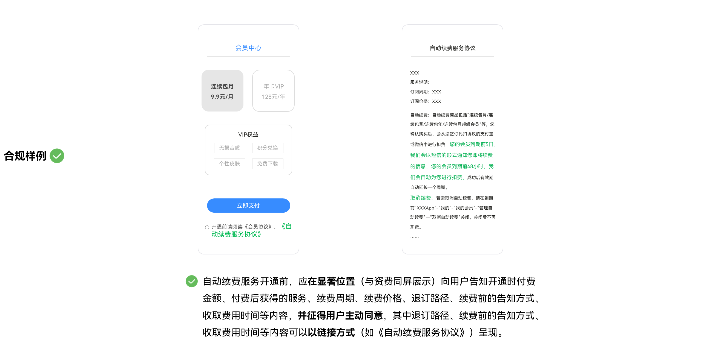
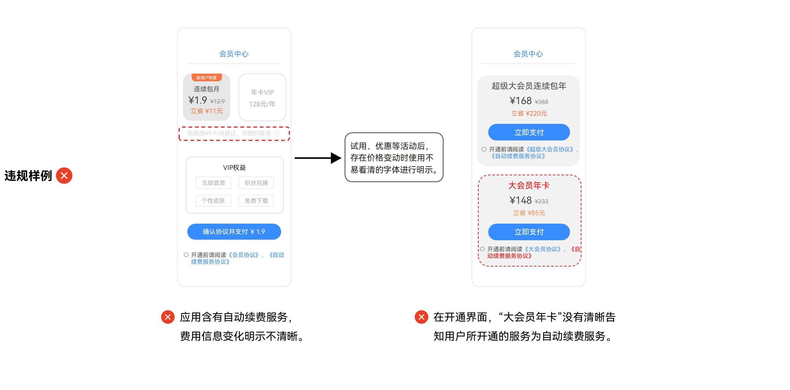
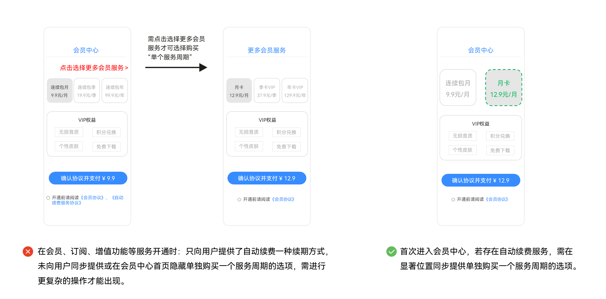
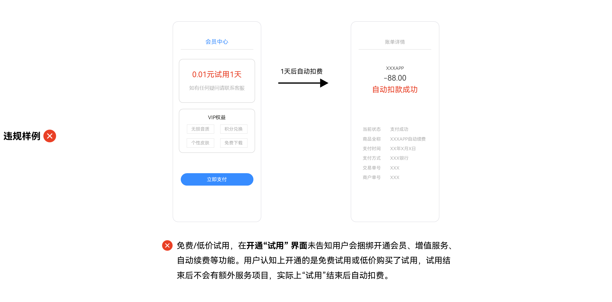
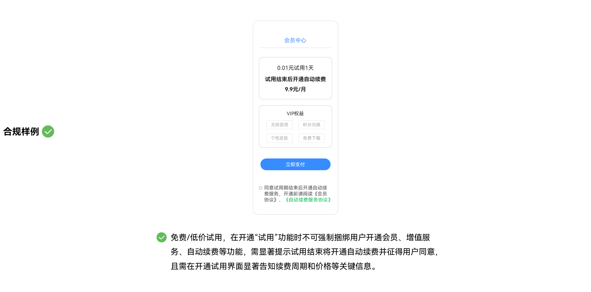
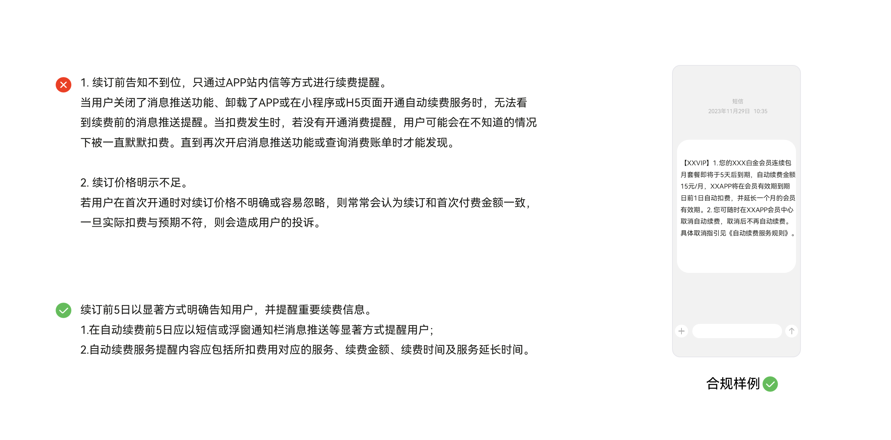

# APP自动续费服务FAQ

## 1. 自动续费服务开通前，需在商品购买或订阅支付界面醒目位置，明示自动续费服务协议，并征得用户主动同意。

续费前应在显著位置向用户明示完整的关键信息，且自动续费服务收取的资费，应与向用户宣传、承诺的保持一致。

关键信息包含：开通时的付费金额、付费后获得的服务、续费周期、退订路径、续费价格、续费前的告知方式和告知时机、收取费用时间等。

## 2. 不应以恶意跳转、虚假图片视频等方式强制或诱导用户开通服务事项。

## 3. 自动续费关键信息需明示到位。

（1）费用信息明示应清晰，试用、优惠活动后，存在价格变动时，需以清晰易懂、简单显著的方式向用户进行明示；

（2）续订方式应清晰，在开通界面，应清晰告知用户所开通的服务为自动续费服务；

## 4. 自动续费服务开通时，应同步提供单次开通服务的选项。

注：个人云存储等需持续存储用户数据的服务除外。

## 5. 提供免费或低价试用功能的，试用结束后应征得用户同意再开通自动续费服务；存在优惠期结束后价格变动的情况，在服务开通前应以清晰易懂、简单显著的方式向用户进行明示。

注：免费试用是指在服务开通时没有发生用户支付的行为。

## 6. 服务过程中应遵循的要求

（1）用户实际享受的服务应与明示的内容保持一致，服务事项有效期内，服务内容出现变动的，应提前告知用户，若用户明确表示不接受，应采取协商等途径解决用户合理诉求；

（2）应用应提供自动续费管理页面向用户展示其全部已购买且在有效期内的自动续费服务信息，包括服务内容、续费时间、续费金额等。

## 7. 服务续期前需提醒到位，续订前5日以显著方式明确告知用户，并提醒重要续费信息。

## 8. 退订自动续费时的操作步骤应简单便捷，且不应设置不合理的条件。

（1）退订自动续费时的操作步骤应简单便捷，且不应设置不合理的条件。例如需要提供超出在服务使用时提供的身份验证等；

（2）自动续费新的服务周期未开始前，用户应可以随时申请退订，服务提供者不应以当前周期剩余时间不够等理由拒绝同意用户诉求；

（3）存在一账通账号体系且同一主体下不同产品存在单独自动续费服务的，不同产品的应用应向用户提供单独的退订方式；

（4）同一产品在不同端（如APP/小程序）开通自动续费服务的，应提供便捷的退订方式，不应强制要求用户下载APP进行退订；

（5）若用户注销时，账号存在自动续费服务的，应明确告知并引导用户取消自动续费服务。