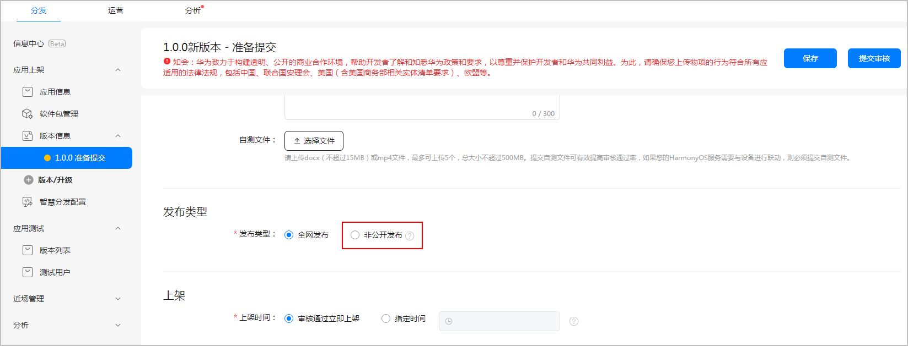
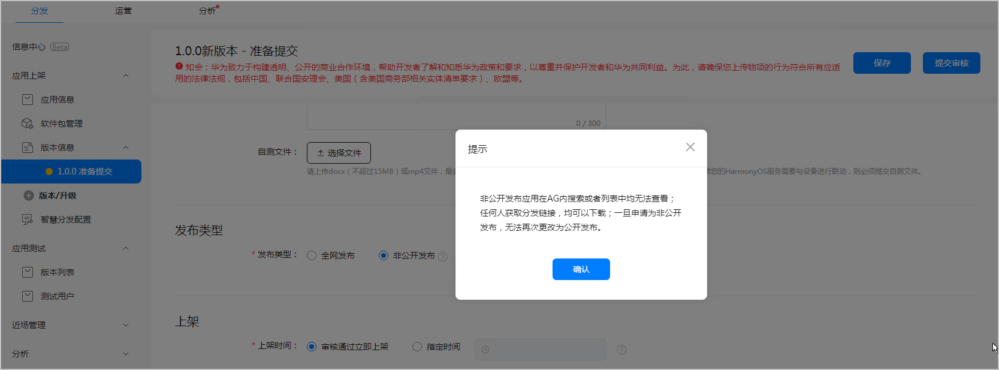
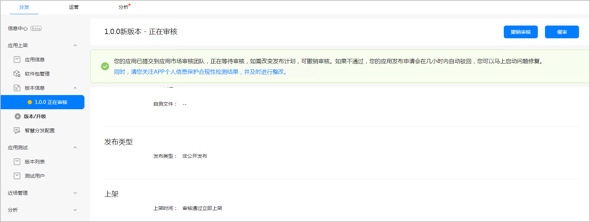
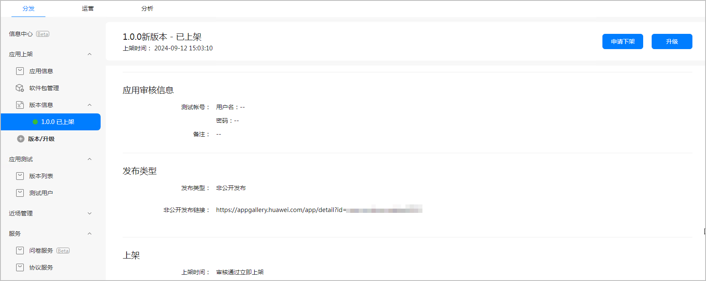
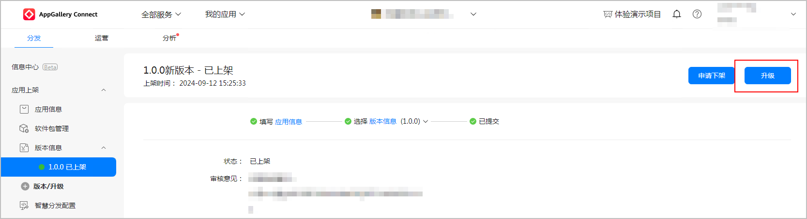
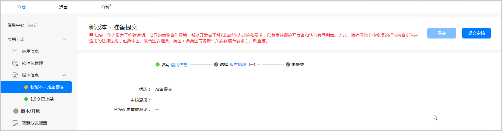
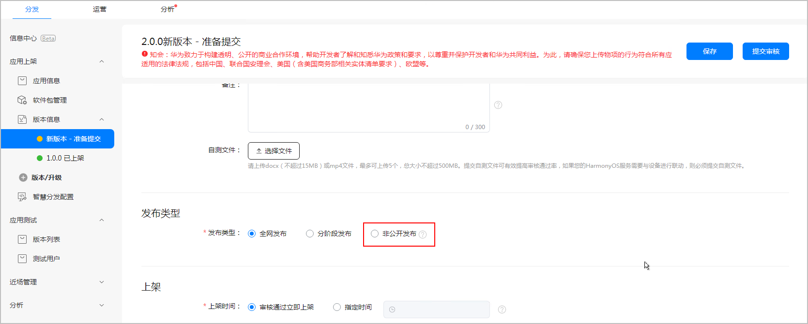
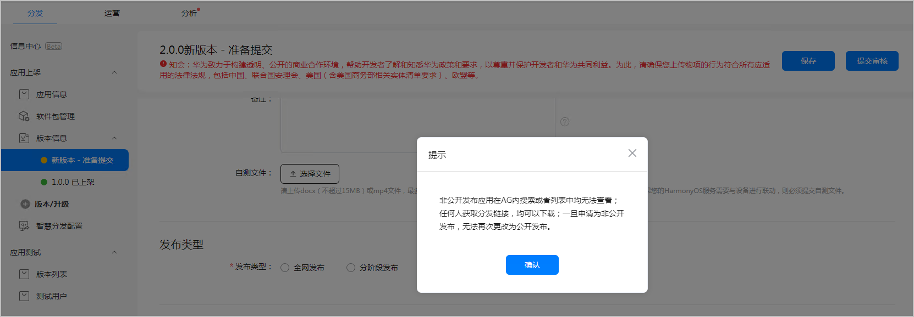
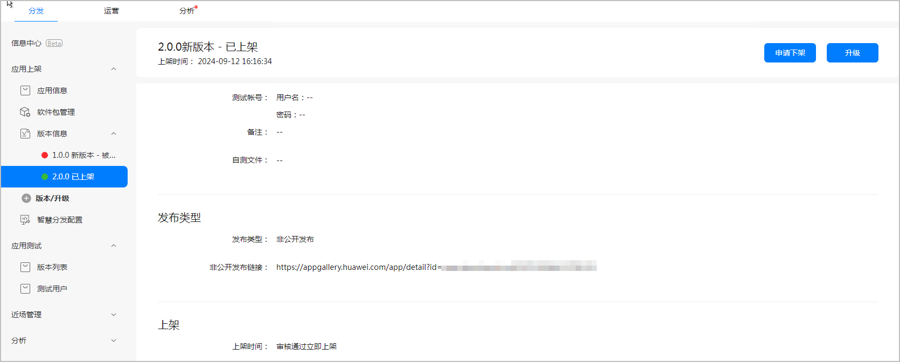

# 非公开发布

## 概述

非公开发布是指您可以将不适合公开分发的应用以非公开方式在华为应用市场上发布，使其仅可通过链接被用户发现。非公开发布的应用不会出现在任何华为应用市场的类别、推荐、排行榜、搜索结果或其他列表中。

## 前提条件

* 您的账号必须是企业类型的主账号。
* 您发布的HarmonyOS应用的API &gt;=10。
* 您的应用不存在分阶段发布和公开测试发布。
* 您需要填写报名申请，申请链接：[非公开发布申请](`https://developer.huawei.com/consumer/cn/activity/101724324266937387/signup`)。申请完成后，等待华为运营人员审核。

## 提交非公开发布申请

（一）直接提交非公开发布版本

1. 登录[AppGallery Connect](`https://developer.huawei.com/consumer/cn/service/josp/agc/index.html`)，点击“我的应用”。
2. 创建HarmonyOS应用/元服务，具体请参考创建HarmonyOS应用/元服务。
3. 选择“分发 &gt; 应用上架 &gt; 版本信息”，进入版本信息详情页，选择软件包后，发布类型可以看到“非公开发布”。

   

   鼠标移至非公开发布旁的问号可以查看提示语：非公开发布需要先申请。[了解更多](`https://developer.huawei.com/consumer/cn/activity/101724324266937387/signup`)
4. 发布类型选择“非公开发布”。

   选择“非公开发布”，会弹框提示：非公开发布应用在AG内搜索或者列表中均无法查看；任何人获取分发链接，均可以下载；一旦申请为非公开发布，无法再次更改为公开发布。

   确定发布后，点击“确认”。

   
5. 完善其他相关信息后，点击“提交审核”，确认版本号无误后点击“确认”。提交成功后，应用版本状态更新为“正在审核”。

   

   1. 审核通过后，应用版本状态更新为“已上架”。

      应用选择非公开发布上架后，发布类型下方展示非公开发布链接。

      链接形式为：`https://appgallery.huawei.com/app/detail?id=包名`。

      非公开发布仅可通过链接形式查看应用详情，以及下载安装和更新。

（二）全网版本升级为非公开发布版本

1. 登录[AppGallery Connect](`https://developer.huawei.com/consumer/cn/service/josp/agc/index.html`)，点击“我的应用”。
2. 在应用列表选择待升级应用，进入应用详情页面。
3. 选择“分发 &gt; 应用上架 &gt; 版本信息”，在页面右上角点击“升级”。

   
4. 左侧导航栏新增“新版本-准备提交”页面。

   
5. 选择软件包后，发布类型可以看到“非公开发布”。

   
6. 发布类型选择“非公开发布”。

   选择“非公开发布”，会弹框提示：非公开发布应用在AG内搜索或者列表中均无法查看；任何人获取分发链接，均可以下载；一旦申请为非公开发布，无法再次更改为公开发布。

   确定发布后，点击“确认”。

   
7. 完善其他相关信息后，点击“提交审核”，确认版本号无误后点击“确认”。提交成功后，应用版本状态更新为“正在审核”。
8. 审核通过后，应用版本状态更新为“已上架”。

   

   应用选择非公开发布上架后，发布类型下方展示非公开发布链接。

   链接形式为：`https://appgallery.huawei.com/app/detail?id=包名`。

   非公开发布仅可通过链接形式查看应用详情，以及下载安装和更新。

   

   全网发布版本升级为非公开发布版本的场景下，非公开发布版本上架后，全网发布版本自动下架，后续不支持切回全网发布版本。